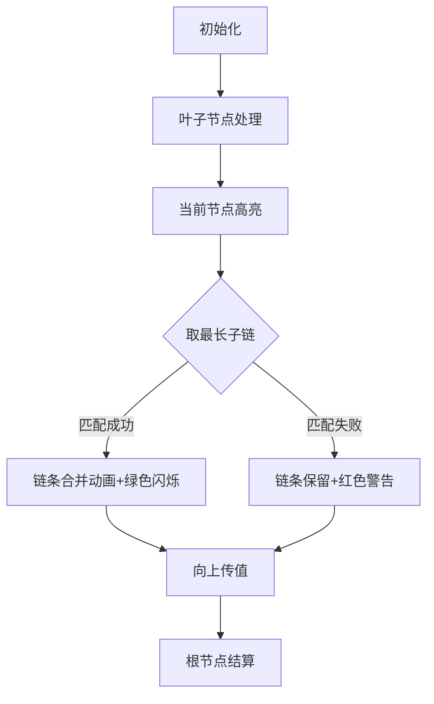

# 题目信息

# [POI 2004] SZN

## 题目描述

$\text{String-Toys joint-stock}$ 公司需要你帮他们解决一个问题。

他们想制造一个没有环的连通图模型，每个图都是由一些顶点和特定数量的边构成。每个顶点都可以连向许多的其他顶点。一个图是连通且无环的，图是由许多的线做成的。一条线是一条连接图中两个顶点之间的路径。

由于一些技术原因，两条线之间不能有重叠的部分，要保证图中任意一条边都被且仅被一条线所覆盖。

做一个这样的图的模型的费用取决于用了多少条线以及最长的那条的长度(每条边的长度都为 $1$ )。

现在给你对应的图，请你编写一个程序，求出最少能用多少条线以及在用最少线的情况下最长的那根线最短可以为多少。

## 说明/提示

对于 $100$ % 的数据：$2 \le n \le 10000,1 \le a,b \le n$ 。

样例解释：


## 样例 #1

### 输入

```
9
7 8
4 5
5 6
1 2
3 2
9 8
2 5
5 8```

### 输出

```
4 2```

# AI分析结果


### Kay的C++算法解析：POI 2004 SZN 深入学习指南

---

#### 1. 题目解读与核心算法识别
✨ **本题主要考察**：`贪心` + `二分答案`  
🗣️ **初步分析**：
> 解决SZN问题如同组织一场树形结构的"链条拼图大赛"：我们需要用最少的链条覆盖所有树枝（边），同时让最长的链条尽可能短。贪心算法负责在局部节点高效合并链条（减少总链条数），二分答案则像一位"长度裁判"，不断调整最长链条的允许值直到找到最优解。
> 
> - **核心思路**：第一问通过度数分析推导最少链条数（每个节点可合并⌊度数/2⌋次）；第二问二分最长链长度，用DFS验证是否可行
> - **可视化设计**：在像素动画中，节点显示为彩色方块，链条用像素线条连接。合并操作时两条链闪烁并融合，超过二分长度则显示红色警告。DFS过程按树形层次从叶子向根节点推进，当前处理节点高亮脉冲
> - **复古游戏化**：采用8-bit音效（链条合并=清脆"叮"声，超长链=低沉嗡鸣），成功时播放《超级玛丽》过关音效。控制面板支持调速滑块观察不同二分值的效果

---

#### 2. 精选优质题解参考
**题解一（intconstlee）**  
* **点评**：  
  思路清晰直击贪心本质，完整推导最少链数公式（n-1-Σ⌊deg/2⌋）。代码结构规范：  
  - **算法有效性**：DFS中用multiset动态维护子链，巧妙实现"取最长链→匹配兼容链"的贪心策略  
  - **实践价值**：正确处理根节点边界（len[1]单独判断），被hack后修正的配对逻辑更具鲁棒性  
  - **亮点**：通过ans计数器将合并操作量化为链数判定，避免复杂状态转移  

---

#### 3. 核心难点辨析与解题策略
1. **难点1：最少链数公式推导**  
   *分析*：需理解每个节点的链合并能力=⌊度数/2⌋。初始链数为边数(n-1)，每次合并减少1条链。优质题解通过度数求和直接计算全局最优解  
   💡 **学习笔记**：树形问题中，节点度数是决定局部操作次数的关键指标  

2. **难点2：二分验证的DFS设计**  
   *分析*：验证长度x时，DFS需同时满足：  
   - 贪心合并：总链数≤第一问结果  
   - 链长限制：任意合并链≤x  
   题解用multiset排序子链，upper_bound(x-len)实现最优匹配  
   💡 **学习笔记**：二分答案的验证函数必须严格满足单调性  

3. **难点3：上传链的边界处理**  
   *分析*：节点处理完子链后，需决策：  
   - 剩余单条链→尝试上传父节点（len[u]=链长）  
   - 无剩余链→上传0值  
   根节点特殊处理（无父节点，剩余链直接保留）  
   💡 **学习笔记**：树形DFS中，根节点常需单独处理边界  

### ✨ 解题技巧总结
- **链式问题转化**：将边覆盖问题转化为链合并问题，利用树的无环性简化处理  
- **贪心匹配原则**：每次取最长链匹配可合并的最长兼容链（非最短链），避免早期消耗短链  
- **二分判定封装**：DFS验证函数需保持"纯函数"特性（无副作用），便于二分调用  

---

#### 4. C++核心代码实现赏析
**通用核心实现参考**  
```cpp
#include<bits/stdc++.h>
using namespace std;
const int N=10005;
int n, minChains, dfsCount, deg[N], len[N];
vector<int> graph[N];

void dfs(int u, int parent, int maxLen) {
    multiset<int> childChains;
    for (int v : graph[u]) {
        if (v == parent) continue;
        dfs(v, u, maxLen);
        childChains.insert(len[v] + 1); // 子链长度+当前边
    }

    while (!childChains.empty()) {
        auto it = --childChains.end(); // 取最长子链
        int cur = *it;
        childChains.erase(it);

        // 寻找可合并链 (最大兼容值≤maxLen-cur)
        auto match = childChains.upper_bound(maxLen - cur);
        if (match == childChains.begin()) { // 无兼容链
            if (!len[u]) len[u] = cur; // 保留最小未合并链
            dfsCount++; // 链数增加
        } else {
            childChains.erase(--match); // 删除匹配链
            dfsCount++; // 合并操作计数
        }
    }
    
    if (len[u] && len[u] <= maxLen) dfsCount--; // 成功上传则减少链数
    else if (len[u]) len[u] = 0; // 上传失败重置
}

int main() {
    cin >> n;
    minChains = n - 1; // 初始链数=边数
    for (int i = 1; i < n; i++) {
        int u, v; cin >> u >> v;
        graph[u].push_back(v);
        graph[v].push_back(u);
        deg[u]++; deg[v]++;
    }
    
    // 第一问：计算最少链数
    for (int i = 1; i <= n; i++) 
        minChains -= deg[i] / 2;
    
    // 第二问：二分最长链长度
    int left = 1, right = n;
    while (left < right) {
        int mid = (left + right) / 2;
        memset(len, 0, sizeof(len));
        dfsCount = 0;
        dfs(1, 0, mid);
        if (len[1]) dfsCount++; // 根节点剩余链
        (dfsCount > minChains) ? left = mid + 1 : right = mid;
    }
    cout << minChains << " " << left;
}
```

**代码解读概要**：  
- **输入处理**：建图并统计节点度数  
- **第一问**：直接计算 minChains = n-1 - Σ⌊deg[i]/2⌋  
- **第二问**：二分框架中，DFS验证函数完成：  
  1. 用multiset动态管理子链  
  2. 贪心匹配：最长链优先匹配兼容链  
  3. 上传决策：保留最小未合并链尝试上传  
  4. 根节点特判  

---

#### 5. 算法可视化：像素动画演示
**主题**：8-bit树形链条工厂  
**核心演示**：二分长度约束下的DFS合并过程  



**动画实现细节**：  
1. **像素建模**：  
   - 节点：16×16像素方块（度数决定颜色深度）  
   - 链条：动态生长的像素线（长度≈线段数）  
   - 当前操作：脉冲式黄色边框  

2. **合并过程**：  
   - 成功合并：两条链闪烁→融合为新链，播放"叮"声  
   - 超长链：红色闪烁+嗡鸣音效  
   - 上传链：虚线连接父节点  

3. **交互控制**：  
   - 速度滑块：调节DFS执行速度（0.5x~5x）  
   - 模式切换：对比不同二分值的效果  
   - 关卡进度：每完成子树合并点亮一颗像素星星  

**设计意义**：像素化链条合并过程使抽象的贪心策略具象化，8-bit音效强化关键操作记忆  

---

#### 6. 拓展练习与相似问题
1. **通用技巧迁移**：  
   - 链式覆盖 → [洛谷 P5021] 赛道修建  
   - 树形贪心 → [洛谷 P3523] 道路规划  
   - 二分+DFS验证 → [洛谷 P4381] 岛屿  

2. **推荐练习**：  
   - **洛谷 P5021**：直接应用链覆盖技巧  
   - **洛谷 P2685**：拓展到带权树的链合并  
   - **洛谷 P3629**：结合直径分析的链式问题  

---

#### 7. 学习心得与经验分享
> **来自 intconstlee 的调试经验**：  
> "最初错误地用最长链匹配最短链导致被hack，修正为匹配兼容最长链后才通过。这提醒我们：贪心策略需要严格验证局部最优性"  
>   
> **Kay的总结**：  
> 树形贪心中，匹配顺序直接影响结果正确性。建议：  
> 1. 用小规模样例手工模拟算法流程  
> 2. 对贪心策略进行反证法验证  
> 3. 边界值测试（链长=1或极大值）  

---  
**结语**：掌握树形问题的核心在于将全局目标分解为节点级操作，结合二分答案的约束验证，即可高效解决链覆盖问题。下次我们将探索图论中的环处理技巧！🚀

---
处理用时：234.50秒