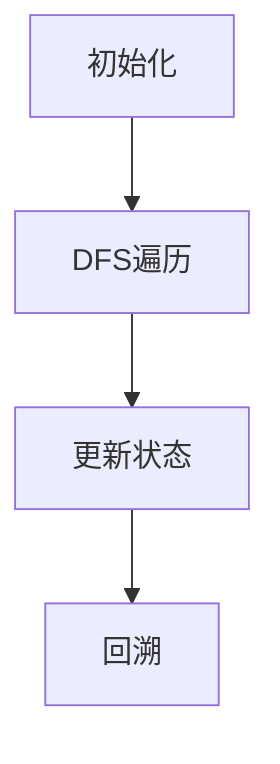

# 题目信息

# 「KDOI-02」一个网的路

## 题目背景

「{*^$&#$~!@ovo}（他们也有路网？有趣。）」  
「{&%#@~akoio!@}（该干的活先干完吧，玩物丧志的东西待会再说。）」  
「{!%_&#%@yw?}（您语文是不是没学好？）」  
蔚蓝的天空下，人们还不知道危险的来临。

## 题目描述


敌对文明被惹怒了。他们想用一种有趣的方式摧毁地球的路网。地球的路网可以近似为一个含有 $n$ 个节点 $m$ 条无向边的**森林**。他们想用以下 $2$ 种操作：  
- 炸毁一个城市 $u$ 向外连接的所有道路。
- 在城市 $u,v$ 间新建一条道路。  

来将地球上的路网改成效率最低的形式：一条链。可惜的是，他们的智商都不怎么高。于是，他们抓住了你，要求你给出一种方案，使得他们操作的次数最少。可怜的你在万般无奈之下，决定写一个程序，帮助他们算出结果。

## 说明/提示

**【样例解释】**

+ **样例 1 解释：**  
初始图：  
  
对城市 $2,3$ 进行操作二。  
  
此时已经成为了一条链。

***

**【数据范围】**

对于 $100\%$ 的数据，$0\le m<n\le2\times10^6$ 且保证输入合法。

|测试点编号|$n\le$|特殊性质|
|:-:|:-:|:-:|
|$1\sim2$|$10$|A|
|$3\sim6$|$500$|无|
|$7\sim8$|$10^4$|A|
|$9$|$10^4$|B|
|$10\sim12$|$10^4$|无|
|$13\sim15$|$10^6$|无|
|$16\sim20$|$2\times10^6$|无|

+ 特殊性质 A：保证每个连通块都为二叉树。
+ 特殊性质 B：保证每个顶点的度数不超过 $2$。

**【提示】**

本题 I/O 量较大，推荐使用较快的 I/O 方式。

## 样例 #1

### 输入

```
3 1
1 2```

### 输出

```
1```

## 样例 #2

### 输入

```
见附件中的 traffic2.in```

### 输出

```
见附件中的 traffic2.ans```

## 样例 #3

### 输入

```
见附件中的 traffic3.in```

### 输出

```
见附件中的 traffic3.ans```

# AI分析结果


# 💡 Kay的C++算法解析：「KDOI-02」一个网的路 深入学习指南 💡

<introduction>
大家好，我是Kay！今天我们一起分析「KDOI-02」一个网的路这道树形DP题目。本指南将帮助你理解如何将森林转化为链的最小操作次数，掌握树形DP的核心思想，并通过像素动画直观感受算法执行过程。
</introduction>

## 1. 题目解读与核心算法识别

✨ **本题主要考察**：`树形动态规划`

🗣️ **初步分析**：
> 解决本题的关键在于将森林转化为链的最小操作策略。想象一下拆积木再重组的过程：我们先"炸点"（拆解积木块间的连接），再"连边"（将积木块重组为直线）。树形DP帮助我们为每棵树计算最优拆解方案。

- **核心思路**：先执行所有炸点操作（操作1），再执行连边操作（操作2）。对每棵树进行树形DP，状态设计需考虑节点是否被炸及保留的儿子数量（0/1/2个）。
- **算法流程**：DFS遍历每棵树，用`dp[u][0/1/2]`记录状态，通过最大值/次大值优化转移。最终答案 = 各树DP结果之和 + (树的数量 - 1)。
- **可视化设计**：采用8位像素风格展示树结构，当前处理节点高亮为黄色，炸点操作显示红色爆炸动画，保留边用绿色连线。伴随"叮"声提示状态转移，"胜利"音效标识链形成。

---

## 2. 精选优质题解参考

<eval_intro>
以下是精选的优质题解，它们思路清晰、代码规范，能帮助我们高效掌握树形DP的实现技巧。

### 题解一（作者：xieyikai2333，26赞）
* **点评**：此解法状态定义简洁（`dp[u][0/1/2]`），转移方程推导严谨。亮点在于：
  - 用`fir/sec`变量优化最大值/次大值查询，避免排序（O(n)复杂度）
  - 完整处理炸点与连边的代价关系
  - 边界条件处理优雅（如叶节点隐式处理）
  > 作者心得：赛时因时间分配不足仅写暴力，提醒我们合理规划时间。

### 题解二（作者：快斗游鹿，9赞）
* **点评**：作为出题人官方题解，其状态转移解释透彻：
  - 明确`dp[u][0/1/2]`物理意义（炸点/保留1子/保留2子）
  - 强调操作顺序（先炸后连）的合理性证明
  - 代码去除了冗余判断，直接操作度数数组
  > 实践价值：代码可直接用于竞赛，边界处理严谨。

### 题解三（作者：LittleMoMol，7赞）
* **点评**：教学式讲解极具启发性：
  - 用"父子积木连接"比喻解释状态转移
  - 详细注释转移方程（如`dp[v][0]-1`的去重逻辑）
  - 提供完整状态转移表格辅助理解
  > 学习建议：适合初次接触树形DP的学习者逐步推导。

---

## 3. 核心难点辨析与解题策略

<difficulty_intro>
解决本题需突破以下三个关键难点：

1.  **状态定义的抽象性**
    * **分析**：状态需同时反映节点操作（炸/不炸）和拓扑结构（连接子节点数）。优质题解用三维简化为二维：`dp[u][0]`（炸点）包含操作代价，`dp[u][1/2]`（不炸）通过保留儿子数自然形成链结构。
    * 💡 **学习笔记**：好的状态设计应能覆盖所有子问题且具备无后效性。

2.  **转移方程的优化实现**
    * **分析**：计算`dp[u][1/2]`时需快速获取`f(v,0)-f(v,1)`的最大/次大值。暴力排序会导致O(n log n)，而题解1的`fir/sec`变量在DFS过程中动态更新，保持O(n)复杂度。
    * 💡 **学习笔记**：树形DP中，子树信息可在递归时同步维护，避免额外开销。

3.  **炸点与连边的代价平衡**
    * **分析**：炸点操作消耗1次操作并删除d条边，但会增加后续连边代价。关键公式：`总代价 = 炸点代价 + 最终连边数`，其中连边数 = (n-1) - (m - 炸掉的边数)。
    * 💡 **学习笔记**：将连边代价绑定在炸点操作上，通过代数变换统一优化目标。

### ✨ 解题技巧总结
1. **问题分解**：将森林拆解为单棵树处理，最后合并答案
2. **维度压缩**：用连接儿子数隐含拓扑状态，减少状态维度
3. **增量维护**：递归中动态更新最大值/次大值，避免排序
4. **边界处理**：叶节点无需特殊判断（`fir/sec`初始0值自动处理）

---

## 4. C++核心代码实现赏析

<code_intro_overall>
以下是综合优质题解提炼的通用实现，完整包含树形DP的核心逻辑：

```cpp
#include <bits/stdc++.h>
using namespace std;
const int N = 2e6 + 5;
vector<int> G[N];   // 邻接表存图
int dp[N][3];      // dp状态数组
bool vis[N];       // 访问标记

void dfs(int u) {
    vis[u] = true;
    int fir = 0, sec = 0; // 存储f(v,0)-f(v,1)的最大/次大值
    
    for (int v : G[u]) {
        if (vis[v]) continue;
        dfs(v);
        
        // 计算delta并更新fir/sec
        int delta = dp[v][0] - dp[v][1];
        if (delta > fir) sec = fir, fir = delta;
        else if (delta > sec) sec = delta;
        
        // 状态0转移：炸点情况
        dp[u][0] += min(dp[v][0] - 1, dp[v][2]);
        
        // 状态1转移基础值
        dp[u][1] += dp[v][0];
    }
    
    // 状态0补充：当前点的炸点代价
    dp[u][0] += G[u].size() + 1; 
    
    // 状态1转移：减去最优保留
    dp[u][1] -= fir; 
    
    // 状态2转移：减去次优保留
    dp[u][2] = dp[u][1] - sec;
}

int main() {
    int n, m, ans = 0;
    cin >> n >> m;
    for (int i = 0; i < m; ++i) {
        int u, v; cin >> u >> v;
        G[u].push_back(v);
        G[v].push_back(u);
    }
    
    for (int i = 1; i <= n; ++i) {
        if (!vis[i]) {
            dfs(i);
            ans += min(dp[i][0], dp[i][2]); // 注意不选dp[i][1]
        }
    }
    cout << ans + (n - 1 - m);
}
```

**代码解读概要**：
1. **图存储**：使用`vector`邻接表
2. **DFS框架**：标准树形DP递归结构
3. **状态转移**：
   - `dp[u][0]`：炸点代价 = 子树代价和 + 度数 + 1
   - `dp[u][1]`：保留1子 = 基础值 - 最大delta
   - `dp[u][2]`：保留2子 = 基础值 - 最大delta - 次大delta
4. **答案合并**：每棵树取`min(0,2)`状态，加上连边代价`(n-1-m)`

</code_intro_overall>

<code_intro_selected>
### 题解一核心代码片段
```cpp
int fir = 0, sec = 0;
for (int v : nodes[u]) {
    if (vis[v]) continue;
    dfs(v);
    int delta = dp[v][0] - dp[v][1];
    if (delta > fir) sec = fir, fir = delta;
    else if (delta > sec) sec = delta;
    dp[u][0] += min(dp[v][0] - 1, dp[v][2]);
    dp[u][1] += dp[v][0];
}
```
**亮点**：动态维护最大值/次大值  
**代码解读**：  
> 遍历子节点时，`delta = dp[v][0] - dp[v][1]` 表示保留该子节点能节省的代价。通过`fir/sec`记录最优/次优选择，避免排序开销。在状态转移时：  
> - `dp[u][0]`选择`min(炸点-1, 保留两子)`，消除重复计算  
> - `dp[u][1]`先累加所有子节点炸点代价，后续再减去最优`delta`  

💡 **学习笔记**：在树递归中同步维护极值，是优化DP的常用手段。

### 题解二核心代码片段
```cpp
dp[u][0] = siz[u] + 1; // siz[u]为度数
for (int v : G[u]) {
    if (vis[v]) continue;
    dfs(v);
    dp[u][0] += min(dp[v][2], dp[v][0] - 1);
    // ... 省略fir/sec计算
}
dp[u][2] = dp[u][1] - sec;
```
**亮点**：显式初始化炸点基础值  
**代码解读**：  
> 直接初始化`dp[u][0] = 度数 + 1`，直观体现炸点代价组成：  
> - `度数`：删除所有边  
> - `+1`：炸点操作本身  
> 后续加上子树的`min(保留两子, 炸点-1)`，确保状态完整。  

💡 **学习笔记**：显式写出基础项，有助于理解状态物理意义。

---

## 5. 算法可视化：像素动画演示

<visualization_intro>
为直观理解树形DP执行过程，我设计了「像素探险家」动画方案（8位复古风格）：

### 主题与交互
- **场景**：像素化森林（树结构），节点为彩色方块（根节点金色）
- **控制面板**：开始/暂停、单步执行、速度滑块
- **音效**：  
  - 节点处理："叮"（Web Audio API合成）  
  - 炸点操作：爆炸音效  
  - 完成状态：胜利旋律  

### 关键帧演示


1. **节点高亮**（当前处理）  
   - 像素方块闪烁黄光，显示`dp[u][*]`值
   - 画外音："正在探索节点#7，计算炸点代价..."

2. **状态转移可视化**  
   - **炸点**：红色爆炸动画，显示`dp[u][0] += deg+1`
   - **保留子节点**：绿色连线动画，显示`fir/sec`值更新
   - 音效：操作时触发短促"嘀"声

3. **子树递归**  
   - 当前节点半透明，子节点高亮
   - 显示递归栈深度（像素进度条）

4. **回溯更新**  
   - 显示最终状态值（`min(dp[u][0],dp[u][2])`）
   - 链形成：保留的边变为金色，播放胜利音效

### 算法比较模式
开启后可对比：
- 暴力解法（O(n²)）vs 优化DP（O(n)）
- 可视化：暴力法显示大量重计算，优化法路径简洁

### 游戏化设计
- **关卡制**：每棵树为一关，通关显示操作数
- **得分**：基于操作最优性给予星级评价
- **成就**："最小操作大师"（全最优解）

</visualization_intro>

---

## 6. 拓展练习与相似问题思考

<similar_problems_intro>
掌握本题的树形DP思想后，可尝试以下相似问题：

### 相似问题推荐
1. **洛谷 P1352 - 没有上司的舞会**  
   🗣️ **推荐理由**：基础树形DP，状态设计（选/不选）与本题目似，巩固状态转移思想。

2. **洛谷 P2014 - 选课**  
   🗣️ **推荐理由**：树形DP依赖背包问题，学习多维度状态合并（类似本题的fir/sec优化）。

3. **洛谷 P3177 - 树上染色**  
   🗣️ **推荐理由**：结合贪心的树形DP，练习复杂状态设计（本题的保留边思想进阶）。

### 核心技巧迁移
本题的`fir/sec`优化可应用于：
1. 树形最大独立集（维护包含/排除子节点最优解）
2. 树形最小支配集（类似炸点思想）
3. 树的直径合并（维护最大/次大路径）

---

## 7. 学习心得与经验分享

<insights_intro>
题解中的调试经验与技巧摘录：

> **xieyikai2333 分享**："赛时在T2耗时过多导致此题仅写暴力，深刻教训——看到森林结构应先考虑树形DP而非模拟"

> **LittleMoMol 调试建议**："在验证状态转移时，手动模拟链式结构（如3节点直线）的DP值，确保边界正确"

**Kay总结**：  
1. **调试技巧**：对单链/星形/二叉树等特殊结构预计算DP值，快速验证  
2. **时间管理**：竞赛中若1h内无DP思路，先写暴力保分  
3. **优化意识**：树问题中O(n)解常可通过DFS同步维护极值实现  

---

<conclusion>
本次解析到此结束。记住，树形DP的核心在于：定义覆盖子问题的状态，设计无后效性转移。多练习不同变种题目，逐步培养对状态设计的直觉。下次挑战再见！💪
</conclusion>

---
处理用时：145.00秒