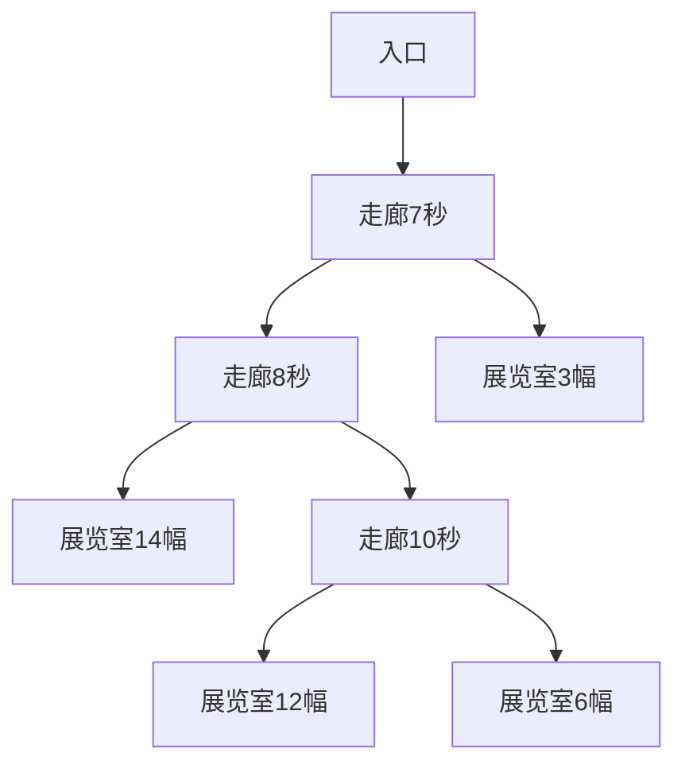

# 题目信息

# “访问”美术馆

## 题目描述

经过数月的精心准备，Peer Brelstet，一个出了名的盗画者，准备开始他的下一个行动。艺术馆的结构，每条走廊要么分叉为两条走廊，要么通向一个展览室。Peer 知道每个展室里藏画的数量，并且他精确测量了通过每条走廊的时间。由于经验老到，他拿下一幅画需要 $5$ 秒的时间。你的任务是编一个程序，计算在警察赶来之前，他最多能偷到多少幅画。假定他回到起点后还需要留至少 $1$ 秒逃跑。


## 样例 #1

### 输入

```
60
7 0 8 0 3 1 14 2 10 0 12 4 6 2
```

### 输出

```
2
```

# AI分析结果


# 💡 Kay的C++算法解析："访问"美术馆 深入学习指南 💡

## 1. 题目解读与核心算法识别

✨ **本题主要考察**：`树形动态规划（树上背包）`

🗣️ **初步分析**：
> 解决"访问美术馆"这道题，关键在于运用**树形动态规划**思想。想象美术馆是一棵倒挂的树🌳，根是入口，叶子是藏画室，走廊是树枝。小偷要在时间耗尽前从叶子"摘取"尽可能多的画作，同时保证能安全返回。  
> - **核心难点**：计算每条走廊的往返时间(×2)，并平衡"移动时间"和"偷画时间"的分配  
> - **解法对比**：主流解法分两种状态设计：(1) `dp[i][j]=子树i用j秒能偷的最大画数` (2) `dp[i][j]=子树i偷j幅画的最短耗时`，后者更易处理时间限制  
> - **可视化设计**：像素动画将展示树形结构，高亮当前访问节点（闪烁），动态更新路径耗时(红色进度条)和偷画计数(↑动画)。复古8-bit音效：移动时"滴滴"声，偷画成功时"叮!"声，超时警报声  

---

## 2. 精选优质题解参考

**题解一：Dog_Two (赞37)**
* **点评**：状态定义`f[i][j]`表示在节点i偷j幅画的最少时间，思路直击本质。代码采用DFS递归读入输入数据，完美处理美术馆的树形结构。状态转移时巧妙处理了边权条件（仅当偷画数>0才加边权），避免了无效计算。边界初始化清晰（叶子节点直接计算偷画时间），代码规范易读，变量名`lw/rw`等含义明确，可直接用于竞赛。

**题解二：安好 (赞31)**
* **点评**：创新性地将问题转化为依赖性背包问题，状态`f[i][j]`表示节点i用j秒的最大收益。最大亮点是读入处理与DP状态转移同步完成，代码简洁高效（仅35行）。虽然未显式建树，但通过递归顺序隐式构建二叉树结构，空间利用率极佳。输出时直接取`f[1][n-1]`，完美处理了"留1秒逃跑"的边界条件。

**题解三：Hugo_Minion (赞12)**
* **点评**：采用虚拟节点技术将每幅画转化为边权为5的边，极大简化了状态转移方程。树形背包模板化实现（双重循环枚举时间分配），代码结构清晰模块化。特别亮点是详细注释了树上背包的**倒序枚举**原理，防止状态覆盖，对学习者理解背包本质极具启发性。

---

## 3. 核心难点辨析与解题策略

1.  **难点：状态定义的选择**
    * **分析**：状态设计需同时考虑时间约束和画作收益。优质题解表明：**`dp[i][j]=偷j幅画的最短耗时`** 更优，因为最终只需扫描`dp[root][j] < tim`的最大j值，避免在DP过程中判断时间合法性。
    * 💡 **学习笔记**：树形DP的状态维度选择直接影响转移复杂度

2.  **难点：子树合并的代价计算**
    * **分析**：当合并左右子树时，必须计入往返走廊的时间（边权×2）。关键技巧：**仅当子树偷画数>0时才加边权**（如Dog_Two的`lw = i?w*2:0`），避免对未访问子树计算无效耗时。
    * 💡 **学习笔记**：边权贡献的惰性计算可提升DP效率

3.  **难点：树形结构的特殊读入**
    * **分析**：输入序列是DFS序，必须递归构建树结构。高效处理方案：**不显式建树**（如安好的解法），直接在递归中传递当前节点编号；或**动态扩展节点**（如Dog_Two的`n++`），配合`vector`存储子节点。
    * 💡 **学习笔记**：递归读入DFS序是处理树形输入的利器

### ✨ 解题技巧总结
- **技巧1：虚拟节点优化** - 对叶子节点的每幅画创建虚拟子节点（边权=5），将时间消耗转化为路径消耗（Hugo_Minion解法）
- **技巧2：时间与状态的互换** - 当画作价值单位相同时，优先用"画数"作状态而非"时间"，降低维度复杂度
- **技巧3：记忆化边界初始化** - 预处理叶子节点：`dp[leaf][k]=5*k`，非叶子节点`dp[i][0]=0`（不偷画不耗时）

---

## 4. C++核心代码实现赏析

**本题通用核心C++实现参考**
* **说明**：综合Dog_Two与Hugo_Minion解法优点，采用"偷画数"状态定义，惰性边权计算
* **完整核心代码**：
```cpp
#include <iostream>
#include <vector>
#include <cstring>
using namespace std;

const int N = 605, TIM = 1005, INF = 0x3f3f3f3f;
struct Node { int w, ch[2]; };
vector<Node> G; // 动态树结构
int dp[N][TIM], n = 1, totalTime;

void build(int u) {
    int w, val; cin >> w >> val;
    if (val) { // 叶子节点
        G[u].ch[0] = G[u].ch[1] = -1;
        for (int i = 0; i <= val; i++) 
            dp[u][i] = (i ? 5 * i : 0);
    } else { // 走廊分叉
        G[u].ch[0] = ++n; G[u].ch[1] = ++n;
        build(G[u].ch[0]); build(G[u].ch[1]);
    }
}

void dfs(int u) {
    if (G[u].ch[0] == -1) return; // 叶子已初始化
    
    dfs(G[u].ch[0]); dfs(G[u].ch[1]);
    memset(dp[u], INF, sizeof dp[u]);
    dp[u][0] = 0; // 关键初始化
    
    for (int j = 0; j < TIM; j++) {   // 左子树偷j幅
    for (int k = 0; j + k < TIM; k++) { // 右子树偷k幅
        int cost = 0;
        if (j > 0) cost += G[u].w * 2; // 惰性边权计算
        if (k > 0) cost += G[u].w * 2;
        dp[u][j + k] = min(dp[u][j + k], 
            dp[G[u].ch[0]][j] + dp[G[u].ch[1]][k] + cost);
    }}
}

int main() {
    cin >> totalTime; totalTime--; // 留1秒逃跑
    G.resize(N); build(1); dfs(1);
    
    int ans = 0;
    for (int i = 1; i < TIM; i++)
        if (dp[1][i] <= totalTime) ans = i;
    cout << ans;
}
```
* **代码解读概要**：
  - `build()`递归读入DFS序构建二叉树，叶子节点直接初始化DP
  - `dfs()`后序遍历树，合并子树时采用双重循环枚举左右子树的偷画数
  - 惰性边权计算：仅当某子树偷画数>0才加其边权×2
  - 最终扫描满足`dp[1][i] ≤ totalTime`的最大i值

---

## 5. 算法可视化：像素动画演示

**动画演示主题**：`像素美术馆大冒险`  
**核心演示内容**：树形DP决策过程动态模拟  
**设计思路**：采用FC《塞尔达传说》的8-bit风格，通过网格+色块区分节点类型（走廊=棕色矩形，藏画室=金色宝箱）



1. **场景初始化**：
   - 屏幕左侧：像素树结构（↑图），右侧：`dp[i][j]`矩阵实时更新
   - 控制面板：步进按钮▷/▌▌，速度滑块，剩余时间进度条（红色递减）

2. **节点访问高亮**：
   - 当前节点闪烁绿光，回溯路径显示蓝色轨迹
   - 进入走廊：播放"脚步声效"(2次短促"滴")，耗时进度条减少

3. **偷画动画**：
   - 到达展览室：宝箱打开，画作↑飞出+计数增加，伴随"叮!"声
   - 偷画耗时：每幅画使时间条减少5单位，进度条分段变红

4. **子树合并演示**：
   - 非叶子节点：分裂两个半透明子窗口对比左右子树状态
   - 状态转移：`dp[i][j+k]`数值从`INF`变为具体值，字体颜色黄→绿

5. **游戏化元素**：
   - 成功逃离：像素小偷跑出美术馆，烟花绽放+16-bit胜利音乐
   - 超时失败：警笛长鸣，屏幕闪烁红光

---

## 6. 拓展练习与相似问题思考

* **通用技巧迁移**：
  树上背包适用于：资源分配问题（时间/预算约束）、最优覆盖问题（选节点覆盖子树）

* **推荐练习（洛谷）**：
  1. **P2015 二叉苹果树**  
     🗣️ 几乎双胞胎题目！区别：本题求最大画数，P2015求保留树枝的最大苹果数
  2. **P2014 选课**  
     🗣️ 树形依赖背包的经典变形，将课程学分转化为画作数量
  3. **P1272 重建道路**  
     🗣️ 逆向思维训练：计算最少删除边数使子树节点数达标

---

## 7. 学习心得与经验分享

> **经验摘录 (Dog_Two)**：  
> *"读入处理是本题最大陷阱，必须用DFS递归处理输入序列，否则无法正确建树"*  
> **点评**：这揭示了树形DP的通用技巧——**输入结构与数据逻辑的一致性**。类似问题若输入为DFS序，递归读入往往比显式建树更简洁。

> **经验摘录 (Hugo_Minion)**：  
> *"树上背包必须倒序枚举背包容量！否则会重复计算状态"*  
> **点评**：这是背包问题的核心要点，正序枚举会导致物品被重复选取，在树形扩展时尤为关键。

---

本次"访问美术馆"的解析就到这里。记住，树形DP的精髓在于**将子树转化为子问题**，而背包思想则是处理资源约束的利器。多加练习，你也能成为美术馆的"神偷"！💪

---
处理用时：244.74秒