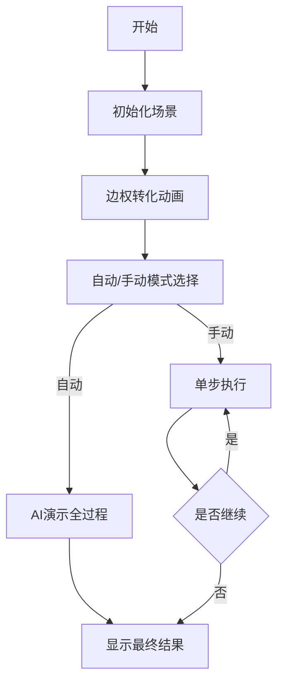

# 题目信息

# [国家集训队] 阿狸和桃子的游戏

## 题目描述

阿狸和桃子正在玩一个游戏，游戏是在一个带权图 $G=(V,E)$ 上进行的，设节点权值为 $w(v)$，边权为 $c(e)$。游戏规则是这样的：

1. 阿狸和桃子轮流将图中的顶点染色，阿狸会将顶点染成红色，桃子会将顶点染成粉色。已经被染过色的点不能再染了，而且每一轮都必须给一个且仅一个顶点染色。

2. 为了保证公平性，节点的个数 $N$ 为偶数。

3. 经过 $\frac{N}{2}$ 轮游戏之后，两人都得到了一个顶点集合。对于顶点集合 $S$，得分计算方式为

$$\sum_{v \in S}w(v) + \sum_{e=(u,v)\in E \land u,v\in S}c(e)$$

由于阿狸石头剪子布输给了桃子，所以桃子先染色。两人都想要使自己的分数比对方多，且多得越多越好。如果两人都是采用最优策略的，求最终桃子的分数减去阿狸的分数。

## 说明/提示

数据规模和约定：

对于 $40\%$ 的数据，$1 \le N \le 16$。

对于 $100\%$ 的数据，$1 \le N \le 10000$，$1 \le M \le 100000$，$-10000 \le w , c \le 10000$。

## 样例 #1

### 输入

```
4 4
6
4
-1
-2
1 2 1
2 3 6
3 4 3
1 4 5```

### 输出

```
3```

# AI分析结果


# 💡 Kay的C++算法解析：阿狸和桃子的游戏 深入学习指南 💡

**引言**  
今天我们来分析国家集训队题目"阿狸和桃子的游戏"。这道题考察的是博弈论中的贪心策略和问题转化技巧。本指南将帮助你理解如何巧妙处理图论中的点权和边权问题。

## 1. 题目解读与核心算法识别

✨ **本题主要考察**：`贪心算法` 与 `编程技巧应用（边权转化）`

🗣️ **初步分析**：  
> 这道题的关键在于**边权转化为点权**的巧妙思想。想象每个顶点是一个蛋糕，每条边是连接蛋糕的绳子，绳子上挂着糖果。如果我们将绳子剪断，把糖果平均分给两端的蛋糕，那么无论两个人怎么选蛋糕，糖果的分配都会公平合理：
> - 当两人各选一个蛋糕时，各自得到一半糖果（差值不变）
> - 当一人选两个蛋糕时，得到全部糖果（完整计入得分）
> 
> 在本题中，我们将边权平分到两个端点，转化为纯点权问题后，通过排序和轮流选取即可解决。
> 
> **可视化设计**：采用8位像素风格展示图结构，顶点显示为不同颜色的蛋糕图标，边显示为挂糖果的绳子。动画将演示：
> 1. 糖果平分到蛋糕的过程（边权→点权）
> 2. 桃子（粉色角色）和阿狸（红色角色）轮流拿取蛋糕
> 3. 每步高亮当前最大点权蛋糕和选择者
> 4. 计分区实时显示差值变化

---

## 2. 精选优质题解参考

**题解一（第一宇宙速度）**  
* **点评**：这份题解详细证明了边权平分的四种情况，逻辑严密且具有启发性。代码实现简洁高效（点权×2避免小数），变量命名清晰（`a[i]`表示处理后的点权），排序和差值计算的实现一气呵成。特别值得学习的是作者对问题本质的深入思考，通过数学证明确保解法正确性。

**题解二（AubRain）**  
* **点评**：仅13行的极简实现展现高效编程技巧。虽然省略了证明，但核心思路表述清晰（边权转点权→排序→交替取点）。代码使用位运算加速（`a[i]<<=1`），循环控制精炼（`while(n)`配合自减），体现了竞赛编程的优化思维。

**题解三（rui_er）**  
* **点评**：结构清晰，分"题意→方法→证明→代码"四部分，教学性强。采用浮点数处理（`w/2.0`）直观展示思路，最后转整数输出。亮点在于对边权分配后不同选择场景的对比分析，帮助理解问题本质。

---

## 3. 核心难点辨析与解题策略

1.  **边权转化可行性证明**  
    * **分析**：需要严格证明边权平分后不影响最终差值。如题解所示，分四种情况讨论（同人得两点/各得一点），数学推导验证转化等价性
    * 💡 **学习笔记**：图论问题中，将边权合理分配到顶点是常见转化技巧

2.  **避免浮点数精度问题**  
    * **分析**：直接使用`c/2`可能导致小数精度丢失。优质题解采用点权×2（`a[i]<<=1`），边权直接相加（`a[x]+=c`），最终差值除以2的整数处理
    * 💡 **学习笔记**：竞赛编程中，整数运算优于浮点

3.  **最优选择策略证明**  
    * **分析**：转化后为何排序+轮流选取就是最优？因双方都想最大化分差，每次选当前最大点权必然导致局部最优，且无后效性
    * 💡 **学习笔记**：贪心策略成立需具备无后效性和局部最优性

### ✨ 解题技巧总结
-   **问题转化**：将复杂问题（边权+点权）转化为标准问题（纯点权）
-   **避免浮点**：通过整体缩放处理小数
-   **贪心证明**：通过数学归纳或场景分析验证策略正确性
-   **代码精简**：合理使用语言特性（位运算、复合赋值）提升效率

---

## 4. C++核心代码实现赏析

**本题通用核心C++实现参考**
* **说明**：综合优质题解思路，采用整数处理避免浮点误差
```cpp
#include <iostream>
#include <algorithm>
using namespace std;
const int MAXN = 10005;

int main() {
    int n, m, a[MAXN] = {0};
    cin >> n >> m;
    
    // 点权×2处理
    for (int i = 1, w; i <= n; ++i) {
        cin >> w;
        a[i] = w * 2;
    }
    
    // 边权加到端点
    for (int i = 1, u, v, w; i <= m; ++i) {
        cin >> u >> v >> w;
        a[u] += w;
        a[v] += w;
    }
    
    // 排序后交替取点计算差值
    sort(a + 1, a + n + 1);
    int ans = 0;
    for (int i = n; i >= 1; i -= 2) {
        ans += a[i] - a[i - 1];
    }
    cout << ans / 2;
    return 0;
}
```
* **代码解读概要**：
  1. 点权×2避免后续小数
  2. 边权直接加入两端点
  3. 降序排序后从大到小交替取点
  4. 偶数索引点权减奇数索引点权
  5. 最终差值除以2还原实际分差

**题解一核心代码片段**  
```cpp
sort(a+1,a+1+n);
for(int i=n;i>=1;i-=2)
    ans+=a[i]-a[i-1];
printf("%d",ans/2);
```
* **亮点**：简洁的降序处理与成对取值
* **代码解读**：  
  > 排序后从末尾开始，每次取两个点（当前最大和次大）。`a[i]-a[i-1]`实际是(桃子点权-阿狸点权)，循环步长`i-=2`确保成对处理所有点
* 💡 **学习笔记**：逆向遍历配合固定步长是处理成对元素的技巧

**题解二核心代码片段**  
```cpp
sort(val+1,val+1+n);
while(n) ans+=val[n--]-val[n--];
```
* **亮点**：极简循环控制与复合条件判断
* **代码解读**：  
  > `n--`在表达式中同时完成取值和索引更新。当n为奇数时取val[n]，然后n减1；再取val[n]时n已是偶数位，实现交替取值
* 💡 **学习笔记**：理解自增/减在表达式中的执行顺序

**题解三核心代码片段**  
```cpp
for(int i=n;i>=1;--i) 
    s[i&1] += a[i];
cout << (s[0]-s[1]);
```
* **亮点**：奇偶分组累加清晰展示选择逻辑
* **代码解读**：  
  > 排序后逆序循环，`i&1`判断奇偶位置（桃子取奇数位/阿狸取偶数位）。两个累加器`s[0]`和`s[1]`分别存储双方得分，最后直接相减
* 💡 **学习笔记**：位运算判断奇偶比取模更高效

---

## 5. 算法可视化：像素动画演示

**动画演示主题**：蛋糕争夺战（8位像素风格）

**核心演示内容**：
1. 顶点显示为蛋糕图标，边显示为挂糖果的绳子
2. 边权转化过程：糖果平分到两端蛋糕（视觉：糖果移动+数字变化）
3. 桃子与阿狸轮流选取最大蛋糕（角色头像高亮+选择音效）
4. 实时计分板显示当前差值

**设计思路**：  
采用FC红白机风格像素画风，通过色彩区分不同状态：
- 未选蛋糕：白色糖霜
- 桃子选定：粉色糖霜
- 阿狸选定：红色糖霜
- 当前可选最大蛋糕：闪烁金边

**交互控制**：


**关键动画细节**：
1. **边权转化**：绳子上的糖果分裂成两半飞向蛋糕，伴随"叮叮"音效
2. **选择过程**：角色头像移动到蛋糕上方，蛋糕变色+"收集"音效
3. **差值计算**：计分板实时更新，正差值为绿色，负差值为红色
4. **历史路径**：显示已选蛋糕之间的连接（同色连线）

**游戏化元素**：
- 每完成一次选择触发"收集成功"音效
- 最终结果展示时根据分差播放胜利/平局BGM
- 添加"挑战模式"：限时完成选择决策

---

## 6. 拓展练习与相似问题思考

**通用思路迁移**：  
边权转化技巧还可用于：
1. 图分割问题（如MaxCut近似算法）
2. 社区发现中的模块度计算
3. 电网负载分配问题

**练习推荐（洛谷）**：
1. **P1351 联合权值**  
   🗣️ 推荐理由：同样需要处理顶点间权值关系，练习邻接点权值计算
2. **P1663 山**  
   🗣️ 推荐理由：考察问题转化能力，将几何问题转化为代数决策
3. **P5020 货币系统**  
   🗣️ 推荐理由：贪心策略应用，与本题的"最优选取"思想相通

---

## 7. 学习心得与经验分享

> **参考经验（来自philosopherchang）**：  
> "我在解决这个问题时，最初在边权处理上卡了很久，后来通过画图分析四种情况才豁然开朗。这让我意识到面对复杂问题时，分情况讨论是理清思路的有效方法"

**点评**：这位作者的经验很有代表性。在解决算法问题时：
1. 当理论理解困难时，动手画图/列举案例是关键突破口
2. 分情况讨论（本题的四种选择场景）能系统验证解法正确性
3. 保持耐心，解题的顿悟常来自持续的思考

---

**结语**  
通过本次分析，我们学习了如何将图论中的边权问题转化为点权问题，并运用贪心策略高效解决。记住这些核心技巧：
1. 大胆转化问题形式
2. 严格验证转化正确性
3. 选择最优处理策略
4. 注意数值精度处理

希望这份指南能帮助你在算法学习中更进一步！下次见！🚀

---
处理用时：137.35秒