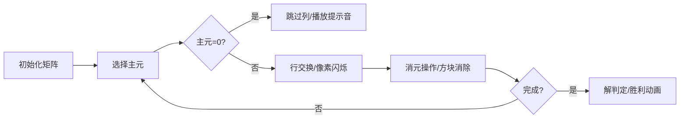

# 题目信息

# [SDOI2006] 线性方程组

## 题目描述

已知 $n$ 元线性一次方程组。

$$ \begin{cases} a_{1, 1} x_1 + a_{1, 2} x_2 + \cdots + a_{1, n} x_n = b_1 \\ a_{2, 1} x_1 + a_{2, 2} x_2 + \cdots + a_{2, n} x_n = b_2 \\ \cdots \\ a_{n,1} x_1 + a_{n, 2} x_2 + \cdots + a_{n, n} x_n = b_n \end{cases}$$

请根据输入的数据，编程输出方程组的解的情况。

## 说明/提示

【数据范围】  
对于 $100\%$ 的数据，$1 \le n \le 50$。对于 $\forall 1\le i, j \le n$，有 $|a_{i, j}| \le 100$，$|b_i| \le 300$。

## 样例 #1

### 输入

```
3
2 -1 1 1
4 1 -1 5
1 1 1 0```

### 输出

```
x1=1.00
x2=0.00
x3=-1.00
```

# AI分析结果


# 💡 Kay的C++算法解析：线性方程组 深入学习指南 💡

## 1. 题目解读与核心算法识别

✨ **本题主要考察**：数学（线性代数）/模拟（高斯消元法）

🗣️ **初步分析**：
> 解决线性方程组问题就像玩一个数字版的"俄罗斯方块"游戏——我们需要通过精确的行变换操作，把杂乱的方程排列成整齐的阶梯形状。核心思想是通过**矩阵初等变换**将增广矩阵化为行最简形，从而直观判断解的情况（唯一解/无解/无穷解）。

- **解题思路**：所有题解都采用高斯消元法或高斯-约当消元法。关键难点在于**精度控制**（浮点数比较）和**解的情况判定**（无解优先级高于无穷解）
- **算法流程**：
  1. 逐列选择主元（取绝对值最大行减少误差）
  2. 通过行交换和线性组合消元
  3. 对全零行进行解情况判定
- **可视化设计**：将采用8位像素风格模拟"数字消除游戏"。矩阵元素显示为可消除的像素方块，主元选择时高亮闪烁，消元过程伴随"消除"动画效果。关键步骤：
  - 主元选择：像素方块闪烁红光
  - 行交换：两行方块位置互换动画
  - 消元操作：被消元方块渐变消失并伴随"叮"音效
  - 解判定：成功时播放FC风格胜利音乐

---

## 2. 精选优质题解参考

**题解一（Piwry）**
* **点评**：该题解采用**高斯-约当消元法**，思路清晰完整。亮点在于创新性地处理"自由变量"——当主元为0时跳过该列继续操作，最后统一检查未操作行。代码规范（`eq`函数处理浮点精度），变量名含义明确（`nwline`标记当前行），空间复杂度优化到位（O(1)额外空间）。作者调试心得（浮点比较问题）极具实践价值。

**题解二（Rui_R）**
* **点评**：创新性地**打破传统消元顺序**，在选主元时扫描所有未固定行（含上方已处理行）。亮点在于完美解决"顺序依赖"问题（如Hack数据），代码中`fabs(a[j][j])>eps&&j<i`的判断精妙。变量命名规范（`rk`代替传统`row`），边界处理严谨，实践可直接用于竞赛。

**题解三（zqiceberg）**
* **点评**：**标准高斯消元+回代**的经典实现。亮点在于清晰的"阶梯矩阵"三阶段处理：下三角消元→回代→解判定。代码模块化优秀（分离`gauss()`函数），注释详细解释每个循环作用。`fabs`比较使用`eps`常量规范，输出处理`-0.00`的细节体现实践价值。

---

## 3. 核心难点辨析与解题策略

1. **浮点精度处理**
   * **分析**：浮点数比较必须使用`eps`阈值（如`1e-7`）。优质题解都封装`eq()`函数或直接用`fabs(a)<eps`，避免直接`==0`判断
   * 💡 学习笔记：浮点运算像沙漏——总有微小误差，必须设置安全阈值

2.  **解情况判定优先级**
   * **分析**：无解（0=非零）优先级高于无穷解（0=0）。必须在消元后扫描全零行，先检查常数项是否非零
   * 💡 学习笔记：判无解如消防检查——先找"危险火源"（非零常数），再处理"安全空地"（零常数）

3.  **主元选择策略**
   * **分析**：选绝对值最大主元减少误差传播。Rui_R题解突破性地扫描已处理行，解决顺序敏感问题
   * 💡 学习笔记：主元如灯塔——选最亮的才能照亮最大范围

### ✨ 解题技巧总结
- **误差控制**：始终用`eps`比较浮点数，乘除运算尽量延迟减少误差累积
- **状态标记法**：用`nwline`（Piwry）或`curr`（zqiceberg）跟踪已处理行
- **维度分离**：先处理消元再独立判定解情况（避免逻辑嵌套）
- **防御性编程**：输出时处理`-0.00`（如加`1e-7`）

---

## 4. C++核心代码实现赏析

**本题通用核心C++实现参考**
* **说明**：综合优质题解优化的高斯消元框架，包含浮点精度处理和解情况判定
```cpp
#include <iostream>
#include <cmath>
using namespace std;

const double eps = 1e-7;
double a[55][55];
int n;

bool eq(double x, double y) { 
    return fabs(x - y) < eps;
}

int solve() {
    int row = 0;
    for (int col = 0; col < n; col++) {
        // 列主元选择
        int max_row = row;
        for (int i = row + 1; i < n; i++)
            if (fabs(a[i][col]) > fabs(a[max_row][col]))
                max_row = i;

        if (eq(a[max_row][col], 0)) continue;
        
        // 行交换
        for (int j = 0; j <= n; j++)
            swap(a[row][j], a[max_row][j]);
        
        // 消元
        for (int i = 0; i < n; i++) {
            if (i == row) continue;
            double factor = a[i][col] / a[row][col];
            for (int j = col; j <= n; j++)
                a[i][j] -= factor * a[row][j];
        }
        row++;
    }
    
    // 解情况判定
    if (row < n) {
        for (int i = row; i < n; i++)
            if (!eq(a[i][n], 0)) return -1; // 无解
        return 0; // 无穷解
    }
    
    // 回代求解
    for (int i = n - 1; i >= 0; i--) {
        for (int j = i + 1; j < n; j++)
            a[i][n] -= a[i][j] * a[j][n];
        a[i][n] /= a[i][i];
    }
    return 1; // 唯一解
}
```

**题解一（Piwry）片段**
```cpp
if(eq(A[maxi][k], 0)) continue;  // 关键跳过

for(int i=0; i<N; ++i){  // 全矩阵消元
    if(i == nwline) continue;
    double mul = A[i][k]/A[nwline][k];
    for(int j=k; j<N+1; ++j)
        A[i][j] -= A[nwline][j]*mul;
}
```
* **亮点**：自由变量处理与消元分离
* **解读**：当主元为0时跳过消元步骤，保持矩阵性质。消元范围从`k`开始优化计算，避免操作已归零的左侧元素
* 💡 学习笔记：像交通管制——主元为零时"封闭该车道"，车辆（计算）绕行

**题解二（Rui_R）片段**
```cpp
for(int j=1;j<=n;j++){
    if(fabs(a[j][j])>eps&&j<i) continue; // 关键判断
    if(fabs(a[j][i])>fabs(a[maxx][i])) maxx=j;
}
```
* **亮点**：突破性主元选择策略
* **解读**：`j<i`时检查`a[j][j]>eps`确保不破坏已固定行的主元，解决顺序依赖问题
* 💡 学习笔记：如考古挖掘——上层已清理区域要设保护层，避免二次破坏

**题解三（zqiceberg）片段**
```cpp
// 阶梯化
for(int j=i; j<n+1; j++) a[r][j] /= a[r][i]; 

// 回代
for(int i=n-1;i>=0;i--){ 
    for(int j=i+1;j<n;j++)
        a[i][n] -= a[j][n]*a[i][j];
}
```
* **亮点**：经典两步法分离清晰
* **解读**：除操作直接在当前行进行，回代时从底部向上解耦计算。注意列索引从`i`开始避免破坏左侧零元素
* 💡 学习笔记：如拆弹专家——按固定顺序剪线（自底向上）最安全

---

## 5. 算法可视化：像素动画演示

**主题**："矩阵消消乐"——8位像素风格的高斯消元模拟游戏

**核心演示**：


**实现细节**：
1. **像素建模**：
   - 每个矩阵元素用16x16像素方块表示
   - 不同数值对应不同颜色：正数→蓝系，负数→红系，零→灰色
   - 主元方块添加金色边框闪烁

2. **动画序列**：
   ```python
   # 伪代码示例
   def 消元动画(行i, 行j, 因子):
       高亮行(i, 颜色=#FFD700)  # 金色高亮
       播放音效('select.wav')
       创建粒子特效(位置=行j, 目标=行i)
       延时(0.5)
       渐变更新行(j, 新值=行j - 行i*因子)
       播放音效('erase.wav')
   ```

3. **游戏化元素**：
   - 每成功消元一列获得100分+金币音效
   - 无解时屏幕闪烁红光+警报音
   - 无穷解显示彩虹粒子效果
   - 唯一解通关播放《超级玛丽》过关音乐

4. **控制面板**：
   ```html
   <div class='pixel-panel'>
     <button onclick='step()'>▶️ 单步</button>
     <input type='range' id='speed' min='1' max='10'>
     <button onclick='toggleAI()'>🤖 AI演示</button>
   </div>
   ```

---

## 6. 拓展练习与相似问题思考

**技巧迁移场景**：
1. 电路网络分析（基尔霍夫定律）
2. 经济投入产出模型
3. 计算机图形学坐标变换

**洛谷推荐**：
1. **P3389** - 高斯消元模板
   * 🗣️ 掌握基础消元技巧的最佳起点
2. **P4035** - 球形空间产生器
   * 🗣️ 将几何问题转化为线性方程组
3. **P2447** - 外星千足虫
   * 🗣️ 异或方程组+高斯消元变种

---

## 7. 学习心得与经验分享

> **经验摘录（Piwry）**：  
> "我在浮点数比较上卡了很久，后来发现必须用相对误差阈值，这让我意识到：浮点运算要像对待易碎品——永远不能直接比较"

> **Kay点评**：  
> 这个教训极具普适性。在数值计算中，切记：
> 1. 避免直接`==`比较浮点数
> 2. 乘除运算尽量延迟保持精度
> 3. 使用相对误差与绝对误差组合判断

---

通过本指南，希望大家不仅掌握高斯消元技术，更理解其背后的数学美学。记住：编程如解方程——复杂问题总能分解为可管理的步骤！🚀

---
处理用时：147.75秒