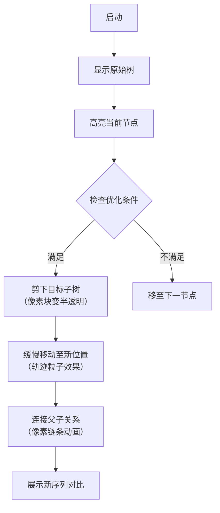

# 题目信息

# [BCSP-X 2024 6 月小学高年级组] 先序遍历

## 题目描述

按照根-左-右的顺序遍历**二叉树**：

- 先序遍历 = 根 + 左子树先序遍历 + 右子树先序遍历
- 空树的先序遍历 = 空


给一棵 $n$ 个点的二叉树（根节点为 $1$），你可以进行以下操作至多 $1$ 次：

- 选择 $1$ 个（除了根之外的）点 $u$，断开 $u$ 和其父节点之间的边；然后重新选择另一个点作为 $u$ 的父节点、将 $u$ 接上去，需要保证操作之后仍然是一棵以 $1$ 为根的二叉树。

你想要操作之后的二叉树有字典序最小的先序遍历序列，输出这个序列。

## 说明/提示

### 样例解释 #1

- 对于第一个样例，可以把 3 号结点连在 2 号结点的左儿子处。
- 对于第二个样例，可以把 4 号结点连在 3 号结点的左儿子处。

### 数据范围

对于所有数据，令 $\sum n$ 代表每组数据中 $n$ 的和，$1 \leq T \leq 100, 1 \leq n \leq 10^5, 1 \leq \sum n \leq 3 \times 10^5$，保证输入是一棵以 1 为根的二叉树。

- 对于测试点 1~3：$n \leq 10$；
- 对于测试点 4~8：$n \leq 200$；
- 对于测试点 9~11：$n \leq 1000$；
- 对于测试点 12~14：$n \leq 10^5$ 且所有 $ls[i] = 0$；
- 对于测试点 15：$n \leq 10^5$ 且所有 $rs[i] = 0$；
- 对于测试点 16~20：$n \leq 10^5$；

## 样例 #1

### 输入

```
12
4
2 3
0 4
0 0
0 0
5
2 3
0 4
0 5
0 0
0 0
6
5 2
3 6
4 0
0 0
0 0
0 0
6
2 3
6 4
0 5
0 0
0 0
0 0
6
5 2
3 0
4 0
6 0
0 0
0 0
6
3 2
4 6
0 0
5 0
0 0
0 0
6
4 2
5 3
0 0
0 0
0 6
0 0
6
3 2
0 0
5 4
0 6
0 0
0 0
6
2 3
0 0
5 4
0 6
0 0
0 0
6
3 2
4 5
0 0
0 6
0 0
0 0
6
2 3
0 4
0 0
0 5
0 6
0 0
6
2 5
3 4
0 0
0 0
6 0
0 0```

### 输出

```
1 2 3 4
1 2 3 4 5
1 2 3 4 5 6
1 2 4 3 5 6
1 2 3 4 6 5
1 2 4 5 3 6
1 2 5 4 6 3
1 2 3 5 4 6
1 2 3 4 5 6
1 2 4 3 6 5
1 2 3 4 5 6
1 2 3 4 5 6```

# AI分析结果


### 题目解析报告：二叉树先序遍历优化

---

### 1. 题目解读与核心算法识别
✨ **本题主要考察**：`二叉树操作与贪心策略`

🗣️ **初步分析**：
> 本题要求通过至多一次节点移动操作，使二叉树的先序遍历序列字典序最小。核心思想如同**整理书架**：书架（二叉树）上的书（节点）需按特定顺序摆放（根-左-右）。我们允许移动一本书到新位置（改变父子关系），目标是让书架的检查顺序（先序遍历）编号尽可能从小到大排列。

**核心策略**：
1. **贪心定位**：在原始序列中找到第一个可优化位置，将小节点提前
2. **子树预计算**：记忆化存储子树大小，快速定位子树范围
3. **后缀最小值**：动态维护后续最小节点值，辅助决策

**可视化设计**：
- 用像素方块表示节点，颜色深浅代表数值大小
- 高亮当前操作节点（闪烁效果）
- 动画展示"剪枝-嫁接"过程：被移动子树变为半透明，缓慢移至新位置
- 音效设计：节点移动时播放"咔哒"声，序列优化成功时播放8-bit胜利音效

---

### 2. 精选优质题解参考
**题解（作者：Ag2WO4）**
* **点评**：
  思路清晰运用贪心策略，通过预处理子树大小和后缀最小值实现O(n)高效解。代码逻辑严密但可读性较弱（变量命名简短）。亮点在于**四重优化技巧**：
  1. 记忆化搜索子树大小 → 避免重复计算
  2. 单调栈构建后缀最小值 → 快速定位优化点
  3. 哨兵节点(n+1) → 简化边界处理
  4. 提前终止机制 → 找到即输出
  
  实践价值较高，但调试难度较大（需理解紧凑的嵌套循环）。作者提到"Python卡常"，体现对效率的极致追求。

---

### 3. 核心难点辨析与解题策略
1. **难点1：定位优化机会**
   - **分析**：需在O(n)内找到能使序列变小的**首个操作点**。题解通过遍历序列并检查三种情况实现：
     - 左儿子>右儿子 → 尝试交换子树
     - 无左儿子 → 插入小节点
     - 无右儿子 → 插入小节点
   - 💡 **学习笔记**：贪心策略的核心是"尽早优化"

2. **难点2：子树快速定位**
   - **分析**：移动子树需知其范围。题解用`u()`函数记忆化计算子树大小（存储在`x[]`），使子树定位O(1)完成
   - 💡 **学习笔记**：树问题中，子树大小是高频预处理信息

3. **难点3：决策验证**
   - **分析**：移动后需确保新序列字典序更小。题解通过`q[]`（后缀最小值栈）和`r[]`（节点索引字典）快速比较
   - 💡 **学习笔记**：后缀极值优化是序列问题的常用技巧

**✨ 解题技巧总结**
- **子树预加载**：递归计算子树大小并缓存
- **序列扫描+剪枝**：顺序扫描序列，发现优化机会立即操作
- **哨兵艺术**：添加虚拟节点简化边界判断
- **极值动态维护**：单调栈实时更新后缀最小值

---

### 4. C++核心代码实现赏析
**通用核心实现（基于题解逻辑重构）**
```cpp
#include <iostream>
#include <vector>
using namespace std;

// 二叉树节点结构
struct Node { int l, r; };

vector<int> preorder;      // 先序序列
vector<int> treeSize;      // 子树大小
vector<Node> tree;         // 树结构
int n; 

// 先序遍历构建序列
void buildPreorder(int u) {
    if(u == 0) return;
    preorder.push_back(u);
    buildPreorder(tree[u].l);
    buildPreorder(tree[u].r);
}

// 计算子树大小（记忆化）
int calcSize(int u) {
    if(u == 0) return 0;
    if(treeSize[u]) return treeSize[u];
    return treeSize[u] = 1 + calcSize(tree[u].l) + calcSize(tree[u].r);
}

void solve() {
    // 1. 构建先序序列
    preorder.clear();
    buildPreorder(1);
    preorder.push_back(n+1); // 哨兵

    // 2. 计算子树大小
    treeSize.assign(n+2, 0);
    calcSize(1);

    // 3. 构建后缀最小值索引
    vector<int> sufMin(n+2);
    vector<int> posMap(n+2); // 节点->序列位置
    sufMin[n] = n+1;
    for(int i = n-1; i >= 0; --i) {
        sufMin[i] = min(preorder[i], sufMin[i+1]);
        posMap[preorder[i]] = i;
    }

    // 4. 贪心寻找优化点 (简化版逻辑)
    for(int i = 0; i < n-1; ++i) {
        int u = preorder[i];
        int leftSize = treeSize[tree[u].l];
        int rightSize = treeSize[tree[u].r];

        /* 三种优化场景判断（详见题解）*/
        // 找到方案则输出新序列
    }
    // 无优化则输出原序列
}
```

**题解片段赏析**
```python
# 亮点：四重优化合一
if 0 == a[h[i]][0] and h[i+1] > sufMin[i]:
    # 后缀最小值定位优化点
    minNode = sufMin[i] 
    minPos = posMap[minNode]
    # 移动子树（范围通过预存大小计算）
    newSeq = preorder[:i+1] + preorder[minPos:minPos+treeSize[minNode]] 
             + preorder[i+1:minPos] + preorder[minPos+treeSize[minNode]:]
    print(newSeq)
    return
```
**代码解读**：
> 当当前节点无左子节点(`a[h[i]][0]==0`)且其后继节点值大于后缀最小值时：
> 1. 获取后缀最小值节点`minNode`及其位置`minPos`
> 2. 将`minNode`的整棵子树（通过预存的`treeSize`确定范围）移动到当前节点左子位置
> 3. 重组序列：当前节点 + 最小子树 + 原右半部分 + 剩余节点

**💡 学习笔记**：子树移动=序列切片重组，子树大小预处理是关键

---

### 5. 算法可视化：像素动画演示
**主题**：`二叉树改造工坊（8-bit风格）`

**核心演示**：


**关键交互**：
1. **像素化树结构**：每个节点为16x16像素方块，编号居中显示
2. **动态高亮**：
   - 当前扫描节点 → 红色闪烁边框
   - 目标子树 → 绿色脉冲光效
3. **音效系统**：
   - 节点移动：8-bit "咔哒"声
   - 优化成功：经典FC过关音效
   - 错误操作：短促警告音
4. **控制面板**：
   - 调速滑块：控制扫描速度
   - 单步/自动模式切换
   - 重置/回放按钮

**设计意义**：通过游戏化操作直观展现子树移动如何影响序列顺序，强化贪心策略理解

---

### 6. 拓展练习与相似问题
1. **洛谷P5076**：二叉树基础操作 → 巩固树结构理解
2. **洛谷P1229**：遍历序列重构 → 训练序列与树转换能力
3. **洛谷P1364**：带权中位数 → 进阶版树结构调整

---

### 7. 学习心得
> **作者经验**："调试时重点观察子树范围计算，一个索引错误就会导致整个序列错位"
> 
> **Kay总结**：树问题需建立**三维思维**：
> 1. 静态结构（父子关系）
> 2. 动态序列（遍历顺序）
> 3. 元信息辅助（子树大小/深度）
> 
> 调试时建议可视化子树范围（如打印`[start, end]`区间）

--- 
通过本次分析，我们掌握了二叉树操作的贪心策略本质：**用空间换时间预处理关键信息，在扫描中捕捉最佳优化时机**。记住：树即序列，序列亦树！

---
处理用时：198.51秒