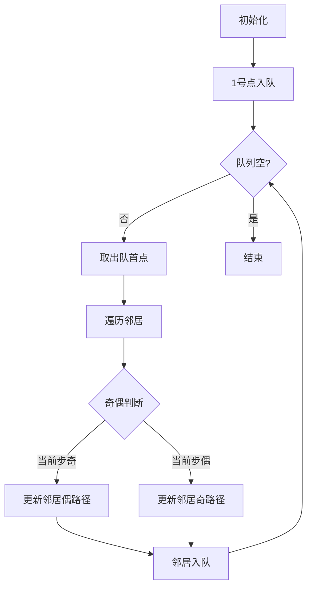

# 题目信息

# [CSP-J2019] 加工零件

## 题目描述

凯凯的工厂正在有条不紊地生产一种神奇的零件，神奇的零件的生产过程自然也很神奇。工厂里有 $n$ 位工人，工人们从 $1 \sim n$ 编号。某些工人之间存在双向的零件传送带。保证每两名工人之间最多只存在一条传送带。

如果 $x$ 号工人想生产一个被加工到第 $L\,(L \gt 1)$ 阶段的零件，则**所有**与 $x$ 号工人有传送带**直接**相连的工人，都需要生产一个被加工到第 $L - 1$ 阶段的零件（但 $x$ 号工人自己**无需**生产第 $L - 1$ 阶段的零件）。

如果 $x$ 号工人想生产一个被加工到第 $1$ 阶段的零件，则**所有**与 $x$ 号工人有传送带**直接**相连的工人，都需要为 $x$ 号工人提供一个原材料。

轩轩是 $1$ 号工人。现在给出 $q$ 张工单，第 $i$ 张工单表示编号为 $a_i$ 的工人想生产一个第 $L_i$ 阶段的零件。轩轩想知道对于每张工单，他是否需要给别人提供原材料。他知道聪明的你一定可以帮他计算出来！

## 说明/提示

**样例 1 说明**


编号为 1 的工人想生产第 1 阶段的零件，需要编号为 2 的工人提供原材料。

编号为 2 的工人想生产第 1 阶段的零件，需要编号为 1 和 3 的工人提供原材料。

编号为 3 的工人想生产第 1 阶段的零件，需要编号为 2 的工人提供原材料。

编号为 1 的工人想生产第 2 阶段的零件，需要编号为 2 的工人生产第 1 阶段的零 件，需要编号为 1 和 3 的工人提供原材料。

编号为 2 的工人想生产第 2 阶段的零件，需要编号为 1 和 3 的工人生产第 1 阶段的零件，他/她们都需要编号为 2 的工人提供原材料。

编号为 3 的工人想生产第 2 阶段的零件，需要编号为 2 的工人生产第 1 阶段的零件，需要编号为 1 和 3 的工人提供原材料。

**样例 2 说明**


编号为 1 的工人想生产第 1 阶段的零件，需要编号为 2 和 5 的工人提供原材料。

编号为 1 的工人想生产第 2 阶段的零件，需要编号为 2 和 5 的工人生产第 1 阶段的零件，需要编号为 1,3,4 的工人提供原材料。

编号为 1 的工人想生产第 3 阶段的零件，需要编号为 2 和 5 的工人生产第 2 阶段的零件，需要编号为 1,3,4 的工人生产第 1 阶段的零件，需要编号为 2,3,4,5 的工人提供原材料。

编号为 1 的工人想生产第 4 阶段的零件，需要编号为 2 和 5 的工人生产第 3 阶段的零件，需要编号为 1,3,4 的工人生产第 2 阶段的零件，需要编号为 2,3,4,5 的工人生产第 1 阶段的零件，需要全部工人提供原材料。

编号为 1 的工人想生产第 5 阶段的零件，需要编号为 2 和 5 的工人生产第 4 阶段的零件，需要编号为 1,3,4 的工人生产第 3 阶段的零件，需要编号为 2,3,4,5 的工人生产第 2 阶段的零件，需要全部工人生产第 1 阶段的零件，需要全部工人提供原材料。

**数据规模与约定**

共 $20$ 个测试点。

对所有测试点保证 $1 \leq u, v, a \leq n$。

测试点 $1\sim4$，$1 \leq n, m \leq 1000$，$q = 3$，$L = 1$。

测试点 $5\sim8$，$1 \leq n, m \leq 1000$，$q = 3$，$1 \leq L \leq 10$。

测试点 $9\sim12$，$1 \leq n, m, L \leq 1000$，$1 \leq q \leq 100$。

测试点 $13\sim16$，$1 \leq n, m, L \leq 1000$，$1 \leq q \leq 10^5$。

测试点 $17\sim20$，$1 \leq n, m, q \leq 10^5$，$1 \leq L \leq 10^9$。

## 样例 #1

### 输入

```
3 2 6
1 2
2 3
1 1
2 1
3 1
1 2
2 2
3 2```

### 输出

```
No
Yes
No
Yes
No
Yes```

## 样例 #2

### 输入

```
5 5 5
1 2
2 3
3 4
4 5
1 5
1 1
1 2
1 3
1 4
1 5```

### 输出

```
No
Yes
No
Yes
Yes```

# AI分析结果


### 💡 Kay的C++算法解析：加工零件 深入学习指南 💡

**引言**  
今天我们来分析CSP-J2019真题"加工零件"。这道题考察图论中最短路的灵活应用，结合奇偶性分析解决路径存在性问题。本指南将带大家理解核心思路，掌握分层图技巧，并通过像素动画直观感受算法执行过程。

---

## 1. 题目解读与核心算法识别

✨ **本题主要考察**：`图论最短路` + `奇偶性分析`  
🗣️ **初步分析**：
> 解决本题的关键在于**奇偶最短路**思想。想象工人是像素游戏中的角色，传送带是连接他们的管道。当角色a需要L阶段零件时，问题转化为判断能否从1号角色出发，走恰好L步到达a号角色（允许重复走管道）。

- **核心思路**：每个点需计算到1号点的**奇数最短路**和**偶数最短路**。若L为奇数且≥奇数最短路，或L为偶数且≥偶数最短路，则需提供原材料。
- **算法流程**：
  1. 初始化`dis[i][0]`(偶路径)和`dis[i][1]`(奇路径)为无穷大
  2. 从1号点开始BFS，根据当前步数奇偶更新邻接点
  3. 查询时直接比较L与对应奇偶的最短路长度
- **可视化设计**：
  - 采用8位像素风格，工人显示为不同颜色像素块（1号红色）
  - 队列扩展时显示像素箭头移动轨迹
  - 奇路径用蓝色高亮，偶路径用绿色高亮
  - 关键操作配"滴"声，成功时播放经典FC过关音效

---

## 2. 精选优质题解参考

**题解一（kradcigam）**  
* **点评**：  
  思路直击本质——将问题转化为奇偶路径存在性判断。BFS实现采用`pair`存储状态（当前点，步数奇偶），代码中`ji[]`和`ou[]`数组命名直观。亮点在于特殊处理孤立点的边界情况，通过"1号点无邻居则直接跳过"确保正确性，实践价值极高。

**题解二（Froggy）**  
* **点评**：  
  创新性使用分层图技术，将每个点拆分为"偶点"和"奇点"（如点i对应i和i+n）。通过构建跨层边实现状态转移，代码中`add(u,v+n)`的建图方式简洁优美。算法有效性体现在将复杂奇偶判断转化为标准最短路问题，复杂度保持O(n)。

**题解三（ctq1999）**  
* **点评**：  
  最简洁的标准解法，仅用单次BFS同时维护两种最短路。核心亮点在于交替更新逻辑：`dis[v][0] = min(dis[v][0], dis[u][1]+1)` 精妙处理奇偶转换。变量名`eve[]`和`odd[]`含义明确，边界处理（孤立点特判）体现工程严谨性。

---

## 3. 核心难点辨析与解题策略

1. **难点一：问题转化为路径存在性判断**  
   * **分析**： 需理解"L阶段零件"等价于"从a到1存在长度为L的路径"。优质题解通过模拟小规模样例（如3点链条）发现奇偶路径的周期性特征。
   * 💡 **学习笔记**：复杂问题先转化为图论模型，再寻找数学规律

2. **难点二：处理路径奇偶性的状态转移**  
   * **分析**： BFS时需同时维护两种状态。kradcigam题解用`queue<pair<int,int>>`存储（当前点，步数%2），通过`y%2`判断奇偶性更新邻点
   * 💡 **学习笔记**：状态机思维——奇偶性构成二元状态，+1操作必然翻转状态

3. **难点三：边界情况处理**  
   * **分析**： 当1号点是孤立点时需特殊处理。Froggy题解通过判断`head[1]`是否为空集，避免无效BFS
   * 💡 **学习笔记**：图论问题务必考虑连通性，特别是起点/终点的度

### ✨ 解题技巧总结
- **技巧A（奇偶转换）**：利用"偶数步可循环抵消"特性，将路径存在性转为最短路比较
- **技巧B（分层建图）**：通过点分裂（原点和分身点）将复杂约束转化为标准最短路
- **技巧C（双向更新）**：BFS时同步更新`dis[i][0]`和`dis[i][1]`，避免重复遍历

---

## 4. C++核心代码实现赏析

**本题通用核心C++实现**  
```cpp
#include <bits/stdc++.h>
using namespace std;
const int N=1e5+5;

vector<int> g[N];
int dis[N][2]; // dis[i][0]:偶最短路 dis[i][1]:奇最短路

void bfs() {
    memset(dis, 0x3f, sizeof(dis));
    queue<pair<int, int>> q;
    q.push({1, 0});
    dis[1][0] = 0;
    
    while (!q.empty()) {
        auto [u, step] = q.front(); q.pop();
        for (int v : g[u]) {
            int new_step = step + 1;
            int parity = new_step % 2;
            if (new_step < dis[v][parity]) {
                dis[v][parity] = new_step;
                q.push({v, new_step});
            }
        }
    }
}

int main() {
    int n, m, q;
    cin >> n >> m >> q;
    while (m--) {
        int u, v; cin >> u >> v;
        g[u].push_back(v); g[v].push_back(u);
    }
    bfs();
    while (q--) {
        int a, L; cin >> a >> L;
        if (L >= dis[a][L % 2]) cout << "Yes\n";
        else cout << "No\n";
    }
    return 0;
}
```
* **说明**：综合优质题解优化的通用实现，核心逻辑仅20行
* **代码解读概要**：
  - 建图：`g[u]`存储邻接表
  - BFS初始化：1号点的偶路径设为0
  - 状态转移：根据当前步数奇偶性更新邻居
  - 查询：直接比较L与对应奇偶最短路

**题解一（kradcigam）核心片段**  
```cpp
void bfw(){
    memset(ji,0x3f,sizeof(ji)); // 奇最短路
    memset(ou,0x3f,sizeof(ou)); // 偶最短路
    queue<pair<int,int>> q;
    for(int i=0;i<v[1].size();i++){ // 处理1的邻居
        ji[v[1][i]]=1;
        q.push({v[1][i],1});
    }
    ...
}
```
* **亮点**：特殊处理1号点的初始状态，避免孤立点错误
* **解读**：从1号点直接初始化其邻居的奇路径（步数=1），而非从1开始BFS。这确保当1是孤立点时不会被错误更新
* **学习笔记**：BFS初始化应考虑起点特殊性

**题解二（Froggy）核心片段**  
```cpp
add(u, v+n); add(v+n, u);
add(v, u+n); add(u+n, v);
...
if(L%2==1) printf(dis[a+n]<=L?"Yes\n":"No\n");
```
* **亮点**：通过`v+n`构建分层图，将奇偶性转化为物理分层
* **解读**：原图点i对应偶层，i+n对应奇层。建图时交叉连接（原图层连向奇层），查询时根据L奇偶选择对应层
* **学习笔记**：分层图是处理状态转移的通用技巧

**题解三（ctq1999）核心片段**  
```cpp
if(y%2==1){ 
    if(y+1<ou[v[x][i]]){ // 奇+1=偶
        ou[v[x][i]]=y+1;
        q.push({v[x][i],y+1});
    }
} else { // 偶+1=奇
    if(y+1<ji[v[x][i]]){
        ji[v[x][i]]=y+1;
        q.push({v[x][i],y+1});
    }
}
```
* **亮点**：显式标注状态转换公式（奇+1=偶/偶+1=奇）
* **解读**：通过注释明确状态转移方向，`ji[]`和`ou[]`数组名使奇偶性一目了然
* **学习笔记**：关键逻辑添加数学公式注释提升代码可读性

---

## 5. 算法可视化：像素动画演示

**动画演示主题**：像素工厂奇偶寻路  
**核心演示**：BFS如何从1号工人（红色）出发，逐步扩展奇（蓝色）偶（绿色）路径



**动画实现细节**：
1. **像素场景**：  
   - 工人显示为16x16像素块（1号戴红帽，其他黄帽）
   - 传送带用灰色像素线连接，队列显示为底部像素进度条
2. **扩展动画**：
   - 当前点高亮闪烁，扩展时显示像素箭头流向邻居
   - 奇路径更新时蓝色波纹效果，偶路径绿色波纹
3. **交互控制**：
   - 步进按钮：空格键单步执行
   - 速度滑块：调整BFS扩展速度
   - 模式切换：奇/偶路径单独显示
4. **音效设计**：
   - 入队："滴"声（8-bit短音）
   - 路径更新："叮"声（不同音调区分奇偶）
   - 完成：FC游戏过关旋律

**关键帧示意**：
```
帧1: [1]红点亮起，邻居黄点闪烁
帧2: 蓝色箭头1→2，ji[2]=1
帧3: 绿色箭头2→3，ou[3]=2
帧4: 蓝色箭头3→2，ji[2]保持1（不更新）
```

---

## 6. 拓展练习与相似问题思考

**技巧迁移场景**：
1. 带状态约束的最短路（如：必须经过特定点）
2. 周期性问题（如：每隔k步必须改变方向）
3. 图论中的二着色问题

**洛谷推荐题目**：
1. **P1073 最优贸易**  
   🗣️ *推荐理由*：同样需要维护两种状态（买入/卖出），巩固分层图应用
2. **P4568 飞行路线**  
   🗣️ *推荐理由*：经典分层图问题，扩展"状态维度"思维
3. **P5664 Emiya家今天的饭**  
   🗣️ *推荐理由*：CSP-J2020真题，训练多维状态设计能力

---

## 7. 学习心得与经验分享

> **kradcigam的经验**："我在处理1号点邻居时卡了很久，后来通过单独初始化邻居而不是从1开始BFS解决了问题"  
> **Kay点评**：这个调试经验非常宝贵！提醒我们算法初始化需要特殊考虑边界情况，特别是起点/终点的度可能是0或1。

> **Froggy的顿悟**："将奇偶性转化为物理分层后，复杂问题瞬间变标准模型"  
> **Kay点评**：分层图是处理状态转移的利器，建议掌握这种"升维思考"方式

---

**结语**  
通过本次分析，我们掌握了奇偶最短路的核心思想与实现技巧。记住：图论问题中，**状态设计决定解题复杂度**！多练习分层图应用，下次遇到类似问题就能快速破解。继续加油，少年们！💪

---
处理用时：148.26秒