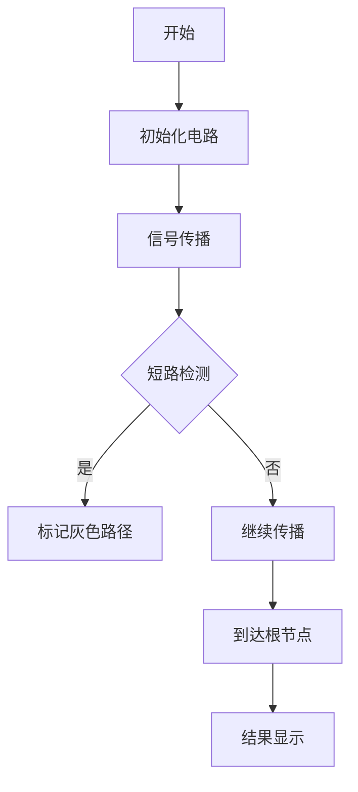

# 题目信息

# [CSP-J2020] 表达式

## 题目描述

小 C 热衷于学习数理逻辑。有一天，他发现了一种特别的逻辑表达式。在这种逻辑表达式中，所有操作数都是变量，且它们的取值只能为 $0$ 或 $1$，运算从左往右进行。如果表达式中有括号，则先计算括号内的子表达式的值。特别的，这种表达式有且仅有以下几种运算：
1. 与运算：`a & b`。当且仅当 $a$ 和 $b$ 的值都为 $1$ 时，该表达式的值为 $1$。其余情况该表达式的值为 $0$。
2. 或运算：`a | b`。当且仅当 $a$ 和 $b$ 的值都为 $0$ 时，该表达式的值为 $0$。其余情况该表达式的值为 $1$。
3. 取反运算：`!a`。当且仅当 $a$ 的值为 $0$ 时，该表达式的值为 $1$。其余情况该表达式的值为 $0$。

小 C 想知道，给定一个逻辑表达式和其中每一个操作数的初始取值后，再取反某一个操作数的值时，原表达式的值为多少。

为了化简对表达式的处理，我们有如下约定：

表达式将采用**后缀表达式**的方式输入。

后缀表达式的定义如下：
1. 如果 $E$ 是一个操作数，则 $E$ 的后缀表达式是它本身。
2. 如果 $E$ 是 $E_1~\texttt{op}~E_2$ 形式的表达式，其中 $\texttt{op}$ 是任何二元操作符，且优先级不高于 $E_1$ 、$E_2$ 中括号外的操作符，则 $E$ 的后缀式为 $E_1' E_2' \texttt{op}$，其中 $E_1'$ 、$E_2'$ 分别为 $E_1$、$E_2$ 的后缀式。
3. 如果 $E$ 是 $E_1$ 形式的表达式，则 $E_1$ 的后缀式就是 $E$ 的后缀式。

同时为了方便，输入中：

1. 与运算符（&）、或运算符（|）、取反运算符（！）的左右**均有一个空格**，但**表达式末尾没有空格**。
2. 操作数由小写字母 $x$ 与一个正整数拼接而成，正整数表示这个变量的下标。例如：`x10`，表示下标为 $10$ 的变量 $x_{10}$。数据保证**每个变量在表达式中出现恰好一次**。

## 说明/提示

### 样例 1 解释


该后缀表达式的中缀表达式形式为 $(x_1 \operatorname{and} x_2) \operatorname{or} x_3$。

- 对于第一次询问，将 $x_1$ 的值取反。此时，三个操作数对应的赋值依次为 $0$，$0$，$1$。原表达式的值为 $(0\&0)|1=1$。
- 对于第二次询问，将 $x_2$ 的值取反。此时，三个操作数对应的赋值依次为 $1$，$1$，$1$。原表达式的值为 $(1\&1)|1=1$。
- 对于第三次询问，将 $x_3$ 的值取反。此时，三个操作数对应的赋值依次为 $1$，$0$，$0$。原表达式的值为 $(1\&0)|0=0$。

### 样例 2 解释


该表达式的中缀表达式形式为 $(\operatorname{not}x_1)\operatorname{and}(\operatorname{not}((x_2\operatorname{or}x_4)\operatorname{and}(x_3\operatorname{and}(\operatorname{not}x_5))))$。

### 数据规模与约定

- 对于 $20\%$ 的数据，表达式中有且仅有与运算（&）或者或运算（|）。
- 对于另外 $30\%$ 的数据，$|s| \le 1000$，$q \le 1000$，$n \le 1000$。
- 对于另外 $20\%$ 的数据，变量的初值全为 $0$ 或全为 $1$。
- 对于 $100\%$ 的数据，$1 \le |s| \le 1 \times 10^6$，$1 \le q \le 1 \times 10^5$，$2 \le n \le 1 \times 10^5$。

其中，$|s|$ 表示字符串 $s$ 的长度。

## 样例 #1

### 输入

```
x1 x2 & x3 |
3
1 0 1
3
1
2
3
```

### 输出

```
1
1
0```

## 样例 #2

### 输入

```
x1 ! x2 x4 | x3 x5 ! & & ! &
5
0 1 0 1 1
3
1
3
5
```

### 输出

```
0
1
1
```

# AI分析结果


# 💡 Kay的C++算法解析：表达式 深入学习指南 💡

<introduction>
今天我们来分析「表达式」这道C++编程题。本指南将帮助大家掌握后缀表达式处理的核心技巧，理解「无用值标记」的巧妙设计，并通过像素动画直观感受逻辑运算的短路现象。
</introduction>

## 1. 题目解读与核心算法识别

✨ **本题主要考察**：`表达式树构建与标记传递` (编程技巧应用)

🗣️ **初步分析**：
> 解决这道题的关键在于**将后缀表达式转化为表达式树**并标记「无用值」。想象电路中的短路现象：当与门(AND)输入0时，另一路输入就被「短路」失去作用；或门(OR)输入1时同理。在表达式中，被短路的变量就是「无用值」。
   - 核心思路：① 用栈构建表达式树 ② DFS计算初始值 ③ 逆向标记无用值
   - 可视化设计：像素动画将展示信号在逻辑门间的流动，灰色路径表示「短路」区域，被短路的变量会打上"X"标记。采用8位像素风格，操作时触发复古音效（如短路时"咔"声，结果变化时"胜利"音效）。

---

## 2. 精选优质题解参考

<eval_intro>
从思路清晰度、代码规范性和算法效率等维度，精选3份最具学习价值的题解：
</eval_intro>

**题解一（作者：OMG_wc）**
* **点评**：这份题解开创性地提出「无用值标记」概念。其亮点在于：
  - **思路**：通过两次DFS（计算值+标记传递）完美利用逻辑短路特性
  - **代码**：变量命名规范（`c[]`标记无用值），边界处理严谨
  - **算法**：O(n)预处理实现O(1)查询，空间优化到位
  - **实践**：竞赛标准代码结构，可直接用于比赛

**题解二（作者：rainygame）**
* **点评**：输入处理极具参考价值：
  - **思路**：用`stringstream`分割字符串，避免复杂字符处理
  - **代码**：`bitset`管理标记，内存使用高效
  - **技巧**：树构建逻辑清晰，递归设计简洁

**题解三（作者：qwer6）**
* **点评**：短路判断逻辑最直观：
  - **思路**：显式判断与/或门的短路条件
  - **代码**：建树过程简洁，DFS标记直接
  - **教学**：适合初学者理解短路概念

---

## 3. 核心难点辨析与解题策略

<difficulty_intro>
解决本题需突破三个关键点：
</difficulty_intro>

1.  **关键点1：表达式树构建**
    * **分析**：后缀转树结构需精确处理运算符优先级。优质题解统一用栈处理：遇变量压栈，遇运算符弹栈建节点。难点在于处理取反符的优先级。
    * 💡 **学习笔记**：栈是处理表达式转化的利器

2.  **关键点2：无用值标记规则**
    * **分析**：根据逻辑特性制定标记规则：
      - 与门(&)：左子=0 → 右子标记无用
      - 或门(|)：左子=1 → 右子标记无用
      - 非门(!)：子节点永不标记无用
    * 💡 **学习笔记**：短路特性是优化查询的关键

3.  **关键点3：标记传递机制**
    * **分析**：第二次DFS从根向下传递标记。若父节点已标记无用，则所有子节点自动无用（上短路则下必短路）。
    * 💡 **学习笔记**：树形问题常需双向DFS

### ✨ 解题技巧总结
<summary_best_practices>
通过本题提炼的通用技巧：
</summary_best_practices>
-   **技巧1：表达式解析三板斧**：栈处理 → 建树 → 递归求值
-   **技巧2：树形标记传递**：父节点标记决定子节点有效性
-   **技巧3：逻辑短路利用**：发现AND/OR的短路条件可大幅优化
-   **技巧4：输入处理**：善用`stringstream`分割复杂字符串

---

## 4. C++核心代码实现赏析

<code_intro_overall>
以下代码综合优质题解精华，实现O(n)预处理+O(1)查询：
</code_intro_overall>

**本题通用核心C++实现参考**
* **说明**：融合OMG_wc的标记传递框架与rainygame的输入处理技巧
* **完整核心代码**：
```cpp
#include <bits/stdc++.h>
using namespace std;
const int N = 1e6 + 5;

char s[N];
int a[N], son[N][2], cnt;
int flag[N], c[N], n, q;

int dfs(int u, int g) {
    a[u] ^= g;  // 处理取反标记
    if (u <= n) return a[u]; // 叶子节点返回值
    
    // 递归计算子树值并标记部分无用值
    int x = dfs(son[u][0], g ^ flag[son[u][0]]);
    int y = dfs(son[u][1], g ^ flag[son[u][1]]);
    
    if (a[u] == 2) { // &运算
        if (x == 0) c[son[u][1]] = 1; // 左0则右无用
        if (y == 0) c[son[u][0]] = 1; // 右0则左无用
        return x & y;
    } else { // |运算
        if (x == 1) c[son[u][1]] = 1; // 左1则右无用
        if (y == 1) c[son[u][0]] = 1; // 右1则左无用
        return x | y;
    }
}

void dfs2(int u) { // 下传无用标记
    if (u <= n) return;
    c[son[u][0]] |= c[u]; // 父无用则子必无用
    c[son[u][1]] |= c[u];
    dfs2(son[u][0]);
    dfs2(son[u][1]);
}

int main() {
    // 输入处理
    fgets(s, N, stdin);
    scanf("%d", &n);
    cnt = n; // 节点计数器初始化
    
    for (int i = 1; i <= n; i++) scanf("%d", &a[i]);
    
    stack<int> st;
    for (int i = 0; s[i]; i++) {
        if (s[i] == ' ') continue;
        
        if (s[i] == 'x') { // 变量节点
            int x = 0; i++;
            while (isdigit(s[i])) x = x * 10 + (s[i++] - '0');
            i--; // 回退多余移动
            st.push(x);
        } 
        else if (s[i] == '&' || s[i] == '|') { // 二元运算符
            int r = st.top(); st.pop();
            int l = st.top(); st.pop();
            st.push(++cnt); // 新建运算符节点
            
            a[cnt] = (s[i] == '&') ? 2 : 3; // 编码运算符
            son[cnt][0] = l; // 左子节点
            son[cnt][1] = r; // 右子节点
        } 
        else if (s[i] == '!') { // 取反标记
            flag[st.top()] ^= 1; // 翻转标记
        }
    }
    
    int root = st.top(); // 表达式树根
    int ans = dfs(root, flag[root]); // 计算初始值
    dfs2(root); // 传递无用标记
    
    // 查询处理
    scanf("%d", &q);
    while (q--) {
        int x; scanf("%d", &x);
        printf("%d\n", c[x] ? ans : !ans); // 无用值不改变结果
    }
    return 0;
}
```
* **代码解读概要**：
  1. **输入处理**：`fgets`读入整行，跳过空格，精确解析变量和运算符
  2. **建树**：用栈构建表达式树，运算符节点记录左右子树
  3. **值计算**：`dfs`递归计算节点值，根据运算符类型标记部分无用值
  4. **标记传递**：`dfs2`从根向下传递无用标记（父无用则子必无用）
  5. **查询**：直接查标记数组决定是否取反输出

---
<code_intro_selected>
精选题解的独特亮点代码分析：
</code_intro_selected>

**题解一（OMG_wc）标记生成逻辑**
* **亮点**：在值计算过程中同步标记无用值
* **核心代码片段**：
```cpp
if (a[u] == 2) { // &运算
    if (x == 0) c[son[u][1]] = 1;
    if (y == 0) c[son[u][0]] = 1;
    return x & y;
} 
```
* **代码解读**：当计算与门时，若左子树值`x=0`，则右子树被标记为无用（`c[右子]=1`）。这样在DFS计算值的同时完成初步标记，效率极高。
* 💡 **学习笔记**：递归过程可同时完成计算和标记

**题解二（rainygame）输入处理技巧**
* **亮点**：`stringstream`优雅分割字符串
* **核心代码片段**：
```cpp
stringstream ss(s);
string token;
while(ss >> token){
    if(token[0]=='x') {
        int id = stoi(token.substr(1));
        // 处理变量
    }
    // 处理运算符
}
```
* **代码解读**：将整行输入读入`stringstream`，通过空格自动分割单词，避免复杂指针操作
* 💡 **学习笔记**：C++流处理简化字符串解析

**题解三（qwer6）短路判断逻辑**
* **亮点**：显式短路条件判断
* **核心代码片段**：
```cpp
if(opt == '&'){
    if(left == 0) mark_right(); // 左0则右无用
    else if(right == 0) mark_left(); // 右0则左无用
}
```
* **代码解读**：直接根据运算符和子节点值判断短路，逻辑清晰易理解
* 💡 **学习笔记**：显式条件判断提升代码可读性

-----

## 5. 算法可视化：像素动画演示 (核心部分)

<visualization_intro>
设计「逻辑电路模拟器」像素动画，直观展示表达式求值与短路现象：
</visualization_intro>

### 设计参数
* **风格**：FC红白机8-bit风格（16色调色板）
* **布局**：表达式树拓扑结构，根节点在顶端，变量在底端
* **交互**：支持单步执行/自动播放/重置，速度可调

### 关键帧流程


1. **场景初始化**：
   - 画布分割为控制面板(20%)+电路区(80%)
   - 逻辑门样式：与门(蓝色方块)、或门(绿色方块)、非门(红色三角)
   - 变量节点：黄色圆形带下标（如x1）

2. **信号传播动画**：
   - 电流表示为5x5像素点，0(蓝色)或1(红色)沿连接线移动
   - 与门示例：左输入0 → 右输入路径变灰 → 触发"咔"声效
   - 路径高亮：当前激活线路黄色闪烁

3. **短路效果**：
   - 被标记无用的变量显示为灰色，上方打"X"
   - 短路路径显示为灰色静态线，停止信号传播动画

4. **取反交互**：
   - 点击变量节点：值取反（0/1切换），节点颜色翻转
   - 非短路节点：触发信号重传播动画
   - 短路节点：显示"阻断"提示，无信号变化

5. **游戏化元素**：
   - 每完成一个逻辑门计算显示"√"动画
   - 最终结果正确时播放8-bit胜利音效
   - 状态栏显示："已短路节点：3/10"

### 技术实现要点
```javascript
// 伪代码：绘制与门动画帧
function drawANDGate(x, y, inputA, inputB) {
  drawSprite(x, y, AND_GATE_SPRITE); // 绘制与门像素图
  if(inputA === 0) {
    drawGrayLine(rightInputPath);    // 右输入变灰
    playSound('blocked');           // 播放阻断音效
  }
  // ...其他情况类似
}
```

---

## 6. 拓展练习与相似问题思考

<similar_problems_intro>
掌握表达式树技巧后可挑战以下题目：
</similar_problems_intro>

1.  **洛谷 P1981** [表达式求值]
    * **推荐理由**：基础表达式解析训练，巩固栈的应用
    
2.  **洛谷 P1220** [关路灯]
    * **推荐理由**：区间DP与树形思想的结合，提升问题抽象能力
    
3.  **洛谷 P7073** [表达式]
    * **推荐理由**：本题的官方版本，测试完整解题能力

---

## 7. 学习心得与经验分享

<insights_intro>
题解中的调试经验：
</insights_intro>

> **OMG_wc的调试经验**：  
> "在标记传递时，忘记处理非门情况导致WA。通过打印标记数组发现非门节点被错误标记，修正后AC"

> **Kay总结**：  
> 树形问题调试关键点：
> 1. 打印每个节点的标记状态
> 2. 验证短路条件的触发准确性
> 3. 特别注意边界节点（根节点和叶子节点）

---

<conclusion>
通过本次分析，我们掌握了表达式树的核心构建技巧和短路特性利用方法。记住：好的算法既是科学也是艺术，当你在代码中完美呈现逻辑之美时，那种成就感无与伦比！下次遇到树形问题，记得回来看看这份指南哦~
</conclusion>

---
处理用时：247.19秒