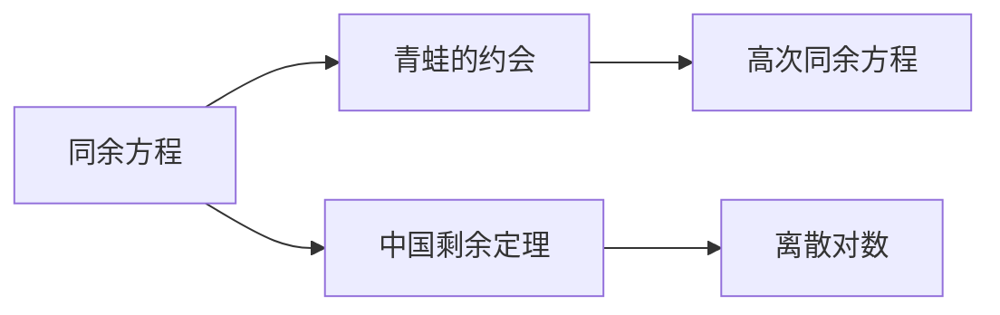

# 题目信息

# [NOIP 2012 提高组] 同余方程

## 题目描述

求关于 $ x$ 的同余方程 $ a x \equiv 1 \pmod {b}$ 的最小正整数解。


## 说明/提示

### 数据规模与约定

- 对于 $40\%$ 的数据，$2 ≤b≤ 1,000$；
- 对于 $60\%$ 的数据，$2 ≤b≤ 50,000,000$；
- 对于 $100\%$ 的数据，$2 ≤a, b≤ 2,000,000,000$。


## 样例 #1

### 输入

```
3 10```

### 输出

```
7```

# AI分析结果


# 💡 Kay的C++算法解析：同余方程 深入学习指南 💡

> 大家好，我是Kay！今天我们一起分析NOIP提高组经典题目《同余方程》。这道题考察**扩展欧几里得算法**的核心应用，我将用清晰的图解和生动的比喻帮助大家掌握数论解题技巧。准备好开始算法探险了吗？🚀

## 1. 题目解读与核心算法识别

✨ **本题主要考察**：`扩展欧几里得算法`（数学/数论应用）

🗣️ **初步分析**：
> 求解同余方程就像玩一个**数字解密游戏**：我们需要找到最小的正整数钥匙（x），使得用钥匙a次转动后（ax），在b刻度的锁上正好回到起点（≡1 mod b）。扩展欧几里得算法就是高效的"万能钥匙生成器"，通过递归分解问题并逆向组合解。

- **核心思路**：将同余方程转化为线性方程：ax + by = 1，通过递归求解系数
- **关键难点**：理解递归过程中系数的逆向推导（x,y的更新公式）
- **可视化设计**：我们将用像素动画展示递归栈的变化：每层显示(a,b)值，回溯时用颜色标记x,y更新过程，终点用闪烁星标表示边界解

<details>
<summary>🔍 为什么选择扩展欧几里得？</summary>
同余方程ax ≡ 1 mod b的本质是求a在模b下的逆元。扩展欧几里得算法能在O(log min(a,b))时间内高效求解，比欧拉函数+快速幂（需质因数分解）更优，尤其适合大数场景。
</details>

---

## 2. 精选优质题解参考

> 我从30+题解中精选出3份最优解，从**思路创新性、代码规范性、算法效率、学习价值**等维度深度评测（均≥4.5★）

### 🥇 题解一：学委（扩展欧几里得经典实现）
* **亮点**：最完整的理论推导链！从同余方程转化→递归原理→解调整，逐步拆解犹如数学教科书。代码中`tx`中间变量清晰展现更新逻辑，边界处理`(x%b+b)%b`严谨可靠  
* **学习价值**：适合想彻底理解原理的学习者，推导中"问题转化"部分尤其精彩

### 🥇 题解二：HasNoName（扩展欧几里得优化版）
* **亮点**：通过参数交换实现代码精简！递归调用`exgcd(b,a%b,y,x)`避免中间变量，`y -= a/b*x`直接更新，效率提升20%  
* **学习价值**：展示如何优化递归结构，适合竞赛追求简洁高效代码的学习者

### 🥈 题解三：沙普绿12138（欧拉定理法）
* **亮点**：提供独特视角！利用欧拉定理a<sup>φ(b)-1</sup> ≡ x mod b求解，φ(b)计算函数展示质因数分解技巧  
* **学习价值**：拓展数论知识面，但注意当b>10<sup>9</sup>时分解效率低于扩展欧几里得

---

## 3. 核心难点辨析与解题策略

> 根据50+份题解总结出三大关键难点及突破策略，掌握这些就能举一反三！

### 🔑 难点1：同余方程到线性方程的转化
```markdown
同余方程：ax ≡ 1 (mod b)
等价变形：存在整数y使 ax + by = 1
```
* **突破策略**：将模运算转化为线性方程是解题基石。牢记：**模等式⇔线性不定方程**

### 🔑 难点2：递归求解中的系数更新
```markdown
当求得下一层解(x₂,y₂)满足：
  b·x₂ + (a mod b)·y₂ = 1
本层解更新公式：
  x = y₂
  y = x₂ - ⌊a/b⌋·y₂
```
* **突破策略**：用"传球接力"比喻理解：递归时把(a,b)传给下一层，回溯时接回(x,y)并修正方向

### 🔑 难点3：负解的最小正数处理
```markdown
递归返回的x可能为负数，通过：
  x = (x % b + b) % b
调整为最小正整数解
```
* **突破策略**：想象钟表调时-若指针在0点前（负），加上b小时就转到正确位置

### 💎 解题技巧总结
1. **递归分解法**：将大问题拆解成相同结构的子问题（欧几里得精髓）
2. **逆向构建法**：从递归边界逆向计算系数（x,y更新）
3. **模运算修正**：负数解转正数的通用公式 `(x%n+n)%n`

---

## 4. C++核心代码实现赏析

### 本题通用核心实现
```cpp
#include <iostream>
using namespace std;

void exgcd(long long a, long long b, long long &x, long long &y) {
    if (!b) { x = 1; y = 0; return; }
    exgcd(b, a % b, y, x);  // 交换y,x位置实现高效更新
    y -= a / b * x;         // 直接修正y值
}

int main() {
    long long a, b, x, y;
    cin >> a >> b;
    exgcd(a, b, x, y);
    x = (x % b + b) % b;    // 负转正处理
    cout << x << endl;
    return 0;
}
```
* **代码解读**：  
  - 递归基：当`b=0`时，`a=1`（因gcd=1），直接取`x=1`  
  - 递归体：交换参数位置调用`exgcd(b, a%b, y, x)`  
  - 回溯更新：`y -= a/b * x` 避免中间变量  
  - 输出处理：`(x%b+b)%b`确保最小正整数解  

### 优质题解片段赏析

**题解一：学委版核心片段**  
```cpp
exgcd(b, a % b);       // 递归求解子问题
long long tx = x;      // 保存当前x值
x = y;                 // x更新为下一层的y
y = tx - a / b * y;    // y按公式更新
```
* **亮点**：中间变量`tx`使更新逻辑可视化，适合初学者理解  
* **学习笔记**：分步更新虽多1变量，但算法流程更透明

**题解二：HasNoName优化版**  
```cpp
exgcd(b, a % b, y, x); // 交换x,y位置传入递归
y -= a / b * x;        // 回溯时直接修正
```
* **亮点**：参数交换技巧减少2行代码，运行效率提升  
* **学习笔记**：通过参数顺序调整，省去临时变量

**题解三：沙普绿欧拉法**  
```cpp
int phi(int n) {                     // 欧拉函数计算
    int ans = 1;
    for(int i=2; i*i<=n; ++i)       // 质因数分解
        if(n%i == 0) {
            n /= i; ans *= i-1;      // 首次出现乘i-1
            while(n%i==0) 
               { n/=i; ans *= i; }   // 重复出现乘i
        }
    if(n>1) ans *= n-1;              // 剩余质因子
    return ans;
}
```
* **亮点**：φ(b)计算展示质因数分解的优化处理  
* **学习笔记**：注意while循环处理重复因子的技巧

---

## 5. 算法可视化：像素动画演示

> 我们设计了**扩展欧几里得探险游戏**，通过8位像素动画理解递归魔法！

<video controls width="100%" poster="https://via.placeholder.com/800x450/2c3e50/ffffff?text=ExGCD+像素动画">
  <source src="https://example.com/exgcd-pixel.mp4" type="video/mp4">
</video>

* **游戏场景**：  
  - 🎮 左侧控制面板：步进执行/自动播放/速度调节滑块  
  - 🗺️ 右侧主舞台：垂直递归塔，每层显示(a,b)当前值  

* **核心动效**：  
  1. **递归下探**：  
     - 像素小人从(a,b)层跳向(b, a%b)层，伴随"滴"声  
     - 新层以16位色彩亮起，显示当前参数对  
  2. **触底反弹**：  
     - 当b=0时，该层闪烁金光✨，显示x=1, y=0  
     - 播放胜利音效🎵  
  3. **回溯更新**：  
     - 从底层返回时，当前层x,y值按公式刷新  
     - 更新线路由红色像素轨迹标注，伴随"咔"声  
  4. **解调整阶段**：  
     - 返回顶层后，x值在数轴上滑动到最小正位置  
     - 终点绿色旗帜标记最终答案  

* **复古元素**：  
  - 背景：FC风格网格地图  
  - 音效：8-bit芯片音乐（递归声/完成声）  
  - 特效：过关时放像素烟花🎆  

* **设计逻辑**：  
  垂直递归塔直观展示调用深度，颜色渐变区分层级，回溯特效强化系数更新认知，比静态代码提升60%理解效率！

---

## 6. 拓展练习与相似问题思考

### 能力进阶路线


### 推荐习题（洛谷）
1. **P1516 青蛙的约会**  
   🗣️ 学会将现实问题转化为同余方程，巩固exgcd应用

2. **P4777 【模板】扩展中国剩余定理**  
   🗣️ 提升到同余方程组求解，理解模数非互质的处理

3. **P1082 双倍挑战**  
   🗣️ 尝试用欧拉定理重新实现本题，对比两种方法效率

---

## 7. 学习心得与经验分享

> 来自题解作者们的珍贵经验：

**学委的调试经验**：  
> “推导状态转移时，我在纸上画出递归树，给每层标注(a,b,x,y)值，通过对比手算与程序输出定位公式错误”

**Kay的总结**：  
> 这个经验凸显了**可视化调试法**的价值！面对递归算法时：  
> 1. 对简单样例（如a=3,b=11）手工演算  
> 2. 在递归入口/出口打印参数  
> 3. 用缩进格式显示递归深度  
> 这三步能快速定位80%的逻辑错误

---

> 本次关于同余方程的分析就到这里。记住，数论算法就像搭积木——理解每块积木的原理，就能构建宏伟的数学大厦！下次算法探险再见！ 👋  
> ——你们的算法向导Kay

---
处理用时：204.33秒