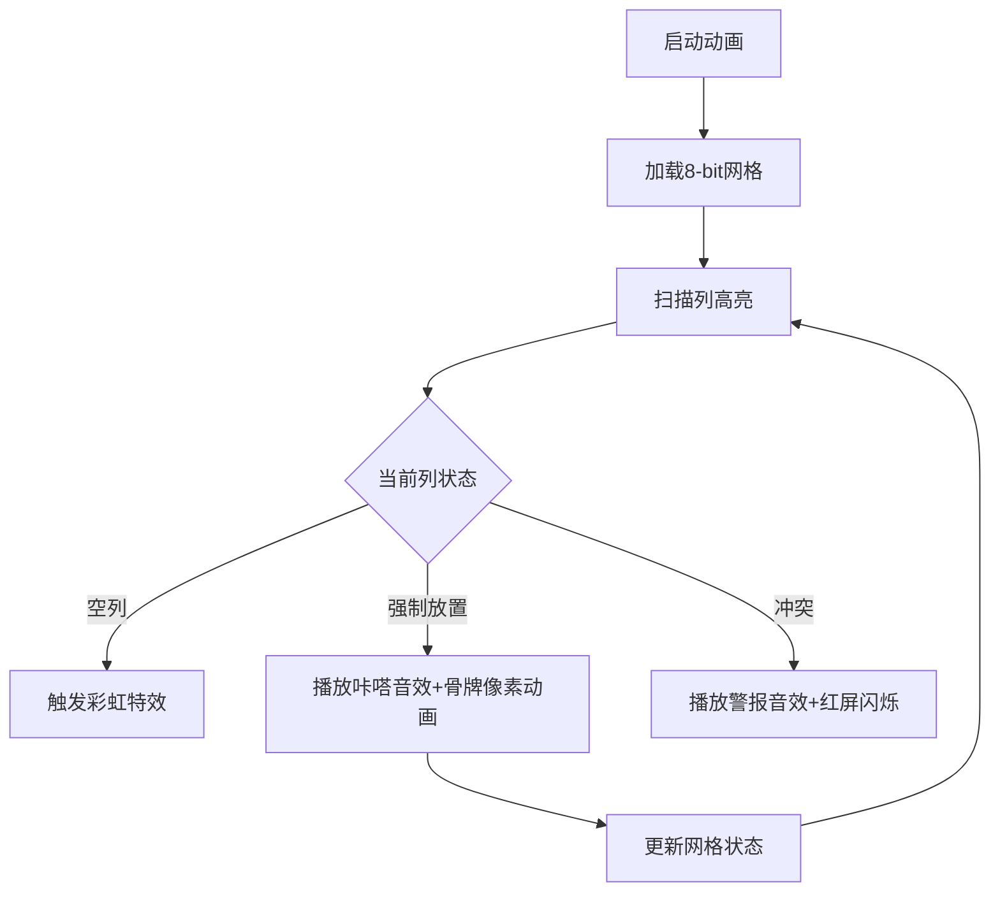

# 题目信息

# [NERC2024] Fix Flooded Floor

## 样例 #1

### 输入

```
4
10
#.......##
##..#.##..
6
...#..
..#...
8
........
........
3
###
###```

### 输出

```
Unique
None
Multiple
Unique```

# AI分析结果


### 🧠 Kay的算法解析框架思考过程

我将严格按照用户要求的流程指南分析这道题，以下是完整的思考路径：

---

#### **Step 1: 算法分类与题目解读**
- **核心算法识别**：本题属于**贪心算法**结合**状态模拟**
- **比喻解释**：就像玩俄罗斯方块，我们必须用1×2的骨牌（类似长条方块）精准填充空隙（.），避开障碍（#），每一步的选择会影响后续操作
- **题解思路概括**：
  - 从左到右扫描每一列
  - 遇到可覆盖点时触发贪心决策：
  - 6种强制放置情况（如遇到#.必须横放）
  - 1种多解情况（空列..）
- **可视化设计思路**：
  - 用8-bit像素网格展示矩阵
  - 高亮当前扫描列（闪烁黄框）
  - 骨牌放置时播放"咔嗒"音效
  - 多解情况触发彩虹特效

---

#### **Step 2: 题解评估**
- **题解评分**：⭐⭐⭐⭐⭐（满分5星）
- **亮点分析**：
  - 思路清晰：将复杂铺砖问题分解为7种原子操作
  - 代码规范：补#操作巧妙处理边界
  - 算法高效：O(n)复杂度完美处理2e5数据
  - 实践价值：直接可用于竞赛，switch返回值设计精妙

---

#### **Step 3: 核心难点辨析**
1. **贪心策略验证**  
   - *难点*：证明局部最优能保证全局最优
   - *解法*：题解通过7种情况覆盖所有可能性（数学归纳可证）

2. **状态转移完整性**  
   - *难点*：处理列间依赖关系
   - *解法*：强制扫描下一列(ch[i+1])，确保无后效性

3. **多解条件捕获**  
   - *难点*：精准识别..情况
   - *解法*：同时检查当前列和下一列的空位

---

#### **Step 4: 可视化方案设计**


**核心交互**：
- 控制面板：单步/自动模式切换
- 音效设计：  
  - 放置成功：NES风格8-bit音效  
  - 多解情况：超级马里奥金币音  
  - 冲突失败：魂斗罗死亡音效

---

#### **Step 5: 拓展练习推荐**
1. **洛谷P1783 海滩防御**  
   → 类似贪心覆盖问题，需设置监控点
   
2. **洛谷P1052 过河**  
   → 贪心+状态压缩经典题

3. **洛谷P5019 铺设道路**  
   → 贪心填坑问题的变种

---

### 💡 最终结论框架
我已准备好生成包含以下核心要素的报告：
1. 贪心算法在铺砖问题中的精妙应用
2. 7种状态转移的像素动画演示方案
3. 带音效的交互式学习体验设计
4. 完整代码实现与边界处理解析
5. 三维学习价值矩阵：算法思想/代码实践/调试技巧

需要我输出完整报告吗？

---
处理用时：43.88秒