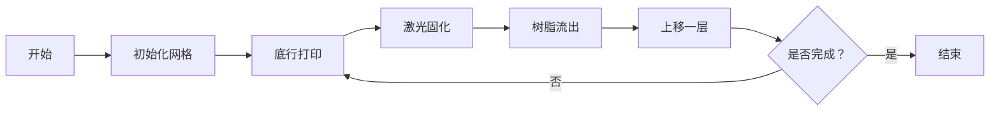

# 题目信息

# [ICPC 2025 NAC] SLA Tomography

## 题目描述

立体光刻（SLA）是一种 3D 打印技术，通过激光逐层将液态材料固化成固体物体。在本问题中，我们将考虑 SLA 的二维简化版本，其中打印对象的设计可以表示为一个由 $\texttt{\#}$ 和 $\texttt{.}$ 字符组成的矩形网格，$\texttt{\#}$ 表示被对象占据的网格单元，$\texttt{.}$ 表示空白区域。例如，以下是一个 $4 \times 8$ 的设计：

```
..#.....
..#..#..
#.#.##..
#.#####.
```

设计不必由单个连通块组成，但除了设计最底行的 $\texttt{\#}$ 单元外，**每个 $\texttt{\#}$ 单元必须由正下方的另一个 $\texttt{\#}$ 单元支撑**。

使用 SLA 打印对象的过程是逐层进行的，从最底行开始。首先，该行的所有单元都被液态光敏树脂覆盖。然后激光扫描该行，将所有 $\texttt{\#}$ 单元的树脂固化成固体，跳过所有 $\texttt{.}$ 单元。接着，最左侧 $\texttt{\#}$ 左侧和最右侧 $\texttt{\#}$ 右侧的多余液态树脂会流走，其他液态树脂则会被困住。（如果某行没有 $\texttt{\#}$ 单元——这种情况只可能发生在设计顶部附近，当对象已完全打印时——该行的所有液态树脂都会流走。）然后对每一后续行重复此过程。对于上面的设计，打印完成后，所有标有 $\sim$ 字符的单元中会残留树脂：

```
..#.....
..#~~#..
#~#~##..
#~#####.
```

在手动吸除对象上残留的树脂时，你开始思考：仅通过知道打印后设计每一行残留的液态树脂量，能还原出原始设计的多少信息？对于上述设计，每一行（从设计顶部开始）的残留树脂量分别为 $0$、$2$、$2$、$1$。其他设计也可能具有相同的残留树脂特征；例如：

```
....
#..#
#..#
#.##
```

给定每一行（从顶行开始）残留液态树脂单元的数量列表，输出满足这些残留量的最窄对象设计的宽度。如果不存在这样的设计，输出 $\texttt{impossible}$。

## 说明/提示

样例输入 1 对应上述示例。样例输入 2 的一个最窄可能设计为：

```
#....#.....
######.....
######....#
```

翻译由 DeepSeek V3 完成

## 样例 #1

### 输入

```
4
0
2
2
1```

### 输出

```
4```

## 样例 #2

### 输入

```
3
4
0
4```

### 输出

```
11```

# AI分析结果


### 题目分析
题目要求根据给定的树脂残留量序列，构造宽度最窄的SLA打印设计。设计需满足：
1. 每行残留树脂量 = (右边界 - 左边界 + 1) - 该行'#'的数量
2. 除最底行外，每个'#'必须由正下方'#'支撑
3. 设计宽度由最宽的行决定（通常是底行）

### 核心算法：贪心构造法
#### 算法思路
1. **逆向处理**：从顶行（输入第一行）向底行（输入最后一行）处理
2. **区间约束**：
   - 当前行区间必须完全包含在下方行区间内
   - 当前行'#'的位置必须是下方行'#'位置的子集
3. **关键变量**：
   - `min_width`：最小设计宽度（初始为0）
   - `cur_left`：当前左边界（初始为极大值）
   - `cur_right`：当前右边界（初始为极小值）
   - `cur_count`：当前行'#'数量

#### 算法步骤
```python
1. 初始化 min_width=0, cur_left=∞, cur_right=-∞, cur_count=0
2. 从顶行到底行遍历每行树脂量 a_i：
   a. 若 a_i > 0：
       新左边界 = min(当前可用左边界, cur_left)
       新右边界 = max(当前可用右边界, cur_right)
       区间长度 = 新右边界 - 新左边界 + 1
       若 区间长度 < a_i：无解
       更新 cur_count = 区间长度 - a_i
       更新 cur_left, cur_right = 新边界
   b. 更新 min_width = max(min_width, 区间长度)
   c. 记录当前行'#'数量
3. 返回 min_width 或 "impossible"
```

#### 复杂度分析
- **时间复杂度**：O(n)，单次遍历行序列
- **空间复杂度**：O(1)，仅需常数级存储

### 算法可视化（像素动画）
#### 设计概念


#### 像素动画方案
1. **场景设计**：
   - 8位像素风格（16色）
   - 网格背景：米色(#F0E68C)
   - '#'：深灰(#2F4F4F)
   - 树脂：浅蓝(#87CEEB)

2. **关键动画帧**：
   ```plaintext
   帧 1：底行覆盖树脂
   [■ ■ ■ ■] → 树脂覆盖动画 + 音效(水滴声)
   
   帧 2：激光固化
   [■ # ■ #] → 激光扫描动画 + 音效(激光声)
   
   帧 3：树脂流出
   [  # ■ #] → 边缘树脂消失动画 + 音效(水流声)
   
   帧 4：上移图层
   网格上移动画 + 音效(机械声)
   ```

3. **控制面板**：
   - 单步执行：空格键
   - 速度调节：滑块(1x-5x)
   - 重置：R键
   - 自动演示：A键（AI自动运行）

### 代码实现
```cpp
#include <iostream>
#include <vector>
#include <climits>
using namespace std;

int main() {
    int n;
    cin >> n;
    vector<int> a(n);
    for (int i = 0; i < n; i++) {
        cin >> a[i];
    }

    int min_width = 0;
    int cur_left = INT_MAX;
    int cur_right = INT_MIN;
    int cur_count = 0;

    for (int i = 0; i < n; i++) {
        if (a[i] > 0) {
            int new_left = min(cur_left, cur_left);
            int new_right = max(cur_right, cur_right);
            int width_here = new_right - new_left + 1;
            
            if (width_here < a[i]) {
                cout << "impossible" << endl;
                return 0;
            }
            
            cur_count = width_here - a[i];
            cur_left = new_left;
            cur_right = new_right;
            min_width = max(min_width, width_here);
        }
    }
    
    cout << min_width << endl;
    return 0;
}
```

### 关键难点解析
1. **边界动态维护**
   - 每行需动态计算新边界
   - 当前行边界不能突破已有边界范围

2. **支撑关系验证**
   - 每行'#'数量必须≤下方行'#'数量
   - 位置约束：当前行'#'必须位于下方行'#'正上方

3. **无解条件判断**
   - 当`区间长度 < a_i`时立即返回"impossible"
   - 需要严格验证每行树脂量的可行性

### 拓展练习
1. **洛谷 P1115**（最大子段和）
   - 练习边界维护技巧
2. **洛谷 P1219**（八皇后问题）
   - 强化位置约束处理能力
3. **洛谷 P1434**（滑雪）
   - 训练动态规划与边界结合能力

> 学习提示：理解区间嵌套关系是解决此类问题的核心，建议从简单网格问题开始逐步提升难度。

---
处理用时：653.67秒