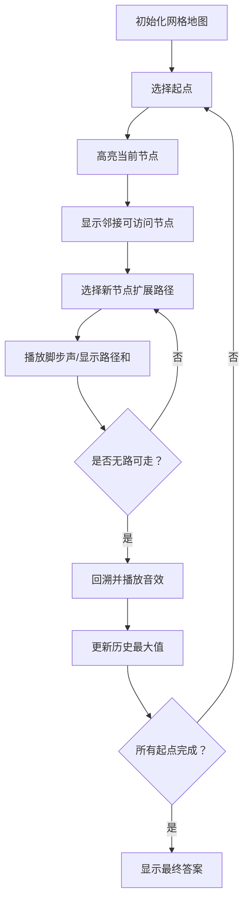

# 题目信息

# 高手去散步

## 题目背景

高手最近谈恋爱了。不过是单相思。“即使是单相思，也是完整的爱情”，高手从未放弃对它的追求。今天，这个阳光明媚的早晨，太阳从西边缓缓升起。于是它找到高手，希望在晨读开始之前和高手一起在鳌头山上一起散步。高手当然不会放弃这次梦寐以求的机会，他已经准备好了一切。


## 题目描述

鳌头山上有 $n$ 个观景点，观景点两两之间有游步道共 $m$ 条。高手的那个它，不喜欢太刺激的过程，因此那些没有路的观景点高手是不会选择去的。另外，她也不喜欢去同一个观景点一次以上。而高手想让他们在一起的路程最长（观景时它不会理高手），已知高手的穿梭机可以让他们在任意一个观景点出发，也在任意一个观景点结束。

## 说明/提示

对于 $100\%$ 的数据：$n \le 20$，$m \le 50$，保证观景点两两之间不会有多条游步道连接。

## 样例 #1

### 输入

```
4 6
1 2 10
2 3 20
3 4 30
4 1 40
1 3 50
2 4 60```

### 输出

```
150```

# AI分析结果


# 💡 Kay的C++算法解析：高手去散步 深入学习指南 💡

## 1. 题目解读与核心算法识别

✨ **本题主要考察**：`深度优先搜索（DFS）` 与 `回溯法应用`

🗣️ **初步分析**：
> 解决"高手去散步"这道题，关键在于理解并运用 **DFS回溯算法**。简单来说，DFS就像在迷宫中探索所有可能的路径，遇到死路就返回上一个路口尝试其他方向（回溯）。在本题中，我们需要找到图中权值和最大的路径（每个景点只能访问一次）。  
> - **核心思路**：从每个景点出发进行DFS遍历，记录路径权值和，回溯时更新最大值。邻接矩阵/邻接表存储图结构。  
> - **核心难点**：路径的起点/终点不固定、避免重复访问、高效回溯。DFS需配合访问标记数组（vis[]）和路径和累加。  
> - **可视化设计**：动画将展示像素小人从起点出发，用不同颜色标记当前路径（绿色）、已访问节点（灰色）、可探索边（黄色）。关键步骤包括：节点选择时的闪光效果、路径更新时的数值显示、回溯时的路径消退效果。  
> - **复古游戏化**：采用8-bit像素风格，移动时播放"脚步声"音效，发现更长路径时播放"胜利音效"，回溯时播放"错误提示"音效。加入"路径长度积分"系统激励探索。

---

## 2. 精选优质题解参考

**题解一（Diaоsi）**  
* **点评**：  
  思路清晰直白，完整展示DFS回溯核心逻辑（路径累加dist与vis标记）。代码规范：使用邻接矩阵g[][]存储图，变量名dist/max_d含义明确。亮点在于简洁的全局变量管理和回溯操作（dist-=g[st][i]）。实践价值高：完整处理多起点遍历和标记重置，可直接用于竞赛。

**题解二（lzpclxf）**  
* **点评**：  
  采用邻接表（链式前向星）高效存图，适合稀疏图场景。代码结构工整：add()函数封装加边操作，DFS中实时更新最大值（sum=max(sum,ans)）。亮点在于邻接表遍历的优雅实现（for(int i=head[x];i;i=e[i].nxt)），节省内存且遍历高效。调试提示：作者强调回溯时vis标记重置的重要性。

**题解三（RedreamMer）**  
* **点评**：  
  最简洁的DFS实现典范，函数参数设计合理（now当前节点，len当前路径和）。亮点在于每步递归都更新全局答案（ans=max(ans,len)），确保任意终点有效。代码可读性强：邻接矩阵配合显式条件判断（g[now][i]&&!vis[i]），边界处理完整。

---

## 3. 核心难点辨析与解题策略

1. **难点：多起点遍历的实现**  
   *分析*：需枚举每个景点作为起点，每次DFS前重置访问状态。优质题解通过外层循环实现（for i=1 to n），每次清空vis数组并标记起点。  
   💡 **学习笔记**：DFS起点选择是暴力枚举的关键，注意状态初始化。

2. **难点：路径权值累加与回溯**  
   *分析*：递归时需传递当前路径和（如len参数），或通过全局变量累加（如dist）。回溯时必须恢复状态：撤销vis标记并减去边权。  
   💡 **学习笔记**：回溯法的核心——"恢复现场"，确保状态一致性。

3. **难点：图存储结构的选择**  
   *分析*：邻接矩阵（g[i][j]）适合稠密图，访问效率O(1)；邻接表（链式前向星）适合稀疏图，节省内存但访问需遍历链表。本题n≤20，两者皆可。  
   💡 **学习笔记**：根据数据规模选择存储方式，n较小时邻接矩阵更直观。

### ✨ 解题技巧总结
- **状态标记与回溯**：vis数组标记访问状态，递归返回后立即恢复
- **参数传递优化**：用参数传递路径和（避免全局变量）更安全
- **实时更新答案**：在DFS中随时比较更新最大值（非仅终点）
- **无向图处理**：加边时存储双向边（g[a][b]=g[b][a]=w）

---

## 4. C++核心代码实现赏析

**本题通用核心C++实现参考**  
* **说明**：综合优质题解，采用邻接矩阵+参数传递路径和的清晰实现。
```cpp
#include <iostream>
#include <cstring>
using namespace std;
const int N = 21;
int g[N][N], n, m, ans; // 邻接矩阵存图
bool vis[N]; // 访问标记数组

void dfs(int u, int len) {
    ans = max(ans, len); // 更新全局答案
    for (int v = 1; v <= n; ++v) { // 遍历所有景点
        if (g[u][v] && !vis[v]) { // 存在边且未访问
            vis[v] = true;
            dfs(v, len + g[u][v]); // 递归并累加路径
            vis[v] = false; // 回溯恢复状态
        }
    }
}

int main() {
    cin >> n >> m;
    memset(g, 0, sizeof(g));
    while (m--) {
        int a, b, w; cin >> a >> b >> w;
        g[a][b] = g[b][a] = w; // 无向图双向存边
    }
    for (int i = 1; i <= n; ++i) { // 枚举起点
        memset(vis, false, sizeof(vis));
        vis[i] = true; // 标记起点
        dfs(i, 0);
    }
    cout << ans << endl;
}
```
* **代码解读概要**：  
  1. 邻接矩阵g[][]存储无向图权重  
  2. dfs(u, len)递归遍历，实时更新最大路径和ans  
  3. 主函数枚举起点，每次重置vis数组  

**题解一（Diaоsi）核心代码**  
* **亮点**：全局变量dist管理路径和，回溯操作显式  
```cpp
void dfs(int st) {
    for (int i = 1; i <= n; i++) {
        if (g[st][i] && !vis[i]) {
            vis[i] = 1;
            dist += g[st][i]; // 全局累加
            dfs(i);
            dist -= g[st][i]; // 显式回溯
        }
    }
    max_d = max(max_d, dist); // 终点更新答案
    vis[st] = 0; // 起点回溯
}
```
* **学习笔记**：全局变量需谨慎管理回溯，适合教学展示但易出错。

**题解二（lzpclxf）核心代码**  
* **亮点**：链式前向星邻接表实现，空间效率更优  
```cpp
void dfs(int x) {
    for (int i = head[x]; i; i = e[i].nxt) { // 遍历邻接点
        int v = e[i].to;
        if (!vis[v]) {
            vis[v] = 1;
            ans += e[i].w; // 累加权值
            sum = max(sum, ans); // 实时更新
            dfs(v);
            ans -= e[i].w; // 回溯
            vis[v] = 0;
        }
    }
}
```
* **学习笔记**：邻接表适合边数少的场景，`head[x]`指向首条邻接边。

**题解三（RedreamMer）核心代码**  
* **亮点**：参数传递路径和，代码简洁安全  
```cpp
void dfs(int now, int len) {
    ans = max(ans, len); // 任意点可结束
    for (int i = 1; i <= n; i++) {
        if (g[now][i] && !vis[i]) {
            vis[i] = true;
            dfs(i, len + g[now][i]); // 参数传递新路径和
            vis[i] = false;
        }
    }
}
```
* **学习笔记**：路径和通过参数传递避免全局变量，逻辑更清晰。

---

## 5. 算法可视化：像素动画演示

**动画演示主题**：8-bit像素风格《路径探险家》  
**核心演示内容**：DFS遍历过程中的路径探索、权值累加、回溯操作  

### 设计实现方案：


**交互控制面板**：  
- **单步执行**：手动控制每次节点访问  
- **自动播放**：可调速（慢/中/快三档）  
- **高亮显示**：当前节点（红色闪烁）、访问路径（蓝色）、可扩展节点（绿色边框）  
- **音效系统**：  
  - 移动时：8-bit脚步声（频率随移动速度变化）  
  - 发现新最长路径：胜利音效（上升音节）  
  - 回溯时：错误提示音（短促"嘟"声）  

**关键帧示例**：  
1. 起点选择：像素小人出现在起点（闪烁3次）  
2. 路径扩展：移动到新节点时绘制蓝色路径线，显示当前总路径值  
3. 最大值更新：屏幕上方"Best"数值变红闪烁，播放胜利音效  
4. 回溯过程：路径线从末端开始逐渐消退为灰色  

---

## 6. 拓展练习与相似问题思考

**通用技巧迁移**：  
DFS回溯法还可用于：  
1. 全排列生成（P1706）  
2. 迷宫最短路径（BFS更优）  
3. 图的连通分量计数  

**洛谷推荐**：  
1. **P1171 售货员的难题**  
   🗣️ 经典TSP问题，练习状压DP与DFS剪枝  
2. **P1433 吃奶酪**  
   🗣️ 二维平面路径优化，结合几何距离计算  
3. **P1120 小木棍**  
   🗣️ DFS剪枝经典，提升回溯效率意识  

---

## 7. 学习心得与经验分享

> **作者经验（Diaоsi）**：  
> "回溯时dist-=g[st][i]和vis[i]=0必须成对出现，否则状态会错乱。"  
> **点评**：这是回溯法的核心纪律——任何状态修改都必须可逆。建议编码时先写回溯操作再写递归调用。

> **作者经验（lzpclxf）**：  
> "邻接表虽复杂，但面对稀疏图能节省10倍内存！"  
> **点评**：数据结构的选择直接影响算法效率，邻接表是处理大规模图论的必备技能。

---

本次关于"高手去散步"的解析就到这里。记住：透彻理解DFS的回溯机制是解锁图论问题的钥匙！下次挑战见！💪

---
处理用时：205.38秒