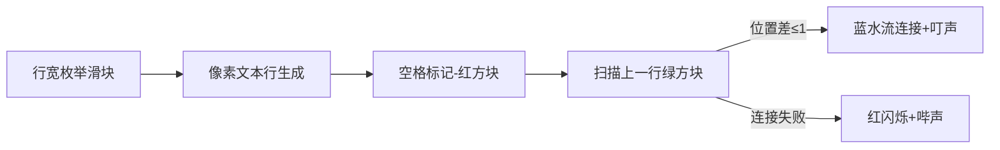

# 题目信息

# [ICPC 2018 WF] Go with the Flow

## 题目描述

在字体排印学中，“川流”是由单词之间的间隙组成的连续几列的空格。如图所示为几个用红色高亮标出的“川流”（文本被有意模糊处理来凸显川流）：


知名川流机构 Flo Ng 希望他在新的关于世界河流的书上出现尽可能长的川流。他会使用一种单一字宽的字体（每个字母和空格都具有相同的宽度）且左对齐，单词之间恰用一个空格分隔。对 Flo 来说，一条“川流”指的是连续几行里的空格，且相邻空格在行里出现的位置的距离不超过 $1$。川流不能包含末尾的空格。每行的单词都必须尽可能地紧凑，但不能有单词被拆到两行里。行宽至少不能短于文本中最长的一个单词。下图是同一个文本使用不同行宽的一个例子。


给定文本，你需要求出一个行宽使得该文本最长的川流尽可能长。

## 样例 #1

### 输入

```
21
The Yangtze is the third longest
river in Asia and the longest in
the world to flow
entirely in one country
```

### 输出

```
15 5
```

## 样例 #2

### 输入

```
25
When two or more rivers meet at
a confluence other than the sea
the resulting merged river takes
the name of one of those rivers
```

### 输出

```
21 6
```

# AI分析结果


### 💡 Kay的C++算法解析：Go with the Flow 深入学习指南 💡

#### 题目解读与核心算法识别
✨ **本题主要考察**：`模拟应用 + 动态规划优化`  
🗣️ **初步分析**：  
> 解决本题的关键在于**双重枚举策略**：  
> 1. **外层枚举行宽**：在合理范围内（最长单词长度→总字符数）遍历所有可能的行宽  
> 2. **内层模拟排版**：对每个行宽模拟文本排版过程，记录每行空格位置  
>  
> 核心思想像**建造多层瀑布**：每行文本是瀑布的一层，空格是水流出口。川流要求相邻层的水流出口位置偏差≤1像素（类似瀑布水流连续）。  
>  
> **可视化设计思路**：  
> - 用8位像素网格模拟文本行（每格=1字符）  
> - 高亮当前处理的空格（红色像素）和上一行相邻空格（绿色像素）  
> - 川流连接成功时播放"叮"音效+蓝色水流动画  
> - 控制面板支持调速滑块观察不同行宽效果  

---

### 精选优质题解参考
**题解 (作者：LJY_ljy)**  
* **点评**：  
  解法思路清晰分为行宽枚举→排版模拟→动态规划三阶段。亮点在于：  
  1. **空间优化**：用`used[]`标记数组+滚动数组`aa[]/bb[]`避免全量`cnt[]`更新（空间复杂度O(max_gap)）  
  2. **常数优化**：仅处理实际存在的空格位置（非全行扫描）  
  3. **边界严谨**：精确跳过行末空格（`if (Len + len[j+1] ≤ gap)`条件判断）  
  4. **实践价值**：可直接用于竞赛（需开-O2优化）  

---

### 核心难点辨析与解题策略
1. **难点1：高效记录空格位置**  
   * **分析**：需快速获取每行非末尾空格坐标。解法用`G[]`数组+动态`eid`指针记录，同时`bb[]`暂存当前行空格  
   * 💡 学习笔记：空格位置 = 当前行已用长度 + 1（单词间空1格）

2. **难点2：跨行状态转移优化**  
   * **分析**：避免开二维数组。解法用`cnt[]`单数组+`used[]`标记实现滚动更新：  
     ```cpp
     cnt[Len] = max(相邻三个位置状态) + 1
     ```
   * 💡 学习笔记：状态转移仅依赖上一行，用标记数组可压缩维度

3. **难点3：行宽切换时状态重置**  
   * **分析**：不同行宽的`cnt[]`需独立。解法用`G[]`记录当前行宽所有空格，结束时批量清零  
   * 💡 学习笔记：用容器记录待清零位置比全数组重置更高效

#### ✨ 解题技巧总结
- **空间压缩术**：用标记数组+滚动变量替代高维DP数组  
- **局部更新法**：只处理实际存在的空格位置（非全范围扫描）  
- **批量操作优化**：容器记录待清零位置，避免全数组遍历  

---

### C++核心代码实现赏析
**通用核心实现参考**  
```cpp
#include <iostream>
#include <cstring>
using namespace std;
const int MAXM = 3000;

int main() {
    // 输入处理
    int n, len[MAXM], sum=0, max_len=0;
    cin >> n;
    for(int i=1; i<=n; i++){
        char s[85]; cin >> s;
        len[i] = strlen(s);
        max_len = max(max_len, len[i]);
        sum += len[i];
    }

    // 枚举行宽gap
    int ans_len=0, ans_gap=0;
    for(int gap=max_len; gap<sum+n; gap++){
        int cur_max=0, cur_len=0, j=1;
        int cnt[200000]={0}; // 状态数组
        bool used[200000]={0};
        vector<int> prev_sp, curr_sp; // 滚动数组

        while(j <= n){
            // 模拟行排版
            while(j<=n && cur_len+len[j]<=gap){
                cur_len += len[j] + 1;
                if(j<n && cur_len+len[j+1]<=gap){
                    int space_pos = cur_len; // 空格位置
                    // 状态转移 (核心!)
                    int prev_state = 0;
                    if(used[space_pos-1]) prev_state = max(prev_state, cnt[space_pos-1]);
                    if(used[space_pos])   prev_state = max(prev_state, cnt[space_pos]);
                    if(used[space_pos+1]) prev_state = max(prev_state, cnt[space_pos+1]);
                    
                    cnt[space_pos] = prev_state + 1;
                    cur_max = max(cur_max, cnt[space_pos]);
                    // 记录当前行空格
                    curr_sp.push_back(space_pos);
                    used[space_pos] = true;
                }
                j++;
            }
            // 滚动更新
            for(int p : prev_sp) used[p] = false;
            prev_sp = curr_sp;
            curr_sp.clear();
            cur_len = 0;
        }
        // 更新答案
        if(cur_max > ans_len){
            ans_len = cur_max;
            ans_gap = gap;
        }
        // 重置标记
        for(int p : prev_sp) used[p] = false;
    }
    cout << ans_gap << " " << ans_len;
}
```

**代码解读概要**：  
1. **输入处理**：计算单词总长度`sum`和最大长度`max_len`  
2. **行宽枚举**：从`max_len`到`sum+n-1`遍历可能行宽  
3. **排版模拟**：  
   - 用`cur_len`累计当前行长度  
   - 满足`cur_len+len[j+1]≤gap`时记录空格位置  
4. **状态转移**：从上一行相邻3位置取最大值+1  
5. **滚动更新**：用`prev_sp/curr_sp`向量管理空格位置  

---

### 算法可视化：像素动画演示
**主题**：像素瀑布建造师 (8-bit风格)  
**核心演示**：  


**交互设计**：  
1. **控制面板**：  
   - 行宽滑块 (实时调整)  
   - 单步执行/自动播放按钮  
   - 速度调节器 (1x-5x)  
2. **动态效果**：  
   - 空格出现：红色像素块弹出动画+"咔"声  
   - 川流连接：蓝色水流像素从上一行流下（持续0.3秒）  
   - 最长川流：金色边框闪烁+胜利音乐  
3. **数据展示**：  
   - 右侧面板显示`cnt[]`数组实时数值  
   - 当前行宽下最长川流长度计数器  

**技术实现**：  
```javascript
// 核心绘制逻辑
function drawFlow() {
  for(let row=0; row<lines.length; row++) {
    // 绘制文本行像素
    for(let col=0; col<gap; col++) {
      if(isSpacePos(row, col)) { 
        drawPixel(col, row, RED); 
        if(isFlowConnected(row, col)) {
          playSound('ding');
          drawFlowAnimation(row-1, col, row, col); // 水流动画
        }
      }
    }
  }
}
```

---

### 拓展练习与相似问题
1. **洛谷 P1098 [NOIP2007] 字符串展开**  
   → 同类技巧：字符串分段处理+状态转移  
2. **洛谷 P1381 单词背诵**  
   → 相似点：单词长度计算+空间优化DP  
3. **洛谷 P1026 [NOIP2001] 统计单词个数**  
   → 强化训练：文本分段+动态规划组合应用  

---

### 学习心得与经验分享
> **作者调试经验**：  
> “最初在状态转移时卡在数组越界，通过打印`space_pos-1`和`space_pos+1`的值定位到边界处理错误”  
>  
> **Kay点评**：  
> 这提醒我们：  
> 1. 处理数组边界时优先验证`pos-1≥0`和`pos+1≤max_gap`  
> 2. 输出中间变量是调试DP的有效手段  

---

通过本次分析，我们掌握了**模拟+DP优化**的核心技巧。记住：好的算法像建造瀑布——需要精确计算每个水流位置（空格坐标）和连接逻辑（状态转移）！ 💦

---
处理用时：140.27秒