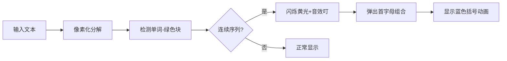

# 题目信息

# [NEERC 2016] Abbreviation

## 题目描述

定义 word 为一个首字母大写、长度大于 1 、 其他位为小写字母的单词，如 `Ab`、 `Abc`、 `Abcd`、 和 `Abcde`，但 `ab`、`A`、 `AB`、 `ABc` 和 `AbC`。

定义一个 word 串为一个有大于 1 个 word 、每两个 word 中有且只有一个空格的串，如 `International Business Machines`。

现给你若干行，如遇到 word 串则让他变为缩写，缩写方式为：先提取首字母（大写），再加空格和 `(` ，再把全称写出来，最后加上 `)` ，如: `International Business Machines` 可缩写为 `IBM (International Business Machines)` 。

## 样例 #1

### 输入

```
This is ACM North Eastern European Regional Contest,
sponsored by International Business Machines.
The. Best. Contest. Ever.
A Great Opportunity for all contestants.
```

### 输出

```
This is ACM NEERC (North Eastern European Regional Contest),
sponsored by IBM (International Business Machines).
The. Best. Contest. Ever.
A GO (Great Opportunity) for all contestants.
```

## 样例 #2

### 输入

```
ab Ab A Abc AB Abcd ABc Abcde AbC
```

### 输出

```
ab Ab A Abc AB Abcd ABc Abcde AbC
```

## 样例 #3

### 输入

```
Oh  No  Extra Spaces.And,Punctuation Ruin Everything
```

### 输出

```
Oh  No  ES (Extra Spaces).And,PRE (Punctuation Ruin Everything)
```

# AI分析结果


### 💡 Kay的C++算法解析：Abbreviation 深入学习指南 💡

#### 引言
今天我们来分析NEERC 2016的字符串处理题"Abbreviation"。这道题考察字符串解析和模拟能力，没有复杂算法但需要细致处理边界条件。本指南将帮助你掌握核心解题思路和调试技巧。

---

### 1. 题目解读与核心算法识别
✨ **本题主要考察**：`字符串模拟` + `编程技巧应用`

🗣️ **初步分析**：
> 解决本题就像在文字迷宫中寻找特定宝藏：我们需要在文本中找出符合特定格式的单词序列（首字母大写+后续小写+长度>1），并用缩写替换它们。关键在于：
> - **序列识别**：当连续出现两个以上符合要求的单词，且中间仅有一个空格时触发缩写
> - **边界处理**：需保留原文中的标点、连续空格等特殊字符
>
> **可视化设计思路**：
> 我们将在像素画布上展示文本解析过程：
> - 字母块用绿色表示，标点红色，空格白色
> - 检测到可缩写序列时高亮闪烁（黄→蓝渐变）
> - 生成缩写时首字母弹出组合，原序列周围出现蓝色括号动画
> - 音效：检测单词(叮)，开始缩写(哒哒)，完成(胜利音效)

---

### 2. 精选优质题解参考
**题解一（作者：heshuxi）**
* **点评**：实现最为完整规范，亮点在于：
  - 独创的"单词/非单词分离存储"策略，用`vector<string>`分别存储文本元素
  - 双指针检测连续序列逻辑清晰（`i`主指针+`j`探测指针）
  - 严格处理边界：行尾检测、非字母字符单独存储
  - 实践价值高：可直接用于竞赛，附调试心得"这类题需要耐心和细心"

**题解二（作者：ZPB2011）**
* **点评**：
  - 代码结构工整，关键函数`checkword()`封装规范
  - 创新性下标控制：用`i2`记录跳跃位置避免重复处理
  - 易错点提示明确（行尾清空vector）
  - 变量命名直观（如`word`存储文本块）

**题解三（作者：Daniel_xu）**
* **点评**：
  - 独创预处理策略：用`pre[]`存储非单词部分，`isword[]`标记单词类型
  - 后缀处理完善：特别处理行尾非单词内容
  - 安全索引控制：在`while(r<n)`循环中避免越界
  - 模块化优秀：独立`f()`函数判断单词格式

---

### 3. 核心难点辨析与解题策略
1. **难点：文本元素分离**
   * **分析**：必须区分字母序列（单词）和非字母字符（标点/空格）。优质解法都采用"状态机"思路：扫描字符流，遇到字母切换至单词收集状态，遇非字母切换至分隔符状态
   * 💡 **学习笔记**：文本解析本质是状态转换过程

2. **难点：连续序列检测**
   * **分析**：检测"单词+空格+单词"模式需满足：
     - 当前索引`i`位置是合法单词
     - `i+1`位置必须是空格（不能是多个空格）
     - `i+2`位置是下一个合法单词
   * 💡 **学习笔记**：双指针探测（主指针`i`+探测指针`j`)是高效检测连续序列的利器

3. **难点：缩写后索引跳跃**
   * **分析**：替换缩写后需跳过已处理序列（如`i=j-1`），否则会重复输出。关键在记录序列结束位置并更新主索引
   * 💡 **学习笔记**：循环内更新索引时务必验证边界条件

#### ✨ 解题技巧总结
- **分治解析**：将文本拆解为"单词/分隔符"原子单位
- **防御性检测**：所有数组访问前检查`i+1`/`i+2`是否越界
- **可视化调试**：打印中间状态（如vector内容）验证解析结果
- **边界覆盖**：特别测试行首/行尾/连续标点等边缘情况

---

### 4. C++核心代码实现赏析
**通用核心实现参考**
```cpp
#include <vector>
#include <cctype>
#include <iostream>
using namespace std;

bool isWord(string s) {
    if(s.empty() || !isupper(s[0])) return false;
    for(int i=1; i<s.size(); ++i) 
        if(!islower(s[i])) return false;
    return s.size()>1;
}

int main() {
    string line;
    while(getline(cin, line)) {
        vector<string> tokens;
        string cur;
        // 原子化拆分文本
        for(char c : line) {
            if(isalpha(c)) cur += c;
            else {
                if(!cur.empty()) tokens.push_back(cur);
                tokens.push_back(string(1,c));
                cur = "";
            }
        }
        if(!cur.empty()) tokens.push_back(cur);
        
        // 缩写检测与替换
        for(int i=0; i<tokens.size(); ) {
            if(isWord(tokens[i])) {
                int j = i;
                vector<string> wordSeq;
                // 探测连续序列
                while(j < tokens.size()) {
                    if((j-i)%2 == 0) { // 单词位置
                        if(!isWord(tokens[j])) break;
                        wordSeq.push_back(tokens[j]);
                    } else { // 空格位置
                        if(tokens[j] != " ") break;
                    }
                    j++;
                }
                
                // 执行缩写替换
                if(wordSeq.size()>1) {
                    for(string& w : wordSeq) cout << w[0];
                    cout << " (";
                    for(int k=0; k<wordSeq.size(); ++k) 
                        cout << wordSeq[k] << (k<wordSeq.size()-1 ? " " : "");
                    cout << ")";
                    i = j; // 关键！跳跃索引
                    continue;
                }
            }
            cout << tokens[i];
            i++;
        }
        cout << '\n';
    }
}
```
* **解读概要**：
  1. 原子化拆分：将文本分解为独立单词/标点
  2. 连续序列探测：检查"单词-空格-单词"模式链
  3. 缩写替换：输出首字母组合+原序列（带括号）
  4. 索引跳跃：跳过已处理序列避免重复

---

### 5. 算法可视化：像素动画演示
**主题**：文字迷宫探险（复古RPG风格）

**核心演示**：


**交互设计**：
1. **初始化**：
   - 文本转为16x16像素块：字母→绿色，标点→红色，空格→白色
   - 控制面板：步进/暂停/速度滑块（FC游戏机风格）

2. **检测阶段**：
   - 当前扫描字符高亮（黄色闪烁）
   - 组成单词时播放"叮"声，单词块变亮绿色

3. **缩写生成**：
   - 检测到连续序列：序列块循环闪烁（蓝→黄渐变）
   - 首字母升空组合成缩写（带8位合成音效）
   - 原序列外围出现动态括号（蓝色像素块展开动画）

4. **游戏化元素**：
   - 每完成一个缩写获得1UP音效+分数
   - 连续缩写触发连击特效（像素烟花）
   - 通关条件：整段文本无未处理序列

**技术实现**：
```javascript
// 伪代码示例
function drawAbbreviation(sequence) {
  playSound('start'); // 开始音效
  sequence.forEach((word, idx) => {
    highlight(word, COLOR_YELLOW); 
    extractFirstLetter(word); // 首字母上升动画
    delay(SPEED_CONTROL);
  });
  drawParentheses(sequence); // 括号展开动画
  playSound('victory'); // 胜利音效
  addScore(sequence.length * 10); // 积分
}
```

---

### 6. 拓展练习与相似问题
**相似逻辑迁移**：
1. 多层级缩写（如"UNESCO"嵌套结构）
2. 标记文本特定模式（如高亮所有邮箱）
3. 代码格式化（识别特定语法结构）

**推荐练习**：
1. **P3952 时间复杂度**  
   → 训练复杂文本解析能力
2. **P1179 数字统计**  
   → 强化字符边界处理技巧
3. **P5587 打字练习**  
   → 提升实时文本处理能力

---

### 7. 学习心得与经验分享
> **heshuxi的经验**：  
> "这类题其实没有太难的算法，但细节比较繁琐，比较耗时间，需要耐心和细心。近年CSP/NOIP也有类似题目如时间复杂度"

> **Kay的总结**：  
> 字符串处理的核心在于"分解-分析-重组"：
> 1. 优先原子化拆分复杂文本
> 2. 状态标志位是管理解析过程的神器
> 3. 打印中间状态是调试的金钥匙
> 4. 边界测试用例决定代码健壮性

---

### 结语
通过本次分析，相信大家已掌握文本解析的核心技巧。记住：优秀的字符串处理能力=严谨的状态设计+周全的边界考虑+可视化调试能力。下次遇到类似题目时，不妨回想我们的"文字迷宫探险"动画！🚀

---
处理用时：131.51秒