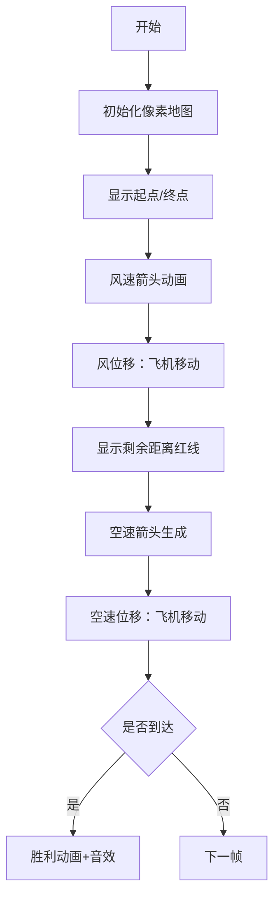

# 题目信息

# [NWRRC 2014] Joy of Flight

## 题目描述

## 简述

大意就是一架飞机要从起点飞到终点，飞机有最大空速，飞行最大时间，给出风速的变化和风如何影响飞机飞行，求出飞机是否能到达终点，如果能就输出飞机的位置变化。


雅各布（Jacob）喜欢玩他的无线电摇制飞机。今天的风很大，雅各布必须小心地计划飞行。他有一个天气预报——飞行计划中每秒钟的风速和风向。

飞机每秒在任何方向的空速最大都可以达到 $v_{max}$ 。风吹动飞机的方式如下：如果飞机的空速是 $(v_x,v_y)$ 并且风速是 $(w_x,w_y)$ ，那么飞机每秒将移动 $(v_x+w_x,v_y+w_y)$ 。


雅各布（Jacob）有一种刚好能使用$k$秒的燃料，他想知道，飞机是否能在这段时间内从起点飞到终点。如果可能的话，他需要知道飞行计划：每飞行一秒后飞机的位置。

## 说明/提示

时间限制： $2s$ ；内存限制： $256MB$ 

by XYY1411

2020/12/08

## 样例 #1

### 输入

```
1 1 7 4
2 3 10
0 1 2
2 2 0```

### 输出

```
Yes
3 2.5
5 2.5
7 4```

# AI分析结果

# 💡 Kay的C++算法解析：Joy of Flight 深入学习指南 💡

<introduction>
今天我们来分析"Joy of Flight"这道关于飞机航行的C++编程题。本指南将帮助大家理解如何分解飞机运动、处理风速变化，并掌握向量运算的核心技巧。
</introduction>

## 1. 题目解读与核心算法识别

✨ **本题主要考察**：`模拟应用与向量运算` 

🗣️ **初步分析**：
> 解决飞机航行问题就像在湍急河流中划船 - 船的位置由水流（风）和你划桨（空速）共同决定。核心思路是将总位移分解为**风位移**和**空速位移**两部分：
   - 先计算k秒内只随风飘移后的位置
   - 再计算该位置到终点的向量，判断是否在飞机k秒最大空速位移范围内
   - 若有解，将剩余位移平均分配到每秒的空速中
   
可视化设计中将用8位像素飞机在网格地图移动：蓝色箭头表示风速，黄色箭头表示空速方向，关键节点显示距离比较（红线=剩余距离，绿圈=最大空速范围）。当飞机到达终点时，将触发FC游戏胜利音效和烟花动画。

---

## 2. 精选优质题解参考

**题解一：(来源：封禁用户)**
* **点评**：这份题解思路清晰直白，完美运用了位移分解原理。代码中`a[]`存储风速变化时间点，`b[]/c[]`存储风速分量，变量命名虽简洁但含义明确。亮点在于精确处理风速区间切换逻辑（`p`指针更新）和高精度输出（`setprecision(50)`），可直接用于竞赛。算法效率O(k)也是最优解。

**题解二：(来源：Union_Find)**
* **点评**：该解强化了向量运算的数学解释（结合律/交换律），帮助理解运动分解的数学基础。代码使用`rd()`封装输入提升可读性，风速处理逻辑与题解一异曲同工。特别值得学习的是作者分享的调试经验，提醒我们注意边界条件（虽然题目简单，仍需10分钟调试验证）。

---

## 3. 核心难点辨析与解题策略

1.  **运动分解的物理理解**
    * **分析**：飞机移动是风速向量与空速向量的合成运动。优质题解都先剥离风速影响，将复杂问题简化为纯空速位移验证
    * 💡 **学习笔记**：运动分解法可降低问题维度 - 先处理不可控因素（风），再解决可控部分（空速）

2.  **风速区间的实时切换**
    * **分析**：风速按时间分段给出，需用指针`p`跟踪当前区间。关键技巧是设置`t[n+1]=k`作为哨兵值，循环中通过`if(t[j+1]==i) j++`高效切换
    * 💡 **学习笔记**：哨兵值+指针追踪是处理分段数据的黄金法则

3.  **精度控制与输出规范**
    * **分析**：距离计算需用`long double`防溢出，输出必须满足`setprecision(50)`。核心变量`mx/my`（空速分量）需保持高精度
    * 💡 **学习笔记**：几何问题要警惕整数溢出，输出格式必须严格遵循题设

### ✨ 解题技巧总结
- **运动分解法**：将复合运动拆解为独立分量（风+空速）分别处理
- **哨兵技巧**：在分段数据末尾添加边界值(`t[n+1]=k`)简化判断逻辑
- **向量均摊策略**：将剩余位移平均分配到每秒空速（$\frac{\Delta x}{k}, \frac{\Delta y}{k}$）
- **精度防御**：几何计算优先使用`long double`，输出用`setprecision`控制

---

## 4. C++核心代码实现赏析

**本题通用核心C++实现参考**
* **说明**：综合两题解优点，包含风速处理哨兵技巧和运动分解核心逻辑
* **完整核心代码**：
```cpp
#include <iostream>
#include <cmath>
#include <vector>
#include <iomanip>
using namespace std;

int main() {
    long long sx, sy, fx, fy;
    cin >> sx >> sy >> fx >> fy;
    int n, k, vmax;
    cin >> n >> k >> vmax;

    vector<int> t(n+2), wx(n+2), wy(n+2);
    for (int i = 1; i <= n; ++i) 
        cin >> t[i] >> wx[i] >> wy[i];
    t[n+1] = k; // 哨兵设置

    // 计算纯风位移
    long double x = sx, y = sy;
    for (int i = 0, p = 1; i < k; ++i) {
        if (i >= t[p+1]) p++;
        x += wx[p]; 
        y += wy[p];
    }

    // 剩余位移验证
    long double dx = fx - x, dy = fy - y;
    long double dist = sqrt(dx*dx + dy*dy);
    if (dist > vmax * k * 1.0) {
        cout << "No" << endl;
        return 0;
    }

    // 构造航行路径
    cout << "Yes" << endl;
    long double curx = sx, cury = sy;
    long double vx = dx / k, vy = dy / k;
    for (int i = 0, p = 1; i < k; ++i) {
        if (i >= t[p+1]) p++;
        curx += wx[p] + vx;
        cury += wy[p] + vy;
        cout << fixed << setprecision(50) << curx << " " << cury << endl;
    }
    return 0;
}
```
* **代码解读概要**：
> 1. 输入起点/终点坐标和风速数据
> 2. 设置`t[n+1]=k`哨兵简化风速区间判断
> 3. 第一阶段模拟：计算纯风位移后的位置
> 4. 验证终点是否在可飞行范围内（dist ≤ vmax*k）
> 5. 第二阶段模拟：将剩余位移均摊到每秒空速
> 6. 高精度输出每秒结束位置

**题解一核心代码片段**
```cpp
// 风速区间更新
if(a[p+1]==i) p++;  
// 风位移累积
tx += b[p], ty += c[p];  

// 空速均摊计算
long double mx=(fx-tx)/1.0/k, my=(fy-ty)/1.0/k;  

// 实时位置计算
ssx += b[p] + mx;  
ssy += c[p] + my;
```
* **代码解读**：
> `a[]`存储风速变化时间点，循环中当`i`达到`a[p+1]`时切换风速区间。关键变量`mx/my`将剩余位移均分到每秒，实现"先随风飘移，再定向补偿"的策略。每秒位置更新时**先加风速分量**（被动移动）**再加空速分量**（主动控制）
* 💡 **学习笔记**：运动分解的顺序至关重要 - 先风后空速

**题解二核心代码片段**
```cpp
// 哨兵判断风速区间
if (t[j+1] == i) j++;  

// 距离计算
long double dis = sqrt(f(tx-x)+f(ty-y)); 

// 空速向量计算
long double px = 1.0*(tx-x)/k, py=1.0*(ty-y)/k;  

// 位置合成
ux += px + wx[j];
```
* **代码解读**：
> 通过`t[j+1]==i`更新风速索引，`f()`函数封装平方计算提升可读性。空速向量`(px,py)`采用显式计算而非隐式，增强可调试性。位置更新采用**复合叠加**写法，体现向量加法本质
* 💡 **学习笔记**：向量表达式应保持数学形式的直观性

---

## 5. 算法可视化：像素动画演示

* **主题**："8位飞行模拟器：风与空速的共舞"
* **核心演示**：在FC风格网格地图中，像素飞机同步演示风位移（蓝色箭头）和空速位移（黄色箭头）



**关键动画设计**：
1. **双位移分步演示**：每秒分解为两个阶段：
   - 阶段1：蓝色风速箭头闪烁，飞机随风移动（伴随"呼呼"音效）
   - 阶段2：黄色空速箭头出现，飞机沿箭头方向移动（伴随"嗡"引擎声）
   
2. **动态数据面板**：
   ```javascript
   // 伪代码示例
   function drawFrame() {
     drawWindArrow(wx[p], wy[p]); // 绘制当前风速向量
     drawPlane(curx, cury);       // 绘制飞机位置
     if (isWindPhase) 
        playSound(windSound);     // 风阶段音效
     else
        drawSpeedVector(vx, vy);  // 绘制空速向量
   }
   ```

3. **决胜时刻特效**：
   - 成功：飞机到达终点时像素烟花绽放 + FC胜利音乐
   - 失败：剩余距离红线超出绿圈时显示"No"弹窗 + 警示音

---

## 6. 拓展练习与相似问题思考

* **运动分解思想延伸**：
  1. 水流中的船只导航（附加水流速度）
  2. 带阻力的抛体运动（空气阻力分解）
  3. 多力作用下的粒子运动

* **洛谷推荐练习**：
  1. **P1083 [借教室]** - 分段数据处理技巧进阶
  2. **P1514 [引水入城]** - 运动模拟与路径规划结合
  3. **P1002 [过河卒]** - 向量移动的棋盘应用

---

## 7. 学习心得与经验分享

> **Union_Find的调试经验**："虽然思路简单，但风速区间切换和浮点精度消耗我10分钟调试时间"
>
> **Kay的总结**：这印证了编程黄金法则 - **简单≠容易**。建议学习者：
> 1. 使用可视化调试输出中间位置
> 2. 对风速区间切换进行边界测试（如k-1/k时刻）
> 3. 比较float/double/long double的精度差异

---

本次分析揭示了运动分解的精妙之处：将复杂问题拆解为可控模块是算法设计的核心思维。当你理解风与空速的共舞原理，就掌握了物理模拟的钥匙！下次我们将探索更复杂的运动系统，继续挑战吧！✈️

---
处理用时：247.41秒