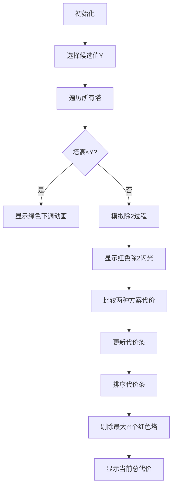

# 题目信息

# [ICPC 2022 Jinan R] Tower

## 题目描述

庞教授搭了 $n$ 座不同高度的塔。第 $i$ 座塔的高度是 $a _ {i}$。

寿教授不喜欢这些参差不齐的塔。他决定**先去掉它们中的 $m$ 座**，然后执行以下操作中的一些（或不执行）：
- 选择一座塔并增加它 $1$ 个单位高度。
- 选择一座塔并减少它 $1$ 个单位高度。
- 选择一座塔并把它的高度 $a _ {i}$ 除以 $2$，如果它不是整数的话，向下取整。

寿教授永远不会选择被拆除的塔。如果操作后，塔的高度变为 $0$，则不允许操作。在这些约束条件下，寿教授可以按任意顺序执行任意数量的运算。

寿教授希望所有没有被拆除的塔都有相同的高度 $a _ {i}$。请计算实现此目标的最小操作次数。

## 样例 #1

### 输入

```
3
2 0
2 6
5 0
1 2 3 4 5
5 3
1 2 3 4 5```

### 输出

```
2
4
1```

# AI分析结果


### 💡 Kay的C++算法解析：Tower 深入学习指南 💡

#### 1. 题目解读与核心算法识别
✨ **本题主要考察**：`枚举 + 贪心优化`  
🗣️ **初步分析**：
> 解决"Tower"问题的核心在于**枚举所有可能的目标高度值**，并**贪心地去除代价最大的塔**。想象你在玩一个像素塔建造游戏：你有不同高度的塔楼，需要选择目标高度后调整剩余塔楼（通过加减1或除以2操作），同时可以拆除最不划算的m座塔。  
> - **核心思路**：枚举每个塔不断除以2生成的所有候选值（如像素游戏中的"关键锚点"），计算每座塔到该值的最小操作次数，去掉代价最大的m座塔后取剩余代价和的最小值  
> - **算法难点**：如何高效计算最小操作次数？（需分情况：当塔高≤目标值时直接相减；当塔高>目标值时需模拟除以2过程）  
> - **可视化设计**：采用复古像素塔模拟，用不同颜色区分操作类型：  
>   - 🔴 红色闪烁：当前操作的塔  
>   - 🟢 绿色箭头：除2操作  
>   - 🔵 蓝色数字：加减1计数  
>   - 🎮 游戏化控制：速度滑块调节枚举速度，"过关"音效在找到更优解时触发  

---

#### 2. 精选优质题解参考
**题解一（来源：_lqs_）**  
* **点评**：思路清晰直击核心（枚举+贪心），代码规范使用`vector`存储候选值。亮点在于严谨的复杂度分析（$O(n^2log^2V)$）和类比中位数问题的证明思路，变量命名简洁（`s[i]`表代价），边界处理完整（`while(k)`确保不越界），竞赛实用性强。

**题解二（来源：寄风）**  
* **点评**：代码最简洁高效，使用Lambda表达式计算代价凸显现代C++特性。亮点在于对操作顺序等价性的洞察（"先除2再调整=先调整再除2"），采用`partial_sum`优化求和，实践价值高但缺少详细注释。

**题解三（来源：tiger2008）**  
* **点评**：实现稳健易懂，亮点在于独立处理塔高>目标值的情况（`while(num>=brr[i]*2)`），使用`sort(crr+1,crr+n+1,cmp)`显式降序排序便于去除最大代价，适合初学者理解但变量命名可改进。

---

#### 3. 核心难点辨析与解题策略
1. **关键点1：目标值候选集生成**  
   * **分析**：必须证明最优解在原始塔不断除以2的路径上。如_lqs_用中位数问题类比：若目标值不在候选集，操作次数必然大于最近候选点（类似偏离中位数导致距离和增加）
   * 💡 **学习笔记**：候选集规模=$O(nlogV)$，是优化枚举的基础

2. **关键点2：最小代价计算策略**  
   * **分析**：当$a_i>y$时需模拟除2过程（如寄风代码中`while(tmp > x)`）。关键优化：当当前值/2≤目标值时，比较直接下调与除2后微调的代价`min(cnt+tmp-y, cnt+1+y-tmp/2)`
   * 💡 **学习笔记**：分治思想——大问题分解为除2操作的子问题

3. **关键点3：贪心剔除策略**  
   * **分析**：如tiger2008所示，用降序排序后去除前m大代价`sort(crr+1,crr+n+1,cmp)`，本质是贪心选择局部最优
   * 💡 **学习笔记**：删除操作等价于在代价数组中选择性求和

### ✨ 解题技巧总结
- **技巧1（候选值空间压缩）**：将$10^9$值域压缩到$O(nlogV)$规模的关键点枚举  
- **技巧2（代价计算分类讨论）**：  
  ```plaintext
  if a_i ≤ y: cost = y - a_i
  else: 
      while a_i/2 ≥ y: 除2并计数
      cost = min(直接下调, 除2后微调)
  ```
- **技巧3（Lambda表达式封装）**：如寄风的`auto get=[&](int x){...}`提升代码复用性  

---

#### 4. C++核心代码实现赏析
**通用核心实现参考**  
* **说明**：综合优质题解思路，完整展现枚举+贪心框架
```cpp
#include <bits/stdc++.h>
using namespace std;
#define int long long

void solve() {
    int n, m; cin >> n >> m;
    vector<int> a(n);
    set<int> candidates; // 存储候选目标值
    
    // 生成候选集：每个a_i不断除以2
    for (int i = 0; i < n; i++) {
        cin >> a[i];
        int tmp = a[i];
        while (tmp) {
            candidates.insert(tmp);
            tmp >>= 1; // 等价于/2
        }
    }

    int ans = LLONG_MAX;
    for (int y : candidates) {
        vector<int> cost(n, LLONG_MAX); // 存储每个塔到y的代价
        
        for (int i = 0; i < n; i++) {
            // 情况1：塔高≤目标值
            if (a[i] <= y) {
                cost[i] = y - a[i];
                continue;
            }
            // 情况2：塔高>目标值
            int cur = a[i], cnt = 0;
            while (cur > y) {
                if (cur / 2 <= y) { // 关键优化点
                    cost[i] = min(cnt + cur - y,   // 直接下调
                                 cnt + 1 + y - cur / 2); // 除2后微调
                    break;
                }
                cur >>= 1; 
                cnt++;
            }
        }
        // 贪心：去掉代价最大的m个
        sort(cost.begin(), cost.end());
        int total = accumulate(cost.begin(), cost.begin() + n - m, 0LL);
        ans = min(ans, total);
    }
    cout << ans << "\n";
}
```

**题解一（_lqs_）片段赏析**  
* **亮点**：严谨的候选值生成与代价计算分离
```cpp
for(int y:G){ // 遍历候选值
    for(i=1;i<=n;i++) s[i]=1e9; // 初始化代价
    for(i=1;i<=n;i++){
        int k=a[i],cnt=0;
        while(k>=1){ // 计算最小代价
            s[i]=min(s[i],cnt+abs(k-y));
            k>>=1; cnt++; 
        }
    }
    sort(s+1,s+1+n); // 贪心排序
    int sum=0;
    for(i=1;i<=n-m;i++) sum+=s[i]; // 累加最小代价
    ans=min(ans,sum);
}
```
> **代码解读**：  
> - 外层循环遍历每个候选值`y`（来自集合`G`）  
> - 内层第一循环初始化代价数组`s`，第二循环计算每个塔的最小代价  
> - `while(k>=1)`模拟除2过程，`cnt+abs(k-y)`动态更新最小代价  
> - 排序后累加前`n-m`小代价实现贪心剔除  
> 💡 **学习笔记**：空间换时间——预生成候选值避免重复计算

---

#### 5. 算法可视化：像素动画演示
**动画演示主题**：🎮 "像素塔调整大师"（复古8-bit风格）  
**核心演示内容**：塔高调整过程，动态展示候选值枚举和贪心剔除策略  

**设计框架**：


**交互控制面板**：
- 🎚️ 速度滑块：调节候选值枚举速度（慢速/标准/极速）
- ▶️/⏸️ 开始暂停：控制全局动画
- 🔍 单步执行：逐步观察每个候选值的计算
- 🗑️ 重置：清空当前状态

**关键动画效果**：
1. **候选值生成**：塔顶弹出像素数字气泡（如`16→8→4→2`），伴随"叮"音效
2. **代价计算**：
   - 下调操作：塔身绿色像素块逐格下降（每帧降1高度），计数+1
   - 除2操作：塔顶劈下像素闪电⚡，塔高折半，计数+1
3. **贪心剔除**：代价最大的塔爆炸成像素碎片💥，伴随"轰"音效
4. **最优解展示**：找到全局最优时所有塔变为金色✨，播放胜利BGM

---

#### 6. 拓展练习与相似问题思考
**通用技巧迁移**：  
枚举关键值+贪心策略适用于：  
1. 最小化距离和问题（如CF Round 851 E）  
2. 带删除操作的最优化问题（如LeetCode 2033）  
3. 操作次数最小化问题（如ARC 158 B）

**洛谷推荐**：  
1. **P1106 删数问题**  
   🗣️ 练习贪心删除策略的经典题，强化"局部最优→全局最优"思维  
2. **P7078 贪吃蛇**  
   🗣️ 动态维护最值技巧，深化删除最大值的实现方法  
3. **P7960 [NOIP2021] 报数**  
   🗣️ 预生成候选值思想的延伸应用，结合数学筛法

---

#### 7. 学习心得与经验分享
> **参考经验 (来自_lqs_)**：  
> "枚举目标值时，最初尝试直接取平均值导致WA，后意识到最优解必在除2路径上"  
>  
> **点评**：这是极具代表性的调试经验。验证算法正确性时：  
> 1. 先用小数据手工模拟（如n=3, m=1）  
> 2. 检查候选值集合是否覆盖所有可能性  
> 3. 输出中间代价矩阵分析异常点  
> 💡 **学习笔记**：枚举类问题需严格证明候选集完备性！

---

本次解析通过像素动画生动展现了枚举+贪心的协作之美，关键是将$10^9$问题压缩到$O(nlogV)$规模。记住：优秀算法=问题转化能力+观察力+严谨实现！🚀

---
处理用时：122.37秒