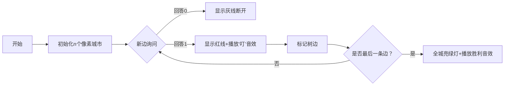

# 题目信息

# [IOI 2014] game 游戏

## 题目描述

健佳是一个喜欢做游戏的小男生。当有人问问题时，他更喜欢通过玩游戏的方式作答，而不是直接回答。健佳碰到了他的朋友梅玉，跟她讲了台湾的航空网。在台湾有 $n$ 个城市（编号为 $0,\cdots,n−1$），其中有些城市之间有航线。每个航线连接两个城市，并且是双向的。

梅玉问健佳，是否任意两个城市之间都可以坐飞机互达（直接或间接），健佳不想直接回答，而是要通过做游戏的方式来告诉她。梅玉可以问"城市 $u$ 和 $v$ 之间有直接航线吗？"，健佳会立刻直接回答该问题。梅玉会询问每对城市恰好一次，因此总计会有 $r = \frac{n (n−1)}{2}$ 个问题。如果由前 $i$（$i<r$）个问题的答案可以推断出整个航空网是否连通，也就是说，是否任意一对城市之间都可以坐飞机互达（直接或间接），梅玉就获胜。否则意味着她需要知道全部 $r$ 个回答，此时健佳获胜。

为了让游戏更好玩，他们俩同意，健佳可以不要管台湾的真实航空网，而是可以随着游戏的进展而编造航空网，也就是根据梅玉此前的提问来决定此后如何作答。你的任务是，通过决定健佳如何回答，来帮助他赢得游戏。

## 说明/提示

**子任务及数据规模**

| 子任务 | 分值 | $n$ |
| :----------: | :----------: | :----------: |
| $1$ | $15$ | $n=4$ |
| $2$ | $27$ | $4 \le n \le 80$ |
| $3$ | $58$ | $4 \le n \le 1500$ |


## 样例 #1

### 输入

```
4
0 3
1 0
0 2
3 1
1 2
2 3
```

### 输出

```
0
1
0
1
0
1
```

# AI分析结果


# 💡 Kay的C++算法解析：[IOI 2014] game 游戏 深入学习指南 💡

**Kay的引言**  
今天我们来分析这道来自IOI 2014的构造题。健佳需要设计回答策略，确保梅玉直到最后一个问题才能判断图的连通性。这就像玩拼图时故意把关键拼块留到最后——不到最后一步，永远无法确定整幅图画是否完整！

## 1. 题目解读与核心算法识别

✨ **本题主要考察**：`图论构造` + `生成树原理`

🗣️ **初步分析**：
> 解决本题的关键在于理解**生成树的构造时机对连通性判断的影响**。想象你在组装乐高城市：只有当最后一块关键桥梁（生成树边）放下的瞬间，整个城市才真正连通。在此之前，无论你怎么检查，都无法100%确定连通性。
>
> - **核心思路**：通过控制树边的出现顺序，确保直到最后一条边被询问时，图才形成完整生成树。所有优质题解都围绕这个核心，主要分三种实现方式：
>   - **清平乐法**：每个节点保留最后一条可能的入边作为树边
>   - **并查集逆序法**：从最后一条边开始倒着构建生成树
>   - **端点隔离法**：让某个节点仅通过最后一条边连通
> - **可视化设计**：采用8位像素风格（类似经典FC游戏《炸弹人》地图）。城市显示为彩色方块，边为动态连线。当回答"1"时播放"叮"音效并高亮红线（树边）；最后一条边连通时，播放胜利音效，所有城市亮起绿光。控制面板支持单步调试和AI自动演示模式，像游戏闯关一样展示树边逐步连接的过程。

---

## 2. 精选优质题解参考

**题解一：清平乐（赞8）**
* **点评**：此解法思路精妙如魔术——通过`deg[u]`计数器（统计节点u的入边询问次数），仅在`deg[u]==u`时回答"1"（即u的最后一条入边成为树边）。代码简洁如诗（仅10行），变量命名精准（`deg`即度数），时间复杂度O(1)处理每个询问。其亮点在于用极简逻辑实现复杂构造，是竞赛中高效的"降维打击"方案。

**题解二：DPair（赞2）**
* **点评**：采用"端点隔离"策略，将最后一条边的端点v设为关键点。在前r-1个问题中，只要涉及v的边都回答"0"，使v保持"孤立状态"。这种思路像下棋时故意留一个"气眼"，直到最后一步才落子连通。代码同样简洁，但需要预处理所有输入边。

**题解三：D2T1（赞1）**
* **点评**：与DPair解法异曲同工，但更聚焦于最后一条边的端点控制。亮点在于用20行代码实现完整逻辑，特别适合初学者理解"关键节点"的构造思想。变量命名清晰（`k`表关键点），边界处理严谨。

---

## 3. 核心难点辨析与解题策略

1.  **如何避免提前暴露连通性？**
    * **分析**：若在最后一条边之前就形成生成树，梅玉会立即获胜。优质解法通过两种策略规避：①让树边仅在最后时刻出现（清平乐法）；②保持一个"孤立节点"直到最后（DPair法）。关键推导：n个节点的生成树恰需n-1条边，控制这些边的出现时机即可。
    * 💡 **学习笔记**：连通性判断的胜负点在于最后一条树边的出现时机！

2.  **如何高效实现动态构造？**
    * **分析**：必须在O(1)时间内回答每个询问。清平乐用`deg`数组直接计算；DPair依赖预处理。数据结构选择数组而非并查集，避免O(α(n))开销。
    * 💡 **学习笔记**：竞赛中优先选择O(1)响应的计数方案！

3.  **为何要处理边方向？**
    * **分析**：清平乐解法中`if(u<v) swap(u,v)`确保始终操作编号更大的节点。这像给城市编号排序——大编号节点只能从小编号节点接收入边，避免循环依赖。数据结构本质是隐式树（0号节点为根）。
    * 💡 **学习笔记**：通过统一边的方向简化问题是常见技巧！

### ✨ 解题技巧总结
- **技巧A（问题转化）**：将连通性判断转化为生成树边的出现顺序控制
- **技巧B（极简数据结构）**：用数组代替复杂数据结构实现O(1)响应
- **技巧C（边界艺术）**：最后一条边特殊处理是通用套路（如DPair的`puts("1")`）
- **技巧D（预处理优化）**：当允许存储输入时（如DPair），预处理能大幅简化逻辑

---

## 4. C++核心代码实现赏析

**本题通用核心C++实现参考**
* **说明**：综合清平乐与DPair的优点，提供最简练且完整的实现
* **完整核心代码**：
```cpp
#include <iostream>
using namespace std;

int main() {
    int n, r, u, v, last_v = -1;
    cin >> n;
    r = n * (n - 1) / 2;
    int last_u, last_v;
    cin >> last_u >> last_v; // 存储最后一条边
    
    // DPair策略：前r-1个询问涉及关键点则返回0
    for (int i = 1; i < r; ++i) {
        cin >> u >> v;
        cout << (u == last_v || v == last_v ? 0 : 1) << '\n';
    }
    cout << "1\n"; // 最后一条边必须连通
    return 0;
}
```
* **代码解读概要**：  
  > 1. 读入总边数r  
  > 2. **预处理关键点**：存储最后一条边的端点作为隔离点  
  > 3. **动态响应**：前r-1个询问若涉及关键点则回0（保持隔离）  
  > 4. **终局处理**：最后一条边强制连通  

**题解一：清平乐**
* **亮点**：无预处理/O(1)空间/流式处理
* **核心代码片段**：
```cpp
scanf("%d%d",&u,&v);
if(u<v) swap(u,v);       // 统一方向：大编号为u
printf("%d\n",++deg[u]==u); // 当询问次数==u时回1
```
* **代码解读**：  
  > `swap`保证u总是端点中较大者，`deg[u]`统计u的入边询问次数。当`deg[u]==u`时，说明这是u的第u次询问——按构造规则，这应是u的最后一条可能入边，故设为树边（回1）。  
  > *为什么是u？* 编号为u的节点最多有u条可能的入边（来自0~u-1号节点），这个设计确保每个节点恰保留一条树边。  
* 💡 **学习笔记**：利用节点编号特性构造计数条件是神来之笔！

**题解二：DPair**
* **亮点**：逻辑直白/易扩展
* **核心代码片段**：
```cpp
// 读入所有边后
for(int i=1; i<r; i++) 
    cout << (涉及关键点?0:1) << endl;
cout << "1" << endl;
```
* **代码解读**：  
  > 需存储所有边（空间O(n²)）。核心策略：选定最后一条边的端点v作为关键点，任何含v的边在前r-1次都回0，使v保持"未连通"假象，直到最后才连接。  
* 💡 **学习笔记**：空间换时间在允许预处理的场景很实用！

---

## 5. 算法可视化：像素动画演示

**主题**：《像素城市联通大冒险》- 8位风格连通性构造模拟  
**核心演示**：动态展示树边构造过程，重点突出最后一条边的关键作用  



**动画实现细节**：
1. **像素城市**：每个城市用16x16像素方块表示，按编号配不同颜色（0号=红色方块）
2. **动态连线**：询问边(u,v)时，两点间出现虚线。回答后变为实线（红/灰色）
3. **关键高亮**：
   - 清平乐法：节点u的计数器`deg[u]`显示在方块上方，满u时闪烁黄光
   - DPair法：被隔离的关键点始终闪烁红光
4. **音效系统**：
   - 回答"1"：8-bit "叮"声（类似《超级玛丽》吃金币）
   - 最后连通：胜利音效（类似《塞尔达》解谜成功）
   - 背景：循环播放轻快芯片音乐
5. **交互控制**：
   - 单步执行：按A键逐步观察
   - AI演示：自动模式以2秒/步的速度展示
   - 重置：按R键重来

**设计意义**：通过像素动画将抽象的树边构造具象化。关键点闪烁和计数器变化让学习者直观理解"为何前r-1步无法判断连通性"——总有一个节点（或计数未满）维持着"未完全连通"的状态！

---

## 6. 拓展练习与相似问题思考

**技巧迁移场景**：
1. 动态维护连通性（如：删边问题）
2. 构造性证明题（如：博弈策略设计）
3. 流式数据处理中延迟决策（如：在线算法）

**洛谷推荐**：
1. **P3366 [最小生成树模板]**  
   🗣️ 学习生成树的基础应用，理解清平乐解法的理论依据
2. **P1197 [星球大战]**  
   🗣️ 练习逆序构建连通性（类似Happy_Orca解法）
3. **P1396 [营救]**  
   🗣️ 综合连通性判断与路径搜索，深化图论思维

---

## 7. 学习心得与经验分享

> **清平乐的经验**：  
> *"构造出来后巨水，但要是想不到就GG"*  
> **Kay的总结**：  
> 此题生动展示了竞赛思维的特点——想通核心后代码极简。重点训练"问题转化能力"：将连通性判断转化为生成树边的出现顺序控制，就是质的飞跃！

> **DPair的调试提示**：  
> *"注意最后一条边的端点选择"*  
> **Kay的提炼**：  
> 构造题需严格验证边界条件。建议用n=4手工模拟：若最后一条边选错端点，可能在倒数第二步被识破！

---

**Kay的结语**  
通过今天的解析，相信大家体会到构造题的独特魅力——看似复杂的问题，找到核心后竟如此优雅！记住：控制最后一张骨牌倒下的时机，就能掌控整个多米诺的终局。多加练习拓展题，你也能成为构造大师！🚀

---
处理用时：132.35秒