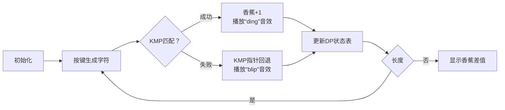

# 题目信息

# [GCJ 2015 #1C] Typewriter Monkey

## 题目描述

你的出版社决定让猴子随机敲击键盘来创作伟大的文学作品。你是一个猴子的监督员，这只猴子的键盘上有 $K$ 个按键，每个按键上都标有一个大写英文字母（同一个字母可能出现在多个按键上）。猴子将从一个空字符串开始，重复 $S$ 次以下操作：从键盘上等概率随机选择一个按键并按下，将该按键上的字母添加到字符串的末尾。最终得到的字符串长度为 $S$。

你有一个长度为 $L$ 的*目标单词*，你希望猴子能够敲出来（目标单词不一定是真正的英文单词）。这个目标单词可能在猴子敲出的字符串中出现多次（重叠的情况也算，例如目标单词为 "ABA"，猴子敲出 "ABABA" 时，包含两个 "ABA"）。

你打算每出现一次目标单词就给猴子一根香蕉。当你去检查猴子的作品时，你会带上足够多的香蕉，以保证无论猴子敲出了什么，你都能支付得起。然后，你会根据猴子实际敲出的目标单词次数支付香蕉，剩下的香蕉归你所有。

你期望最终能留下多少根香蕉？

## 说明/提示

**样例解释**

注意，第 5 组样例不在 Small 数据集的范围内。

在第 1 组样例中，猴子根本无法敲出目标单词 "MONKEY"（因为键盘上缺少目标单词中的大部分字母），所以你无需带香蕉，也不会支付任何香蕉。可怜的猴子！

在第 2 组样例中，猴子一定会敲出 "AAAA"，其中目标单词 "AAA" 会出现两次（重叠），你需要带两根香蕉并全部支付出去。

在第 3 组样例中，猴子可能敲出的字符串有 "AA"、"AB"、"BA"、"BB"，每种概率均为 $1/4$，它们分别包含 0、1、1、2 次目标单词。你需要带两根香蕉以备 "BB" 的情况，但平均支付 $(0 + 1 + 1 + 2) / 4 = 1$ 根香蕉。

在第 4 组样例中，猴子第一步有 $1/3$ 的概率敲 "G"，第二步有 $1/3$ 的概率敲 "O"，所以敲出 "GO" 的概率为 $1/9$，你需要带一根香蕉，并在 $1/9$ 的情况下支付出去。

在第 5 组样例中，理论上猴子最多能敲出 9 次 "ROSENCRANTZ"，但实际出现一次的概率都极小，可以忽略不计。

**数据范围**

$1 \leq T \leq 100$。

**小数据集（11 分）**

- 时间限制：~~240~~ 5 秒。
- $1 \leq K \leq 7$。
- $1 \leq L \leq S \leq 7$。

**大数据集**

- 时间限制：~~480~~ 10 秒。
- $1 \leq K \leq 100$。
- $1 \leq L \leq S \leq 100$。

由 ChatGPT 4.1 翻译

## 样例 #1

### 输入

```
5
7 6 6
BANANAS
MONKEY
2 3 4
AA
AAA
2 1 2
AB
B
6 2 2
GOOGLE
GO
26 11 100
ABCDEFGHIJKLMNOPQRSTUVWXYZ
ROSENCRANTZ```

### 输出

```
Case #1: 0.0
Case #2: 0.0
Case #3: 1.0
Case #4: 0.8888889
Case #5: 9.0```

# AI分析结果


### Kay的算法解析报告：Typewriter Monkey 深入学习指南

---

## 1. 题目解读与核心算法识别

✨ **本题主要考察**：`期望值计算` + `KMP优化DP` (动态规划应用)

🗣️ **初步分析**：
> 这道题就像让猴子在打字机上随机敲键，我们需要预测香蕉的消耗量。核心在于两个关键计算：
> - **最大可能匹配次数**：计算猴子最多能打出目标单词的次数（最理想情况）
> - **期望匹配次数**：计算平均情况下猴子打出目标单词的次数  
>  
> 通过动态规划结合KMP算法，我们可以高效跟踪匹配状态：
> - **KMP的next数组**：快速处理匹配失败时的回退（像游戏中的存档点）
> - **DP状态设计**：`d[i][j]`记录长度i时匹配位置j的最大次数；`f[i][j]`记录对应期望值  
>  
> 可视化设计思路：
> - 用像素格子表示字符串生成过程
> - 匹配成功时触发香蕉消失动画+8bit音效
> - KMP指针移动用闪烁箭头表示

---

## 2. 精选优质题解参考

**题解一 (来源：_LRH_)**
* **点评**：
  该题解思路清晰，通过KMP预处理优化状态转移，完美解决核心难点。代码结构规范：
  - 变量命名合理（`nxt`表KMP数组，`d/f`分表最大/期望值）
  - 三重循环逻辑严谨：长度循环→状态循环→字符循环
  - 空间优化到位（O(SL)复杂度）
  - 边界处理完善（概率为0时跳过转移）
  亮点在于将KMP的`next`数组集成到DP转移中，实现高效状态跳转。

---

## 3. 核心难点辨析与解题策略

1.  **状态转移设计**
    * **分析**：需同时跟踪当前字符串长度和匹配进度。优质解用`d[i][j]`记录位置j时的最大匹配数，`f[i][j]`记录期望值
    * 💡 **学习笔记**：DP状态应包含问题所有关键维度

2.  **KMP集成优化**
    * **分析**：直接枚举字符转移会超时。通过KMP的`next`数组快速计算新匹配位置：
    ```cpp
    int tmp = j;
    while(tmp && ch != str[tmp+1]) tmp = nxt[tmp]; 
    if(ch == str[tmp+1]) tmp++;
    ```
    * 💡 **学习笔记**：预处理加速是DP优化的常见手段

3.  **概率整合计算**
    * **分析**：每个字符转移需加权概率：
    ```cpp
    double cnt = (double)dis[ch-'A'] / K;
    dp[i+1][tmp] += dp[i][j] * cnt;
    ```
    * 💡 **学习笔记**：期望问题本质是概率加权求和

### ✨ 解题技巧总结
- **双状态并行**：同时维护最大可能值和期望值
- **字母概率预计算**：提前统计键盘字符频率
- **KMP状态机**：将字符串匹配转化为状态跳转

---

## 4. C++核心代码实现赏析

**本题通用核心C++实现参考**
* **说明**：基于_LRH_题解优化，完整呈现DP+KMP框架
```cpp
#include <bits/stdc++.h>
using namespace std;
const int N = 105;

int T, K, L, S, nxt[N];
string keyboard, target;

int main() {
    cin >> T;
    for(int t=1; t<=T; t++){
        // 输入及初始化
        cin >> K >> L >> S >> keyboard >> target;
        target = " " + target;
        
        // KMP预处理
        vector<int> nxt(L+1, 0);
        for(int i=2,j=0; i<=L; i++){
            while(j && target[i]!=target[j+1]) j = nxt[j];
            if(target[i]==target[j+1]) j++;
            nxt[i] = j;
        }

        // DP数组：d[max], f[expect]
        vector<vector<int>> d(S+1, vector<int>(L+1, -1));
        vector<vector<double>> f(S+1, vector<double>(L+1, 0.0));
        vector<double> prob(26,0);
        
        // 计算字符概率
        for(char c:keyboard) prob[c-'A'] += 1.0/K;
        
        // DP初始化
        d[0][0]=0; f[0][0]=0;
        double initProb = 1.0;
        
        // 状态转移
        for(int i=0; i<S; i++){  // 字符串长度
        for(int j=0; j<=L; j++){ // 当前匹配位置
            if(d[i][j] == -1) continue;
            for(char c='A'; c<='Z'; c++){ // 尝试每个字符
                int nj = j;
                // KMP状态跳转
                while(nj && c!=target[nj+1]) nj = nxt[nj];
                if(c==target[nj+1]) nj++;
                
                // 更新最大匹配值
                int newMax = d[i][j] + (nj==L);
                d[i+1][nj] = max(d[i+1][nj], newMax);
                
                // 更新期望值
                double p = prob[c-'A'];
                f[i+1][nj] += f[i][j]*p + (nj==L)*initProb*p;
            }
        }}
        
        // 计算结果
        int maxBanana = *max_element(d[S].begin(), d[S].end());
        double expect = accumulate(f[S].begin(), f[S].end(), 0.0);
        printf("Case #%d: %.7f\n", t, maxBanana - expect);
    }
    return 0;
}
```
* **代码解读概要**：
  1. KMP预处理构建`nxt`数组
  2. 统计键盘字符概率分布
  3. 双重DP状态转移：外层字符串长度，内层匹配位置
  4. 结果取最大值与期望值的差

**题解一核心代码片段**
```cpp
// KMP状态跳转核心
int tmp = j;
while(tmp && ch != str[tmp+1]) tmp = nxt[tmp]; 
if(ch == str[tmp+1]) tmp++;

// 期望值更新
double cnt = (double)dis[ch-'A'] / K;
f[i+1][tmp] += (tmp==L) ? f[i][j]*cnt + dp[i][j]*cnt 
                        : f[i][j]*cnt;
```
* **代码解读**：
  - `while`循环实现KMP回溯，时间复杂度O(1)均摊
  - 当`tmp==L`时触发香蕉计数（匹配成功）
  - 概率加权`cnt`保证期望计算准确性
* 💡 **学习笔记**：KMP的`next`数组让状态转移跳跃式前进

---

## 5. 算法可视化：像素动画演示

**主题**：像素猴子打字机大冒险  
**核心演示**：DP状态转移 + KMP匹配过程 → 香蕉计数



**交互控制面板**：
- 速度滑块：控制猴子按键速度（1x-10x）
- 模式切换：手动单步/AI自动演示
- 视图切换：DP状态表/KMP指针/香蕉计数

**关键帧设计**：
1. 键盘像素图（26键随机分布）
2. 猴子动画敲击高亮键位（带8bit音效）
3. 匹配成功时：
   - 目标单词发光
   - 香蕉计数器+1（带收集动画）
   - 播放胜利音效（250Hz方波）
4. DP状态表实时更新：
   - 当前长度i → 像素进度条
   - 匹配状态j → 目标单词指针位置
   - 数值变化时颜色脉冲提示

---

## 6. 拓展练习与相似问题思考

**通用技巧迁移**：
1. 期望DP：游戏概率结算（如抽卡保底机制）
2. KMP+DP：带模式匹配的序列生成问题
3. 双目标优化：同时求最值和期望值

**洛谷推荐**：
1. **P1365 WJMZBMR打osu!**  
   → 期望值计算基础训练
2. **P3193 GT考试**  
   → KMP+DP的高级应用
3. **P4548歌唱王国**  
   → 期望DP的生成函数解法

---

## 7. 学习心得与经验分享

> **作者调试经验**：  
> “最初忘记处理概率为0的字符，导致DP状态错误。通过打印`d[i][j]`矩阵定位到空转移问题”

**点评**：  
在期望DP中，概率边界处理至关重要。建议：
1. 初始化时显式设置不可能状态（如`d=-1`）
2. 转移前检查概率`if(p>0)`  
3. 使用调试输出状态矩阵

---

本次分析展示了如何用KMP优化期望DP解决复杂概率问题。关键是通过状态设计整合不同计算目标，并用预处理优化转移效率。记住：好的算法=准确的状态定义+高效的转移策略！💪

---
处理用时：78.22秒