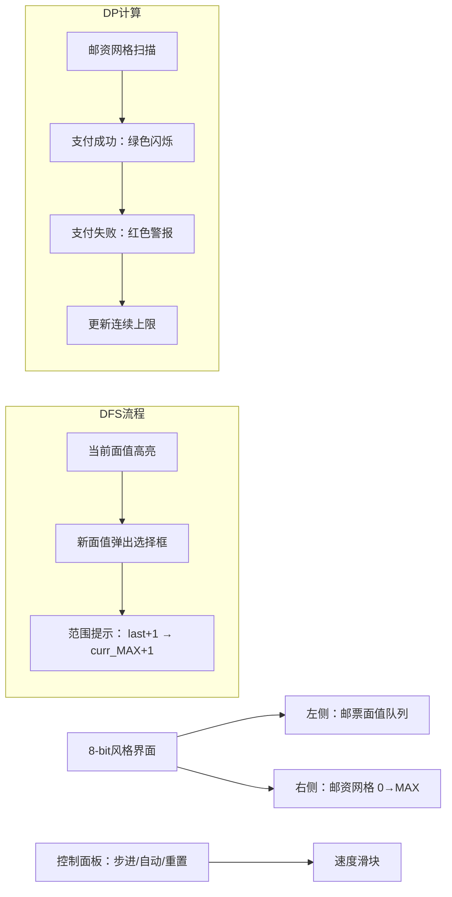

# 题目信息

# [NOIP 1999 提高组] 邮票面值设计

## 题目背景

除直接打表外，本题不保证存在**正确且时间复杂度可以通过全部数据**做法。由于测试数据过水，部分错误做法可以通过此题，通过不代表做法正确。本题不接受 hack 数据。

[关于此类题目的详细内容](https://www.luogu.com.cn/paste/pf94n89x)

## 题目描述

给定一个信封，最多只允许粘贴 $N$ 张邮票，计算在给定 $K$（$N+K \le 15$）种邮票的情况下（假定所有的邮票数量都足够），如何设计邮票的面值，能得到最大值 $\mathsf{MAX}$，使在 $1$ 至 $\mathsf{MAX}$ 之间的每一个邮资值都能得到。

例如，$N=3$，$K=2$，如果面值分别为 $1$ 分、$4$ 分，则在 $1\sim 6$ 分之间的每一个邮资值都能得到（当然还有 $8$ 分、$9$ 分和 $12$ 分）；如果面值分别为 $1$ 分、$3$ 分，则在 $1\sim 7$ 分之间的每一个邮资值都能得到。可以验证当 $N=3$，$K=2$ 时，$7$ 分就是可以得到的连续的邮资最大值，所以 $\mathsf{MAX}=7$，面值分别为 $1$ 分、$3$ 分。


## 样例 #1

### 输入

```
3 2
```

### 输出

```
1 3
MAX=7
```

# AI分析结果


### 💡 Kay的C++算法解析：邮票面值设计 深入学习指南 💡

**引言**  
今天我们一起分析NOIP 1999提高组"邮票面值设计"。这道题要求设计K种邮票面值，在最多使用N张邮票的限制下，使能连续支付的邮资范围最大化。本指南将解析DFS+DP的核心解法，并通过像素动画帮助大家直观理解算法执行过程。

---

### 1. 题目解读与核心算法识别
✨ **本题主要考察**：`搜索（DFS）与动态规划（背包变种）`

🗣️ **初步分析**：
> 本题如同设计一套"万能货币组合"——用有限的邮票面值组合支付连续金额。核心是DFS枚举面值序列，结合背包DP验证连续性。  
> - **算法流程**：  
>   1. 固定首张邮票为1（否则无法支付1分）  
>   2. DFS枚举后续面值（范围=[上一面值+1, 当前最大连续值+1]）  
>   3. 用完全背包DP计算当前面值序列的连续支付上限  
>   4. 回溯更新最优解  
> - **可视化设计**：  
>   在像素动画中，我们将用不同颜色方块表示邮票面值，网格表示邮资金额。DP更新时高亮当前计算的邮资金额和回溯的参考位置，断层点用红色闪烁警示。

---

### 2. 精选优质题解参考
**题解一：包子入侵（赞170）**  
* **点评**：  
  思路清晰推导合理，注释详细适合初学者。代码规范（如`a[]`存储面值，`dp()`函数独立），核心逻辑直白：DFS中严格限定面值范围=[a[t-1]+1, 当前MAX+1]，DP用完全背包求连续上限。亮点在于边界处理严谨（初始化`f[0]=0`，邮资遍历至断层点），可直接用于竞赛。

**题解二：Celebrate（赞39）**  
* **点评**：  
  代码模块化程度高（分离`solve()`和`dfs()`），剪枝策略明确：面值上界=当前连续值+1。变量命名合理（`tmp[]`暂存当前方案），实践时注意DP数组初始化`memset(dp,63)`。亮点在于调试心得分享——输出中间状态验证边界。

**题解三：neymar_jr（赞70）**  
* **点评**：  
  算法有效性突出，简洁高效。DFS中直接传递当前连续值作为参数，DP更新时巧用`f[i]=min(f[i],f[i-f[j]]+1)`。亮点在于空间优化（仅一维DP数组），适合小数据快速求解。

---

### 3. 核心难点辨析与解题策略
1. **难点1：如何确定DFS枚举范围？**  
   * **分析**：下界=上一面值+1（保证递增），上界=当前连续值+1（若新面值>MAX+1，则MAX+1无法支付）。优质题解均采用`for(int i=prev+1; i<=last_max+1; i++)`结构。
   * 💡 **学习笔记**：合理剪枝是避免超时的关键。

2. **难点2：如何高效计算连续邮资上限？**  
   * **分析**：转化为背包问题——用当前邮票组合支付金额i所需最少张数。状态转移：`dp[i] = min(dp[i], dp[i-面值]+1)`，当首次出现`dp[i]>N`时，连续上限=i-1。
   * 💡 **学习笔记**：DP本质是验证支付能力的"压力测试"。

3. **难点3：如何维护全局最优解？**  
   * **分析**：DFS到达叶子节点（选满K种面值）时，比较当前连续值与历史最大值。注意需深拷贝面值数组（如`memcpy(ans, tmp)`）。
   * 💡 **学习笔记**：回溯时状态还原（`a[t]=0`）避免脏数据。

#### ✨ 解题技巧总结
- **剪枝艺术**：面值枚举范围由当前连续值动态限定
- **DP初始化**：`dp[0]=0`（支付0元需0张），其余初始化为大数
- **边界陷阱**：邮资遍历上限=最大面值×N（全用最大面值）
- **调试技巧**：输出中间面值序列和DP结果验证

---

### 4. C++核心代码实现赏析
**本题通用核心C++实现参考**  
```cpp
#include <iostream>
#include <cstring>
#include <algorithm>
using namespace std;
const int MAXN = 1000;
int n, k, max_ans;
int curr[20], best[20]; // 当前方案/最优方案

int calc_continuous(int t) {
    int dp[MAXN]; // dp[i]:支付i元所需最少张数
    memset(dp, 0x3f, sizeof dp);
    dp[0] = 0; // 边界：0元需0张

    // 完全背包DP
    for (int money = 1; money <= curr[t] * n; money++) {
        for (int i = 1; i <= t; i++) {
            if (money >= curr[i]) {
                dp[money] = min(dp[money], dp[money - curr[i]] + 1);
            }
        }
        if (dp[money] > n) return money - 1; // 发现断层
    }
    return curr[t] * n;
}

void dfs(int dep, int last_max) {
    if (dep > k) { // 已选k种面值
        if (last_max > max_ans) {
            max_ans = last_max;
            for (int i = 1; i <= k; i++) best[i] = curr[i];
        }
        return;
    }

    // 关键：枚举范围[上一面值+1, 当前连续值+1]
    for (int val = curr[dep - 1] + 1; val <= last_max + 1; val++) {
        curr[dep] = val;
        int new_max = calc_continuous(dep);
        dfs(dep + 1, new_max);
    }
}

int main() {
    cin >> n >> k;
    curr[1] = 1; // 首张必须为1
    max_ans = n; // 初始连续上限=n
    dfs(2, n);   // 从第2张开始搜索

    for (int i = 1; i <= k; i++) cout << best[i] << " ";
    cout << "\nMAX=" << max_ans;
    return 0;
}
```

**题解片段赏析**  
1. **包子入侵 - DP函数**  
   ```cpp
   int dp(int t, int mx) {
       int f[50000]; // 支付i元所需最少张数
       f[0] = 0;     // 边界初始化
       for (int i = 1; i <= a[t] * n; i++) {
           f[i] = 50000;  // 初始大值
           for (int j = 1; j <= t; j++) {
               if (i >= a[j]) {
                   f[i] = min(f[i], f[i - a[j]] + 1);
               }
           }
           if (f[i] > n) return i - 1; // 断层点
       }
       return a[t] * n;
   }
   ```
   * **亮点**：清晰展现背包DP本质，断层检测直接
   * **学习笔记**：`f[0]=0`是正确递推的基石

2. **Celebrate - 剪枝策略**  
   ```cpp
   void dfs(int dep) {
       int end = solve(dep - 1); // 当前连续上限
       for (int j = a[dep - 1] + 1; j <= end + 1; j++) {
           a[dep] = j;
           dfs(dep + 1);
       }
   }
   ```
   * **亮点**：用独立函数解耦DP计算
   * **学习笔记**：面值上界=end+1保证连续性

3. **neymar_jr - 状态转移**  
   ```cpp
   for (int i = 1; i <= t; i++) 
   for (int j = a[i]; j <= n * sum; j++) 
       dp[j] = min(dp[j], dp[j - a[i]] + 1);
   ```
   * **亮点**：内层循环从`a[i]`开始优化效率
   * **学习笔记**：避免无效判断（j<a[i]时无需更新）

---

### 5. 算法可视化：像素动画演示
**主题**：邮票面值设计之"寻宝探险"  
**核心演示**：DFS生成面值序列 + DP验证连续性  

**像素动画设计**  


**关键交互**  
1. **初始化阶段**：  
   - 像素邮票1固定在队列首格（棕色方块）  
   - 邮资网格第0格显示✓（支付0元）  

2. **DFS选择新面值**：  
   - 当前可选范围用蓝色边框标记（如last=1时范围[2, n+1]）  
   - 选择值3时：邮票队列新增橙色方块"3"，播放"叮"音效  

3. **DP验证连续性**：  
   - 邮资网格从1开始向右扫描（像素小车移动）  
   - 支付成功：网格变绿，显示dp值（如支付2：min(dp[2-1]+1)=2）  
   - 支付失败：网格变红闪烁（如首次dp[i]>n），播放破裂音效  

4. **回溯与更新**：  
   - 找到更优解时：最优面值队列金色闪光，MAX值跳动更新  
   - 游戏化激励：连续突破记录时触发"Combo!"特效+积分奖励  

**技术实现**：Canvas绘制网格，Web Audio API触发音效，单步执行通过requestAnimationFrame控制。

---

### 6. 拓展练习与相似问题
1. **洛谷P1249** - 最大乘积  
   * **推荐理由**：同样需要枚举拆分方案+数学验证，巩固DFS剪枝技巧  
2. **洛谷P1284** - 三角形牧场  
   * **推荐理由**：背包DP验证方案可行性，强化状态转移思维  
3. **洛谷P1379** - 八数码难题  
   * **推荐理由**：BFS求最优解，对比DFS/DP适用场景差异  

---

### 7. 学习心得与经验分享
> **参考经验 (来自 Celebrate)**：  
> "我在处理DP数组初始化时卡了很久，后来通过打印中间变量发现未初始化位置导致计算错误。这提醒我们：DP边界处理必须严谨！"  
>   
> **点评**：  
> 这是非常典型的调试经验。在DFS+DP类问题中，务必：  
> 1. 初始化DP数组（特别是`dp[0]=0`）  
> 2. 邮资遍历范围要覆盖理论最大值  
> 3. 每次DFS新分支时重置DP数组  

---

**结语**  
通过本次分析，我们掌握了DFS+DP求解邮票面值设计的核心方法。关键点是理解面值枚举范围的剪枝逻辑和背包DP的连续性验证。建议大家动手实现像素动画的交互演示，这将极大提升对算法流程的直观理解。下次我们将探讨更复杂的组合优化问题，继续加油！💪

---
处理用时：200.61秒