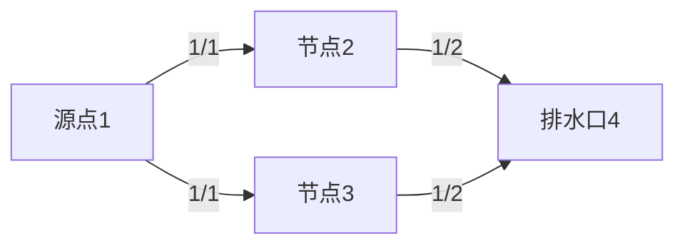

# 题目信息

# [NOIP2020] 排水系统

## 题目描述

对于一个城市来说，排水系统是极其重要的一个部分。

有一天，小 C 拿到了某座城市排水系统的设计图。排水系统由 $n$ 个排水结点（它们从 $1 \sim n$ 编号）和若干个单向排水管道构成。每一个排水结点有若干个管道用于汇集其他排水结点的污水（简称为该结点的汇集管道），也有若干个管道向其他的排水结点排出污水（简称为该结点的排出管道）。

排水系统的结点中有 $m$ 个污水接收口，它们的编号分别为 $1, 2, \ldots , m$，污水只能从这些接收口流入排水系统，并且这些结点没有汇集管道。排水系统中还有若干个最终排水口，它们将污水运送到污水处理厂，没有排出管道的结点便可视为一个最终排水口。

现在各个污水接收口分别都接收了 $1$ 吨污水，污水进入每个结点后，会均等地从当前结点的每一个排出管道流向其他排水结点，而最终排水口将把污水排出系统。

现在小 C 想知道，在该城市的排水系统中，每个最终排水口会排出多少污水。该城市的排水系统设计科学，管道不会形成回路，即不会发生污水形成环流的情况。

## 说明/提示

**【样例 #1 解释】**

$1$ 号结点是接收口，$4, 5$ 号结点没有排出管道，因此是最终排水口。  
$1$ 吨污水流入 $1$ 号结点后，均等地流向 $2, 3, 5$ 号结点，三个结点各流入 $\frac{1}{3}$ 吨污水。  
$2$ 号结点流入的 $\frac{1}{3}$ 吨污水将均等地流向 $4, 5$ 号结点，两结点各流入 $\frac{1}{6}$ 吨污水。  
$3$ 号结点流入的 $\frac{1}{3}$ 吨污水将均等地流向 $4, 5$ 号结点，两结点各流入 $\frac{1}{6}$ 吨污水。  
最终，$4$ 号结点排出 $\frac{1}{6} + \frac{1}{6} = \frac{1}{3}$ 吨污水，$5$ 号结点排出 $\frac{1}{3} + \frac{1}{6} + \frac{1}{6} = \frac{2}{3}$ 吨污水。

**【数据范围】**

| 测试点编号 | $n \le$ | $m \le$ |
|:-:|:-:|:-:|
| $1 \sim 3$ | $10$ | $1$ |
| $4 \sim 6$ | ${10}^3$ | $1$ |
| $7 \sim 8$ | ${10}^5$ | $1$ |
| $9 \sim 10$ | ${10}^5$ | $10$ |

对于全部的测试点，保证 $1 \le n \le {10}^5$，$1 \le m \le 10$，$0 \le d_i \le 5$。

数据保证，污水在从一个接收口流向一个最终排水口的过程中，不会经过超过 $10$ 个中间排水结点（即接收口和最终排水口不算在内）。

## 样例 #1

### 输入

```
5 1
3 2 3 5
2 4 5
2 5 4
0
0
```

### 输出

```
1 3
2 3
```

## 样例 #2

### 输入

```
见附件中的 water/water2.in```

### 输出

```
见附件中的 water/water2.ans```

## 样例 #3

### 输入

```
见附件中的 water/water3.in```

### 输出

```
见附件中的 water/water3.ans```

# AI分析结果


# 💡 Kay的C++算法解析：排水系统 深入学习指南 💡

**引言**  
今天我们一起探索NOIP2020题目"排水系统"。这道题考察在有向无环图中模拟污水流动的过程。本指南将帮助你理解拓扑排序的核心思想，掌握分数运算技巧，并通过像素动画直观感受算法执行过程。

## 1. 题目解读与核心算法识别

✨ **本题主要考察**：`图论（拓扑排序）` + `分数运算`

🗣️ **初步分析**：  
> 想象城市排水系统是像素游戏中的水管网络，污水从源头（绿色方块）流向排水口（红色方块）。拓扑排序就像水管工按顺序连接管道：从源头开始，确保上游水管先接通下游水管。  
> - 核心思路：用队列管理"待处理节点"（入度为0），模拟污水从源头逐层分流的过程  
> - 关键难点：分数运算中分子分母指数级增长（如5^11），需用__int128或高精度  
> - 可视化设计：在8位像素网格中，绿色方块表示当前处理节点，蓝色线条显示水流方向，节点上方实时显示分数值。每当污水流动时播放"滴答"音效，完成排水时播放马里奥过关音效

---

## 2. 精选优质题解参考

### 题解一：hensier（赞11）
* **亮点**：  
  - 思路清晰：完整封装分数类（Fraction），支持加减约分运算  
  - 代码规范：拓扑排序标准实现，变量名`in[]`（入度）、`out[]`（出度）含义明确  
  - 算法优化：使用`__int128`避免高精度，复杂度O(n log V)  
  - 实践价值：边界处理严谨（分母初始化为1防除零错误）

### 题解二：gavinliu266（赞4）
* **亮点**：  
  - 创新设计：用`pair<__int128, __int128>`存储分数，减少封装开销  
  - 逻辑简洁：拓扑排序中直接实现通分公式 $\frac{a}{b}+\frac{c}{d}=\frac{ad+bc}{bd}$  
  - 调试技巧：注释强调"先除后乘"防止溢出

---

## 3. 核心难点辨析与解题策略

1. **分数运算溢出风险**  
   * **分析**：分母可达$5^{11}$（>48828125），普通整型会溢出。优质题解采用`__int128`（128位整数），每次运算后调用`gcd`约分
   * 💡 **学习笔记**：分数运算如同做蛋糕，每次切割（除法）后要重新称重（约分）保持精确

2. **拓扑排序顺序控制**  
   * **分析**：必须确保节点在水流到达前完成计算。用`in[]`数组跟踪未处理入边，队列管理"就绪节点"
   * 💡 **学习笔记**：拓扑排序是DAG上的接力赛，只有接到所有上游接力棒才能出发

3. **边界条件初始化**  
   * **分析**：接收口（入度=0）初始化为1/1，非接收口初始化为0/1。分母为1可避免未定义行为
   * 💡 **学习笔记**：程序如水管系统，启动前务必关闭所有阀门（初始化变量）

### ✨ 解题技巧总结
- **分数优化技巧**：运算前先约分，避免中间结果溢出
- **拓扑排序模板**：  
  ```cpp
  1. 计算所有节点入度
  2. 入度=0的节点入队
  3. while(队不空):
        u = 队首
        for v in u的出边:
            更新v的分数
            v入度减1
            若v入度=0则入队
  ```
- **调试技巧**：小规模数据手工验证（如样例），打印中间分数值

---

## 4. C++核心代码实现赏析

### 本题通用核心C++实现
```cpp
#include <vector>
#include <queue>
#include <cctype>
using namespace std;
typedef __int128 ll;

struct Frac { ll x, y; }; // 分子x, 分母y

void topo(int n, vector<vector<int>>& graph, vector<Frac>& res) {
    vector<int> in(n+1, 0), out(n+1, 0);
    queue<int> q;
    
    // 初始化入度出度和分数
    for (int i = 1; i <= n; ++i) {
        out[i] = graph[i].size();
        for (int v : graph[i]) in[v]++;
        if (in[i] == 0) { // 接收口
            q.push(i);
            res[i] = {1, 1};
        } else res[i] = {0, 1};
    }

    while (!q.empty()) {
        int u = q.front(); q.pop();
        if (out[u] == 0) continue; // 排水口不处理
        
        Frac flow = {res[u].x, res[u].y * out[u]}; // 当前节点流出量
        ll g = __gcd(flow.x, flow.y);
        flow.x /= g; flow.y /= g; // 约分

        for (int v : graph[u]) {
            // 分数相加: res[v] = res[v] + flow
            ll new_y = res[v].y * flow.y / __gcd(res[v].y, flow.y);
            ll new_x = res[v].x*(new_y/res[v].y) + flow.x*(new_y/flow.y);
            res[v] = {new_x, new_y};
            
            if (--in[v] == 0) q.push(v);
        }
    }
}
```

### 优质题解片段赏析

**题解一：hensier**
```cpp
// 分数加法重载
Frac operator+(const Frac& other) {
    ll lcm = y * other.y / __gcd(y, other.y);
    return {x*(lcm/y) + other.x*(lcm/other.y), lcm};
}
```
**代码解读**：  
> 如同调配两种颜料，先找到公容器（lcm），按比例混合颜料（分子乘倍数），最后简化为最简配方（约分）。`lcm`计算避免中间溢出。

**题解二：gavinliu266**
```cpp
// 拓扑排序中更新下游节点
void update(int v, Frac flow) {
    if (res[v].x == 0) res[v] = flow; // 直接赋值
    else {
        ll g = __gcd(res[v].y, flow.y);
        ll new_y = res[v].y / g * flow.y; // 防止溢出
        res[v].x = res[v].x*(new_y/res[v].y) + flow.x*(new_y/flow.y);
        res[v].y = new_y;
    }
}
```
**代码解读**：  
> 像接水管时避免漏水：当新水管接入空容器（x=0）时直接开闸放水；否则先扩建水池（计算公分母）再混合水流。`new_y`计算顺序避免乘法溢出。

---

## 5. 算法可视化：像素动画演示

**动画主题**：8位像素风格"水管工大冒险"  
**核心演示**：拓扑排序中污水流动与分数变化  

### 动画设计细节：


1. **像素场景设计**：
   - 16x16像素节点，源点=绿色，排水口=红色，普通节点=蓝色
   - 管道用黄色像素线连接，水流动画使用浅蓝色像素块移动
   - 控制面板：开始/暂停按钮，速度滑块（蜗牛→兔子）

2. **关键帧流程**：
   - **帧1**：源点闪烁绿光（播放"滴"声），显示分数1/1
   - **帧2**：水流沿管道流向相邻节点（流动动画持续0.5秒）
   - **帧3**：节点接收水流，分数更新（如1/1→1/3），播放"叮"声
   - **帧4**：排水口变金色（播放马里奥金币声），显示最终分数

3. **交互特性**：
   - **步进模式**：按空格键单步执行，观察分数约分过程
   - **AI演示**：点击机器人按钮自动演示，速度可调
   - **错误提示**：若分母为零，节点闪烁红光（播放警报音）

---

## 6. 拓展练习与相似问题思考

1. **通用技巧迁移**：
   - 拓扑排序处理依赖关系：课程安排、编译依赖
   - 分数运算技巧：概率计算、物理模拟

2. **推荐练习**：
   1. **P1137 旅行计划**（拓扑排序求最长路）  
      *推荐理由：巩固拓扑排序框架，理解状态转移*
   
   2. **P1038 神经网络**（拓扑排序+阈值传递）  
      *推荐理由：学习带权值的拓扑排序应用*
   
   3. **P1983 车站分级**（拓扑排序确定层次）  
      *推荐理由：转化实际问题为拓扑关系*

---

## 7. 学习心得与经验分享

> **经验分享**（来自题解作者）：  
> *"在分数运算时，忘记初始化分母为1导致除零错误——这提醒我们，就像水管安装前要检查接口，编码时必须初始化变量！"*

**Kay的总结**：调试时可采用"二分打印法"：在拓扑排序每步后输出分数值，观察数据异常点。边界处理是算法鲁棒性的关键保障。

---

**结语**  
通过拓扑排序模拟水流，我们解决了排水系统问题。记住：算法如同管道工程，精确的流程控制（拓扑序）和防漏设计（边界处理）缺一不可。下次遇到依赖关系问题，不妨尝试拓扑排序！💪

---
处理用时：133.05秒