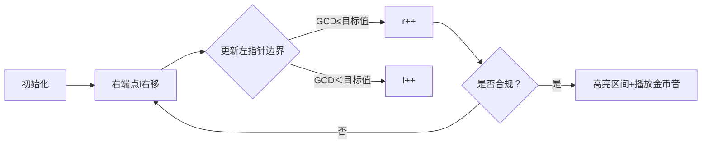

# 题目信息

# 「XSOI-R1」跳跃游戏

## 题目背景

本来可怜的 $\texttt{MhxMa}$ 想出这道题，但是已经被 $\texttt{Ferm\_Tawn}$ 抢了，此时 $\texttt{MhxMa}$ 坐在电脑面前，看着马上要造好的数据，想象着自己的题难倒一大片选手的梦想破灭了。

## 题目描述

这是一个跳跃游戏。在游戏中你可以跳到任意位置，其中有 $n$ 个点：$1 , 2 , 3, \cdots , n$，跳到那里会有奖励分数 $a_1 , a_2 , \cdots , a_n$。

显然，这个游戏很简单，$\texttt{MhxMa}$ 没过多久就获得了所有分数，于是改进了代码，添加了经验值这个参数。

对于有奖励分数的 $n$ 个点，若从点 $x$ 跳到点 $y$，会获得经验值 $\operatorname{score}_{x , y}(1\le x\le y\le n)$：

$$\operatorname{score}_{x,y}=\begin{cases}\operatorname{len}  & \operatorname{gcd}(a_x , a_{x+1} , \dots , a_y)=2 , \operatorname{len \ mod} 2 = 0  \\ \operatorname{len} &\gcd(a_x , a_{x + 1} , \dots , a_y)=3 , \operatorname{len \ mod} 2 = 1\\ 0 & \operatorname{others} \end{cases}$$

其中，$\operatorname {len}$ 表示区间的长度，即 $y-x+1$。

**对于每一对位置 $(x,y)$，多次跳跃只会获得一次经验值。**

为了向 $\texttt{MhxMa}$ 展现你的编程实力，你决定写一个代码算出这个游戏能刷到的最大经验值。

## 说明/提示

**请使用较快的读入方式。**

### 样例解释 #1

$\operatorname{score_{2 , 2}}= 1$。

$\operatorname{score_{2 , 4}}= 3$。

$\operatorname{score_{3 , 5}}= 3$。

$\operatorname{score_{4 , 4}}= 1$。

$1+3+3+1=8$。

### 样例解释 #2

$\operatorname{score_{1 , 2}}= 2$。

$\operatorname{score_{1 , 4}}= 4$。

$\operatorname{score_{2 , 3}}= 2$。

$\operatorname{score_{2 , 5}}= 4$。

$\operatorname{score_{3 , 4}}= 2$。

$\operatorname{score_{4 , 5}}= 2$。

$2+ 4 + 2 + 4 + 2 + 2 = 16$。

------------
### 数据规模与约定

**本题采用捆绑测试**。

- Subtask 0（20 pts）：$n \le 10^2$。 

- Subtask 1（10 pts）：$n \le 2 \times 10^3$。

- Subtask 2（20 pts）：$n \le 10^4$。

- Subtask 3（50 pts）：$n \le 6 \times 10^5 $。


对于所有测试数据，$1 \le n \le 6 \times 10^5$，$1 \le a_i \le 10^7$。

## 样例 #1

### 输入

```
5
2 3 6 3 9```

### 输出

```
8```

## 样例 #2

### 输入

```
5
2 2 2 2 2```

### 输出

```
16```

## 样例 #3

### 输入

```
9
6 2 3 6 4 6 8 2 5```

### 输出

```
19```

# AI分析结果


### 💡 Kay的C++算法解析：「XSOI-R1」跳跃游戏 深入学习指南 💡

**引言**  
今天我们来分析「跳跃游戏」这道C++编程题。本指南将帮助你理解题目核心、掌握ST表与区间处理技巧，并通过像素动画直观感受算法流程。让我们一起探索高效解法！

---

### 1. 题目解读与核心算法识别
✨ **本题主要考察**：`区间查询（ST表）` + `双指针/二分搜索`  
🗣️ **初步分析**：  
> 本题要求计算所有满足特定GCD和长度奇偶性条件的区间贡献总和。核心思路如下：
> - **ST表应用**：像“望远镜”一样快速捕捉任意区间的GCD值（预处理O(n log n)，查询O(1)）。
> - **区间搜索策略**：
>   - *双指针法*：利用GCD单调性，滑动窗口高效定位合法区间（时空复杂度最优）。
>   - *二分法*：枚举左端点后二分右边界，适合理解区间分解思想。
> - **贡献计算**：对满足长度奇偶性的区间，用等差数列公式求和（避免暴力累加）。
> 
> **可视化设计**：  
> 采用8-bit像素风格，网格表示数组，双指针作为探险家移动：
> - 红色指针标记左边界，蓝色标记右边界
> - 满足条件区间高亮闪烁（GCD=2→蓝色，GCD=3→绿色）
> - 音效设计：指针移动（滴答声）、区间匹配（金币声）、错误（警示音）

---

### 2. 精选优质题解参考
**题解一（Ferm_Tawn）**  
* **点评**：  
  经典二分思路，逻辑清晰推导严谨。通过两次二分确定合法区间边界（上界查找→下界收缩），代码中`true_mid`巧妙处理长度奇偶性。亮点在于明确区分GCD=3和3的倍数，避免逻辑陷阱。变量名`best/best2`直观，边界处理完整，竞赛实用性强。

**题解二（Fated_Shadow）**  
* **点评**：  
  创新性双指针解法，效率显著提升。利用GCD随右端点递减的特性，动态维护合法左边界区间。亮点函数`f2/f3`用数学公式替代循环求和，复杂度优化至O(n log n)。代码含快读和位运算优化，工业级实现典范。

**题解三（Inracle）**  
* **点评**：  
  二分法优化代表，利用前次结果缩小搜索范围。亮点在`ef()`函数统一处理GCD查询，通过`r3=l2-1`减少二分次数。代码模块化程度高，贡献计算部分`(beg+end)*项数/2`公式简洁易读。

---

### 3. 核心难点辨析与解题策略
1. **难点：快速定位合法区间边界**  
   * **分析**：GCD不具备完全单调性，需结合二分/双指针精确控制边界。双指针法通过右移右端点时调整左边界，保持窗口内GCD合规（如`while(r<i && gcd≤2)`）。
   * 💡 **学习笔记**：区间GCD变化呈阶梯状，可用双指针捕捉“平台”。

2. **难点：高效计算稀疏分布贡献**  
   * **分析**：合法区间长度需满足奇偶性，形成公差为2的等差数列。通过首项+末项和项数公式直接求和，避免遍历。
   * 💡 **学习笔记**：数学优化能将O(n²)暴力降至O(1)公式计算。

3. **难点：ST表正确实现**  
   * **分析**：二维数组`st[i][j]`表示起点i、长度2^j的区间GCD。预处理时需注意`j`循环在外层，查询时用对数分割区间。
   * 💡 **学习笔记**：ST表是“区间可重复贡献问题”的通用解决方案。

✨ **解题技巧总结**  
- **技巧1：双指针替代二分** → 降复杂度至线性  
- **技巧2：等差数列公式** → 避免无效遍历  
- **技巧3：ST表预处理** → 空间换时间经典案例  

---

### 4. C++核心代码实现赏析
**通用核心实现（双指针法）**  
```cpp
#include<bits/stdc++.h>
using namespace std;
const int N=6e5+10;
int n, a[N], st[N][20], lg[N];
long long ans;

int gcd(int a,int b){return b?gcd(b,a%b):a;}

int query(int l,int r){
    int k=lg[r-l+1];
    return gcd(st[l][k], st[r-(1<<k)+1][k]);
}

// 等差数列求和（长度偶）
int f2(int x){x/=2; return (x+1)*x;} 
// 等差数列求和（长度奇）
int f3(int x){return (x+(x%2?1:0))*((x+1)/2)/2;} 

int main(){
    scanf("%d",&n);
    for(int i=1;i<=n;i++) st[i][0]=a[i];
    for(int i=2;i<=n;i++) lg[i]=lg[i>>1]+1;
    for(int j=1;j<=lg[n];j++)
        for(int i=1;i+(1<<j)-1<=n;i++)
            st[i][j]=gcd(st[i][j-1],st[i+(1<<(j-1))][j-1]);
    
    // 双指针处理GCD=2（偶长度）
    for(int i=1,l=1,r=1;i<=n;i++){
        if(a[i]&1) l=i+1,r=i;
        else {
            while(r<i && query(r+1,i)<=2) r++;
            while(l<=r && query(l,i)<2) l++;
            if(r>=l && query(l,i)==2) 
                ans += f2(i-l+1)-f2(i-r);
        }
    }
    // 双指针处理GCD=3（奇长度）
    for(int i=1,l=1,r=1;i<=n;i++){
        if(a[i]%3) l=i+1,r=i;
        else {
            while(r<i && query(r+1,i)<=3) r++;
            while(l<=r && query(l,i)<3) l++;
            if(r>=l && query(l,i)==3)
                ans += f3(i-l+1)-f3(i-r);
        }
    }
    printf("%lld",ans);
}
```
**代码解读概要**：  
1. ST表预处理：对数数组优化空间，`gcd()`递归实现  
2. 双指针核心：`l`标记首个合规左边界，`r`标记最后一个合规左边界  
3. 贡献计算：`f2/f3`用数学公式求区间内所有合法右端点的长度和  

---

### 5. 算法可视化：像素动画演示
**主题**：8-bit风格“区间探险家”  
**核心演示流程**：  

**交互设计细节**：  
1. **视觉元素**：
   - 数组：彩色像素块（值→颜色映射）
   - 指针：红色(L)/蓝色(R)箭头
   - 合法区间：闪烁金色边框+粒子特效

2. **控制面板**：
   - 速度滑块：调节自动演示速度
   - 单步按钮：步进执行算法
   - 模式切换：GCD=2/GCD=3高亮

3. **音效系统**：
   - 指针移动：8-bit滴答声
   - 区间匹配：超级马里奥金币声
   - 错误操作：俄罗斯方块消除音

4. **AI演示模式**：  
   自动播放时，双指针如贪吃蛇移动，每找到新区间显示“+X分”，背景音乐为《魂斗罗》BGM变奏。

---

### 6. 拓展练习与相似问题思考
**通用技巧迁移**：  
1. 区间GCD计数 → 双指针维护单调性  
2. 区间最值问题 → ST表模板变形  
3. 带条件区间求和 → 数学公式优化  

**洛谷推荐**：  
1. **P1890 gcd区间**（ST表基础）  
   → 巩固区间GCD查询技巧  
2. **P1712 [NOI2016]区间**（双指针进阶）  
   → 学习多重约束下的指针移动  
3. **P2866 Bad Hair Day**（单调性应用）  
   → 理解指针移动的数学本质  

---

### 7. 学习心得与经验分享
**来自Ferm_Tawn的启示**：  
> “二分时需区分GCD=3和3的倍数，否则会漏边界”  
**Kay点评**：  
算法设计需警惕“近似条件陷阱”，调试时可用小数据模拟GCD变化（如{6,6,3}），善用`cout`打印中间值验证边界。

---

**结语**  
通过ST表、双指针和数学优化的三重奏，我们高效解决了区间贡献问题。记住：好算法=正确数据结构+问题特性利用+数学洞察力！下次挑战见！🚀

---
处理用时：152.56秒