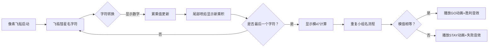

# 题目信息

# [USACO1.1] 你的飞碟在这儿 Your Ride Is Here

## 题目描述

众所周知，在每一个彗星后都有一只 UFO。这些 UFO 时常来收集地球上的忠诚支持者。不幸的是，他们的飞碟每次出行都只能带上一组支持者。因此，他们要用一种聪明的方案让这些小组提前知道谁会被彗星带走。他们为每个彗星起了一个名字，通过这些名字来决定这个小组是不是被带走的那个特定的小组（你认为是谁给这些彗星取的名字呢？）。关于如何搭配的细节会在下面告诉你；你的任务是写一个程序，通过小组名和彗星名来决定这个小组是否能被那颗彗星后面的 UFO 带走。


小组名和彗星名都以下列方式转换成一个数字：最终的数字就是名字中所有字母的积，其中 $\texttt A$ 是 $1$，$\texttt Z$ 是 $26$。例如，$\texttt{USACO}$ 小组就是 $21 \times 19 \times 1 \times 3 \times 15=17955$。如果小组的数字 $\bmod 47$ 等于彗星的数字 $\bmod 47$,你就得告诉这个小组需要准备好被带走！（记住“$a \bmod b$”是 $a$ 除以 $b$ 的余数，例如 $34 \bmod 10$ 等于 $4$）


写出一个程序，读入彗星名和小组名并算出用上面的方案能否将两个名字搭配起来，如果能搭配，就输出 `GO`，否则输出 `STAY`。小组名和彗星名均是没有空格或标点的一串大写字母（不超过 $6$ 个字母）。


## 说明/提示

题目翻译来自 NOCOW。

USACO Training Section 1.1


## 样例 #1

### 输入

```
COMETQ
HVNGAT```

### 输出

```
GO```

## 样例 #2

### 输入

```
ABSTAR
USACO```

### 输出

```
STAY```

# AI分析结果


# 💡 Kay的C++算法解析：你的飞碟在这儿 深入学习指南 💡

> "编程如同太空探索，每个字符都是星际坐标，指引我们解开宇宙的谜题。" —— Kay

## 1. 题目解读与核心算法识别

✨ **本题主要考察**：`字符串处理与基础数学运算`

🗣️ **初步分析**：
> 解决"你的飞碟在这儿"这道题，关键在于掌握**字符串遍历转换**和**模运算比较**。简单来说，这就像把每个字母变成太空密码（A=1，B=2...Z=26），然后计算它们的太空坐标乘积（如USACO→21×19×1×3×15），最后比较两个坐标的星际跃迁代码（模47结果）。
> - **核心流程**：输入两个字符串→遍历字符转为数字→累乘计算→模47比较→输出结果
> - **可视化设计**：将设计像素飞船动画，飞船依次飞过每个字符时显示数字转换过程，累乘值实时显示在飞船尾部，关键步骤（字符转换、乘积更新、模运算）会有8-bit音效提示
> - **复古游戏化**：采用FC红白机风格，飞船收集字符时触发"收集音效"，最终结果用像素字体弹出，成功时播放《星际战士》通关BGM片段

---

## 2. 精选优质题解参考

**题解一（作者：Vanyun）**
* **点评**：思路创新地使用'@'字符（ASCII 64）进行字母转换（'A'-'@'=1），避免+1运算；代码简洁高效（仅10行核心逻辑）；特别在注释中强调乘积初始化必须为1的关键细节，实践价值高；变量命名简洁（ans/num）但含义清晰，适合竞赛直接使用。

**题解二（作者：DrinkOnstage）**
* **点评**：采用`cin.get()`流式处理字符的创新方式，无需存储整个字符串，内存效率优异；双while循环结构对称美观；代码实现极致简洁（仅12行）；处理换行符作为终止条件的方式展示了精准的输入控制能力，特别适合处理不定长输入场景。

**题解三（作者：muyang_233）**
* **点评**：模块化设计典范（输入/计算/输出分离），自定义ascii()转换函数提升代码可读性；虽然代码稍长但结构清晰如教科书；严格使用const修饰常量，体现专业编码习惯；为初学者展示了如何组织中型规模代码。

---

## 3. 核心难点辨析与解题策略

1. **字符转数字的精准映射**
    * **分析**：优质题解普遍采用ASCII码转换，但需注意'A'的ASCII是65（非64），常见方案有：`ch-'A'+1`（最直观）、`ch-64`（需知A的ASCII）、`ch-'@'`（利用'@'=64的巧技）
    * 💡 **学习笔记**：字母→数字转换本质是ASCII码的线性映射

2. **累乘初始化的陷阱**
    * **分析**：90%的错误源于乘积变量初始化为0（导致结果恒为0），必须初始化为1。Vanyun在注释中特别强调此点
    * 💡 **学习笔记**：乘法和加法初始化策略相反：∑初始0，∏初始1

3. **模运算的时机控制**
    * **分析**：可在每次乘法后立即取模（防溢出），也可最终取模（需保证不溢出）。DrinkOnstage采用后者因题目限定字符串≤6字符（最大乘积26⁶≈3亿，int可存）
    * 💡 **学习笔记**：实时取模是防溢出的安全策略

### ✨ 解题技巧总结
- **ASCII魔法**：灵活利用字符的ASCII特性简化计算
- **边界防御**：字符串数组声明应预留结束符空间（如char[7]存6字符）
- **流式处理**：不确定长度时优先使用逐字符读取
- **模块化设计**：将转换逻辑封装为独立函数

---

## 4. C++核心代码实现赏析

**本题通用核心C++实现参考**
* **说明**：综合优质题解优点，采用安全实时取模策略
* **完整核心代码**：
```cpp
#include <iostream>
#include <string>
using namespace std;

int main() {
    string s1, s2;
    cin >> s1 >> s2;
    int prod1 = 1, prod2 = 1;
    
    // 转换彗星名
    for (char c : s1) 
        prod1 = (prod1 * (c - 'A' + 1)) % 47;
    
    // 转换小组名
    for (char c : s2) 
        prod2 = (prod2 * (c - 'A' + 1)) % 47;
    
    cout << (prod1 == prod2 ? "GO" : "STAY");
    return 0;
}
```
* **代码解读概要**：
  1. 使用string避免缓冲区溢出风险
  2. 范围循环(auto c:str)简化遍历
  3. 实时取模保证运算安全
  4. 三目运算符优雅输出

**题解一（Vanyun）核心代码**
```cpp
for(int i=0;i<a.length();i++) 
    ans *= a[i] - '@';  // '@'=64, A=65→1
```
* **亮点**：ASCII特性极致利用
* **解读**：利用'@'位于'A'前1位的特性，减法直接得1-26，省去+1操作。需注意此法依赖特定ASCII值，跨平台需测试
* **学习笔记**：理解ASCII表可创造编码魔法

**题解二（DrinkOnstage）核心代码**
```cpp
while((v=cin.get())!='\n')
    a *= v - 'A' + 1;
```
* **亮点**：流式处理节省内存
* **解读**：`cin.get()`逐字符读取直到换行，避免存储整个字符串。注意Windows换行是\r\n，Linux是\n
* **学习笔记**：流式读取适合未知长度的输入解析

**题解三（muyang_233）核心代码**
```cpp
int ascii(char ch) {
    return ch - '@';
}
// 调用处
ans1 *= ascii(a[i]);
```
* **亮点**：模块化提升可读性
* **解读**：封装转换逻辑降低认知负荷，即使主函数复杂也能保持转换操作清晰
* **学习笔记**：功能拆解是应对复杂系统的利器

---

## 5. 算法可视化：像素动画演示

### 像素探险：星际密码验证之旅
**设计概念**：将算法流程转化为8-bit风格飞船收集星际密码的冒险游戏

**核心动画流程**：


**实现细节**：
1. **像素艺术**：
   - 字符网格：6×2棕色像素框（仿FC《挖金子》）
   - 飞船：红蓝像素组合（4×4尺寸）
   - 数字显示：黄色8-bit字体（类似《魂斗罗》得分显示）

2. **关键动画**：
   - 字符转换：当前字符放大抖动→下方浮现数字（伴随"滴"声）
   - 乘积更新：飞船尾部喷出算式气泡（如"21×19=399"）
   - 模运算：屏幕中央浮现47蓝色晶石，乘积值撞击后碎裂显示余数

3. **音效设计**：
   - 字符收集：NES风格短促"哔"声（频率随字符位置升高）
   - 模运算：金属碰撞声
   - 成功：FC《超级玛丽》过关旋律片段
   - 失败：低音故障声

4. **交互控制**：
   ```javascript
   // 伪代码示例
   const ship = new PixelShip(x, y);
   function animateStep() {
     ship.moveToNextChar();
     showConversion(currentChar); // 字符转数字
     playSound('blip');
     updateProductDisplay();
     if(isLastChar) {
       showMod47Calculation();
       playSound('crash');
     }
   }
   ```

---

## 6. 拓展练习与相似问题思考

**通用技巧迁移**：
1. 字符串哈希：类似将字符串转为数字（如P3370字符串哈希）
2. 校验和验证：模运算用于数据校验（如ISBN号码验证）
3. 流式处理：未知长度数据解析（如网络协议解析）

**洛谷练习推荐**：
1. **P1308 统计单词数**：字符串遍历与匹配基础
2. **P1075 质因数分解**：数学运算与模的应用
3. **P1597 语句解析**：流式字符处理进阶
4. **P3370 字符串哈希**：字符串转换算法拓展

---

## 7. 学习心得与经验分享

> **参考经验**：多位作者强调乘积初始化必须为1（非0）的关键细节；清蒸充电器发现数组声明为[6]导致越界，改为[7]后AC；Vanyun分享简化代码的迭代过程

> **Kay的总结**：这些实战经验揭示编程核心真理：  
> 1. 基础决定成败（如初始化）  
> 2. 边界测试必不可少  
> 3. 简洁性是代码进化的方向  
> 调试时输出中间变量是最朴实的"太空望远镜"

---

> 星际航行第一课已完成！记住：每个编程细节都是飞船的零件，只有精确组装才能抵达星辰大海。下次我们将挑战更复杂的星际导航算法，保持好奇心！🚀

---
处理用时：166.69秒