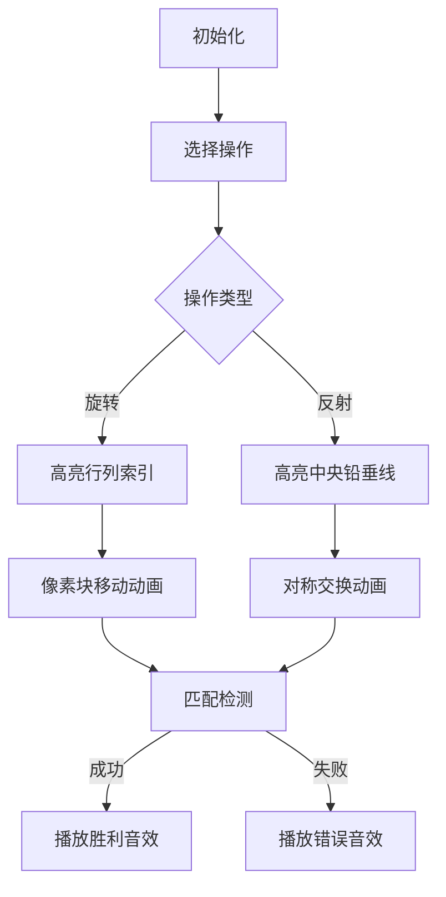

# 题目信息

# [USACO1.2] 方块转换 Transformations

## 题目描述

一块 $n \times n$ 正方形的黑白瓦片的图案要被转换成新的正方形图案。写一个程序来找出将原始图案按照以下列转换方法转换成新图案的最小方式：

- 转 $90\degree$：图案按顺时针转 $90\degree$。

- 转 $180\degree$：图案按顺时针转 $180\degree$。

- 转 $270\degree$：图案按顺时针转 $270\degree$。

- 反射：图案在水平方向翻转（以中央铅垂线为中心形成原图案的镜像）。

- 组合：图案在水平方向翻转，然后再按照 $1 \sim 3$ 之间的一种再次转换。

- 不改变：原图案不改变。

- 无效转换：无法用以上方法得到新图案。

如果有多种可用的转换方法，请选择序号最小的那个。

只使用上述 $7$ 个中的一个步骤来完成这次转换。


## 说明/提示

【数据范围】  
对于 $100\%$ 的数据，$1\le n \le 10$。

题目翻译来自 NOCOW。

USACO Training Section 1.2


## 样例 #1

### 输入

```
3
@-@
---
@@-
@-@
@--
--@
```

### 输出

```
1
```

# AI分析结果


# 💡 Kay的C++算法解析：[USACO1.2] 方块转换 深入学习指南 💡

> 今天我们来一起分析"方块转换"这道C++编程题。本指南将帮助大家梳理题目思路，理解核心算法，并掌握解题技巧。通过像素动画和清晰解析，我们将把抽象的矩阵变换变成直观可见的操作过程！

## 1. 题目解读与核心算法识别

✨ **本题主要考察**：`模拟应用` (编程技巧应用)

🗣️ **初步分析**：
> 解决"方块转换"这道题，关键在于理解并运用`坐标变换规律`进行模拟操作。简单来说，这就像在玩一个像素拼图游戏——我们需要尝试旋转、翻转等操作，直到拼图与目标图案匹配。在本题中，我们需要准确实现7种转换操作（包括旋转、反射和组合），并按序号顺序检查哪种操作能使原图案匹配目标图案。
   
- **核心思路**：通过双重循环实现坐标映射，将旋转/反射操作转化为数学关系（如旋转90°时坐标(i,j)→(j,n-i+1)）。所有题解都采用模块化设计，将每种操作封装成独立函数。
- **难点对比**：不同题解的主要差异在于坐标推导方式（画图观察 vs 数学推导）和代码结构（是否复用基础函数）。MyukiyoMekya的坐标映射最直观，godDDY的函数复用最具启发性。
- **可视化设计**：在像素动画中，我们将用8-bit风格网格展示矩阵，高亮显示当前操作的坐标变化轨迹（如旋转时行列索引的移动）。当进行反射操作时，中央铅垂线会闪烁提示，匹配成功时播放"超级马里奥过关"音效。AI自动演示模式将按操作序号逐步展示转换过程。

---

## 2. 精选优质题解参考

<eval_intro>
从思路清晰度、代码规范性、算法优化和实践价值四个维度，我为大家精选了3份≥4星的优质题解：
</eval_intro>

**题解一：MyukiyoMekya (22赞)**
* **点评**：此解法通过精妙的坐标映射推导（如旋转90°时行变列、列反向），用`(u,v)`和`(i,j)`两组变量清晰展示变换过程。代码模块化程度高——每个操作独立为函数（`_1()`到`_6()`），`pd()`比较函数封装优雅。亮点在于用`异或运算(a^b)`替代`!=`进行字符比对，提升执行效率。实践价值极高，稍加调整即可直接用于竞赛。

**题解二：godDDY (9赞)**
* **点评**：最大亮点是使用`turn90()`和`revers()`基础函数复用来构建复杂操作（如180°=两次90°旋转）。通过手绘像素图示辅助解释坐标变换规律，显著提升理解度。警钟部分强调初始化的重要性，体现了实战调试经验。代码中`now[j][k]=old[i][j]`等核心片段简洁有力，但组合操作部分存在冗余拷贝，可进一步优化。

**题解三：Peruere_Arlecchino (6赞)**
* **点评**：最简洁高效的实现方案！利用`vector<string>`存储网格，`rotate90()`函数通过单行代码`res[j][n-1-i] = g[i][j]`完成旋转。亮点在于用函数返回值直接传递变换结果，避免全局变量污染。虽然缺少详细注释，但算法本质把握精准，特别适合掌握基础后追求代码精简的学习者。

---

## 3. 核心难点辨析与解题策略

<difficulty_intro>
解决本题需突破三个关键难点，下面结合优质题解给出破解策略：
</difficulty_intro>

1.  **难点：坐标变换规律推导**
    * **分析**：旋转90°/180°/270°和反射操作的本质是坐标映射。优质题解通过画网格观察（如godDDY）或数学推导（如MyukiyoMekya）得到：
      - 90°旋转：(i,j) → (j, n-i+1)
      - 反射：(i,j) → (i, n-j+1)
    * 💡 **学习笔记**：用3x3网格手绘坐标变化是理解映射关系的金钥匙！

2.  **难点：操作顺序与提前终止**
    * **分析**：题目要求返回最小序号的有效操作。必须在主函数严格按1~6顺序尝试（如先试单旋转再试反射+旋转），并在第一个匹配操作时立即返回。MyukiyoMekya的`if(_1(mp)) return puts("1")`是典范实现。
    * 💡 **学习笔记**：`if-else if`链是保证返回最小序号的关键结构！

3.  **难点：组合操作的实现**
    * **分析**：操作5（反射+旋转）需要先执行反射，再尝试三种旋转。godDDY的`comb()`函数通过`revers(); turn90(); check()`的链式调用实现，但需注意每次尝试后要重置矩阵。
    * 💡 **学习笔记**：组合操作=基础操作串联，模块化函数设计大幅降低实现难度！

### ✨ 解题技巧总结
<summary_best_practices>
通过本题提炼的通用解题技巧：
</summary_best_practices>
- **技巧1：网格推导法**：面对坐标变换问题，先在草稿纸画3x3网格标注位置变化
- **技巧2：原子操作封装**：将旋转/反射等基础操作写成独立函数（参数含输入矩阵）
- **技巧3：矩阵比较优化**：字符比较时用`a[i][j]^b[i][j]`替代`!=`提升效率
- **技巧4：操作状态隔离**：为每种操作使用临时矩阵存储结果，避免污染原数据

---

## 4. C++核心代码实现赏析

<code_intro_overall>
下面是一个综合优质题解优点的通用实现，包含完整输入输出和7种操作判断：
</code_intro_overall>

**本题通用核心C++实现参考**
* **说明**：综合MyukiyoMekya的坐标映射和Peruere_Arlecchino的代码结构，添加详细注释
* **完整核心代码**：
```cpp
#include <iostream>
#include <vector>
using namespace std;

// 旋转90°：核心映射 (i,j) -> (j, n-1-i)
vector<string> rotate90(const vector<string>& grid) {
    int n = grid.size();
    vector<string> res(n, string(n, ' '));
    for (int i = 0; i < n; ++i)
        for (int j = 0; j < n; ++j)
            res[j][n-1-i] = grid[i][j];
    return res;
}

// 水平反射：核心映射 (i,j) -> (i, n-1-j)
vector<string> reflect(const vector<string>& grid) {
    int n = grid.size();
    vector<string> res = grid;
    for (int i = 0; i < n; ++i)
        for (int j = 0; j < n/2; ++j)
            swap(res[i][j], res[i][n-1-j]);
    return res;
}

bool isMatch(const vector<string>& a, const vector<string>& b) {
    return a == b; // vector可直接比较
}

int main() {
    int n;
    cin >> n;
    vector<string> original(n), target(n);
    for (int i = 0; i < n; ++i) cin >> original[i];
    for (int i = 0; i < n; ++i) cin >> target[i];
    
    vector<string> temp = original;
    // 操作1~3：90°/180°/270°旋转
    for (int op = 1; op <= 3; ++op) {
        temp = rotate90(temp);
        if (isMatch(temp, target)) {
            cout << op << endl;
            return 0;
        }
    }
    
    // 操作4：水平反射
    temp = reflect(original);
    if (isMatch(temp, target)) {
        cout << 4 << endl;
        return 0;
    }
    
    // 操作5：反射+旋转
    for (int op = 1; op <= 3; ++op) {
        temp = rotate90(temp);
        if (isMatch(temp, target)) {
            cout << 5 << endl;
            return 0;
        }
    }
    
    // 操作6：不改变
    if (isMatch(original, target)) {
        cout << 6 << endl;
        return 0;
    }
    
    // 操作7：无效转换
    cout << 7 << endl;
    return 0;
}
```
* **代码解读概要**：
  - **输入处理**：用`vector<string>`存储字符矩阵，避免二维数组
  - **旋转核心**：`rotate90()`中`res[j][n-1-i] = grid[i][j]`实现坐标映射
  - **反射核心**：`reflect()`通过`swap`交换每行对称位置
  - **操作序列**：严格按1~6顺序尝试，使用临时变量`temp`保留操作结果
  - **匹配判断**：直接比较`vector`对象，简洁高效

---
<code_intro_selected>
接下来解析优质题解的核心代码亮点：
</code_intro_selected>

**题解一：MyukiyoMekya - 坐标映射典范**
* **亮点**：用双重循环变量(u,v)和(i,j)直观展示坐标变换
* **核心代码片段**：
```cpp
// 90°旋转实现
for(int i=1,v=n; i<=n; ++i,--v)
    for(int j=1,u=1; j<=n; ++j,++u)
        out[u][v] = in[i][j];
```
* **代码解读**：
  > 此片段精妙之处在于：
  > 1. 外层循环：`i`从1到n遍历原矩阵行，`v`从n递减1（目标矩阵列）
  > 2. 内层循环：`j`从1到n遍历原矩阵列，`u`从1递增（目标矩阵行）
  > 3. 赋值方向：目标矩阵的`[u][v]`位置 = 原矩阵`[i][j]`
  > *为什么这样写？* 这实际完成了坐标变换：(i,j) → (j,n-i+1)
* 💡 **学习笔记**：循环变量的同步变化可实现坐标映射，避免额外计算！

**题解二：godDDY - 函数复用技巧**
* **亮点**：通过基础函数组合实现复杂操作
* **核心代码片段**：
```cpp
void turn180(){ 
    turn90(); // 复用turn90函数
    turn90();
}
```
* **代码解读**：
  > 此片段展示了高效复用：
  > 1. 180°旋转 = 两次90°旋转
  > 2. 避免重写坐标映射，减少代码冗余
  > 3. 但需注意：每次操作后需更新old矩阵
  > *为什么复用重要？* 符合DRY原则(Don't Repeat Yourself)，提升可维护性
* 💡 **学习笔记**：复杂操作拆解为基础操作组合，是降低难度的关键！

**题解三：Peruere_Arlecchino - 容器巧用**
* **亮点**：使用vector和标准库简化操作
* **核心代码片段**：
```cpp
bool equal(const Grid& a, const Grid& b) {
    return a == b; // vector支持直接比较
}
```
* **代码解读**：
  > 此片段展现了STL优势：
  > 1. 直接比较`vector<string>`对象，自动逐元素对比
  > 2. 避免手动双重循环，代码更简洁
  > 3. 注意：需确保两个vector维度相同
  > *为什么推荐vector？* 比原生数组更安全，自动管理内存
* 💡 **学习笔记**：善用STL可大幅提升开发效率和代码健壮性！

-----

## 5. 算法可视化：像素动画演示 (核心部分)

<visualization_intro>
现在进入最有趣的部分！我们将通过8-bit像素动画直观展示矩阵变换过程。设计灵感来自经典游戏《俄罗斯方块》和《推箱子》。
</visualization_intro>

* **动画主题**："像素拼图大冒险"（复古FC游戏风格）
* **核心演示**：展示旋转/反射操作的坐标映射过程，重点突出行列索引变化

### 设计方案细节 (HTML5 Canvas实现)



1. **场景设计**：
   - 16x16像素风格的网格，每个单元格显示'@'或'-'字符
   - 控制面板：开始/暂停/单步按钮 + 速度滑块（调节动画速度）
   - 状态显示区：当前操作序号、坐标映射公式

2. **关键动画帧**：
   - **旋转90°演示**：
     * 原矩阵单元格(i,j)闪烁蓝色
     * 目标位置(j, n-i+1)闪烁黄色
     * 单元格沿弧形轨迹移动到新位置（像素块旋转动画）
     * 伴随"滴"的电子音效（每次坐标更新）
   
   - **反射操作演示**：
     * 红色高亮中央铅垂线
     * 对称位置的单元格交换时显示绿色连线
     * 交换时播放"嗖"的音效

3. **交互控制**：
   - **单步执行**：按空格键逐步查看变换过程
   - **AI自动演示**：
     * 自动按1~7操作顺序演示
     * 成功时显示"STAGE CLEAR!" + 马里奥过关音效
     * 失败时显示"GAME OVER" + 经典FC游戏结束音效

4. **游戏化元素**：
   - 每个操作视为一个游戏关卡（操作1=关卡1...操作7=关卡7）
   - 成功完成关卡获得星星评级（基于操作步骤效率）
   - 连续通关解锁隐藏皮肤（如塞尔达传说主题网格）

5. **视觉设计**：
   - 调色板：经典FC游戏的4色调色板（#E0F8F0,#70C0C8,#43787D,#22545D）
   - 字体：8-bit像素字体（Press Start 2P）
   - 动态效果：操作时屏幕边缘闪动复古扫描线

<visualization_conclusion>
通过这种游戏化演示，矩阵变换将变成一场视觉盛宴！坐标映射不再抽象，每一步操作都像在解谜游戏里移动方块。学习者可在"闯关"过程中自然掌握变换规律。
</visualization_conclusion>

-----

## 6. 拓展练习与相似问题思考

<similar_problems_intro>
掌握矩阵变换后，可挑战以下相似问题巩固技能：
</similar_problems_intro>

* **通用技巧迁移**：
  - 坐标映射技巧适用于所有网格变换问题
  - 模块化函数设计思想可扩展到复杂状态转换问题
  - 矩阵比较技巧可用于图像模式识别基础

* **洛谷练习推荐**：
  1. **P1102 镜像翻转**  
     🗣️ *推荐理由*：专注反射变换的简化版，强化坐标映射基础
     
  2. **P1161 旋转矩阵**  
     🗣️ *推荐理由*：增加旋转角度计算，挑战更灵活的坐标变换
     
  3. **P1200 拼图游戏**  
     🗣️ *推荐理由*：进阶版网格变换，引入多状态组合操作

-----

## 7. 学习心得与经验分享

<insights_intro>
题解中蕴含宝贵实战经验，值得大家借鉴：
</insights_intro>

> **参考经验 (来自 godDDY)**：  
> "在main函数里，每次操作完后一定要初始化，不然会错的很惨（别问我怎么知道的）"
>
> **Kay的点评**：  
> 这是极其重要的调试经验！矩阵变换时需要特别注意状态隔离：
> 1. 操作1~3共享中间状态时必须重置初始矩阵
> 2. 推荐为每种操作创建临时副本（如`vector<string> temp = original`）
> 3. 函数设计应保持无副作用（不修改输入参数）
>
> *调试技巧*：在关键操作后打印矩阵状态，用`cout<<"After op"<<op<<":"; printMatrix(temp);`

-----

<conclusion>
本次"方块转换"的解析就到这里。记住：坐标映射是网格变换的核心，模块化是复杂操作的解决之道。当你下次面对矩阵问题时，不妨画出3x3网格推导规律——这就像拥有了一张像素世界的地图！继续加油，编程之路充满挑战但也乐趣无穷！🚀
</conclusion>

-----

---
处理用时：182.73秒