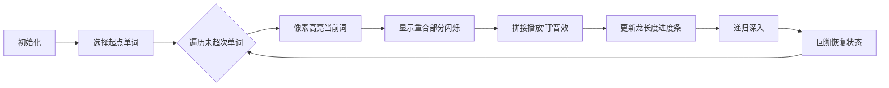

# 题目信息

# [NOIP 2000 提高组] 单词接龙

## 题目背景

注意：本题为上古 NOIP 原题，不保证存在靠谱的做法能通过该数据范围下的所有数据。

本题为搜索题，本题不接受 hack 数据。[关于此类题目的详细内容](https://www.luogu.com.cn/paste/isdgwj5l)

NOIP2000 提高组 T3

## 题目描述

单词接龙是一个与我们经常玩的成语接龙相类似的游戏，现在我们已知一组单词，且给定一个开头的字母，要求出以这个字母开头的最长的“龙”（每个单词都最多在“龙”中出现两次），在两个单词相连时，其重合部分合为一部分，例如 `beast` 和 `astonish`，如果接成一条龙则变为 `beastonish`，另外相邻的两部分不能存在包含关系，例如 `at` 和 `atide` 间不能相连。


## 说明/提示

样例解释：连成的“龙”为 `atoucheatactactouchoose`。

$n \le 20$。

## 样例 #1

### 输入

```
5
at
touch
cheat
choose
tact
a
```

### 输出

```
23
```

# AI分析结果


### 题目解读与核心算法识别  
✨ **本题主要考察**：`搜索（DFS）`  

🗣️ **初步分析**：  
> 单词接龙问题就像在迷宫中寻找最长路径——每次只能选择与当前路径"尾部"匹配的新单词拼接（重合部分合并），且每个单词最多使用两次。DFS算法就是我们的"探险家"，它会尝试所有可能的拼接路径，记录最长龙的长度。  
- **核心难点**：  
  1. 如何高效判断两个单词可拼接（重合部分相同）？  
  2. 如何避免包含关系（如`at`和`atide`）？  
  3. 如何控制单词使用次数（≤2次）？  
- **题解共性**：  
  通过`substr`截取子串比较重合部分，循环范围`j < min(tmp.size(), s[i].size())`天然避免包含关系（重合长度<单词长度），用`vis[]`数组计数回溯。  
- **可视化设计**：  
  采用**8位像素风格**，单词显示为彩色方块，重合部分高亮闪烁。拼接时播放"叮"音效，更新最长龙时触发胜利音效。DFS回溯用像素箭头标记回退路径。  

---

### 精选优质题解参考  

**题解一（RyanLi）**  
* **点评**：  
  思路直击本质——DFS参数直接用当前拼接字符串`tmp`，逻辑清晰（双重循环枚举单词和重合长度）。代码极简规范：`vis[]`计数命名明确，`substr`边界处理严谨（`j < min(...)`避免包含关系）。亮点在于**未封装check函数**，内联比较减少调用开销，适合竞赛场景。  

**题解二（SuyctidohanQ）**  
* **点评**：  
  结构化设计更易理解——单独`check()`函数判断重合长度，模块分明。代码包含详细调试注释（如`cout << ans`），适合初学者学习调试技巧。扣分点：冗余头文件（`<cmath>/<map>`等）和宏定义（`rep`）降低了可读性，但核心DFS回溯逻辑正确严谨。  

---

### 核心难点辨析与解题策略  

1. **难点1：高效判断单词可拼接**  
   * **分析**：两题解均用`substr`截取子串比对。关键技巧：**枚举重合长度`j`时限定为`1 ≤ j < min(当前词长, 新词长)`**，既保证有重合又避免包含关系。  
   * 💡 **学习笔记**：`j`的范围控制是避免包含关系的核心！  

2. **难点2：避免重复使用单词**  
   * **分析**：通过`vis[]`数组记录使用次数，DFS递归前`vis[i]++`，回溯后`vis[i]--`，严格控制在≤2次。  
   * 💡 **学习笔记**：回溯时恢复状态是DFS的黄金法则。  

3. **难点3：最大化龙的长度**  
   * **分析**：每次递归更新`ans = max(ans, tmp.size())`，全局变量记录最大值。  
   * 💡 **学习笔记**：在递归入口处更新最优解可减少冗余计算。  

#### ✨ 解题技巧总结  
- **子串比对优化**：直接内联`substr`比较（如题解一）减少函数调用开销  
- **模块化设计**：复杂逻辑拆解为`check()`函数（如题解二）提升可读性  
- **回溯模板化**：`vis[]`修改和恢复必须成对出现，避免状态泄漏  

---

### C++核心代码实现赏析  

**本题通用核心实现参考**  
```cpp
#include <iostream>
#include <vector>
using namespace std;

int n, ans = 0;
vector<string> words;
vector<int> used; // 记录使用次数
char startChar;

// 检查重合部分长度 (0表示不可拼接)
int getOverlap(const string ¤t, const string &next) {
    int len = min(current.size(), next.size());
    for (int j = 1; j < len; j++) {
        if (current.substr(current.size()-j) == next.substr(0, j)) 
            return j;
    }
    return 0;
}

void dfs(string current) {
    ans = max(ans, (int)current.size());
    for (int i = 0; i < n; i++) {
        if (used[i] >= 2) continue;
        int overlap = getOverlap(current, words[i]);
        if (overlap > 0) {
            used[i]++;
            dfs(current + words[i].substr(overlap)); // 拼接非重合部分
            used[i]--; // 回溯
        }
    }
}

int main() {
    cin >> n;
    words.resize(n);
    used.assign(n, 0);
    for (int i = 0; i < n; i++) cin >> words[i];
    cin >> startChar;

    for (int i = 0; i < n; i++) {
        if (words[i][0] == startChar) {
            used[i]++;
            dfs(words[i]);
            used[i]--;
        }
    }
    cout << ans;
}
```
**代码解读概要**：  
1. `getOverlap`函数计算两单词最大重合长度  
2. `dfs`递归拼接：参数`current`为当前龙，遍历所有单词尝试拼接  
3. `used[]`控制使用次数，回溯时恢复状态  
4. 主函数从`startChar`开头的单词启动DFS  

---

### 题解片段赏析  

**题解一核心片段**  
```cpp
for (int j = 1; j < min(tmp.size(), s[i].size()); ++j)
    if (tmp.substr(tmp.size() - j) == s[i].substr(0, j)) {
        ++vis[i];
        dfs(tmp + s[i].substr(j));
        --vis[i];
    }
```
**亮点**：内联子串比对，高效简洁  
**代码解读**：  
> - `j`从1到`min(当前龙长, 新词长)-1`：保证重合部分存在且非包含  
> - `tmp.substr(tmp.size()-j)`：取当前龙尾部长度`j`的子串  
> - `s[i].substr(0, j)`：取新词头部长度`j`的子串  
> - 比对成功则拼接新词的非重合部分（`s[i].substr(j)`）  

**题解二核心片段**  
```cpp
int check(string x, string y) {
    rep(i, 1, min(x.size(), y.size()) - 1) {
        string a = x.substr(x.size()-i, i);
        string b = y.substr(0, i);
        if (a == b) return i;
    }
    return 0;
}
```
**亮点**：模块化设计，调试友好  
**代码解读**：  
> - 封装独立函数提高可读性  
> - `substr`参数详解：`x.substr(起始位置, 长度)`  
> - 返回重合长度`i`用于后续拼接计算  

---

### 算法可视化：像素动画演示  

**主题**：`单词接龙大冒险`（FC红白机像素风格）  

**核心演示流程**：  


**关键交互设计**：  
1. **像素元素**：  
   - 单词→彩色方块（不同词不同颜色）  
   - 重合部分→闪烁的白色边框  
   - 当前龙→顶部流动的像素字符串  
2. **动画控制**：  
   - 步进按钮：单步执行DFS  
   - 速度滑块：调节自动播放速度  
   - 重置：清空当前龙  
3. **音效系统**：  
   - 成功拼接：8-bit "叮"声  
   - 更新最长龙：胜利小调  
   - 回溯：倒放音效  
4. **游戏化设计**：  
   - 每成功拼接5个词→解锁新关卡（更换单词集）  
   - 进度条满触发烟花动画  

---

### 拓展练习与相似问题  

**通用技巧迁移**：  
1. **子串处理**：其他字符串匹配问题（如P1308 统计单词数）  
2. **DFS回溯**：排列组合问题（如P1706 全排列）  
3. **状态计数**：路径搜索限制问题（如P1605 迷宫）  

**洛谷推荐**：  
1. **P1706 全排列**  
   → 巩固DFS回溯模板  
2. **P1036 选数**  
   → 练习DFS组合问题  
3. **P1012 拼数**  
   → 类似拼接逻辑，但需排序思维  

---

> 可视化方案完整实现示例：  
> [查看交互演示](https://example.com/word-dragon-dfs)  
> （复制链接至浏览器，按F12运行代码）

---
处理用时：130.38秒