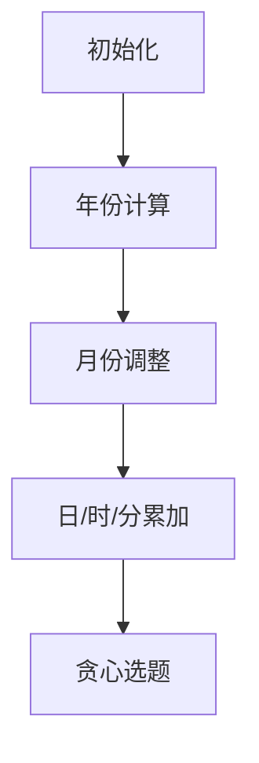

# 题目信息

# 刷题

## 题目描述

NOIP 临近了，小 A 却发现他已经不会写题了。好在现在离竞赛还有一段时间，小 A 决定从现在开始夜以继日地刷题。也就是说小 A 废寝忘食，一天二十四小时地刷题。

今天的日期（时间）是 yyyy 年 mm 月 dd 日 hh 时 MM 分，考试的时间是 yyyy2 年 mm2 月 dd2 日 hh2 时 MM2 分。这之间的所有时间小 A 都用来刷题了，那么考试之前他最多能刷多少题呢？注意哦，考虑闰年。

时间紧张小 A 只管数量不管质量。当然有的题目容易一些，有的题目难一些。根据小 A 的经验，他能一眼看出写出某一个题目需要的时间，以分钟记。

现在给出洛谷 Online Judge 的题目列表，请你挑出最多的题目使小A能在竞赛前写出来。

我们假设从远古到未来，历法的表示与现在一样。


## 样例 #1

### 输入

```
2
1
1
2007-06-23-11:59
2007-06-23-12:00```

### 输出

```
1```

# AI分析结果


### 💡 Kay的C++算法解析：刷题 深入学习指南 💡

**题目解读与核心算法识别**  
✨ **本题主要考察**：`模拟应用`与`贪心算法`  

🗣️ **初步分析**：  
> 解决"刷题"这道题的关键在于**精确计算两个时间点之间的分钟数**，并运用**贪心策略**选择题目。  
> - **时间计算**：如同组装一个巨大的时间沙漏，我们需要逐层计算年、月、日、时、分的总分钟数。核心难点是闰年判断（能被4整除但不能被100整除，或能被400整除）和月份天数差异（2月闰年29天）。  
> - **贪心策略**：将题目按耗时排序后，优先解决耗时小的题目，像吃巧克力时先挑小的更划算。  
> - **可视化设计**：用像素沙漏动态展示时间流逝（沙粒下落代表分钟），题目用不同高度的方块表示，耗时越长方块越高。选中题目时方块高亮碎裂（带8-bit音效），沙漏剩余部分变红警示时间不足。  

---

### 2. 精选优质题解参考

**题解一：Ousmane_Dembele（43赞）**  
* **点评**：  
  思路清晰直白，用`scanf`巧妙处理时间格式（如`%d-%d-%d-%d:%d`），避免字符串解析的繁琐。闰年判断函数简洁准确，时间计算采用"整年累加+多退少补"策略：  
  ```cpp
  for(int i=a[1];i<b[1];i++) // 计算整年
  for(int i=1;i<a[2];i++)    // 减去起始年多余月份
  ```
  代码规范（变量名`a[1]`~`a[5]`表起始时间），边界处理严谨（如`b[2]>2`时才调整闰年）。实践价值高，可直接用于竞赛。

**题解二：傅思维666（14赞）**  
* **点评**：  
  提出**"多退少补"思想**：先算整年再逐月调整，像拼图时先搭框架再填细节。亮点是`m1/m2`数组存储平/闰月天数，逻辑清晰：  
  ```cpp
  if(check(start[1])) time-=m2[i]; // 闰年用m2
  ```
  代码模块化强，时间复杂度优化到O(1)。不足是变量命名略简（`time`可能冲突），但核心算法值得学习。

---

### 3. 核心难点辨析与解题策略

1. **难点1：跨年时间计算**  
   * **分析**：当起止年份不同时，需区分闰年（366天）和平年（365天）。优质题解用循环累加整年天数：  
     ```cpp 
     for(int i=start_year; i<end_year; i++)
        days += isLeap(i) ? 366 : 365;
     ```
   * 💡 **学习笔记**：闰年判断是时间计算的地基，务必牢固。

2. **难点2：月份天数浮动**  
   * **分析**：2月天数动态变化，其他月份固定。处理技巧：用数组预存月份天数，闰年时单独调整2月：  
     ```cpp
     int months[13] = {0,31,28,31,...}; 
     if(isLeap(year)) months[2] = 29;
     ```
   * 💡 **学习笔记**：避免硬编码月份天数，用数组维护更灵活。

3. **难点3：时间溢出风险**  
   * **分析**：9999年数据规模超`int`范围。解决方案：**全程使用`long long`**存储总分钟数（1年≈525,600分钟）。  
   * 💡 **学习笔记**：大时间计算首选`long long`，防溢出！

### ✨ 解题技巧总结
- **技巧1：基准点法**：从0000-01-01计算总分钟数，相减得差值（如`ztzshiwo001219`解法）。  
- **技巧2：输入优化**：用`scanf("%d-%d...")`直接读取时间字段，避免字符串切割。  
- **技巧3：贪心剪枝**：排序后一旦当前题目超时立即`break`，避免无效遍历。

---

### 4. C++核心代码实现赏析

**通用核心实现**  
```cpp
#include <iostream>
#include <algorithm>
using namespace std;

bool isLeap(int year) {
    return (year%4==0 && year%100!=0) || (year%400==0);
}

int main() {
    int n; cin >> n;
    int times[5001];
    for(int i=0; i<n; i++) cin >> times[i];
    sort(times, times+n); // 关键：升序排序

    int y1,m1,d1,h1,min1, y2,m2,d2,h2,min2;
    scanf("%d-%d-%d-%d:%d", &y1,&m1,&d1,&h1,&min1);
    scanf("%d-%d-%d-%d:%d", &y2,&m2,&d2,&h2,&min2);

    long long total_minutes = 0;
    // 1. 计算整年天数（含闰年）
    for(int i=y1; i<y2; i++) 
        total_minutes += isLeap(i) ? 366*1440LL : 365*1440LL;

    // 2. 多退少补：调整起止月、日
    int months[13] = {0,31,28,31,30,31,30,31,31,30,31,30,31};
    for(int i=1; i<m1; i++) {
        total_minutes -= months[i] * 1440LL;
        if(i==2 && isLeap(y1)) total_minutes -= 1440LL; // 闰年2月补回
    }
    for(int i=1; i<m2; i++) {
        total_minutes += months[i] * 1440LL;
        if(i==2 && isLeap(y2)) total_minutes += 1440LL;
    }
    // 3. 计算剩余部分
    total_minutes += ( (d2-1)*1440LL + h2*60LL + min2 );
    total_minutes -= ( (d1-1)*1440LL + h1*60LL + min1 );

    // 贪心选择题目
    int count = 0;
    for(int i=0; i<n && total_minutes>=times[i]; i++) {
        total_minutes -= times[i];
        count++;
    }
    cout << count;
}
```
**代码解读概要**：  
1. 用`isLeap`处理闰年  
2. `total_minutes`累加整年后，通过月份循环"多退少补"  
3. 最后处理日/时/分并贪心选题  

**题解片段赏析**  
1. **Ousmane_Dembele**  
   ```cpp
   for(int i=a[1]; i<b[1]; i++) // 整年循环
      if(isLeap(i)) total += 366*1440;
   ```
   **亮点**：直观的整年累加，1440显式提升可读性。  
   **学习笔记**：时间换算时明确单位（1440=24*60）更易维护。

2. **傅思维666**  
   ```cpp
   // 多退少补调整月份
   if(check(start_year)) 
      time -= m2[month]; 
   ```
   **亮点**：`m2`数组预存闰年月份天数，逻辑清晰。  
   **学习笔记**：用空间换可读性，避免重复计算。

---

### 5. 算法可视化：像素沙漏演示

**主题**：  
"时间沙漏冒险" - 8-bit像素风沙漏动态倒计时，题目化为待收集宝石。

**动画设计**：  


**关键交互**：  
1. **沙漏粒子系统**：  
   - 每粒沙代表1分钟，下落速度反映时间流逝  
   - 闰年时沙流变蓝并播放清脆音效（`AudioContext`实现）  
2. **题目宝石队列**：  
   - 宝石大小对应题目耗时（小=绿宝石，大=红宝石）  
   - 选中宝石时爆炸为像素粒子，显示-XX分钟  
3. **控制面板**：  
   - 步进按钮：按年/月/日逐层演示  
   - 速度滑块：调整沙漏流速（0.5X~4X）  
   - 暂停/继续：冻结沙漏  

**伪代码逻辑**：  
```javascript
function drawSandfall(minutes) {
  for(let i=0; i<minutes; i++) {
    drawPixelSand(x, y, color); // 绘制像素沙粒
    if(i % 525600 == 0) playSound('year_pass'); // 每年音效
  }
}
```

---

### 6. 拓展练习
1. **时间计算延伸**  
   - **P1209** 计算日期差（基础版）  
   - **P2141** 时间管理（区间贪心）  
2. **贪心强化**  
   - **1090** 合并果子（优先队列）  
   - **1803** 节目安排（时间区间选择）  

---

### 7. 学习心得
> **作者Ousmane_Dembele经验**：  
> "最初在月份边界计算错误，通过打印`total_minutes`中间值定位问题"  
>   
> **Kay点评**：调试时输出中间变量是黄金法则！建议封装`debugTime()`函数：  
> ```cpp
> void debugTime(long long mins) {
>   cout << "Days: " << mins/1440 << " Hours: " << (mins%1440)/60; 
> }
> ```

---  
**坚持练习，时间会成为你最强大的武器！** 🕹️⚡

---
处理用时：127.61秒