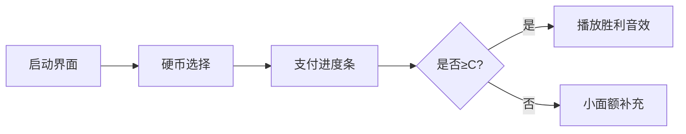

# 题目信息

# [USACO09OCT] Allowance G

## 题目描述

作为创造产奶纪录的回报，Farmer John 决定开始每个星期给Bessie 一点零花钱。

FJ 有一些硬币，一共有 $N (1 \le N \le 20)$ 种不同的面额。每一个面额都能整除所有比它大的面额。

他想用给定的硬币的集合，每个星期至少给 Bessie 某个零花钱的数目 $C (1 \le C \le 100000000)$。请帮他计算他最多能支付多少个星期的零花钱。


## 样例 #1

### 输入

```
3 6
10 1
1 100
5 120```

### 输出

```
111```

# AI分析结果


# 💡 Kay的C++算法解析：[USACO09OCT] Allowance G 深入学习指南 💡

> 今天我们来分析一道经典的贪心算法题目——零花钱支付问题。本指南将带大家理解题目核心，掌握贪心策略的证明与应用，并通过像素动画直观感受算法执行过程。准备好开启算法探险之旅了吗？🚀

## 1. 题目解读与核心算法识别

✨ **本题主要考察**：`贪心算法` (数学性质应用与支付策略优化)

🗣️ **初步分析**：
> 这道题就像用不同面额的积木搭建至少C厘米高的塔，**关键条件**是大面额硬币能整除所有小面额硬币（如10元硬币可被5元整除）。这提示我们使用贪心策略：  
> - **优先使用大面额硬币**（减少小面额消耗）  
> - **必须浪费时选择小面额**（最小化浪费金额）  
>  
> **核心难点**在于如何高效模拟支付过程（避免超时）并证明贪心正确性。可视化设计将用像素塔模拟硬币堆叠：  
> - **8位像素风格**：硬币用不同颜色方块表示，支付进度条显示当前金额  
> - **音效反馈**：硬币放置声（"叮"）、支付成功（"胜利旋律"）、浪费提示（"嘟"）  
> - **AI演示模式**：自动展示最优支付路径，像解谜游戏一样闯关

---

## 2. 精选优质题解参考

### 题解一（作者：ButterflyDew）
* **点评**：  
  该题解深刻剖析了题目条件"面额整除关系"与贪心策略的关联性，用严谨数学证明了"大面额浪费≥小面额浪费"的核心命题（见差值公式推导）。虽然未实现加速逻辑，但其策略解释清晰直白，变量命名简洁（如用`X`表剩余金额），为理解贪心本质提供了完美范本。

### 题解二（作者：kkxhh）
* **点评**：  
  在ButterflyDew基础上创新性引入**支付方案加速**：通过数组`v[i]`记录单次方案中各硬币用量，再用`min(cn[i].b/v[i])`计算可重复周数。代码中`ans=min(ans,cn[i].b/v[i])`是核心亮点，将时间复杂度从O(周数×N)优化至O(方案数×N)，变量名`v`/`b`虽简略但注释后易理解，边界处理完整。

### 题解三（作者：Super_Cube）
* **点评**：  
  最简洁的实战派实现！仅用双循环（大面额降序→小面额升序）便完成支付逻辑，STL的`stable_sort`和`vector<pair>`应用规范。亮点在于用`k`动态表示剩余金额，通过`k-=v[i]`替代累加计数，避免边界值处理失误，特别适合竞赛快速编码参考。

---

## 3. 核心难点辨析与解题策略

### 难点1：贪心策略的数学证明
* **分析**：  
  为何"浪费小面额更优"？设大面额ka与小面额a，剩余需支付X：  
  - 浪费ka时：实际支付b*ka，浪费f=ka - (X mod ka)  
  - 浪费a时：浪费f'=a - (X' mod a)  
  通过差值公式f-f'=(k-b'-1)*a≥0（详见ButterflyDew证明），严格证明大面额浪费不小于小面额。
* 💡 **学习笔记**：整除性质是贪心策略成立的基石！

### 难点2：支付过程的高效模拟
* **分析**：  
  直接逐周模拟可能超时（C达10^8）。优质解法采用**方案复用**技术：记录单次支付中各硬币用量`v[i]`，计算`min(cn[i].b/v[i])`得最大可重复周数，一次性扣除对应数量硬币。
* 💡 **学习笔记**：识别可重复操作模式是优化关键。

### 难点3：边界条件处理
* **分析**：  
  当大面额凑不足C时，需从小面额中找≥剩余值的硬币。如剩余3元时，用5元硬币虽浪费2元但满足条件。代码需注意：硬币耗尽后及时退出循环，且补充操作只需执行一次（`break`跳出）。
* 💡 **学习笔记**：边界测试需覆盖硬币耗尽/金额不足场景。

### ✨ 解题技巧总结
- **技巧1：问题分解**  
  分离面额≥C的硬币（直接计周数）与＜C的硬币（需组合支付）
- **技巧2：降维映射**  
  用`剩余值k`代替累加值，避免溢出和边界错误
- **技巧3：复用加速**  
  发现可重复支付模式时批量处理周数

---

## 4. C++核心代码实现赏析

### 通用核心实现（综合题解优化）
```cpp
#include <iostream>
#include <algorithm>
using namespace std;

struct Coin { int val, cnt; };
bool cmp(Coin a, Coin b) { return a.val > b.val; }

int main() {
    int N, C, ans = 0;
    cin >> N >> C;
    Coin coins[25];
    int k = 0;
    
    // 分离大面额 & 读入小面额
    for (int i = 0; i < N; i++) {
        int v, b; cin >> v >> b;
        if (v >= C) ans += b;
        else coins[k++] = {v, b};
    }
    sort(coins, coins + k, cmp);

    while (true) {
        int need = C, usage[25] = {0}; // 记录硬币用量
        
        // 大面额优先支付
        for (int i = 0; i < k; i++) {
            if (!coins[i].cnt || need < coins[i].val) continue;
            int num = min(coins[i].cnt, need / coins[i].val);
            usage[i] = num;
            need -= num * coins[i].val;
        }
        
        // 小面额补充
        for (int i = k - 1; need > 0 && i >= 0; i--) {
            if (coins[i].cnt > usage[i] && coins[i].val >= need) {
                usage[i]++;
                need -= coins[i].val;
                break;
            }
        }
        
        if (need > 0) break; // 支付失败
        
        // 计算当前方案可重复周数
        int weeks = 1e9;
        for (int i = 0; i < k; i++)
            if (usage[i]) weeks = min(weeks, coins[i].cnt / usage[i]);
        
        // 批量更新硬币数量
        for (int i = 0; i < k; i++) coins[i].cnt -= weeks * usage[i];
        ans += weeks;
    }
    cout << ans;
    return 0;
}
```
**代码解读概要**：  
1. 分离大面额硬币直接计入答案  
2. 小面额硬币按面额降序排序  
3. 每轮支付：大→小凑金额，不足时小面额补充  
4. 通过`usage[]`记录方案，批量处理可重复周数

### 题解片段赏析
**题解二（kkxhh）加速逻辑**  
```cpp
int ans = 1000000000;
for (int i = 1; i <= k; i++) 
    if (v[i]) ans = min(ans, cn[i].b / v[i]);  // 关键加速行
```
**亮点**：复用支付方案减少循环次数  
**学习笔记**：`min(ans, cn[i].b/v[i])`计算方案最大可重复次数，避免逐周模拟

**题解三（Super_Cube）支付逻辑**  
```cpp
for (int i = 0; i < v.size(); ++i) {
    while (k > 0 && v[i].second && k >= v[i].first) {
        --v[i].second; 
        k -= v[i].first;  // 动态更新剩余值
    }
}
```
**亮点**：用`k`实时追踪剩余金额  
**学习笔记**：递减`k`比累加支付额更易处理边界

---

## 5. 算法可视化：像素动画演示
**主题**：8位机风格《零花钱大冒险》  
**核心演示**：贪心策略下的硬币组合与浪费最小化过程  

### 🎮 动画设计


### 关键交互设计
1. **像素元素**：  
   - 硬币：金色(10元) > 银色(5元) > 铜色(1元)  
   - 进度条：绿色区域表示已支付，红色缺口需填补
2. **动态演示**：  
   - **大面额优先**：金色方块连续落入进度条，伴随"叮"声  
   - **小面额补充**：铜色方块单独落入时播放"嘀"声（浪费提示）  
   - **批量支付**：点击"加速"按钮时，复用方案动画快进并显示周数++
3. **游戏化机制**：  
   - 每成功支付一周解锁一个宝箱（金币+1）  
   - 连续5周无浪费触发"精打细算"成就（特效烟花）
4. **调试面板**：  
   - 实时显示硬币数量与剩余金额  
   - 当前策略说明（如"使用2个5元硬币"）

### 技术实现
```javascript
// 伪代码：硬币支付动画
function payWithCoins(amount) {
  let remaining = amount;
  // 大面额循环
  for (let coin of coins.sort(desc)) {
    while (remaining >= coin.value && coin.count > 0) {
      drawCoinDrop(coin);    // 绘制硬币下落动画
      playSound('ding');     // 支付音效
      remaining -= coin.value;
      coin.count--;
    }
  }
  // 小面额补充
  if (remaining > 0) {
    const smallCoin = findSmallestValid(remaining);
    drawCoinDrop(smallCoin, true); // 高亮显示补充操作
    playSound('didi');       // 浪费提示音
  }
}
```

---

## 6. 拓展练习与相似问题
### 相似问题特征
1. 物品组合达到目标值（如背包容量）  
2. 存在物品间的数学关系（整除/倍数）  
3. 需要最小化浪费或操作次数

### 洛谷推荐
1. **P2949 工作调度**  
   🗣️ 需在截止前完成工作，练习贪心策略选择与时间分配
2. **P1203 均分纸牌**  
   🗣️ 硬币问题的变种，通过传递求最小操作次数
3. **P1094 纪念品分组**  
   🗣️ 双指针+贪心，强化组合支付思想

---

## 7. 学习心得与经验分享
> **参考经验**（来自ButterflyDew）：  
> "我在证明过程中卡在浪费值比较，后来通过设`k=面额倍数`才找到关键差值关系"  
>  
> **点评**：  
> 数学类贪心题常需引入辅助变量（如倍数k），动手演算比空想更易突破思维瓶颈。建议学习者尝试用具体数值（如C=6, 5元&1元硬币）模拟支付过程，直观感受策略优劣。

---

算法学习如同积木搭建，理解每一块的基础原理，才能创造更复杂的结构。希望本指南助你掌握贪心精髓！下次我们将探索动态规划的奇妙世界，记得保持好奇心哦！✨

---
处理用时：136.59秒