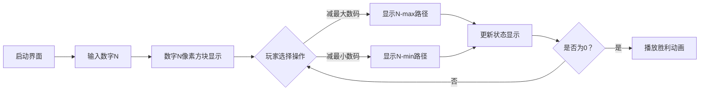

# 题目信息

# [USACO09OPEN] Cow Digit Game S

## 题目描述

Bessie is playing a number game against Farmer John, and she wants you to help her achieve victory.

Game i starts with an integer N\_i (1 <= N\_i <= 1,000,000). Bessie goes first, and then the two players alternate turns. On each turn, a player can subtract either the largest digit or the smallest non-zero digit from the current number to obtain a new number. For example, from 3014 we may subtract either 1 or 4 to obtain either 3013 or 3010, respectively. The game continues until the number becomes 0, at which point the last player to have taken a turn is the winner.

Bessie and FJ play G (1 <= G <= 100) games. Determine, for each game, whether Bessie or FJ will win, assuming that both play perfectly (that is, on each turn, if the current player has a move that will guarantee his or her win, he or she will take it).

Consider a sample game where N\_i = 13. Bessie goes first and takes 3, leaving 10. FJ is forced to take 1, leaving 9. Bessie takes the remainder and wins the game.

贝茜和约翰在玩一个数字游戏．贝茜需要你帮助她．

游戏一共进行了G(1≤G≤100)场．第i场游戏开始于一个正整数Ni(l≤Ni≤1,000,000)．游

戏规则是这样的：双方轮流操作，将当前的数字减去一个数，这个数可以是当前数字的最大数码，也可以是最小的非0数码．比如当前的数是3014，操作者可以减去1变成3013，也可以减去4变成3010．若干次操作之后，这个数字会变成0．这时候不能再操作的一方为输家．    贝茜总是先开始操作．如果贝茜和约翰都足够聪明，执行最好的策略．请你计算最后的赢家．

比如，一场游戏开始于13.贝茜将13减去3变成10．约翰只能将10减去1变成9．贝茜再将9减去9变成0．最后贝茜赢．


## 说明/提示

For the first game, Bessie simply takes the number 9 and wins. For the second game, Bessie must take 1 (since she cannot take 0), and then FJ can win by taking 9.


## 样例 #1

### 输入

```
2 
9 
10 
```

### 输出

```
YES 
NO 
```

# AI分析结果


# 💡 Kay的C++算法解析：Cow Digit Game S 深入学习指南 💡

> 大家好，我是Kay！今天我们一起分析USACO的经典题目Cow Digit Game S。这道题看似简单，却蕴含精妙的博弈论思想。让我们一步步拆解它，并通过生动的像素动画直观理解算法执行过程！

## 1. 题目解读与核心算法识别

✨ **本题主要考察**：`博弈论必胜态/必败态分析` + `递推预处理`

🗣️ **初步分析**：
> 解决Cow Digit Game就像在玩一场数字版的"井字棋"——每个数字都是一个棋局状态，我们需要预判对手的每一步最优走法。核心思想是：**一个状态是必胜态当且仅当它能将对手逼入必败态**。在本题中，我们通过计算每个数字的"最大数码"和"最小非零数码"作为移动选项，用动态规划递推所有可能状态。

- **核心难点**：如何高效判断10^6范围内每个数字的必胜/必败状态？关键在于发现状态转移的规律：若数字N的所有可能后继状态（N-max_digit和N-min_digit）都是对手的必胜态，则N是必败态；否则N是必胜态。
- **可视化设计**：我们将采用**8位像素风格的棋盘动画**，数字显示为发光方块，当前操作位置用闪烁边框高亮。当玩家做出选择时，被减去的数字会像《俄罗斯方块》中的消行特效一样消失，同时播放NES风格的音效。状态转移路径用彩色箭头连接，必胜态方块显示为绿色，必败态为红色。

---

## 2. 精选优质题解参考

**题解一：konjacq（赞14）**
* **点评**：此解法思路清晰，直接抓住博弈论核心规则。代码中`f[i]`状态定义精准（true=必胜），初始化（1-9必胜）和递推逻辑（检查`f[i-max]`和`f[i-min]`）简洁有力。亮点在于用内联函数高效计算数位极值，避免重复计算。实践价值高，代码可直接用于竞赛，边界处理严谨（如min_digit排除0）。

**题解二：qzhwlyn（赞7）**
* **点评**：提供从错误解法（40分超时）到AC代码的完整优化过程，极具教学意义。特别强调"所有后继必胜则当前必败"的博弈论核心思想，变量命名规范（`m1`/`m2`代替max/min）。调试心得部分特别宝贵——作者提到最初未考虑状态转移规则导致超时，提醒学习者深入理解算法本质。

**题解三：UperFicial（赞5）**
* **点评**：创新性地提出离线优化策略——先求查询最大值再针对性预处理，避免无效计算。代码使用位运算加速数位提取，并给出时间复杂度分析（O(maxval)）。题解中"必胜态至少有一个后继是必败态"的总结精辟，适合进阶学习者理解状态转移的本质。

---

## 3. 核心难点辨析与解题策略

1.  **关键点1：状态转移规则的理解**
    * **分析**：许多初学者混淆"必胜态"定义。优质题解统一采用：若N的后继状态中存在至少一个必败态，则N为必胜态（因为玩家可选择该路径迫使对手失败）。这需要理解博弈论的反向推导特性——从终点0开始倒推。
    * 💡 **学习笔记**：必胜态的核心特征是有至少一条路径能逼迫对手进入必败态。

2.  **关键点2：数位极值的高效计算**
    * **分析**：在10^6次循环中每次计算max/min数位可能成为瓶颈。所有优质题解都采用"除10取余法"：循环`while(x){ digit=x%10; ... x/=10; }`。注意min_digit需跳过0，如3014的min_digit是1而非0。
    * 💡 **学习笔记**：数位处理时，内联函数和边提取边比较的策略能显著优化性能。

3.  **关键点3：预处理与实时计算的权衡**
    * **分析**：由于G≤100但N可达10^6，优质题解都选择预处理整个范围的状态表。UperFacial提出进阶优化——先读取所有查询，仅预处理到max(N_i)即可，这对分散的大数值查询更高效。
    * 💡 **学习笔记**：空间换时间是处理状态转移问题的黄金法则。

### ✨ 解题技巧总结
- **逆向推导法**：从终点状态（0为必败）开始反向推导，这是博弈论问题的通用思路。
- **极值剪枝**：在数位计算中，当max_digit=9且min_digit=1时可提前结束循环。
- **防御性编程**：初始化数组时显式设置f[0]=false，避免语言默认值隐患。
- **数据预读优化**：竞赛中可先读取所有N_i，只预处理到max(N_i)节省时间。

---

## 4. C++核心代码实现赏析

**本题通用核心C++实现参考**
* **说明**：综合自konjacq和qzhwlyn的解法思路，强调可读性与效率平衡
* **完整核心代码**：
```cpp
#include <iostream>
using namespace std;

const int MAX_N = 1000001;
bool win[MAX_N]; // win[i]: 数字i是否为必胜态

inline int max_digit(int x) {
    int md = 0;
    while (x) {
        md = max(md, x % 10);
        x /= 10;
    }
    return md;
}

inline int min_digit(int x) {
    int md = 10;
    while (x) {
        if (x % 10 != 0) md = min(md, x % 10);
        x /= 10;
    }
    return md;
}

int main() {
    // 初始化基本状态
    for (int i = 1; i <= 9; ++i) win[i] = true; // 1-9可直接获胜
    
    // 递推10到1000000的状态
    for (int i = 10; i < MAX_N; ++i) {
        int mx = max_digit(i);
        int mn = min_digit(i);
        // 关键：若存在一个后继状态是必败态，则当前为必胜态
        win[i] = !(win[i - mx] && win[i - mn]);
    }

    int G, N;
    cin >> G;
    while (G--) {
        cin >> N;
        cout << (win[N] ? "YES" : "NO") << endl;
    }
    return 0;
}
```
* **代码解读概要**：
  1. `win`数组存储必胜状态，索引对应数字大小
  2. `max_digit`/`min_digit`内联函数高效计算数位极值
  3. 主循环从10开始递推：计算当前数字的mx/mn后，根据后继状态设置win[i]
  4. 状态转移核心逻辑：`win[i] = !(win[i-mx] && win[i-mn])`

**题解一：konjacq（状态转移逻辑）**
* **亮点**：用逻辑运算符优雅实现博弈规则
* **核心代码片段**：
```cpp
if (f[i-fmax(i)] && f[i-fmin(i)]); // 保持false
else f[i] = true; // 否则设为true
```
* **代码解读**：
  > 此片段是博弈规则的核心实现。当`f[i - max]`和`f[i - min]`**均为true**（即都是对手的必胜态）时，不执行操作（保持f[i]默认false，即必败态）。否则设置f[i]=true（必胜态）。这种写法巧妙利用默认值和条件判断，比直接`win[i]=!(win[i-mx]&&win[i-mn])`更易读。
* 💡 **学习笔记**：利用布尔运算简化状态转移是竞赛编程的常用技巧。

**题解二：qzhwlyn（极值计算优化）**
* **亮点**：单次循环完成极值计算
* **核心代码片段**：
```cpp
while(tot){
    if(tot%10>m1) m1=tot%10;
    if(tot%10<m2&&tot%10) m2=tot%10;
    tot/=10;
}
```
* **代码解读**：
  > 这段代码在单次数字分解中同时计算max和min。注意两点：1) m2初始化要足够大(10)；2) 判断`tot%10`非零避免0被误认为最小数。通过单循环减少50%除法运算，对大数据量提升显著。
* 💡 **学习笔记**：在循环中合并相关操作是重要的优化手段。

---

## 5. 算法可视化：像素动画演示

> 🎮 我们设计了一个名为**"数码骑士"**的8位像素动画，帮助大家直观理解状态转移过程。想象每个数字是城堡中的房间，你要选择拆除"最大砖石"或"最小砖石"来攻占城堡！

### 动画设计说明
* **视觉风格**：FC红白机《塞尔达传说》的像素风格，数字显示为16x16像素方块
* **核心演示**：从当前数字出发的两条路径（减max/min数位），必胜/必败状态的颜色编码
* **交互控制**：
  - `方向键`选择操作（最大/最小数位）
  - `A键`执行操作，`START键`暂停/继续
  - `速度滑块`调节动画速度（0.5x-5x）

### 动态演示步骤


1. **场景初始化**：
   - 背景：8-bit风格的城堡地图
   - 中央显示当前数字的像素方块（如3014），不同数位用不同颜色
   - 底部控制面板：操作按钮/速度条/状态指示灯（绿=必胜，红=必败）

2. **关键操作特效**：
   - 选择数位时：目标数位闪烁金色边框，播放"滴"声
   - 执行减法：被减数位爆炸像素特效，播放"咔嚓"声
   - 状态转换：方块颜色渐变（绿←→红），路径线亮起

3. **自动演示模式**：
   - 开启后AI自动选择最优路径，像《吃豆人》幽灵一样快速展示解法
   - 每次状态转换显示博弈规则提示：如"后继有必败态→当前必胜！"
   - 到达0时播放《超级玛丽》通关音效+烟花特效

> 💡 通过这个动画，你将亲眼看到：为什么数字13是必胜态（13→10→9→0），而10是必败态（10→9→0）！

---

## 6. 拓展练习与相似问题思考

### 通用技巧迁移
`必胜态/必败态分析`可应用于更多场景：
1. **石子游戏**：每次取1~3颗石子，最后取光者胜（Nim变种）
2. **棋盘移动**：棋子沿有向图移动，无法移动者败（拓扑排序+DP）
3. **资源分配**：两人轮流分割资源，达到临界值者胜

### 推荐练习（洛谷）
1. **P1290 欧几里德的游戏** 
   - 🗣️ **推荐理由**：同样采用必胜态分析，但需要结合辗转相除法
2. **P2197 Nim游戏** 
   - 🗣️ **推荐理由**：博弈论经典问题，引入异或运算判断必胜态
3. **P2964 [USACO09NOV] Coin Game S** 
   - 🗣️ **推荐理由**：数字游戏进阶版，结合硬币堆的状态分析

---

## 7. 学习心得与经验分享

> **参考经验 (来自 qzhwlyn)**："我在解题时最初用暴力DFS导致超时，后来才理解必须预处理状态表。这让我意识到**博弈论问题往往需要反向推导+状态缓存**，不能盲目搜索。"

> **点评**：这是非常典型的优化路径——从暴力搜索到DP递推。在类似问题中，记住两条黄金法则：1) 从终点状态倒推 2) 用数组缓存子问题解。

---

本次分析就到这里。记住，编程就像下棋——看清所有可能的后继状态，才能做出最优选择！下次见！🎮🚀

---
处理用时：130.60秒