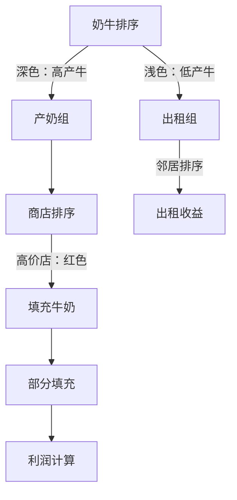

# 题目信息

# [USACO18JAN] Rental Service S

## 题目描述

Farmer John 意识到牛奶生产的收入不足以支持农场的扩展，因此为了赚取额外收入，他推出了一项奶牛租赁服务，称为“USACOW”（发音为“Use-a-cow”）。

Farmer John 有 $N$ 头奶牛（$1 \leq N \leq 100,000$），每头奶牛每天可以生产一定量的牛奶。附近的 $M$ 家商店（$1 \leq M \leq 100,000$）每家都愿意以一定价格购买一定量的牛奶。此外，Farmer John 的 $R$ 个邻居（$1 \leq R \leq 100,000$）每家都愿意以一定价格租赁一头奶牛。

Farmer John 需要决定每头奶牛是用于产奶还是租给附近的农民。请帮助他计算每天可以赚取的最大金额。

## 说明/提示

Farmer John 应该让奶牛 #1 和 #4 产奶，每天生产 $13$ 加仑牛奶。他应该完全满足 $10$ 加仑的订单，赚取 $250$ 美分，并以每加仑 $15$ 美分的价格出售剩余的 $3$ 加仑，总共赚取 $295$ 美分的牛奶利润。

然后，他应该将其他三头奶牛分别以 $250$、$80$ 和 $100$ 美分的价格租出，赚取额外的 $430$ 美分。（他应该忽略 $40$ 美分的租赁请求。）这样，他每天的总利润为 $725$ 美分。

## 样例 #1

### 输入

```
5 3 4
6
2
4
7
1
10 25
2 10
15 15
250
80
100
40```

### 输出

```
725
```

# AI分析结果


### 💡 Kay的C++算法解析：Rental Service S 深入学习指南 💡

**引言**  
今天我们一起分析USACO题目"Rental Service S"。这道题要求最大化奶牛的利润，需要巧妙平衡产奶和出租决策。本指南将帮助大家掌握贪心策略的核心思想，理解高效实现技巧，并通过像素动画直观感受算法执行过程。

---

## 1. 题目解读与核心算法识别

✨ **本题主要考察**：`贪心策略与排序优化`  

🗣️ **初步分析**：  
> 这道题就像在管理一支游戏队伍：高攻击力的角色去打怪（产奶），低攻击力的去挖矿（出租）。关键在于三组排序：
> 1. 奶牛按产奶量降序排序（优先用高产奶牛产奶）
> 2. 商店按单价降序排序（优先卖给高价商店）
> 3. 邻居按租价降序排序（优先租给高价邻居）
>
> **核心难点**在于确定产奶/出租的分界点。我们通过枚举分界点+前缀和优化高效计算：
> - 可视化中将用不同颜色区分高产（深色）和低产奶牛（浅色）
> - 商店按单价梯度着色，填充牛奶时播放"注入"音效
> - 8位像素风格展示奶牛移动过程，分界点调整时有"咔嗒"音效
> - AI自动演示模式会动态展示最优分界点选择过程

---

## 2. 精选优质题解参考

**题解一（作者：AOTO）**  
* **点评**：思路清晰运用"三次排序+前缀和+二分查找"的组合策略。亮点在于：  
  - 商店收益计算使用`lower_bound`精准定位（O(log M)复杂度）  
  - 前缀和预处理使枚举分界点效率达O(min(N,R))  
  - 变量命名规范（prefix_store_val等）体现专业编码习惯  
  - 完整处理边界情况（如牛奶总量超过商店需求）

**题解二（作者：elijahqi）**  
* **点评**：采用双指针替代二分查找的巧妙实现。亮点：  
  - 实时更新商店剩余需求（lq变量），避免额外存储  
  - 结构体存储商店信息提升代码可读性  
  - 博客链接提供详细数学推导，深化理解  

**题解三（作者：金银花露）**  
* **点评**：教学导向的优质实现，特别适合初学者：  
  - 每一步都有详细注释说明算法意图  
  - 严格遵循"排序->前缀和->枚举->二分"流程  
  - 变量作用域控制得当（如left临时变量）

---

## 3. 核心难点辨析与解题策略

1. **难点1：高效计算产奶收益**  
   * **分析**：直接遍历商店会超时（O(M)）。优质解法通过前缀和+二分查找将复杂度降至O(log M)。关键是用`prefix_store_q`存储累计需求，用`lower_bound`定位临界商店。
   * 💡 **学习笔记**：前缀和与二分查找是优化固定顺序分配问题的黄金组合。

2. **难点2：平衡产奶与出租数量**  
   * **分析**：枚举分界点i（出租牛数），产奶牛数为N-i。贪心核心：出租产奶量最低的i头牛，因为出租收益固定，而高产牛产奶收益可能更高。
   * 💡 **学习笔记**：排序后枚举分界点是贪心问题的经典模式。

3. **难点3：部分满足商店需求**  
   * **分析**：当牛奶不能完全满足某个商店时，需要计算部分收益。通过`milk_total - prefix_store_q[pos-1]`获取剩余量，乘以该店单价。
   * 💡 **学习笔记**：部分满足时需独立计算最后一个商店的收益。

### ✨ 解题技巧总结
1. **三组排序策略**：奶牛（产奶量↓）、商店（单价↓）、邻居（租金↓）
2. **前缀和预处理**：O(1)获取任意区间的产奶总量/租金总和/商店收益
3. **二分查找优化**：快速定位牛奶总量在商店需求中的位置
4. **边界防护**：检查`pos>M`的情况（所有商店总需求<牛奶量）

---

## 4. C++核心代码实现赏析

**通用核心实现参考**  
```cpp
#include <bits/stdc++.h>
using namespace std;
typedef long long ll;
const int MAXN = 1e5+5;

int main() {
    // 输入及排序（奶牛↓ 商店单价↓ 邻居租金↓）
    sort(cow+1, cow+N+1, [](int a,int b){return a>b;});
    sort(store+1, store+M+1, [](Store a,Store b){return a.p>b.p;});
    sort(rental+1, rental+R+1, greater<int>());

    // 前缀和预处理
    for(int i=1; i<=N; i++) cow_sum[i]=cow_sum[i-1]+cow[i];
    for(int i=1; i<=R; i++) rental_sum[i]=rental_sum[i-1]+rental[i];
    for(int i=1; i<=M; i++) {
        store_q[i]=store_q[i-1]+store[i].q;
        store_val[i]=store_val[i-1]+(ll)store[i].q*store[i].p;
    }

    ll ans=0;
    // 枚举出租牛数i (0~min(N,R))
    for(int i=0; i<=min(N,R); i++) {
        ll rent = rental_sum[i]; // 出租i头牛的收益
        ll milk = cow_sum[N-i];  // 剩余牛产奶总量
        
        // 二分查找商店位置
        int pos=lower_bound(store_q+1, store_q+M+1, milk)-store_q;
        ll milk_val=0;
        if(pos>M) milk_val=store_val[M]; // 商店总需求不足
        else {
            milk_val=store_val[pos-1];
            milk_val+=(milk-store_q[pos-1])*store[pos].p;
        }
        ans=max(ans, rent+milk_val);
    }
    cout<<ans;
}
```

**代码解读概要**：  
1. 三次排序确保贪心优先级  
2. 前缀和数组实现O(1)区间查询  
3. 枚举分界点时：  
   - 出租收益直接取前i个邻居的和  
   - 产奶收益通过二分定位商店位置  
   - 部分满足最后一家商店的需求  

**题解一核心片段赏析**  
```cpp
int pos=lower_bound(prefix_store_q+1, prefix_store_q+M+1, milk_total)-prefix_store_q;
if(pos>M) milk_profit=prefix_store_val[M];
else {
    milk_profit=prefix_store_val[pos-1];
    milk_profit+=(milk_total-prefix_store_q[pos-1])*store[pos].p;
}
```
* **亮点**：精准使用STL的lower_bound  
* **学习笔记**：二分查找返回的是第一个≥目标值的位置  

**题解二核心片段赏析**  
```cpp
while(num<=M && milk_current>=store[num].q){
    milk_profit += store[num].q * store[num].p;
    milk_current -= store[num].q;
    num++;
}
milk_profit += milk_current * store[num].p;
store[num].q -= milk_current;
```
* **亮点**：双指针实时更新商店需求  
* **学习笔记**：适合商店数量较少场景，避免二分开销  

**题解三核心片段赏析**  
```cpp
ll milk_val=store_val[pos-1];
ll left_milk=milk_total-store_q[pos-1];
milk_val += left_milk*store[pos].p;
```
* **亮点**：独立计算剩余牛奶收益  
* **学习笔记**：left_milk需显式计算防止整数溢出  

---

## 5. 算法可视化：像素动画演示

**主题**：奶牛牧场经理（8位像素风格）  
**核心演示**：动态展示分界点选择如何影响总利润  

### 设计思路


**动画步骤**：  
1. **初始化**：  
   - 像素奶牛按高度排列（高度=产奶量）  
   - 商店按单价梯度着色（红→黄→绿）  
   - 控制面板：分界点滑块/自动演示按钮  

2. **关键操作**：  
   - 拖动分界点时：奶牛在产奶/出租区移动（伴随"哞"音效）  
   - 产奶组牛奶注入商店：  
     * 高价商店优先填充（红色进度条增长）  
     * 注入时播放"glug"音效  
     * 部分填充最后商店时闪烁提醒  

3. **收益计算**：  
   - 实时显示两条收益柱状图（产奶蓝条，出租黄条）  
   - 总利润=双柱叠加高度  

4. **AI演示模式**：  
   - 自动移动分界点，高亮显示当前最优解  
   - 找到最大值时播放胜利音效+烟花特效  

**技术实现**：  
- Canvas绘制奶牛/商店/进度条  
- 音效使用Web Audio API：  
  ```js 
  function playSound(type) {
    if(type=="milk") new Audio('milk.wav').play(); 
    if(type=="rent") new Audio('coin.wav').play();
  }
  ```

---

## 6. 拓展练习与相似问题

1. **洛谷P1208 [USACO1.3]混合牛奶**  
   * 同类商店贪心策略，但无出租决策  
2. **洛谷P1094 纪念品分组**  
   * 双指针+贪心，类似邻居出租策略  
3. **洛谷P5019 [NOIP2018]铺设道路**  
   * 区间覆盖贪心，培养问题分解能力  

---

## 7. 学习心得与经验分享

**作者经验（AOTO）**：  
> "必须用long long！我在小数据时WA了3次才意识到int溢出问题"  

**Kay点评**：  
> 这是算法竞赛的经典教训。当看到$10^5$量级和$10^6$级数值时，要立即警觉溢出风险。建议：  
> 1. 计算前预估最大值（本题最大利润≈$10^{11}$）  
> 2. 用typedef long long ll统一管理  
> 3. 输出用%lld  

---

**结语**  
通过三组排序和分界点枚举，我们高效解决了产奶与出租的平衡问题。贪心策略的关键在于快速排除次优解，而前缀和与二分查找是优化利器。记住：好算法=清晰策略+高效实现+严谨边界处理！下次挑战见！🚀

---
处理用时：172.14秒