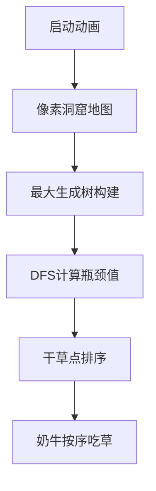

# 题目信息

# [USACO04OPEN] Cave Cows 1

## 题目描述

很少人知道其实奶牛非常喜欢到洞穴里面去探险。

洞窟里有 $ N $ ( $ 1 \leq N \leq 100 $ )个洞室，由 $ M $ ( $ 1 \leq M \leq 1000 $ )条双向通道连接着它们。每对洞室间至多只有一条双向通道，有 $ K $ ( $ 1 \leq K \leq 14 $ )个洞室，里面放有1捆干草．牛吃1捆干草，体重指数就会增加1。

贪吃的贝茜要到洞窟里面探险，她希望能吃尽量多的干草，但每条通道有一个宽度阈值，如果体重指数超过相应的阈值，贝茜就会被卡住。

她从洞窟1出发，体重指数为0。在洞里溜达一圈后，她要返回洞窟1。

那她最多能吃多少捆干草呢？注意，贝茜经过一个洞室，不一定非要吃掉里面的干草。

## 样例 #1

### 输入

```
6 7 5
1
2
3
4
5
1 2 3
3 6 2
6 2 10
2 4 1
5 1 1
4 5 1
1 6 1```

### 输出

```
4```

# AI分析结果


### 💡 Kay的C++算法解析：Cave Cows 1 深入学习指南 💡

**引言**  
今天我们来分析"洞穴奶牛1"这道图论题目。贝茜需要从洞窟1出发，在体重限制下吃掉尽可能多的干草并返回起点。本指南将帮助你理解核心算法、关键难点及多种解法。

---

### 1. 题目解读与核心算法识别  
✨ **本题主要考察**：图论（最大瓶颈路）与贪心策略  

🗣️ **初步分析**：  
> 本题的核心是计算**最大瓶颈路**——即两点间路径的最小边权最大值。想象每个通道是狭窄的管道，奶牛体重必须小于管道宽度才能通过。  
> - **主要解法**：  
>   - **贪心+最大瓶颈路**（主流解法）：预处理起点到干草点的最大瓶颈值，按值排序后贪心选择  
>   - **状压BFS**：用状态压缩记录已吃干草，BFS遍历所有可能路径  
> - **可视化设计**：  
>   - 像素化洞窟地图，高亮显示当前计算的路径瓶颈边  
>   - 贪心过程用8-bit奶牛动画演示：比较当前体重(头顶数字)与干草点要求值  
>   - 音效设计：通过通道时播放"滴"声，吃干草时播放"叮"胜利音效  

---

### 2. 精选优质题解参考  
**题解一：_蒟蒻__（Floyd+贪心）**  
* **点评**：  
  思路清晰直白，用Floyd求任意两点最大瓶颈路（`dis[i][j]=max(dis[i][j], min(dis[i][k],dis[k][j]))`）。代码规范：  
  - 变量名`dis`/`a`/`b`含义明确，边界处理严谨（`dis[i][i]=inf`）  
  - 贪心部分简洁高效（排序后`if(b[i]>ans) ans++`）  
  > 💡 **亮点**：将复杂图论问题转化为经典Floyd应用，适合初学者理解瓶颈路概念  

**题解二：苹果蓝17（最大生成树+贪心）**  
* **点评**：  
  创新性使用最大生成树优化：  
  - 用Kruskal建树（`sort(edg, greater<>())`）保证树路径即最大瓶颈路  
  - DFS预处理起点到各点最小边权（`dfs(u, min(mn, e.w))`）  
  > 💡 **亮点**：时间复杂度从O(n³)优化到O(mlogm)，并给出贪心正确性证明  

**题解三：LJC00118（状压BFS）**  
* **点评**：  
  巧妙利用K≤14的特点：  
  - 状态设计`vis[i][j]`（位置i+状态j）避免重复访问  
  - 预处理`cnt[j]`快速计算已吃干草数  
  > 💡 **亮点**：提供完全不同的思路，展示状态压缩的实际应用  

---

### 3. 核心难点辨析与解题策略  
1. **难点1：最大瓶颈路计算**  
   * **分析**：需理解Floyd中`max(min(dis[i][k],dis[k][j]))`本质是寻找路径最小边权的最大值。最大生成树（题解2）是更优解  
   * 💡 **学习笔记**：最大瓶颈路 = 最大生成树的路径最小边权  

2. **难点2：贪心策略证明**  
   * **分析**：独立考虑每个干草点，按`dis[1][i]`排序后，先吃要求低的干草不会影响后续高要求点  
   * 💡 **学习笔记**：贪心正确性依赖路径独立性（反证法可证）  

3. **难点3：状态压缩设计**  
   * **分析**：状态j的二进制位表示已吃干草，`cnt[j]`即当前体重。转移时需同步检查边权限制  
   * 💡 **学习笔记**：状态空间大小 = 节点数×2ᴷ（K≤14时可行）  

#### ✨ 解题技巧总结  
- **技巧1：问题转化**  
  将吃干草问题 → 最大瓶颈路计算 → 贪心选择  
- **技巧2：数据结构优化**  
  优先最大生成树而非Floyd提升效率  
- **技巧3：边界处理**  
  Floyd初始化`dis[i][i]=inf`避免自环干扰  

---

### 4. C++核心代码实现赏析  
**通用核心实现（综合题解1&2）**  
```cpp
#include <bits/stdc++.h>
using namespace std;
const int N=105;

int main() {
    // 读入数据
    int n,m,k; cin>>n>>m>>k;
    vector<int> hay(k);
    for(int i=0; i<k; i++) cin>>hay[i];
    
    // 建图 & 初始化
    vector<vector<int>> dis(n+1, vector<int>(n+1,0));
    while(m--){
        int u,v,w; cin>>u>>v>>w;
        dis[u][v]=dis[v][u]=w;
    }
    
    // Floyd求最大瓶颈路
    for(int k=1; k<=n; k++)
        for(int i=1; i<=n; i++)
            for(int j=1; j<=n; j++)
                dis[i][j]=max(dis[i][j], min(dis[i][k], dis[k][j]));
    
    // 贪心求解
    vector<int> caps;
    for(int h : hay) caps.push_back(dis[1][h]);
    sort(caps.begin(), caps.end());
    
    int ans=0;
    for(int cap : caps)
        if(cap > ans) ans++;
    cout<<ans;
}
```
**代码解读概要**：  
1. 初始化邻接矩阵（未连接边权为0）  
2. Floyd三层循环更新最大瓶颈  
3. 收集干草点对应瓶颈值并排序  
4. 贪心累加可吃干草数  

---

### 5. 算法可视化：像素动画演示  
**主题**：8-bit像素奶牛探险  
**核心演示**：最大生成树构建 → 贪心路径选择  

**动画设计**：  


**关键交互**：  
1. **动态建树**：  
   - 边按权重从大到小加入，播放"咔嗒"音效  
   - 当前加入边高亮黄色，显示权重值  
2. **贪心过程**：  
   - 奶牛头顶显示当前体重（蓝色数字）  
   - 到达干草点时：若体重<瓶颈值，播放"叮"声并显示↑+1  
3. **控制面板**：  
   - 速度滑块：调速范围1x-5x  
   - 单步执行：按空格逐帧观察  
   - 模式切换：Floyd/最大生成树对比演示  

**音效设计**：  
- 背景音乐：FC风格循环BGM  
- 关键操作：边加入（咔嗒）、吃干草（叮！）、完成（胜利号角）  

---

### 6. 拓展练习与相似问题  
**通用技巧迁移**：  
1. 路径最小边权最大值 → POJ 2253（青蛙过河）  
2. 状态压缩BFS → 洛谷P2622（关灯问题）  
3. 贪心+图论 → LeetCode 1631（最小体力路径）  

**洛谷推荐**：  
1. **P2218**：覆盖问题  
   🗣️ 练习贪心证明能力  
2. **P1073**：最优贸易  
   🗣️ 巩固图论路径最值计算  
3. **P3959**：宝藏  
   🗣️ 深化状态压缩BFS应用  

---

### 7. 学习心得与经验分享  
> **来自苹果蓝17的经验**：  
> "独立考虑每个干草点是关键，用最大生成树替代Floyd提升效率"  
>   
> **Kay点评**：  
> 该经验直击问题核心——证明路径独立性是贪心基础，同时展示算法优化思维，值得学习者掌握"问题转化"技巧  

---

**结语**  
通过本指南，相信你已掌握最大瓶颈路与贪心策略的精髓。记住：图论问题核心在于模型转化！勤加练习，下次探险时贝茜定能吃到更多干草💪

---
处理用时：270.15秒