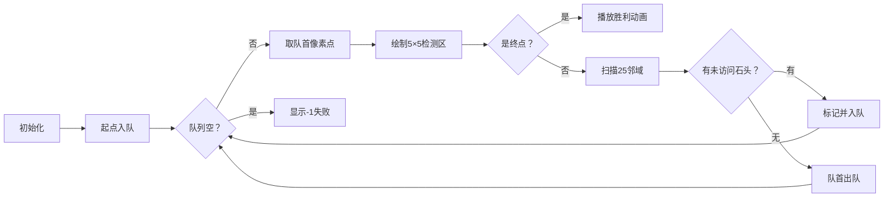

# 题目信息

# [USACO04OPEN] Cave Cows 4

## 题目描述

一道竖直的石墙横在贝茜前面，她必须越过去。

石墙可以看成一个xz平面，贝茜开始的时候在(0，0)，只要她到达 $ z=T $ 
 ( $ 1 \leq T \leq 200000 $ )的位置，就算翻越成功。

墙上有 $ N $ ( $ 1 \leq N \leq 50000 $ )块石头突出，成为贝茜的落蹄石。如果两个落蹄石之间x方向和z方向的距离均不超过2，那贝茜就可以攀上另一块落蹄石。

帮助贝茜计算她是否能够翻越石墙，如果可以，最少需要踩多少块落蹄石。

## 说明/提示

一种可行的方案是：(0,0) -> (1,2) -> (3,2) -> (4,1) -> (6,3) 。

## 样例 #1

### 输入

```
5 3
1 2
6 3
4 1
3 2
0 2```

### 输出

```
4```

# AI分析结果


### 💡 Kay的C++算法解析：Cave Cows 4 深入学习指南 💡

**引言**  
今天我们来分析"USACO04OPEN Cave Cows 4"这道BFS经典题。贝茜需要从(0,0)跳跃到任意纵坐标T的位置，每次只能在x/z方向≤2的落蹄石间移动。本指南将详解BFS优化思路，并通过像素动画帮助大家直观理解算法过程。

---

## 1. 题目解读与核心算法识别

✨ **本题主要考察**：`BFS（广度优先搜索）` + `空间优化技巧`

🗣️ **初步分析**  
> 本题可类比为"像素探险游戏"：贝茜像8位游戏角色，在5×5范围内跳跃平台（落蹄石）。BFS如同逐层扫描地图，确保找到最短路径。核心难点是如何在50000个平台中快速查找相邻点：
> - 直接枚举所有点对（O(n²)）会超时
> - 优化方案：用`map`存储坐标，仅检查每个点周围5×5区域
> 
> **可视化设计要点**：
> - 用不同颜色像素块表示：起点(绿色)、终点(金色)、普通石头(灰色)、已访问(蓝色)
> - 动态绘制BFS队列扩展过程，高亮当前检查的25格区域
> - 添加8位音效：跳跃声(滴答)、到达终点(胜利旋律)

---

## 2. 精选优质题解参考

**题解一（作者：LJC00118）**
* **点评**：最完整的工业级实现。亮点在于：
  1. 用`map<pair<int,int>, int>`精确映射坐标到索引
  2. 预处理时跳过重复坐标(`pre.count(t)`)
  3. BFS前预先建好邻接表，避免运行时查询
  4. 严谨的边界处理(-1初始化距离数组)
  5. 使用Fast_cin加速IO，适合竞赛场景

**题解二（作者：lidagua1004）**
* **点评**：教学级清晰实现。亮点：
  1. 双层map`map<int,map<int,int>>`直接存储坐标存在性
  2. BFS与坐标查询合并，减少中间步骤
  3. 结构体封装状态(x,y,dep)，逻辑直白
  4. 代码简洁易理解，适合初学者模仿

**题解三（作者：Light_az）**
* **点评**：最佳可读性实现。亮点：
  1. 完整中文注释解释每个关键步骤
  2. 使用`vis[x][y]`避免重复访问
  3. 明确标注"拒绝优化"突出BFS本质
  4. 变量命名规范(如`p.x`/`p.y`/`p.dep`)

---

## 3. 核心难点辨析与解题策略

1. **难点：如何避免O(n²)建图？**
   * **分析**：优质解法均利用"移动半径≤2"的特性，仅检查5×5邻域（25格）。通过`map`实现O(1)坐标查询，将建图复杂度降至O(25n)
   * 💡 学习笔记：有限移动范围是优化关键突破口

2. **难点：大坐标空间标记访问状态**
   * **分析**：数组无法覆盖10⁶级坐标。解法1用索引号+`dis[]`数组；解法2/3用双层map嵌套`vis[x][y]`
   * 💡 学习笔记：`map`是稀疏大空间的存储利器

3. **难点：重复坐标与边界处理**
   * **分析**：解法1显式去重(`pre.count`)，解法2/3依赖map自动覆盖。终点需遍历所有y=T的点找最小值
   * 💡 学习笔记：起点(0,0)需显式加入点集

### ✨ 解题技巧总结
- **空间换时间**：用`map`存储辅助信息，避免暴力枚举
- **状态封装**：将坐标/步数打包为结构体，简化BFS逻辑
- **邻域预计算**：固定偏移量表(-2到+2)比动态计算更高效
- **工业级优化**：IO加速（Fast_cin）、邻接表预处理

---

## 4. C++核心代码实现赏析

**通用BFS核心实现**
```cpp
#include <iostream>
#include <queue>
#include <map>
#include <vector>
#include <climits>
using namespace std;

int main() {
    int n, T; 
    cin >> n >> T;
    map<pair<int, int>, bool> rocks;      // 坐标存在性
    map<pair<int, int>, bool> visited;    // 访问标记
    queue<tuple<int, int, int>> q;        // BFS队列(x,y,step)

    // 读取落蹄石 (含起点(0,0))
    rocks[{0, 0}] = true;
    while (n--) {
        int x, y; cin >> x >> y;
        rocks[{x, y}] = true;
    }

    // BFS
    q.push({0, 0, 0});
    visited[{0, 0}] = true;
    while (!q.empty()) {
        auto [x, y, step] = q.front(); q.pop();
        if (y == T) { // 到达终点
            cout << step;
            return 0;
        }
        // 检查5×5邻域
        for (int dx = -2; dx <= 2; dx++) {
            for (int dy = -2; dy <= 2; dy++) {
                int nx = x + dx, ny = y + dy;
                if (rocks.count({nx, ny}) && !visited[{nx, ny}]) {
                    visited[{nx, ny}] = true;
                    q.push({nx, ny, step + 1});
                }
            }
        }
    }
    cout << -1; // 无法到达
}
```
**代码解读概要**  
> 1. 双map存储坐标存在性和访问状态
> 2. BFS队列封装(x,y,step)三元组
> 3. 遇到终点立即返回步数（最短路径性质）
> 4. 双层循环生成25个偏移量检查邻域

**题解一核心片段赏析**  
```cpp
for(int t1=-2; t1<=2; t1++) {
    for(int t2=-2; t2<=2; t2++) {
        int _x = x[i] + t1, _y = y[i] + t2;
        if(pre.count({_x, _y})) {
            adj[i].push_back(pre[{_x, _y}]);
        }
    }
}
```
* **亮点**：预处理邻接表，BFS中直接遍历
* **解读**：  
  > 提前构建`adj`邻接表，使BFS运行时仅需O(1)访问邻居。`pre`将坐标映射为索引，`adj`存储索引关系，是空间优化的典范
* 💡 学习笔记：预建图适合多次查询场景

**题解二核心片段赏析**  
```cpp
for(int i=-2; i<=2; i++) {
    for(int j=-2; j<=2; j++) {
        int xi = x+i, yj = y+j;
        if(mp[xi][yj] && !vis[xi][yj]) {
            vis[xi][yj] = 1;
            q.push({xi, yj, dep+1});
        }
    }
}
```
* **亮点**：运行时动态查询坐标
* **解读**：  
  > 直接在BFS循环中查询`mp[xi][yj]`，省去预处理步骤。`dep+1`同步更新步数，逻辑紧密
* 💡 学习笔记：代码简洁性与效率的平衡

---

## 5. 算法可视化：像素动画演示

**主题**：*贝茜的像素大冒险*（8-bit风格BFS过程模拟）  
**核心演示**：BFS如何从起点(0,0)逐层扩散，标记访问点，最终抵达y=T的终点

### 设计框架


### 交互细节
1. **像素艺术**：
   - 网格背景：16色FC复古调色板
   - 贝茜角色：2×2绿色像素块（当前位置）
   - 落蹄石：棕色像素块，访问后变蓝色
   - 检测区：半透明红色覆盖层（5×5）

2. **控制面板**：
   - 速度滑块：调节BFS执行速度
   - 单步模式：空格键触发下一步
   - 复位按钮：重新初始化场景

3. **音效设计**：
   - 入队：8-bit "滴"声 (200Hz方波)
   - 访问新点："咔嗒"声 (短白噪声)
   - 到达终点：《超级玛丽》过关旋律

4. **动态效果**：
   - 队列可视化：右侧条形图显示待处理点数量
   - 路径追踪：成功时绘制红色路径线
   - 终点闪烁：金色脉冲光效

---

## 6. 拓展练习与相似问题思考

### 同类问题特征
> 当问题满足：
> 1. 求最短移动步数
> 2. 移动规则明确（如方向/距离限制）
> 3. 状态空间大但转移有限
> → 优先考虑BFS+空间优化

### 推荐练习（洛谷）
1. **P1443 马的遍历**  
   → 棋盘上马走日字，同款邻域移动技巧
2. **P1135 奇怪的电梯**  
   → 分层图BFS，强化状态转移思维
3. **P2036 Perket**  
   → 结合DFS/BFS的状态空间遍历

---

## 7. 学习心得与经验分享

> **来自LJC00118的经验**：  
> *"map查询比想象中慢，必须关同步流才能AC"*  
> 
> **Kay点评**：  
> 在算法竞赛中，STL容器性能至关重要。当使用`map`/`unordered_map`时：
> - 优先写`count`而非`find` + `end`判断
> - 关闭同步流：`ios::sync_with_stdio(false)`
> - 考虑预分配内存（如`vector.reserve()`）

---

**结语**  
通过BFS+map优化，我们解决了大空间最短路径问题。记住：有限移动半径是优化关键！尝试用像素动画模拟算法，你会对BFS有更立体的认知。下次挑战见！🚀

---
处理用时：128.92秒