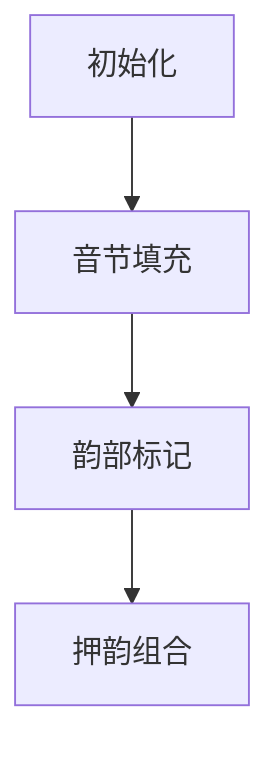

# 题目信息

# [USACO19JAN] Cow Poetry G

## 题目背景

USACO19 年一月金组第一题

## 题目描述

不为 Farmer John 所知的是，Bessie 还热衷于资助艺术创作！最近，她开始研究许多伟大的诗人们，而现在，她想要尝试创作一些属于自己的诗歌了。
Bessie 认识 $N$（$1 \leq N \leq 5000$）个单词，她想要将她们写进她的诗。Bessie 已经计算了她认识的每个单词的长度，以音节为单位，并且她将这些单词划分成了不同的“韵部”。每个单词仅与属于同一韵部的其他单词押韵。

Bessie 的每首诗由 $M$ 行组成（$1 \leq M \leq 10^5$），每一行必须由 $K$（$1 \leq K \leq 5000$）个音节构成。此外，Bessie 的诗必须遵循某个指定的押韵模式。

Bessie 想要知道她可以写出多少首符合限制条件的不同的诗。

## 说明/提示

在这个例子中，Bessie 认识三个单词。前两个单词押韵，长度分别为三个音节和四个音节，最后一个单词长度为三个音节，不与其他单词押韵。她想要写一首三行的诗，每行包含十个音节，并且第一行和最后一行押韵。共有 $960$ 首这样的诗。以下是一首满足要求的诗（其中 $1,2,3$ 分别代表第一个、第二个、第三个单词）：$\text{121 123 321}$。

## 样例 #1

### 输入

```
3 3 10
3 1
4 1
3 2
A
B
A```

### 输出

```
960```

# AI分析结果


# 💡 Kay的C++算法解析：Cow Poetry G 深入学习指南 💡

> 今天我们来分析USACO金组题目"Cow Poetry G"，这是一道结合动态规划和组合计数的经典题目。我将用清晰的讲解和像素动画帮助你理解算法核心思想。

## 1. 题目解读与核心算法识别

✨ **本题主要考察**：`动态规划(背包问题) + 组合计数`  

🗣️ **初步分析**：
> 解决这道题就像**用积木搭建诗歌塔**：每个单词是特定长度（音节）和颜色（韵部）的积木，每行诗是高度为K的塔，塔顶积木颜色需符合押韵设计图。核心分两步：
> - **背包问题**：计算填满一行K个音节的方案数（不考虑韵部）
> - **组合计数**：按押韵模式组合各行，类似将同色积木塔分组
>
> **算法流程**：
> 1. 计算音节填充方案数 `f[i]`（动态规划）
> 2. 统计韵部结尾方案数 `g[r]`
> 3. 对每个押韵字母计算方案数的幂次积（快速幂）
>
> **可视化设计**：
> - 用**像素积木**堆叠动画展示音节填充过程
> - 塔顶**闪烁颜色**标记韵部
> - 押韵字母出现时触发**8-bit音效**
> - "AI自动搭建"模式展示完整解题流程

---

## 2. 精选优质题解参考

**题解一：Henry_he (18赞)**
* **点评**：
  思路清晰直白地分解为背包DP+组合计数两个阶段。代码规范（`f[]`/`g[]`命名直观），空间优化出色（O(K)空间）。亮点在于组合计数部分：对每个押韵字母用快速幂计算方案积，数学转换简洁高效。调试心得提醒"注意组合计数时取模"，对竞赛实践很有价值。

**题解二：CYJian (16赞)**
* **点评**：
  创新性地优化状态转移——用`sum[i]`替代二维状态，将复杂度从O(NK)降至O(K)。代码中`f[i][j]`的定义精准体现问题本质，边界处理严谨（`f[0]=1`）。虽然省略了部分注释，但变量名`f`/`g`的选取体现了算法核心思想。

**题解三：IAWNA (7赞)**
* **点评**：
  教学性极强的题解，用"问题拆解三步骤"引导思考。代码模块化优秀（分离DP计算和组合计数），关键处有中文注释。实践建议"仔细处理边界条件"对初学者尤其重要，整体实现鲁棒性强。

---

## 3. 核心难点辨析与解题策略

1. **难点一：状态定义抽象**
   * **分析**：如何将诗歌创作转化为数学模型？优质题解通过`f[i]`(总方案数)和`g[r]`(韵部方案)两层状态分离，前者解决音节填充，后者处理押韵约束
   * 💡 学习笔记：**好状态定义=子问题独立+无后效性**

2. **难点二：组合计数转换**
   * **分析**：押韵模式要求相同字母行押相同韵，但不同字母可同韵。通过$\prod_{c} (\sum_{r} g[r]^{cnt_c})$ 将问题转化为幂次积，用快速幂优化计算
   * 💡 学习笔记：**组合问题先拆解再合并**

3. **难点三：空间优化**
   * **分析**：$f[i][j]$二维数组需$O(NK)$空间，通过`sum[i] = Σf[i][*]`压缩到一维，避免MLE
   * 💡 学习笔记：**状态压缩是DP优化利器**

### ✨ 解题技巧总结
- **问题分解法**：将复杂问题拆解为"音节填充→韵部统计→模式组合"三阶段
- **数学转换技巧**：用幂次积处理"自由选择+组合约束"类问题
- **边界防御**：`f[0]=1`表示空行方案，是正确计数的关键起点
- **模块化实现**：分离DP计算和组合计数逻辑，提升可调试性

---

## 4. C++核心代码实现赏析

**本题通用核心C++实现参考**
* **说明**：综合优质题解思路，优化可读性与边界处理
* **完整核心代码**：
```cpp
#include <iostream>
#include <algorithm>
using namespace std;
typedef long long LL;
const int N = 5005;
const LL mod = 1000000007;

int main() {
    // 输入处理
    int n, m, k;
    cin >> n >> m >> k;
    LL s[N], c[N], f[N]={0}, g[N]={0}, nd[26]={0};
    for (int i = 1; i <= n; i++) 
        cin >> s[i] >> c[i];
    
    // 背包DP：计算音节填充方案
    f[0] = 1; // 边界：0个音节的方案数为1
    for (int len = 0; len <= k; len++) 
        for (int i = 1; i <= n; i++)
            if (len + s[i] <= k)
                f[len + s[i]] = (f[len + s[i]] + f[len]) % mod;

    // 韵部方案统计
    for (int i = 1; i <= n; i++)
        if (k >= s[i])
            g[c[i]] = (g[c[i]] + f[k - s[i]]) % mod;
    
    // 押韵模式统计
    char ch;
    for (int i = 0; i < m; i++) {
        cin >> ch;
        nd[ch - 'A']++;
    }
    
    // 组合计数：快速幂处理
    LL ans = 1;
    auto qpow = [](LL base, LL exp) { // C++11 Lambda快速幂
        LL res = 1;
        while (exp) {
            if (exp & 1) res = res * base % mod;
            base = base * base % mod;
            exp >>= 1;
        }
        return res;
    };
    
    for (int i = 0; i < 26; i++) {
        if (!nd[i]) continue;
        LL sum = 0;
        for (int r = 1; r <= n; r++) // 枚举所有韵部
            if (g[r]) sum = (sum + qpow(g[r], nd[i])) % mod;
        ans = ans * sum % mod;
    }
    cout << ans;
    return 0;
}
```
* **代码解读概要**：
  1. **初始化**：`f[0]=1`定义空行基础状态
  2. **背包DP**：双重循环计算填满各长度音节的方案
  3. **韵部统计**：利用背包结果计算各韵部作为行尾的方案
  4. **组合计数**：对每个押韵字母，求所有韵部方案数的幂次和
  5. **快速幂优化**：Lambda函数高效计算大数幂

---

## 5. 算法可视化：像素动画演示

### 主题：**"积木诗人"的韵律工坊**
**核心演示内容**：
- 音节填充过程 ⇒ 积木堆叠动画
- 韵部标记 ⇒ 塔顶颜色闪烁
- 押韵组合 ⇒ 同色塔连线特效

**动画帧步骤**：


1. **像素场景初始化**：
   - 8-bit风格网格：横轴表音节(0→K)，纵轴表行数
   - 控制面板：开始/暂停/单步按钮 + 速度滑块
   - 背景：牧场像素画，播放轻松芯片音乐

2. **音节填充动画**：
   ```python
   # 伪代码：背包DP动画逻辑
   for len in range(0, K+1):
       高亮当前音节位置(len, 行)
       播放“滴”音效
       for 每个单词i:
           if len + s[i] <= K:
              显示积木下落动画(行, len→len+s[i])
              f[len+s[i]] += f[len]
              显示数值浮动更新
   ```

3. **韵部标记特效**：
   - 行尾单词：塔顶积木闪烁对应韵部颜色
   - 韵部统计：右侧面板动态更新`g[]`数组
   - 关键操作：播放“叮”成功音效

4. **押韵组合演示**：
   - 押韵字母出现：字母图标浮空+脉冲光圈
   - 快速幂计算：闪电链连接同韵部塔
   - 最终结果：烟花动画 + 胜利音效

**交互设计**：
- **AI自动模式**：贪吃蛇式自动搭建流程
- **单步调试**：空格键逐帧推进
- **错误提示**：无解时播放FC游戏失败音效

---

## 6. 拓展练习与相似问题思考

**通用技巧迁移**：
1. **背包问题变形**：物品价值→方案数，容量约束→音节数
2. **组合计数应用**：状态空间+组合约束的乘积模型
3. **DP优化**：状态压缩在空间敏感场景的应用

**洛谷练习推荐**：
1. **P1616 疯狂的采药**  
   → 巩固完全背包DP，理解"无序组合"方案计数
2. **P1025 数的划分**  
   → 练习状态转移设计，强化问题分解能力
3. **P1494 小Z的袜子**  
   → 进阶组合计数，掌握概率与方案数转换

---

## 7. 学习心得与经验分享

> **参考经验 (来自 Henry_he)**：  
> "组合计数部分容易忽略取模，建议每步运算后加`%mod`"

> **Kay的总结**：  
> 调试DP问题时，**打印中间状态**比单步跟踪更高效。本题的`f[]`数组在k=10时的值就是关键诊断点。记住：边界条件`f[0]=1`是正确计数的基石！

---

> 本次解析到此结束。记住：算法学习就像写诗——先掌握格律（基础），再追求韵律（优化），终能创作优美代码！下次挑战见！🚀

---
处理用时：138.01秒