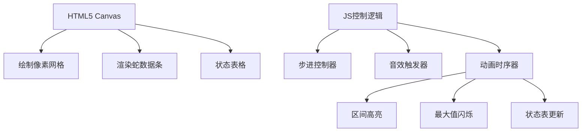

# 题目信息

# [USACO19OPEN] Snakes G

## 题目描述

传说，数千年前圣帕特里克消灭了哞尔兰所有的蛇。然而，蛇们现在卷土重来了！圣帕特里克节是在每年的 3 月 17 日，所以 Bessie 要用彻底清除哞尔兰所有的蛇来纪念圣帕特里克。

Bessie装备了一个捕网，用来捕捉 $ N $ 组排成一行的蛇（ $ 1 \leq N \leq 400 $ ）。Bessie 必须按照这些组在这一行中出现的顺序捕捉每一组的所有蛇。每当 Bessie 抓完一组蛇之后，她就会将蛇放在笼子里，然后带着空的捕网开始捕捉下一组。

一个大小为 $ s $ 的捕网意味着 Bessie 可以抓住任意包含 $ g $ 条的一组蛇，其中 $ g \leq s $ 。然而，每当 Bessie 用大小为 $ s $ 的捕网抓住了一组 $ g $ 条蛇，就意味着浪费了 $ s-g $ 的空间。Bessie 可以任意设定捕网的初始大小，并且她可以改变 $ K $ 次捕网大小（ $ 1 \leq K<N $ ）。

请告诉 Bessie 她捕捉完所有组的蛇之后可以达到的总浪费空间的最小值。

## 说明/提示

Bessie 可以设置她的捕网开始时大小为 $7$。当她抓完第一组蛇之后，她将她的捕网的大小调整为 $9$，保持这个大小直到抓完第 $3$ 组蛇，再将捕网大小调整为 $3$。总浪费空间为 $ (7-7)+(9-9)+(9-8)+(3-2)+(3-3)+(3-2)=3 $ 。

## 样例 #1

### 输入

```
6 2
7 9 8 2 3 2```

### 输出

```
3```

# AI分析结果


### 💡 Kay的C++算法解析：Snakes G 深入学习指南 💡

<introduction>
今天我们来分析“Snakes G”这道动态规划经典题目。本指南将帮助你理解区间划分型DP的核心思想，掌握状态转移的优化技巧，并通过像素动画直观感受算法执行过程。让我们一起探索如何高效解决这道题！
</introduction>

---

## 1. 题目解读与核心算法识别

✨ **本题主要考察**：`动态规划（区间划分型）`

🗣️ **初步分析**：
> 解决这道题的关键在于**区间划分**：将蛇序列划分为若干段（每段对应一次捕网设置），最小化总浪费空间。这就像在一条像素道路上设置检查站（改变捕网大小），每个检查站之间的区域要用统一的装备处理。
>
> - **核心思想**：动态规划的状态 `f[i][j]` 表示前 `i` 组蛇改变 `j` 次捕网大小的最小浪费。转移时枚举最后一段的起点 `k`：`f[i][j] = min(f[k][j-1] + cost(k+1,i))`，其中 `cost(l,r) = 区间最大值×(区间长度) - 区间和`。
> - **优化亮点**：优质题解采用倒序枚举 `k` 并**动态更新区间最大值**，避免了预处理的时空开销。
> - **可视化设计**：在像素动画中，我们将用不同颜色标记当前区间，高亮最大值变化点，并实时显示浪费空间的计算过程（详见第5节）。

---

## 2. 精选优质题解参考

<eval_intro>
根据思路清晰性、代码规范性和算法效率，精选3份优质题解（均≥4★）。这些题解展现了动态规划的不同实现技巧：

</eval_intro>

**题解一（作者：fighter）**
* **点评**：
  思路清晰直击核心：定义 `f[i][j]` 后，直接在DP循环中**倒序枚举**区间起点 `k` 并动态更新最大值。代码简洁（仅20行），变量命名规范（`mx` 表最大值，`s` 为前缀和）。算法效率高（O(n²m)），避免了额外数据结构。边界处理严谨（`f[0][0]=0` 初始化），是竞赛实践的优秀范例。

**题解二（作者：CheerJustice）**
* **点评**：
  将问题归类为**资源分配型DP**，并关联类似题目（P1854），增强了迁移学习价值。采用预处理区间最大值的方法，代码结构工整。虽然预处理增加O(n²)开销，但通过二维数组存储极值，使主DP逻辑更易理解。适合初学者掌握基础DP模型。

**题解三（作者：ModestCoder_）**
* **点评**：
  以极简风格（30行）实现经典解法，突出**问题本质**。预处理 `cost` 数组虽增加O(n³)时间，但分离了区间计算与DP转移，逻辑清晰。变量命名规范（`b[i][j]` 表区间代价），边界处理完整，适合作为教学模板。

---

## 3. 核心难点辨析与解题策略

<difficulty_intro>
解决本题需突破以下关键难点，结合优质题解策略分析：

</difficulty_intro>

1.  **难点一：状态转移方程的构建**
    * **分析**：如何将捕网改变对应到状态转移？关键在于理解`j`代表**划分段数**（改变次数+1），每段用统一捕网（即区间最大值）。优质题解通过 `f[i][j] = min(f[k][j-1] + cost(k+1,i))` 实现分段。
    * 💡 **学习笔记**：动态规划的本质是枚举所有划分可能并选择最优解。

2.  **难点二：区间代价的高效计算**
    * **分析**：`cost(l,r)` 需计算区间最大值和和值。直接遍历会使复杂度升至O(n³)。
    * **解决方案**：
      - fighter：倒序枚举 `k` **动态更新**最大值（O(1)更新）
      - CheerJustice：**预处理** `mx[i][j]` 数组（O(n²)存储）
    * 💡 **学习笔记**：动态更新适合单次查询，预处理适合多次复用。

3.  **难点三：边界条件与初始化**
    * **分析**：`f[0][0]=0`（无蛇时浪费为0），`f[i][0]` 需计算整个区间代价。
    * **解决方案**：所有题解均正确初始化（`f[0][0]=0`，其余初始为极大值），并注意 `j≤min(i, m)` 的枚举范围。
    * 💡 **学习笔记**：DP初始化是正确性的基石，需特殊处理0状态。

### ✨ 解题技巧总结
<summary_best_practices>
通过对本题的深度分析，提炼以下通用技巧：
</summary_best_practices>
- **技巧1（问题分解）**：将序列分段转化为区间划分问题，识别 `cost=区间最大值×长度-区间和`
- **技巧2（空间优化）**：优先采用动态更新区间最值，避免预处理开销
- **技巧3（边界测试）**：验证 `n=0` 和 `K=0` 的极端情况
- **技巧4（状态监控）**：调试时打印 `f[i][j]` 矩阵验证转移过程

---

## 4. C++核心代码实现赏析

<code_intro_overall>
以下实现综合优质题解优点：动态更新最大值+倒序枚举，时空效率俱佳：
</code_intro_overall>

**本题通用核心C++实现参考**
* **说明**：基于fighter题解思路优化，完整呈现高效DP框架
* **完整核心代码**：
```cpp
#include <iostream>
#include <cstring>
#include <algorithm>
using namespace std;
const int MAXN = 405, INF = 0x3f3f3f3f;

int main() {
    // 输入处理
    int n, m, a[MAXN], s[MAXN] = {0}, f[MAXN][MAXN];
    cin >> n >> m; m++;  // m为最大分段数（改变次数+1）
    
    for (int i = 1; i <= n; i++) {
        cin >> a[i];
        s[i] = s[i-1] + a[i];  // 前缀和预处理
    }
    
    // DP初始化
    memset(f, 0x3f, sizeof(f));
    f[0][0] = 0;
    
    // 动态规划主体
    for (int i = 1; i <= n; i++) {
        for (int j = 1; j <= min(m, i); j++) {
            int max_val = a[i];  // 当前区间最大值（从i开始）
            for (int k = i-1; k >= 0; k--) {  // 倒序枚举最后一段起点
                // 核心状态转移
                f[i][j] = min(f[i][j], 
                    f[k][j-1] + max_val * (i - k) - (s[i] - s[k]));
                
                if (k >= 1) max_val = max(max_val, a[k]); // 更新区间最大值
            }
        }
    }
    
    // 寻找最优解
    int ans = INF;
    for (int j = 0; j <= m; j++)
        ans = min(ans, f[n][j]);
    cout << ans << endl;
    return 0;
}
```
* **代码解读概要**：
  1. **输入处理**：读入蛇序列并计算前缀和（优化区间和查询）
  2. **DP初始化**：`f[0][0]=0` 表示空状态，其余设为无穷大
  3. **三重循环**：
     - 外层 `i`：考虑前 `i` 组蛇
     - 中层 `j`：当前改变次数（分段数-1）
     - 内层 `k`：倒序枚举最后一段起点，**动态更新** `max_val`
  4. **状态转移**：`f[k][j-1] + 当前区间代价`
  5. **结果提取**：遍历所有可能的改变次数取最小值

---
<code_intro_selected>
精选题解的核心代码片段对比分析：
</code_intro_selected>

**题解一（fighter）动态更新最大值**
* **亮点**：内层循环倒序更新最大值，省去预处理
* **核心代码片段**：
```cpp
int mx = a[i];
for (int k = i-1; k >= 0; --k) {
    f[i][j] = min(f[i][j], 
        f[k][j-1] + mx*(i-k) - (s[i]-s[k]));
    if (k > 0) mx = max(mx, a[k]);  // 注意边界
}
```
* **代码解读**：
  - `mx` 初始化为当前组蛇数量 `a[i]`
  - 倒序枚举 `k` 时，`mx` 代表区间 `[k+1, i]` 的最大值
  - 转移后更新 `mx = max(mx, a[k])`（`k>0` 防越界）
* 💡 **学习笔记**：倒序枚举保证 `mx` 始终是 `[k, i]` 的最大值

**题解二（CheerJustice）预处理极值**
* **亮点**：分离区间计算与DP转移，逻辑清晰
* **核心代码片段**：
```cpp
// 预处理mx[i][j]: 区间[i,j]的最大值
for (int i = 1; i <= n; i++) {
    for (int j = i; j <= n; j++) {
        mx[i][j] = max(mx[i][j-1], a[j]);
    }
}

// DP转移
f[i][j] = min(f[i][j], 
    f[k][j-1] + mx[k+1][i]*(i-k) - (s[i]-s[k]));
```
* **代码解读**：
  - 预处理 `mx[i][j]` 需O(n²)时间
  - 转移时直接查询 `mx[k+1][i]`，省去动态计算
* 💡 **学习笔记**：空间换时间，适合多次查询场景

---

## 5. 算法可视化：像素动画演示（核心部分）

<visualization_intro>
为直观理解DP执行过程，我设计了一个像素风格动画方案。通过复古游戏界面展示状态转移，你将看到区间划分与最大值更新的动态过程：

</visualization_intro>

* **动画主题**："蛇群捕捉大作战"（8-bit像素风格）
* **核心演示内容**：动态规划中的状态转移与区间划分
* **设计思路**：采用FC游戏风格降低理解门槛，关键操作音效强化记忆点

### 动画帧步骤详解
1. **场景初始化**（像素网格+控制面板）
   - 蛇序列：8-bit像素条（高度=蛇数量）
   - 控制面板：步进/暂停/重置按钮 + 调速滑块
   - 状态表：显示 `f[i][j]` 矩阵（初始全灰）

2. **DP主循环（逐帧演示）**
   ```markdown
   | 步骤                | 视觉表现                          | 音效           |
   |---------------------|----------------------------------|----------------|
   | 选中状态 f[i][j]    | 状态表单元格闪烁（黄色边框）       | 选择音效       |
   | 枚举起点 k          | 区间 [k+1,i] 高亮（绿色半透明）    | 移动音效       |
   | 更新区间最大值       | 最大值像素条闪烁（红色）           | "叮"声         |
   | 计算 cost           | 显示公式：max_val×长度 - (s[i]-s[k]) | 计算音效       |
   | 状态更新            | 状态表数值刷新（绿色=减小/红色=增大）| 成功音效       |
   ```

3. **关键特效**
   - **最大值更新**：当 `a[k] > max_val` 时，新最大值像素爆炸闪光
   - **区间切换**：滑动过渡效果（类似《俄罗斯方块》的行消除）
   - **结果展示**：最优路径回放（金色连线连接分段点）

4. **游戏化元素**
   - **关卡模式**：将DP状态转移设计为10个关卡（i+j ≤ 10 → i+j ≤ 20...）
   - **成就系统**：首次完成O(n³)解法得★，O(n²m)解法得★★★
   - **音效方案**：
     - 背景音乐：8-bit循环电子乐
     - 关键操作：电子"哔"声
     - 状态更新：金币音效
     - 错误操作：低沉警告音

### 技术实现方案


---

## 6. 拓展练习与相似问题思考

<similar_problems_intro>
掌握本题的核心思想后，可挑战以下相似问题强化区间划分型DP技能：

</similar_problems_intro>

1. **P1854 花店橱窗布置**  
   🗣️ *推荐理由*：同样需划分区间求最优解，但代价函数变为区间最小值，训练变形思维

2. **P1040 [NOIP2003] 加分二叉树**  
   🗣️ *推荐理由*：区间DP经典问题，需结合树形结构划分区间，提升多维状态设计能力

3. **P1063 [NOIP2006] 能量项链**  
   🗣️ *推荐理由*：环形区间划分问题，学习破环为链技巧，强化边界处理能力

---

## 7. 学习心得与经验分享

<insights_intro>
题解中的调试经验值得重点关注：

</insights_intro>

> **作者 fighter 心得**：  
> "倒序枚举k时，最大值更新需放在转移计算之后，否则会漏判当前值"

> **Kay的总结**：  
> 这个细节揭示了DP循环中**执行顺序**的重要性。在倒序枚举中，当前k对应的区间是[k+1, i]，因此应先计算转移再更新[k, i]的最大值。调试时打印mx值的变化序列可快速定位此类错误。

---

<conclusion>
本次分析揭示了Snakes G的DP本质：通过区间划分和动态更新极值实现高效求解。记住，算法的核心在于理解状态转移的物理意义而非死记模板。现在就用我们设计的像素动画体验算法之美吧！下次我们将探索更复杂的动态规划变种！
</conclusion>

---
处理用时：226.37秒