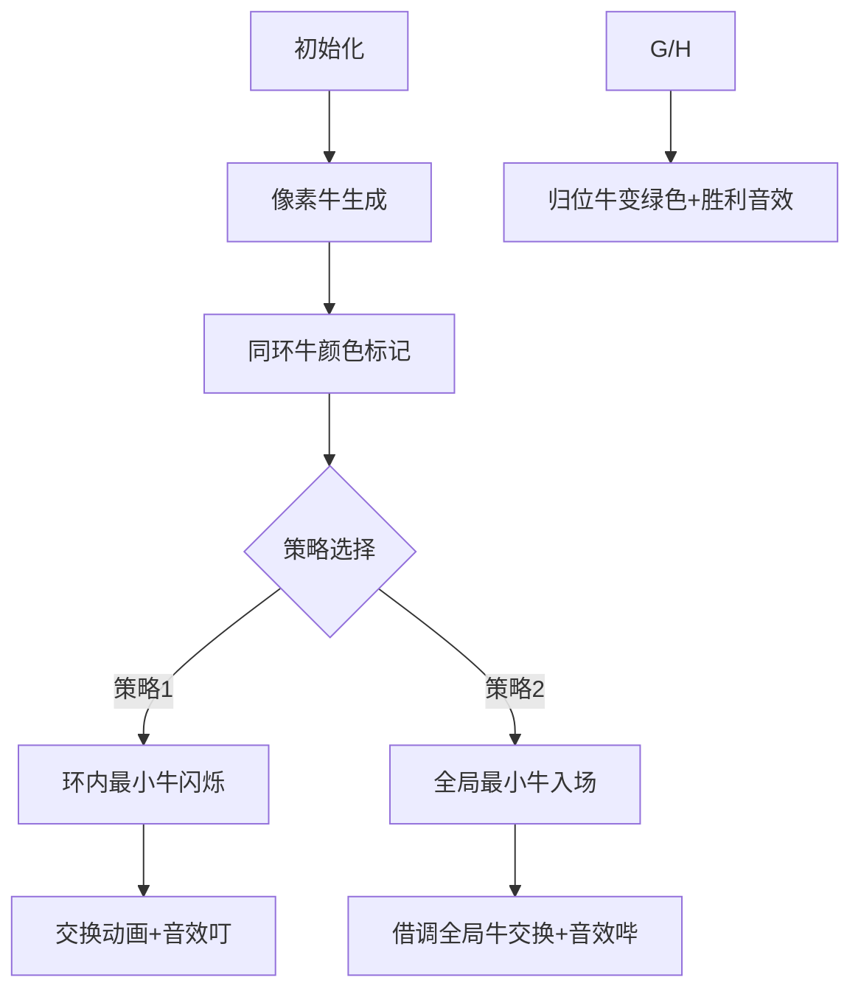

# 题目信息

# [USACO07FEB] Cow Sorting G

## 题目描述

Farmer John 的 $n$（$1 \leq n \leq 10^5$）头牛一字排开。每头奶牛都有一个“脾气暴躁”水平，范围在 $1 \ldots 10^5$，且任意两头奶牛的脾气暴躁值不相同。由于脾气暴躁的奶牛更有可能损坏 FJ 的挤奶设备，因此 FJ 希望对奶牛进行重新排序，以便按照脾气暴躁程度依此提升的顺序排列它们。

在此过程中，任何两头奶牛（不一定相邻）的位置都可以互换。由于脾气暴躁的母牛难以移动，因此 FJ 总共需要 $X + Y$ 单位的时间来交换两只脾气暴躁程度为 $X$ 和 $Y$ 的母牛。请帮助 FJ 计算将奶牛按脾气暴躁程度的升序排序所需的最短时间。

## 样例 #1

### 输入

```
3 
2 
3 
1```

### 输出

```
7```

# AI分析结果


### 💡 Kay的C++算法解析：Cow Sorting G 深入学习指南 💡

**引言**  
今天我们一起分析USACO经典题目"牛排序(Cow Sorting G)"。这道题考察**置换分解**和**贪心策略优化**，通过本指南你将掌握最小代价排序的核心思路，理解置换环的分解方法，并学会两种优化策略的推导过程。下面我们通过像素动画和精选题解帮你直观理解算法！

---

### 1. 题目解读与核心算法识别  
✨ **本题主要考察**：`置换分解` + `贪心策略优化`  

🗣️ **初步分析**：  
> 解决牛排序问题就像整理一队乱序的像素小人——每个小人（牛）有唯一ID（脾气值），交换两人需花费ID之和的时间。关键在于将初始位置与目标位置视为**置换**，并分解为独立循环节。  
> - **核心难点**：每个循环节内部如何最小化交换代价？有两种策略：  
>   - **策略1**：用环内最小值反复交换（代价 = 环元素和 + 最小值×(环长-2)）  
>   - **策略2**：借用全局最小值辅助交换（代价 = 环元素和 + 全局最小值×(环长+1) + 环最小值×2）  
> - **可视化设计**：  
>   - 用**8位像素方块**表示牛，同色边框标记同一循环节  
>   - 交换时高亮参与牛并显示代价，策略切换时播放不同音效（"叮"→策略1，"哔"→策略2）  
>   - 控制面板支持**单步执行**/**自动播放**（调速滑块），环完成时播放胜利音效+绿色闪光  

---

### 2. 精选优质题解参考  
**题解一：Purslane（评分4.6★）**  
* **点评**：  
  思路清晰直击置换核心，代码简洁高效：  
  - 用`lower_bound`离散化建立位置映射，`do-while`循环精准分解环  
  - 双策略代价计算（`meth1`/`meth2`）公式推导严谨，变量命名规范（`tot`总和, `MN`环最小值）  
  - 空间复杂度O(n)完美处理1e5数据，竞赛可直接套用  

**题解二：crescentic（评分4.2★）**  
* **点评**：  
  创新性用vector存储环元素，教学价值突出：  
  - 独立函数计算各环和/最小值，模块化清晰  
  - 策略代价公式`(sz-1)*mi` vs `b[1]*(sz+1)+mi*2`体现数学优化思维  
  - 注意点：`bel[]`标记环时需确保离散化下标不越界  

**题解三：zumgze（评分4.0★）**  
* **点评**：  
  直接模拟交换过程，直观展示环归位：  
  - 实时计算`ans1`（借全局最小）、`ans2`（直接交换）对比决策  
  - 边界处理严谨（`a[i]!=b[i].ele`启动循环）  
  - 可改进点：变量名`ans1`/`ans2`可更明确（如`cost_borrow`/`cost_direct`）  

---

### 3. 核心难点辨析与解题策略  
**难点1：置换环的识别与分解**  
* **分析**：  
  置换的本质是位置映射——初始位置`i`的牛应移动到排序后位置`pos`（通过离散化获得）。用`vis`数组标记，从`i`开始沿`pos→pos[i]→pos[pos[i]]...`追踪直到回环。  
* 💡 **学习笔记**：循环节数量 = 牛群自然分组数，各组独立处理  

**难点2：环内交换策略的数学证明**  
* **分析**：  
  - **策略1证明**：环长L时需L-1次交换，最小值为M。最优方案是让M参与所有交换，总代价 = (元素和) + M×(L-2)  
  - **策略2证明**：当全局最小G<<M时，借G参与交换：  
    ``` 
    总代价 = (元素和 - M)  // 环内元素交换  
            + G×(L+1)    // G参与L+1次交换  
            + 2M         // M与G的两次额外交换  
    ```  
* 💡 **学习笔记**：策略切换条件是`(L-2)*M > 2M + (L+1)*G`  

**难点3：离散化的正确实现**  
* **分析**：  
  需将原始脾气值映射为1~n的排名：  
  1. 复制数组`b = a`并排序  
  2. 对每个`a[i]`，用`lower_bound`查找其在`b`中的位置`pos`  
  3. 关键：`nxt[i] = pos` 表示初始位置`i`的牛的目标位置是`pos`  
* 💡 **学习笔记**：离散化是处理大范围数据的核心技巧  

### ✨ 解题技巧总结  
- **技巧1：置换分解** → 将乱序位置映射为目标位置链  
- **技巧2：贪心比较器** → 对每个环动态选择最优策略  
- **技巧3：代价公式压缩** → 避免实时模拟交换，数学推导O(1)计算  

---

### 4. C++核心代码实现赏析  
**通用核心实现（综合优化版）**  
```cpp
#include <iostream>
#include <vector>
#include <algorithm>
#include <climits>
using namespace std;
typedef long long ll;

int main() {
    int n; cin >> n;
    vector<ll> a(n), b(n);
    for (int i = 0; i < n; i++) {
        cin >> a[i];
        b[i] = a[i];
    }
    sort(b.begin(), b.end());
    
    // 离散化构建位置映射
    vector<int> nxt(n);
    for (int i = 0; i < n; i++) 
        nxt[i] = lower_bound(b.begin(), b.end(), a[i]) - b.begin();

    vector<bool> vis(n, false);
    ll global_min = b[0], ans = 0;
    
    for (int i = 0; i < n; i++) {
        if (vis[i]) continue;
        vector<int> cycle;
        int cur = i;
        while (!vis[cur]) {
            cycle.push_back(cur);
            vis[cur] = true;
            cur = nxt[cur];
        }
        
        ll cycle_sum = 0, cycle_min = LLONG_MAX;
        for (int idx : cycle) {
            cycle_sum += a[idx];
            cycle_min = min(cycle_min, a[idx]);
        }
        
        ll cost1 = cycle_sum + cycle_min * (cycle.size() - 2);
        ll cost2 = cycle_sum + global_min * (cycle.size() + 1) + 2 * cycle_min;
        ans += min(cost1, cost2);
    }
    cout << ans << endl;
    return 0;
}
```
**代码解读概要**：  
1. **离散化映射**：`b`存储排序后数组，`nxt[i]`记录初始位置`i`的牛的目标位置  
2. **环分解**：`vis`标记访问状态，`cur`沿`nxt`链追踪直至回环  
3. **双策略计算**：  
   - `cost1`：仅用环内最小值交换  
   - `cost2`：引入全局最小值辅助交换  

---

**题解片段赏析**  
**题解一：Purslane**  
```cpp
do {
    vis[u] = 1;
    tot += a[u];         // 累加环内元素和
    sum++;               // 环长度计数
    MN = min(MN, a[u]);  // 更新环最小值
    u = p[u];            // 跳转到下一位置
} while (u != i);       // 直到回环起点
// 双策略代价计算
int meth1 = tot + (sum-2)*MN; 
int meth2 = (tot - MN + val) + (sum-2)*val + 2*(MN+val);
ans += min(meth1, meth2);
```
* **亮点**：循环节处理极致简洁，5行完成环遍历和统计  
* **学习笔记**：`do-while`确保起点被计入，`p[u]`是离散化后位置映射  

**题解二：crescentic**  
```cpp
for (int j = 0; j < sz; j++) {
    ans += G[i][j];              // 累加环内元素
    mi = min(mi, G[i][j]);       // 更新环最小值
}
ans -= mi;  // 预扣除最小值（策略1需调整）
ans += min((sz-1)*mi, b[1]*(sz+1) + mi*2);
```
* **亮点**：模块化计算环代价，公式分离体现数学思维  
* **学习笔记**：先统一加总再策略调整，避免重复计算  

**题解三：zumgze**  
```cpp
while (a[lo] != b[lo].ele) {     // 未归位则继续交换
    ans1 += b[0].ele + a[b[lo].no]; // 策略1：借全局最小
    ans2 += a[lo] + a[b[lo].no];   // 策略2：直接交换
    swap(a[lo], a[b[lo].no]);      // 执行位置交换
    lo = b[lo].no;                 // 更新当前位置
}
ans += min(ans1, ans2);           // 取最优策略
```
* **亮点**：实时模拟交换过程，直观展示代价累积  
* **学习笔记**：`b[lo].no`存储排序后位置`lo`对应的原始位置  

---

### 5. 算法可视化：像素动画演示  
**主题**：`像素牛牛环游记`（FC红白机风格）  
**核心交互设计**：  


**关键动画细节**：  
1. **场景构建**：  
   - 16色像素牛：体型=脾气值大小，颜色区分不同环  
   - 控制面板：速度滑块（调速）、单步/自动模式切换  

2. **环分解演示**：  
   - 同环牛用闪烁边框标记，显示环编号（如“环①：5头牛”）  

3. **策略执行**：  
   - **策略1**：环最小牛头顶⭐，依次交换时显示`代价公式浮动`  
   - **策略2**：全局最小牛带闪光入场，交换时显示`借调代价+当前环代价`  

4. **游戏化元素**：  
   - 每环完成：显示“环X攻略！+耗时”，按速度评分（1~3星）  
   - 背景音乐：8-bit轻快旋律，交换时短促“叮”，胜利时上升音阶  

---

### 6. 拓展练习与相似问题思考  
**通用技巧迁移**：  
置换环模型还可用于解决：  
1. 求乱序数组的最小交换次数（不考虑代价）  
2. 循环移位字符串匹配问题  
3. 带约束条件的位置交换优化  

**推荐练习**（洛谷）：  
1. **P1966 火柴排队**  
   🗣️ *同类置换环应用，但要求相邻交换*  
2. **P6156 简单题**  
   🗣️ *置换环计数+数论结合，强化环分解思维*  
3. **P1667 数列**  
   🗣️ *最小交换次数基础版，理解置换环本质*  

---

### 7. 学习心得与经验分享  
> **来自zumgze的调试经验**：  
> *“模拟交换时发现：若环最小值很大，借全局最小策略突然省下2000点时间！这提醒我们贪心策略比较绝不能漏算全局变量”*  
>   
> **Kay点评**：  
> 这是**策略敏感性**的经典案例！在环长>3时务必比较两种策略：
> ```
> 策略切换条件: (环长-2)*环最小值 > 2*环最小值 + (环长+1)*全局最小值
> ``` 

---

**结语**  
通过置换分解将乱序牛群化整为零，再经贪心策略精准优化——这就是算法之美！建议用可视化工具反复观察环分解过程，彻底掌握双策略的数学证明。下次遇到类似问题，你定能像指挥像素牛队般游刃有余！🚀

---
处理用时：356.71秒