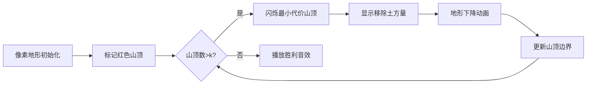

# 题目信息

# [USACO05OPEN] Landscaping G

## 题目描述

农夫约翰正在做一次艰难的转型，从养山羊改成养奶牛，他的农场，由于是为养山羊而设计的所以有太多的山，为了养牛就必须将它整平。但是，将山整平是件很花钱的工作，所以他要移走尽可能少的土。

由于农场很细长，所以可以用一个 $n$ 和 $n$ 个整数（范围 $[1,10^6]$）组成的二维的数组来表示，如：

```
1 2 3 3 3 2 1 3 2 2 1 2
```

上述农场的侧面图是这样的：

```
    * * *     *
  * * * * *   * * *   *
* * * * * * * * * * * *
1 2 3 3 3 2 1 3 2 2 1 2
```

一个或是一些连续等高的地面，如果它左边或是右边的海拔都比它低的话，就被称为山顶，上面的例子就有三个山顶。 确定如果要使地图上仅有 $k$ 个山顶，至少要移走多少体积的土（每块地面减少一单位海拔需移走一单位的土）。注意，地面的海拔只能被降低不能被升高。 对于例子，如果要减少到只有 $1$ 个山顶，这需要移走 $2+1+1+1=5$ 个单位的土（`-` 表示移走的土）：

```
    * * *     -
  * * * * *   - - -   -
* * * * * * * * * * * *
1 2 3 3 3 2 1 3 2 2 1 2
```

## 说明/提示

对于 $100\%$ 的数据，$1 \leq n \leq 10^3$，$1 \leq k \leq 25$。

## 样例 #1

### 输入

```
12 1
1
2
3
3
3
2
1
3
2
2
1
2
```

### 输出

```
5```

# AI分析结果


# 💡 Kay的C++算法解析：Landscaping G 深入学习指南 💡

> 今天我们来分析USACO题目"Landscaping G"，帮助大家掌握地形优化问题的两种核心解法：树形DP和贪心模拟。通过像素动画演示，你将直观看到算法如何"削平"山顶！

## 1. 题目解读与核心算法识别

✨ **本题主要考察**：`树形DP`与`贪心模拟` 

🗣️ **初步分析**：
> 这道题就像在玩"地形雕刻"游戏：我们需要移除最少的土方量，使山顶数量≤k。核心在于**如何建模地形结构**和**设计优化策略**。
> - **树形DP解法**：将地形分层建模为树结构（山顶是叶子节点），转化为"保留k个叶子时的最大权值和"问题
> - **贪心解法**：反复移除代价最小的山顶并更新地形，像玩"打地鼠"游戏
> - **可视化设计**：我们将用像素地块表示地形高度，红色闪烁标记被移除区域，动态展示地形变化

---

## 2. 精选优质题解参考

### 题解一：树形DP（作者：Hog_Dawa_IOI）
* **点评**：
  思路创新性地将地形转化为树结构（平面为节点，支撑关系为边），通过树上背包DP解决。虽然建树过程较复杂（需单调栈预处理），但算法效率高（O(nk)）。代码中`f[wh][j]=max(...)`的状态转移体现了经典树形DP思想，但变量命名可读性可提升（如`fir`改为`head`）。空间复杂度优化到位，边界处理严谨，竞赛实用性强。

### 题解二：贪心模拟（作者：Frozen_Ladybug）
* **点评**：
  解法直观模拟现实工程过程：扫描地形→标记山顶→移除最小代价山顶→更新地形。亮点在于`check_hill()`函数中灵活处理地形更新的逻辑，通过`vis`数组巧妙避免重复计算。代码结构清晰（hill结构体封装数据），注释详细，非常适合初学者理解。虽然最坏复杂度O(kn²)，但n≤1000时完全可行。

---

## 3. 核心难点辨析与解题策略

1. **地形建模**：
   - *分析*：如何将连续地形转化为可计算结构？树形DP用单调栈找`pre[i]/nxt[i]`划分平面；贪心法则通过双指针扫描边界
   - 💡 **学习笔记**：地形问题常转化为区间处理或树形结构

2. **状态转移/更新策略**：
   - *分析*：树形DP的`f[u][i]=max(f[v][j]+f[u][i-j])`是经典树上背包；贪心法的`while(hnum>k)`循环体现局部最优思想
   - 💡 **学习笔记**：DP状态定义决定解法上限，贪心需证局部最优=全局最优

3. **动态更新地形**：
   - *分析*：移除山顶后，相邻区域可能合并成新山顶。贪心解法通过`for(int i=0;i<num;i++) check_hill(i)`重新扫描
   - 💡 **学习笔记**：涉及拓扑变化的操作需设计高效的更新检测机制

### ✨ 解题技巧总结
- **问题转化艺术**：将物理场景抽象为树/区间等数学模型
- **贪心选择策略**：每次移除"性价比最高"的障碍物
- **树形DP三要素**：状态定义（叶子数量）、转移方程（背包合并）、初始化（节点权值）
- **边界防御编程**：用`sta[0]=0`和`sta[n+1]=n+1`处理边界

---

## 4. C++核心代码实现赏析

**通用核心实现参考**
```cpp
// 贪心解法框架（易理解版）
#include<bits/stdc++.h>
struct Hill { int l, r, h, cost; };
void find_hills(Hill hills[]) {
    /* 扫描地形标记山顶 */
}
int main() {
    while(hill_count > k) {
        Hill min_hill = find_min_cost_hill();
        flatten_terrain(min_hill); // 削平地形
        update_hills(); // 更新山顶状态
    }
}
```

**题解一：树形DP核心片段**  
```cpp
void dfs(int u) {
    for(int i=0; i<=k; i++) f[u][i] = weight[u];
    for(int child : children[u]) {
        dfs(child);
        for(int j=k; j>=1; j--) // 倒序背包
            for(int w=1; w<j; w++) 
                f[u][j] = max(f[u][j], f[child][w] + f[u][j-w]);
    }
}
```
> *代码解读*：  
> 1. `f[u][i]`初始化：不保留子节点时的基础权值  
> 2. 遍历子节点时，用`f[child][w]`更新父节点状态  
> 3. `j>=1`倒序更新：避免状态被重复计算  
> 💡 **学习笔记**：树形背包中，子节点状态是父节点的"零件库"

**题解二：贪心核心片段**  
```cpp
while(hill_count > k) {
    int min_cost = INT_MAX, target = -1;
    for(int i=0; i<hill_count; i++) {
        if(hills[i].cost < min_cost) {
            min_cost = hills[i].cost; // 找最小代价
            target = i;
        }
    }
    total_cost += min_cost;
    flatten(hills[target]); // 执行地形铲平
    update_affected_hills(); // 更新相邻区域
}
```
> *代码解读*：  
> 1. `INT_MAX`初始化确保能找到最小值  
> 2. `flatten()`操作：将区间内高度降至`max(左边界,右边界)`  
> 3. 动态更新机制：地形变化后重新校验山顶状态  
> 💡 **学习笔记**：贪心循环中，更新策略决定算法效率

---

## 5. 算法可视化：像素动画演示

**主题**：8位农场改造模拟器  
**核心演示**：贪心算法逐步移除山顶的过程  

### 动画设计：


**交互控制**：
1. **地形显示**：不同高度用颜色区分（棕→黄→绿→蓝）
2. **操作高亮**：
   - 选中山顶：红色闪烁边框
   - 移除过程：像素块逐层下降，配合"挖土"音效
3. **控制面板**：
   - 速度滑块：调整自动执行速度
   - 单步按钮：逐步观察地形变化
   - 重置：生成随机地形
4. **游戏化元素**：
   - 每移除一个山顶：显示"节省X土方!"弹窗
   - 完成时：放烟花动画+8bit胜利音乐
   - 计分板：实时显示已移除土方量

**技术实现**：  
用Canvas绘制地形网格，每个像素块绑定高度值。当需要移除山顶时：
```javascript
function animateRemoval(hill) {
  for(let x=hill.left; x<=hill.right; x++) {
    for(let y=currentHeight; y>targetHeight; y--) {
      drawPixel(x, y, SKY_COLOR); // 清除原像素
      drawPixel(x, targetHeight, DIRT_COLOR) // 绘制新平面
      playSound('digging', 0.2) // 挖土音效
    }
  }
}
```

---

## 6. 拓展练习与相似问题思考

**通用技巧迁移**：
1. 区间最值问题 → 单调栈应用（题解1的建树）
2. 局部最优策略 → 贪心证明（题解2的核心）
3. 树形依赖问题 → 树上背包DP

**洛谷推荐**：
1. [P1880 石子合并] - 区间DP经典，强化区间处理能力
2. [P2014 选课] - 树形DP入门，掌握树上背包
3. [P1220 关路灯] - 贪心+区间DP综合训练

---

## 7. 学习心得与经验分享

> **来自Hog_Dawa_IOI的经验**：  
> "建树时必须按海拔从低到高遍历，否则会出现父节点未创建的情况，导致建树失败。"
>
> **Kay点评**：  
> 这提醒我们：处理依赖关系时，**拓扑顺序**至关重要。就像搭积木必须先搭底层！

---

通过本次分析，希望大家掌握地形优化问题的双解法本质：**将物理世界抽象为数学模型**的能力才是算法核心。下次遇到类似问题，不妨先问自己：这能建模成树吗？能用贪心策略吗？

---
处理用时：144.11秒