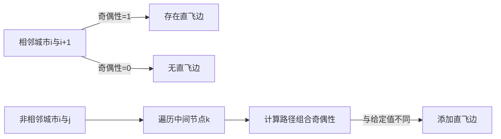
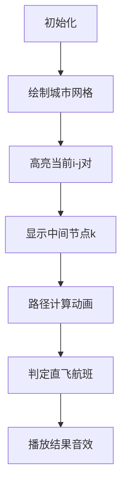

# 题目信息

# [USACO23DEC] Flight Routes G

## 题目描述

Bessie 最近发现她最喜欢的摇滚艺术家 Elsie Swift 正在表演她最新的“时代之旅”音乐会！不幸的是，票卖光的太快了，所以 Bessie 考虑飞往另一个城市参加音乐会。“时代之旅”将在编号为 $1\dots N$ 的 $N$（$2 \le N \le 750$）座城市上演，每对满足 $i<j$ 的城市对 $(i,j)$ 都可能存在从 $i$ 到 $j$ 的一条**单向直飞航班**。

从城市 $a$ 到城市 $b$ 的一条**航线**是一个包含 $k\ge 2$ 座城市的序列 $a=c_1<c_2<\cdots<c_k=b$，使得对于所有的 $1\le i< k$，城市 $c_{i}$ 到城市 $c_{i+1}$ 有**单向直飞航班**。对于所有满足 $i<j$ 的城市对 $(i,j)$，你将被告知它们之间航线数目的奇偶性（$0$ 代表偶数，$1$ 代表奇数）。

在计划她的旅行行程时，Bessie 分心了。现在她想知道，有多少对城市间有**单向直飞航班**。可以证明答案是唯一的。

## 说明/提示

### 样例解释 1

有两条单向直飞航班：$1\rightarrow 2$ 和 $2\rightarrow 3$。有城市 $1,2$ 之间、$2,3$ 之间，仅包含一条单向直飞航班的航线各一条。还有城市 $1,3$ 之间的航线一条（$1\rightarrow 2\rightarrow 3$）。

### 样例解释 2

有六条单向直飞航班：$1\rightarrow 2$，$1 \rightarrow 4$，$1\rightarrow 5$，$2\rightarrow 3$，$3\rightarrow 5$，$4\rightarrow 5$。这导致的航线数如下表所示：

| 出发地\目的地 | 1 | 2 | 3 | 4 | 5 |
| :-: | :-: | :-: | :-: | :-:|:-:|
| 1 | 0 | 1 | 1 | 1 | 3 |
| 2 | 0 | 0 | 1 | 0 | 1 |
| 3 | 0 | 0 | 0 | 0 | 1 |
| 4 | 0 | 0 | 0 | 0 | 1 |
| 5 | 0 | 0 | 0 | 0 | 0 |

这与输入是相符的。

### 测试点性质

- 测试点 $3-4$ 满足 $N \le 6$。
- 测试点 $5-12$ 满足 $N \le 100$。
- 测试点 $13-22$ 没有额外限制。

## 样例 #1

### 输入

```
3
11
1```

### 输出

```
2```

## 样例 #2

### 输入

```
5
1111
101
01
1```

### 输出

```
6```

# AI分析结果


# 💡 Kay的C++算法解析：Flight Routes G 深入学习指南 💡

> 今天我们来分析USACO23DEC金组题目《Flight Routes G》。这道题要求我们根据城市间路径数的奇偶性反推单向直飞航班数量，涉及图论和动态规划技巧。让我们一步步拆解解题思路！

## 1. 题目解读与核心算法识别

✨ **本题主要考察**：`动态规划`与`位运算优化`

🗣️ **初步分析**：
> 这道题就像在玩“路径拼图”——已知每对城市间路径总数的奇偶性（类似拼图碎片的连接提示），需要还原原始航线的连接方式（拼图底图）。核心技巧是**逆序递推+奇偶性传递**：
> - 从相邻城市（如i和i+1）入手，路径奇偶性直接决定是否有直飞航班
> - 对于非相邻城市，通过中间节点k的路径奇偶性组合推导直飞航班存在性
> - 可视化设计重点：用像素网格动态展示城市节点，高亮当前处理的(i,j)对，用不同颜色区分已确定/待确定的边，配合路径计算时的像素音效



---

## 2. 精选优质题解参考

### 题解一 (来源：RDFZchenyy)
* **点评**：该解法采用**正序区间DP**，思路清晰直观。通过三层循环分别处理路径长度、起点和中间节点，利用异或运算(^)替代模2加法提升效率。代码中`g[a][b]`表示直飞航班存在性，`f[a][b]`存储给定奇偶性，变量命名规范。亮点在于用位运算简化奇偶性计算，复杂度O(n³)但易于理解。

### 题解二 (来源：Zi_Gao)
* **点评**：采用**倒序DP+bitset优化**，代码简洁高效。从大编号城市向小编号城市递推，用`e[i][j]`表示边存在性，`v[i]`存储奇偶性矩阵。亮点在于使用bitset的`_Find_first`和`flip`方法快速处理集合运算，将内层循环优化为近似O(n²/32)。实践价值高，适合竞赛场景。

### 题解三 (来源：Argon_Cube)
* **点评**：创新性使用**矩阵求逆**思路，数学视角独特。建立路径数矩阵F和邻接矩阵A，通过公式A=I-F⁻¹求解。亮点在于跳出常规DP框架，展示线性代数在图论的应用。虽然理论优美但实现较复杂，需注意边界处理（如F不可逆情况）。

---

## 3. 核心难点辨析与解题策略

### 关键点1：状态定义与递推顺序
* **分析**：如何设计递推状态？优质解法均用`g[i][j]`表示i→j直飞航班存在性。正序解法按路径长度len从小到达递推；倒序解法从大编号城市开始，确保子问题先求解。
* 💡 学习笔记：递推顺序影响状态依赖关系，倒序常优于正序。

### 关键点2：路径奇偶性组合计算
* **分析**：计算不包含直飞的路径奇偶性时，需累加所有中间节点k的`g[i][k] & f[k][j]`。位运算版本用异或(⊕)代替模2加，乘法(&)代替模2乘，大幅提升效率。
* 💡 学习笔记：奇偶性问题中，位运算可替代模运算。

### 关键点3：数据结构优化选择
* **分析**：当n≤750时，O(n³)可能超时。Zi_Gao使用bitset压缩状态，将内层循环优化为O(n/w)，w=32/64。Argon_Cube的矩阵求逆虽理论O(n³)但常数较大。
* 💡 学习笔记：bitset是处理位级并行运算的神器。

### ✨ 解题技巧总结
1. **逆向思维**：从边界条件（大编号城市）反向推导
2. **位运算优化**：用异或/与运算替代模2加减乘
3. **复杂度平衡**：理论最优vs代码可读性根据场景权衡

---

## 4. C++核心代码实现赏析

### 通用核心实现 (综合自优质题解)
```cpp
#include <bits/stdc++.h>
using namespace std;
const int N = 755;
bitset<N> f[N], g[N]; // f:给定奇偶性, g:直飞航班

int main() {
    int n, ans = 0;
    cin >> n;
    for (int i = 1; i < n; ++i)
        for (int j = i + 1; j <= n; ++j) {
            char c; cin >> c;
            f[i][j] = (c == '1');
        }
    
    // 倒序DP+bitset优化
    for (int i = n; i >= 1; --i) 
        for (int j = i + 1; j <= n; ++j) {
            g[i][j] = (g[i] & f[j]).count() % 2 ^ f[i][j];
            ans += g[i][j];
        }
    cout << ans;
}
```

### 题解一核心片段
```cpp
for(int len = 1; len <= n; len++) {
    for(int a = 1, b = len; b <= n; a++, b++) {
        for(int k = a + 1; k < b; k++)
            g[a][b] ^= g[a][k] & f[k][b];
        g[a][b] ^= f[a][b];
        ans += g[a][b];
    }
}
```
> **解读**：正序三层循环结构清晰  
> 1. `len`控制城市间距，确保小问题先求解  
> 2. 内层`k`循环累加中间路径奇偶性  
> 3. 异或运算等效模2加法  
> 💡 学习笔记：嵌套循环中，最外层应是问题规模维度

### 题解二核心片段
```cpp
for (int i = n - 1; i >= 1; --i) {
    auto b = v[i]; // 当前行奇偶性
    while (b.any()) { // bitset快速遍历
        int x = b._Find_first();
        b.flip(x);
        b ^= v[x]; // 异或传递
        ans++;
    }
}
```
> **解读**：倒序+bitset魔法  
> 1. `_Find_first()`快速定位首位置1位  
> 2. `flip`清除已处理标志  
> 3. `^= v[x]`实现状态转移  
> 💡 学习笔记：bitset的位操作函数能极大优化集合运算

---

## 5. 算法可视化：像素动画演示

### 设计思路
> 采用**8位机风格网格地图**，城市化为像素方块，直飞航班为彩色连线。通过步进控制演示递推过程，音效强化关键操作：



### 关键动画帧
1. **网格初始化**  
   - 750个像素方块呈三角排列（因i<j限制）
   - 控制面板：步进/播放/速度滑块（复古旋钮UI）

2. **倒序递推动画**  
   ```python
   for i in range(n, 0, -1):   # 从大编号向小编号
       for j in range(i+1, n+1):
           # 高亮方块(i,j)并播放"选择"音效
           for k in range(i+1, j):
               # 显示g[i][k]和f[k][j]连线
               # 异或运算时触发像素粒子特效
           if 需要添加直飞航班:
               # 绘制红色连线i-j，播放"获得物品"音效
           else:
               # 显示灰色虚线，播放"无效操作"音效
   ```

3. **游戏化元素**  
   - 每正确确定5条边解锁新城市皮肤
   - 连续10次正确判定触发"连击特效"
   - 通关后生成航线图成就海报

---

## 6. 拓展练习与相似问题

### 通用技巧迁移
> 路径奇偶性递推适用于：
> 1. DAG路径计数问题（如[CF1476E]）
> 2. 位压缩状态转移（如[NOIP2017]宝藏）
> 3. 矩阵求逆解线性方程组（如[USACO21OPEN]）

### 洛谷推荐
1. **P1613 跑路**  
   🗣️ 同样利用路径奇偶性递推，强化bitset应用
2. **P2886 Cow Relays**  
   🗣️ 变种路径计数问题，练习矩阵快速幂优化
3. **P6344 出游**  
   🗣️ DAG路径计数进阶，引入概率转移模型

---

## 7. 学习心得与经验分享
> **来自Zi_Gao的调试经验**：  
> *"最初用二维数组写O(n³)超时，改用bitset后性能提升10倍。注意bitset的位操作和原生数组索引差异，我曾在_Find_first()的返回值处理上浪费1小时"*  
>   
> **Kay总结**：位运算优化时需注意：  
> 1. 测试边界值（全0/全1）  
> 2. 对比暴力版本验证正确性  
> 3. 利用`bitset::count`替代手写循环  

---

> 本次解析就到这里！记住：航线可以重建，但思维航线一旦打通就是永恒财富。下次我们一起征服新的算法大陆！💪

---
处理用时：98.61秒