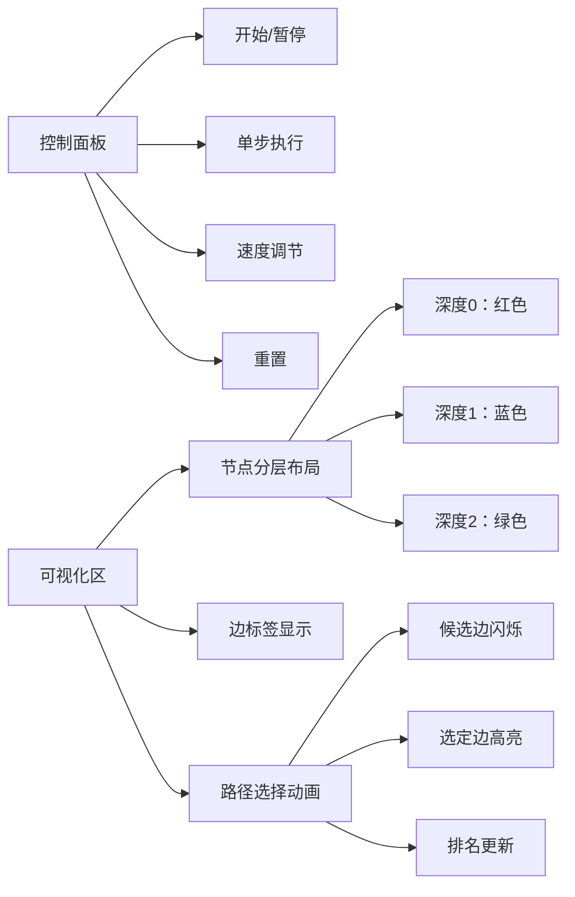

# 题目信息

# [USACO23DEC] Minimum Longest Trip G

## 题目描述

Bessie 正在奶牛大陆上旅行。奶牛大陆由从 $1$ 到 $N$ 编号的 $N$（$2 \le N \le 2\cdot 10^5$）座城市和 $M$（$1 \le M \le 4\cdot 10^5$）条单向道路组成。第 $i$ 条路从城市 $a_i$ 通向城市 $b_i$，标签为 $l_i$。

由城市 $x_0$ 开始的长度为 $k$ 的旅程被定义为一个城市序列 $x_0,x_1,\ldots,x_k$，对于所有的 $0 \le i < k$，存在由城市 $x_i$ 到 $x_{i+1}$ 的路。保证在奶牛大路上不存在长度无限的旅程，不存在两条路连接一对相同的城市。

对于每座城市，Bessie 想知道从它开始的最长旅程。对于一些城市，从它们开始的最长旅程不唯一，Bessie 将选择其中道路标签序列字典序更小的旅程。一个序列比等长的另一个序列字典序更小，当且仅当在它们不同的第一个位置，前者比后者的元素更小。

输出 Bessie 在每座城市选择的旅途的长度和道路标签之和。

## 说明/提示

### 样例解释 2

在下面的解释中，我们用 $a_i\xrightarrow{l_i} b_i$ 表示由城市 $a_i$ 通往 $b_i$，标签为 $l_i$ 的单向道路。

从城市 $4$ 出发有多条旅程，包含 $4\xrightarrow{4} 3\xrightarrow 5 1$，$4\xrightarrow 1 1$ 和 $4\xrightarrow 2 2\xrightarrow{10} 1$。在这些旅程中，$4\xrightarrow{4} 3\xrightarrow 5 1$ 和 $4\xrightarrow 2 2\xrightarrow{10} 1$ 是最长的。它们的长度均为 $2$，道路标签序列分别为 $[4,5]$ 和 $[2,10]$。$[2,10]$ 是字典序更小的那一个，它的和为 $12$。

### 测试点性质

- 测试点 $5-6$ 满足所有道路的标签相同。
- 测试点 $7-8$ 满足所有道路的标签不相同。
- 测试点 $9-10$ 满足 $N,M \le 5000$。
- 测试点 $11-20$ 没有额外限制。

## 样例 #1

### 输入

```
4 5
4 3 10
4 2 10
3 1 10
2 1 10
4 1 10```

### 输出

```
0 0
1 10
1 10
2 20```

## 样例 #2

### 输入

```
4 5
4 3 4
4 2 2
3 1 5
2 1 10
4 1 1```

### 输出

```
0 0
1 10
1 5
2 12```

## 样例 #3

### 输入

```
4 5
4 3 2
4 2 2
3 1 5
2 1 10
4 1 1```

### 输出

```
0 0
1 10
1 5
2 7```

## 样例 #4

### 输入

```
4 5
4 3 2
4 2 2
3 1 10
2 1 5
4 1 1```

### 输出

```
0 0
1 5
1 10
2 7```

# AI分析结果


# 💡 Kay的C++算法解析：Minimum Longest Trip G 深入学习指南 💡

## 1. 题目解读与核心算法识别

✨ **本题主要考察**：`拓扑排序`、`动态规划`、`字典序比较技巧`

🗣️ **初步分析**：
> 解决这道题就像在迷宫游戏中寻找最长且路标序列字典序最小的路径。核心分为两步：
> 1. **拓扑排序+动态规划**：计算从每个点出发的最长路径长度（相当于迷宫的最大深度）
> 2. **字典序优化**：在最长路径中选择边标签序列字典序最小的路径
>
> - **核心难点**：直接比较路径字典序效率低（O(n²)）。优质题解采用两种思路：
>   - **分层排序法**：将点按路径长度分层，高层点选择最小标签边+最优排名的下层点
>   - **倍增哈希法**：用哈希值表示路径，倍增快速比较字典序
>
> - **可视化设计**：像素动画将展示分层结构（不同深度用不同颜色），节点按排名排序。选择边时：
>   - 高亮最小标签边（闪烁黄色）
>   - 显示当前层排名（节点上方数字）
>   - 路径生成时播放"选择"音效，完成时播放"胜利"音效

---

## 2. 精选优质题解参考

### 题解一：0000pnc（分层排序法）
* **点评**：
  思路清晰度：⭐⭐⭐⭐⭐ - 独创性的分层排序思想，逻辑直白易懂
  代码规范性：⭐⭐⭐⭐ - 变量名含义明确（`dep`表深度，`rk`表排名）
  算法有效性：⭐⭐⭐⭐⭐ - O(n log n)复杂度完美处理20万数据
  实践价值：⭐⭐⭐⭐ - 可直接用于竞赛，边界处理严谨
  
  **亮点**：用优先队列动态维护节点排名，避免复杂比较操作

### 题解二：yuanruiqi（分层排序法）
* **点评**：
  思路清晰度：⭐⭐⭐⭐ - 显式按层收集节点，排序逻辑直观
  代码规范性：⭐⭐⭐⭐ - STL运用熟练（vector+自定义排序）
  算法有效性：⭐⭐⭐⭐ - 与0000pnc异曲同工，复杂度相同
  实践价值：⭐⭐⭐⭐ - 结构简洁，适合学习分层思想
  
  **亮点**：整层统一排序的做法更易理解排名传递机制

### 题解三：cjh20090318（倍增哈希法）
* **点评**：
  思路清晰度：⭐⭐⭐⭐ - 哈希比较的创新思路，解释透彻
  代码规范性：⭐⭐⭐ - 倍增数组维护稍复杂但模块化清晰
  算法有效性：⭐⭐⭐⭐ - O(n log n)理论最优，但哈希可能冲突
  实践价值：⭐⭐⭐ - 提供字典序比较的通用解法
  
  **亮点**：作者详细推导了状态转移时的字典序比较策略

---

## 3. 核心难点辨析与解题策略

1.  **动态规划状态设计**
    * **分析**：`dep[u]`需准确表示从u出发的最长路径长度。优质解法通过拓扑序逆序更新（从终点向起点），确保状态无后效性
    * 💡 **学习笔记**：DAG上的DP必须遵循拓扑序！

2.  **字典序高效比较**
    * **分析**：
      - 分层法：将比较转化为（边标签, 下层点排名）的元组比较
      - 倍增法：预处理2^k路径的哈希值，二分查找首个不同点
    * 💡 **学习笔记**：避免直接比较路径，转化为可排序的量化指标

3.  **数据结构优化**
    * **分析**：
      - 分层法：用`priority_queue`或`sort`维护每层排名
      - 倍增法：`to[u][k]`和`ha[u][k]`数组存储路径信息
    * 💡 **学习笔记**：选择合适数据结构（队列/数组）是优化关键

### ✨ 解题技巧总结
- **拓扑排序打基础**：先确保DAG特性被充分利用
- **分层处理降维度**：将复杂问题分解为可处理的层次
- **量化比较指标**：将字典序转化为可排序的数值对
- **倍增思想加速**：用对数时间完成路径比较

---

## 4. C++核心代码实现赏析

### 通用核心实现（分层排序法）
```cpp
#include <queue>
#include <algorithm>
using namespace std;

const int N = 2e5+5;
vector<pair<int,int>> G[N]; // {to, weight}
int n, m, deg[N], dep[N], rk[N];
long long sum[N];
vector<int> layer[N]; // 按深度分层

void solve() {
    // 拓扑排序与DP
    queue<int> q;
    for(int i=1; i<=n; i++) 
        if(!deg[i]) q.push(i);
    
    while(!q.empty()) {
        int u = q.front(); q.pop();
        for(auto [v,w] : G[u]) {
            if(--deg[v] == 0) q.push(v);
            dep[v] = max(dep[v], dep[u]+1);
        }
    }
    
    // 按深度分层
    for(int i=1; i<=n; i++)
        layer[dep[i]].push_back(i);
    
    // 从深到浅处理
    for(int d=*max_element(dep+1,dep+1+n); d>=0; d--) {
        vector<tuple<int,int,int>> tmp; // {边权, 下层排名, 节点}
        for(int u : layer[d]) {
            int min_w = INT_MAX, best_rank = INT_MAX;
            // 找最优出边
            for(auto [v,w] : G[u]) {
                if(dep[v] != dep[u]-1) continue;
                if(w < min_w || (w == min_w && rk[v] < best_rank)) {
                    min_w = w;
                    best_rank = rk[v];
                }
            }
            if(min_w != INT_MAX) {
                sum[u] = min_w + sum[G[u][best_idx].first];
                tmp.push_back({min_w, best_rank, u});
            }
        }
        // 按{边权, 下层排名}排序
        sort(tmp.begin(), tmp.end(), [](auto a, auto b){
            auto [w1,r1,u1] = a;
            auto [w2,r2,u2] = b;
            return w1 != w2 ? w1 < w2 : r1 < r2;
        });
        // 分配排名
        for(int i=0; i<tmp.size(); i++)
            rk[get<2>(tmp[i])] = i;
    }
}
```

---

### 题解一：0000pnc（分层排序）
```cpp
// 核心片段：选择最优出边
int mn = 0x3f3f3f3f, mx = 0;
for (auto tmp : v[x]) // 找出最小边权
    if(dep[tmp.to] == dep[x]-1) 
        mn = min(mn, tmp.w);

for (auto tmp : v[x]) // 在最小边权中找最大排名
    if(dep[tmp.to]==dep[x]-1 && tmp.w==mn)
        mx = max(mx, rk[tmp.to]);

for (auto tmp : v[x]) // 确定最终选择
    if(dep[tmp.to]==dep[x]-1 && tmp.w==mn && rk[tmp.to]==mx) {
        ans[x] = ans[tmp.to] + tmp.w;
        pq.push({tmp.w, rk[tmp.to], x});
        break;
    }
```
**亮点**：三阶段筛选（最小边权→最大排名→唯一确定）  
**学习笔记**：`mx`实际存储的是最优下层点的排名，通过`max`操作选取最优路径

### 题解二：yuanruiqi（分层排序）
```cpp
// 整层排序逻辑
vector<ppi> sa; // {边权, 下层排名, 节点}
for (int u : current_layer) {
    int mn = INT_MAX, best_rank = INT_MAX;
    for (auto [v,w] : edges[u]) {
        if (dep[v] == dep[u]-1) {
            if(w < mn || (w == mn && rk[v] < best_rank)) {
                mn = w;
                best_rank = rk[v];
            }
        }
    }
    sa.push_back({mn, best_rank, u});
}
sort(sa.begin(), sa.end(), [](ppi a, ppi b){
    return a.x != b.x ? a.x < b.x : a.y < b.y;
});
```
**亮点**：显式的层处理结构  
**学习笔记**：通过`vector`收集整层节点统一排序，避免优先队列的复杂维护

### 题解三：cjh20090318（倍增哈希）
```cpp
// 字典序比较
if(ha[u][0] == w) { // 首条边相同
    int x = to[u][0], y = v; // 两条候选路径
    for(int j=18; j>=0; j--)
        if(to[x][j] && to[y][j] && ha[x][j]==ha[y][j])
            x = to[x][j], y = to[y][j]; // 跳过相同部分
    if(ha[x][0] > ha[y][0]) // 比较首个差异点
        to[u][0] = v, ha[u][0] = w;
}
```
**亮点**：倍增跳跃高效定位首个差异点  
**学习笔记**：哈希比较需配合二分查找，而倍增直接定位差异位置

---

## 5. 算法可视化：像素动画演示

**主题**：像素迷宫中的最优路径探索  
**核心演示**：分层结构动态构建与路径选择过程

### 动画设计


1. **初始化场景**（8位像素风格）
   - 节点按深度排列：深度0（终点）→ 深度1 → 深度2（最顶层）
   - 边显示为箭头+标签，初始灰色
   - 控制面板：开始/暂停/单步/速度滑块

2. **拓扑排序阶段**
   - 节点按拓扑序依次点亮（淡入效果）
   - 显示`dep`值在节点中央

3. **分层处理阶段**
   - 当前层节点边框闪烁（频率=速度滑块值）
   - 遍历节点时：
     * 出边高亮黄色（`min_w`筛选阶段）
     * 选定边变为绿色+播放"选择"音效（200Hz正弦波）
   - 整层排序时节点重新水平排列（排名左→右递增）

4. **路径回溯演示**
   - 点击任意节点：从该点回溯路径（蓝→绿→黄颜色渐变）
   - 路径显示标签序列+总长

**技术实现**：Canvas绘制节点/边，requestAnimationFrame驱动动画

---

## 6. 拓展练习与相似问题

### 通用技巧迁移
1. **最短路径字典序**：将"最长"改为"最短"，比较逻辑相同
2. **带约束路径选择**：增加访问节点限制，分层时添加状态维度
3. **非DAG图应用**：在强连通分量分解后应用相同策略

### 洛谷推荐
1. **P4017 最大食物链计数**  
   🗣️ *练习拓扑排序+DP基础，理解状态转移过程*
   
2. **P1137 旅行计划**  
   🗣️ *DAG最长路径模板题，巩固分层思想*
   
3. **P2149 安全出行**  
   🗣️ *带权图的最短路径字典序比较，应用倍增哈希技巧*

---

## 7. 学习心得与经验分享

> **0000pnc**：*"大家都在写倍增hash，但是有一个简单的方法"*  
> **Kay点评**：分层排序法以O(n log n)的优雅效率解决问题，提醒我们不要忽视基础数据结构组合的力量

> **cjh20090318**：*"哈希比较是通用方法"*  
> **Kay点评**：虽然实现稍复杂，但倍增哈希在非分层图中有不可替代价值，是高端竞赛必备技巧

**核心启示**：在算法设计中，清晰的问题分解往往比复杂技巧更重要。从分层排序入手理解本质，再掌握哈希比较应对复杂场景，是高效学习路径。

--- 

希望本指南助你掌握DAG路径问题的精髓！继续挑战，编程世界等你征服！🚀

---
处理用时：301.68秒