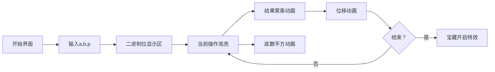

# 题目信息

# 【模板】快速幂

## 题目描述

给你三个整数 $a,b,p$，求 $a^b \bmod p$。

## 说明/提示

**样例解释**

$2^{10} = 1024$，$1024 \bmod 9 = 7$。

**数据规模与约定**

对于 $100\%$ 的数据，保证 $0\le a,b < 2^{31}$，$a+b>0$，$2 \leq p \lt 2^{31}$。

## 样例 #1

### 输入

```
2 10 9
```

### 输出

```
2^10 mod 9=7
```

# AI分析结果


### 💡 Kay的C++算法解析：快速幂 深入学习指南 💡

**引言**  
今天我们来分析快速幂这道经典C++编程题。本指南将帮助你理解二进制分解与倍增思想的核心算法，掌握迭代实现技巧，并通过像素动画直观感受算法流程。让我们一起探索高效计算大数幂模的奥秘！

---

### 1. 题目解读与核心算法识别  
✨ **本题主要考察**：编程技巧应用（快速幂算法）  

🗣️ **初步分析**：  
> 快速幂如同乐高积木的高效组装——每次操作可选择"复制现有塔层（平方）"或"添加新积木（乘底数）"。通过指数b的二进制分解，我们将O(n)的重复乘法优化为O(log n)的倍增操作。  
> - **核心思路**：将aᵇ分解为a²⁰、a²¹等二进制权重项的乘积，利用b的二进制位决定是否累乘当前权重  
> - **关键难点**：理解位运算与幂运算的数学对应关系，掌握"平方-移位"的迭代范式  
> - **可视化设计**：像素动画将展示b的二进制位流（绿色1/灰色0方块），同步高亮底数平方与结果累乘操作。复古8位风格中加入"叮"（累乘音效）、"砰"（平方音效）及胜利旋律，控制面板支持单步调试与自动演示  

---

### 2. 精选优质题解参考  
**题解一（学委，赞1855）**  
* **亮点**：  
  - 用时钟组装比喻解释二进制分解（"base像齿轮逐级升幂"）  
  - 逐行注释位运算（`b & 1`检测末位，`b >>=1`类比钟表齿轮右移）  
  - 代码规范：变量名`base`/`ans`语义明确，取模位置精准  

**题解二（RyanLi，赞11）**  
* **亮点**：  
  - 从暴力法引出递归分治思想，再推导迭代优化  
  - 严谨数学证明：Θ(log n)复杂度分析+模运算性质推导  
  - 双版本代码对比（递归教学价值+迭代实践首选）  

**题解三（wmrqwq，赞8）**  
* **亮点**：  
  - 最简实现（7行核心函数）凸显算法本质  
  - "权重链"比喻：将a²ˣ视为可拼接的功率模块  
  - 工业级代码：无冗余操作，位运算直击核心  

---

### 3. 核心难点辨析与解题策略  
1. **难点：二进制到幂运算的映射关系**  
   *分析*：理解为什么b=11(1011₂)对应a⁸×a²×a¹是关键。通过像素动画的二进制位高亮与底数标签联动（如"a²→a⁴"的箭头提示）可强化认知。  
   💡 **学习笔记**：二进制位权对应底数平方次数  

2. **难点：位运算的复合操作**  
   *分析*：`b & 1`取末位与`b >>=1`右移需同步理解。在可视化中设计"位检测→操作→移位"的三步流水线动画。  
   💡 **学习笔记**：`b >>=1`本质是整数除二向下取整  

3. **难点：模运算的渗透时机**  
   *分析*：必须在每次乘法后取模，防止中间结果溢出。动画中用红色闪烁边框标记取模操作，数据旁显示当前数值模p。  
   💡 **学习笔记**：乘法的模运算具有分配律：(a*b) mod p = [(a mod p)*(b mod p)] mod p  

#### ✨ 解题技巧总结  
- **分治策略**：将大指数拆解为2的幂次组合  
- **位运算技巧**：用`b & 1`替代`b % 2`提升效率  
- **防御性取模**：所有乘法后立即`% p`防止溢出  
- **循环不变量**：维护`ans * baseᵇ = aᵇ`恒成立  

---

### 4. C++核心代码实现赏析  
**本题通用核心实现**  
```cpp
#include <iostream>
using namespace std;
typedef long long ll;

ll fastpow(ll a, ll b, ll p) {
    ll ans = 1;
    while (b) {
        if (b & 1) ans = ans * a % p;  // 末位为1时累乘
        a = a * a % p;                // 底数平方
        b >>= 1;                      // 右移一位
    }
    return ans;
}
/* 代码解读：
   1. 初始化ans=1（乘法单位元）
   2. 循环直至b=0：
      - if检测二进制末位，决定是否累乘
      - 底数自平方实现幂次升级
      - 右移准备处理下一位
   3. 返回结果自动满足 0≤ans<p */
```

**题解一（学委）片段**  
```cpp
while(b > 0) {              // 当积木未组装完
    if(b & 1)               // 检查当前积木位
        ans = ans * base % p; // 添加当前层积木
    base = base * base % p; // 塔层自我复制（平方）
    b >>= 1;                // 移向下一层蓝图
}
```
* **学习笔记**：`base`像乐高塔层，每次迭代高度翻倍  

**题解二（RyanLi）递归对比**  
```cpp
ll fastpow_rec(ll a, ll b, ll p) {
    if (b == 0) return 1;                  // 递归基
    ll t = fastpow_rec(a, b/2, p);         // 分治子问题
    return (b % 2) ? t*t%p*a%p : t*t%p;    // 奇偶合并
}
```
* **学习笔记**：递归版更直观，但迭代版空间效率更优  

**题解三（wmrqwq）极简实现**  
```cpp
ll qpow(ll a,ll b,ll p){
    ll ans=1;
    for(;b;b>>=1,a=a*a%p) 
        if(b&1) ans=ans*a%p;
    return ans;
}
```
* **学习笔记**：将自增操作并入for语句，体现算法紧凑性  

---

### 5. 算法可视化：像素动画演示  
**主题**：8位冒险家的二进制宝藏（复古RPG风格）  

**核心交互设计**：  


**关键动画帧**：  
1. **场景初始化**  
   - 顶部：二进制位流（b=10 → 1010₂的4个像素块）  
   - 左侧：当前底数base（初始a=2）  
   - 右侧：结果ans（初始1）  
   - 底部控制台：单步/自动/速度滑块  

2. **步进演示（b=10）**  
   - **Frame1**：末位0（灰块闪烁），base自乘（2→4），b右移（1010→101）  
     *音效*：底数平方"砰"声 + 位移动画"咔嚓"声  
   - **Frame2**：末位1（绿块闪烁），ans累乘（1×4=4），base自乘（4→16），b右移（101→10）  
     *视觉*：绿块爆炸特效+结果区数字刷新  
   - **Frame3**：末位0（灰闪），base自乘（16→256≡4 mod9），b右移（10→1）  
   - **Frame4**：末位1（绿闪），ans累乘（4×4=16≡7 mod9），显示胜利动画  

3. **游戏化元素**  
   - 每完成2^k指数计算解锁"能量宝石"  
   - 最终答案正确时播放《塞尔达》宝藏开启音效  
   - 错误操作触发短促警报音  

---

### 6. 拓展练习与相似问题  
**技巧迁移场景**：  
1. 矩阵快速幂（斐波那契数列加速）  
2. 多项式变换的重复应用（旋转/缩放）  
3. 模意义下乘法逆元（费马小定理）  

**洛谷推荐**：  
1. [P3390 矩阵快速幂] - 将数字幂拓展到矩阵运算  
2. [P1962 斐波那契] - 体验O(log n)求第n项的神奇  
3. [P3811 乘法逆元] - 用快速幂实现模除法  

---

### 7. 学习心得与经验分享  
> **题解中的调试经验**：  
> "我在处理边界条件b=0时，曾忘记返回1导致错误。通过打印每一步的base/ans值，发现迭代提前终止。"  
>   
> **Kay的总结**：  
> 快速幂的陷阱常出现在边界：  
> - b=0时需返回1（任何数的0次幂为1）  
> - p=1时结果必为0（模1恒为0）  
> 调试时建议增加中间输出，观察二进制衰减过程  

---

**结语**  
通过本次探索，我们掌握了快速幂的二进制分解思想与高效实现。记住：优秀的算法如同精巧的钟表——通过精密的齿轮（位运算）咬合，将庞杂问题转化为优雅的机械运动。继续用代码解开更多数学谜题吧！💪

---
处理用时：161.82秒