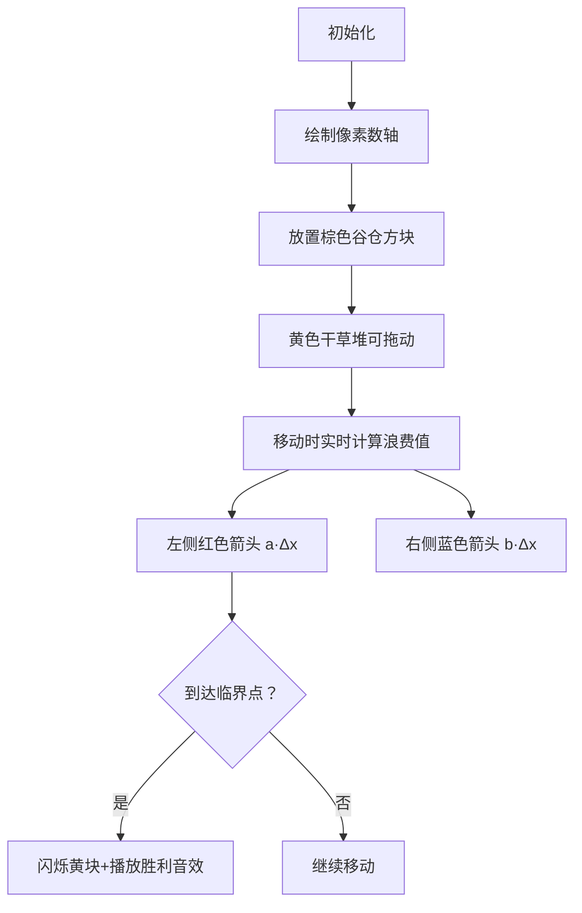

# 题目信息

# [USACO23DEC] Haybale Distribution G

## 题目描述

Farmer John 正在农场上分发干草堆。

Farmer John 的农场上有 $N$（$1 \le N \le 2\cdot 10^5$）座谷仓，分别位于数轴上的整点 $x_1,\ldots,x_N$（$0 \le x_i \le 10^6$）。Farmer John 正计划将 $N$ 车干草堆运输到整点 $y$（$0 \le y \le 10^6$），然后为每一座谷仓运输一车干草堆。

不幸的是，Farmer John 的运输系统浪费了很多干草堆。具体来说，给出一些 $a_i,b_i$（$1 \le a_i,b_i \le 10^6$），每车干草堆每向左移动一单位距离，$a_i$ 堆干草堆会被浪费；每车干草堆每向右移动一单位距离，$b_i$ 堆干草堆会被浪费。形式化地，一车干草堆从整点 $y$ 运动到位于 $x$ 的谷仓，被浪费的干草堆堆数如下：

$$\begin{cases}a_i\cdot (y-x) & \text{if} \ y>x \\ b_i\cdot(x-y)&\text{if}\ x>y\end{cases}$$

给出 $Q$（$1 \le Q \le 2 \cdot 10^5$）组相互独立的询问，每组询问给出一组 $(a_i,b_i)$ 的值，帮助 Farmer John 计算当按照最佳方案选择 $y$，最少有多少堆干草堆被浪费。

## 说明/提示

### 样例解释 1

样例中第二个询问，最佳方案为选择 $y=2$，被浪费的干草堆数量为 $2(2-1)+2(2-2)+1(3-2)+1(4-2)+1(10-2)=1+0+1+2+8=13$。

### 测试点性质

- 测试点 $2$ 满足 $N,Q \le 10$。
- 测试点 $3$ 满足 $N,Q \le 500$。
- 测试点 $4-6$ 满足 $N,Q \le 5000$。
- 测试点 $7-16$ 没有额外限制。

## 样例 #1

### 输入

```
5
1 4 2 3 10
4
1 1
2 1
1 2
1 4```

### 输出

```
11
13
18
30```

# AI分析结果


# 💡 Kay的C++算法解析：Haybale Distribution G 深入学习指南 💡

## 1. 题目解读与核心算法识别

✨ **本题主要考察**：`数学优化`与`前缀和技巧`

🗣️ **初步分析**：
> 解决这道题的关键在于理解**单谷函数性质**和**数学优化**。想象你在数轴上放干草堆，每次移动分发点都会改变左右两侧的浪费值，这就像寻找天平平衡点一样！通过数学分析我们发现：
> - 总浪费函数关于y是单谷的（先减后增）
> - 存在临界点k使得增加1单位距离时，变化量由负转正
> - 这个临界点可通过公式k=ceil(n*b/(a+b))精确计算
>
> 在可视化方案中，我们将设计**像素风格数轴**，用不同颜色标记：
> - 棕色方块：谷仓位置
> - 黄色方块：干草分发点（可拖动）
> - 红色/蓝色箭头：展示浪费变化
> - 当到达临界点时播放"叮"音效并闪烁黄块

---

## 2. 精选优质题解参考

**题解一：RDFZchenyy（数学推导法）**
* **点评**：此解法通过精妙的数学推导，直接计算出最优分界点k=ceil(n*b/(a+b))，利用前缀和O(1)完成查询。思路清晰严谨，代码简洁高效（O(nlogn+Q)），变量命名规范（sum数组），边界处理完整（k=min(k,n)），是竞赛场景的理想解法。

**题解二：mRXxy0o0（二分查找法）**
* **点评**：同样基于变化量分析，但采用二分查找临界点。推导过程稍复杂但避免了浮点数运算，代码中f/g数组分别表示前后缀距离和，实践价值高。稍逊于数学解法的是二分增加了O(logn)的查询时间。

**题解三：Pollococido（三分搜索法）**
* **点评**：直观利用单谷函数性质进行三分搜索。虽然O(Qlog²n)复杂度稍高，但提供了通用解题范式。代码中calc函数通过二分确定位置的设计很巧妙，适合帮助理解问题本质。

---

## 3. 核心难点辨析与解题策略

1.  **关键点：理解变化量单调性**
    * **分析**：当y增加1单位时，变化量Δ=左侧谷仓数×a - 右侧谷仓数×b。随着y右移，左侧谷仓数单调增，Δ从负到正单调递增，最小值点发生在Δ≥0的临界位置
    * 💡 **学习笔记**：抓住变化量的单调性是优化复杂度的关键！

2.  **关键点：数学公式推导**
    * **分析**：由Δ=k*a-(n-k)*b≥0推导出k≥n*b/(a+b)，取整得k=ceil(n*b/(a+b))。需注意整数除法的向上取整技巧和浮点精度处理
    * 💡 **学习笔记**：将物理问题转化为数学公式可大幅提升效率

3.  **关键点：前缀和加速计算**
    * **分析**：预处理排序后的前缀和数组sum，使得左右浪费值可通过(x[k]*k-sum[k])和(sum[n]-sum[k]-x[k]*(n-k))公式O(1)计算
    * 💡 **学习笔记**：前缀和是优化区间统计问题的利器

### ✨ 解题技巧总结
-   **数学建模**：将移动代价转化为变化量分析，发现单调性规律
-   **公式推导**：从Δ≥0推导出临界点k的计算公式
-   **预处理优化**：排序后前缀和预处理，将单次查询降至O(1)
-   **边界处理**：注意k可能越界，需取min(k,n)

---

## 4. C++核心代码实现赏析

**本题通用核心C++实现参考**
* **说明**：综合优质题解思路，采用数学推导+前缀和的优化实现
* **完整核心代码**：
```cpp
#include <iostream>
#include <algorithm>
#include <cmath>
using namespace std;
typedef long long ll;
const int MAXN = 200005;

ll x[MAXN], sum[MAXN];

int main() {
    ios::sync_with_stdio(false);
    cin.tie(0);
    int n, q;
    cin >> n;
    for (int i = 1; i <= n; i++) cin >> x[i];
    sort(x+1, x+n+1);
    for (int i = 1; i <= n; i++) 
        sum[i] = sum[i-1] + x[i];
    
    cin >> q;
    while (q--) {
        ll a, b;
        cin >> a >> b;
        int k = min(n, (int)ceil((long double)b * n / (a + b)));
        ll left_waste = (x[k]*k - sum[k]) * a;
        ll right_waste = (sum[n]-sum[k] - x[k]*(n-k)) * b;
        cout << left_waste + right_waste << '\n';
    }
    return 0;
}
```
* **代码解读概要**：
  1. 读入谷仓位置并排序
  2. 计算前缀和数组sum
  3. 对每个查询：
     - 计算临界点k=ceil(n*b/(a+b))并限制范围
     - 用前缀和计算左侧浪费：(x[k]*k-sum[k])*a
     - 计算右侧浪费：(sum[n]-sum[k]-x[k]*(n-k))*b
     - 输出总和

---

**题解一：RDFZchenyy（数学推导法）**
* **亮点**：直接公式推导，避免迭代查询
* **核心代码片段**：
```cpp
u=(int)(ceil((long double)b*n/(a+b)));
cout<<(x[u]*(u)-sum[u])*a+(sum[n]-sum[u]-x[u]*(n-u))*b<<endl;
```
* **代码解读**：
  > 使用long double确保除法精度，ceil完成向上取整。计算左侧浪费时：x[u]*u-sum[u]表示所有左侧谷仓到分界点的距离和；右侧同理，sum[n]-sum[u]是右侧谷仓坐标和，减去x[u]*(n-u)得到距离和。
* 💡 **学习笔记**：数学推导可直接命中最优解，复杂度最优

**题解二：mRXxy0o0（二分查找法）**
* **亮点**：纯整数运算避免浮点误差
* **核心代码片段**：
```cpp
int l=1,r=n-1,res=1;
while(l<=r){
    int mid=l+r>>1;
    if(x*mid-y*(n-mid)<=0) res=mid+1,l=mid+1;
    else r=mid-1;
}
printf("%lld\n",f[res]*x+g[res]*y);
```
* **代码解读**：
  > 二分查找满足x*mid≤y*(n-mid)的最后一个位置（即变化量≤0），f[res]和g[res]是预处理的前后缀距离和。注意res=mid+1保证跳出时在变化量≥0的第一个位置。
* 💡 **学习笔记**：二分法适合避免浮点数精度的场景

**题解三：Pollococido（三分搜索法）**
* **亮点**：通用单谷函数解法
* **核心代码片段**：
```cpp
int l=0, r=1000000;
while(r-l>2){
    int mid1=l+(r-l)/3, mid2=r-(r-l)/3;
    if(calc(mid1)<calc(mid2)) r=mid2;
    else l=mid1;
}
// 在[l,r]区间枚举找最小值
```
* **代码解读**：
  > 三分法不断缩小搜索区间：每次取1/3处两点，保留函数值更小的区间。最后在小范围枚举是因函数可能有平台期。calc函数内部用二分确定位置再计算浪费值。
* 💡 **学习笔记**：三分法适用单谷函数但效率稍低

-----

## 5. 算法可视化：像素动画演示

**主题**：8位像素风格"干草分发大冒险"  
**核心演示**：单谷函数性质与临界点寻找过程  

**动画设计**：


**关键交互**：
1. **控制面板**：开始/暂停/单步执行按钮，速度调节滑块
2. **动态效果**：
   - 拖拽黄色方块时实时显示红/蓝浪费值
   - 当Δ变化量由负（绿色）转正（红色）时触发"叮"音效
   - 自动演示模式：AI控制黄块移动，像贪吃蛇一样自动寻优
3. **数据结构可视化**：
   - 底部显示前缀和数组的像素化更新
   - 侧边栏显示当前k值及计算公式
4. **游戏化元素**：
   - 每找到临界点获得"平衡大师"奖杯
   - 连续正确触发连击特效

---

## 6. 拓展练习与相似问题思考

* **通用技巧迁移**：  
  前缀和+数学优化适用于：
  1. 带权中位数问题（如洛谷P1168）
  2. 距离和最小化（如CF1486B）
  3. 斜率优化DP（如洛谷P3195）

* **练习推荐**：
  1. **洛谷P2882** - 翻转硬币  
     🗣️ **推荐理由**：同样需要分析变化量性质，练习前缀和技巧
  2. **洛谷P2216** - 理想的正方形  
     🗣️ **推荐理由**：二维前缀和经典应用，拓展到高维
  3. **洛谷P2280** - 激光炸弹  
     🗣️ **推荐理由**：前缀和+最优化问题，综合训练

---

## 7. 学习心得与经验分享

> **参考经验**：题解1作者提到："为了保证精度如此操作"，在ceil函数中使用long double避免溢出

> **点评**：数值稳定性是竞赛编程的重要细节。当处理大整数除法时：
> 1. 优先使用整数运算（如二分法）
> 2. 必须用浮点时选用long double
> 3. 注意ceil/floor的取整方向
> 
> 调试时可用小数据验证边界情况，比如n=1或a/b极大时

---

本次分析就到这里，记住：将物理问题转化为数学模型是算法优化的关键！下次挑战再见！💪

---
处理用时：164.28秒