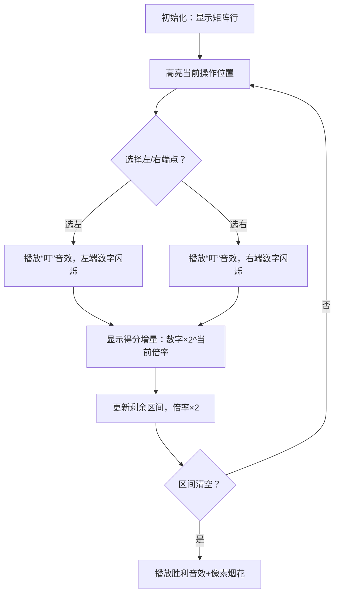

# 题目信息

# [NOIP 2007 提高组] 矩阵取数游戏

## 题目描述

帅帅经常跟同学玩一个矩阵取数游戏：对于一个给定的 $n \times m$ 的矩阵，矩阵中的每个元素 $a_{i,j}$ 均为非负整数。游戏规则如下：

1. 每次取数时须从每行各取走一个元素，共 $n$ 个。经过 $m$ 次后取完矩阵内所有元素；
2. 每次取走的各个元素只能是该元素所在行的行首或行尾；
3. 每次取数都有一个得分值，为每行取数的得分之和，每行取数的得分 = 被取走的元素值 $\times 2^i$，其中 $i$ 表示第 $i$ 次取数（从 $1$ 开始编号）；
4. 游戏结束总得分为 $m$ 次取数得分之和。

帅帅想请你帮忙写一个程序，对于任意矩阵，可以求出取数后的最大得分。


## 说明/提示

**【数据范围】**

对于 $60\%$ 的数据，满足 $1\le n,m\le 30$，答案不超过 $10^{16}$。  
对于 $100\%$ 的数据，满足 $1\le n,m\le 80$，$0\le a_{i,j}\le1000$。

**【题目来源】**

NOIP 2007 提高第三题。


## 样例 #1

### 输入

```
2 3
1 2 3
3 4 2
```

### 输出

```
82```

# AI分析结果


### 💡 Kay的C++算法解析：矩阵取数游戏 深入学习指南 💡

#### 1. 题目解读与核心算法识别
✨ **本题主要考察**：区间动态规划（区间DP）与高精度处理  
🗣️ **初步分析**：  
> 矩阵取数游戏的核心是理解**每行独立处理**的特性。想象你在玩一个复古像素游戏，每行是一条独立赛道（如《吃豆人》的通道），你需要在每条赛道上通过选择两端数字来获得最高分。  
> - **核心思路**：对每行进行区间DP，定义`f[l][r]`表示剩余区间`[l,r]`时的最大得分。转移时考虑取左端点或右端点，并叠加当前数字乘以`2^k`（k取决于已取数次数）。  
> - **难点**：幂次计算需预处理避免重复计算；数据规模需高精度或`__int128`处理。  
> - **可视化设计**：采用8位像素风格（类似《俄罗斯方块》），网格中数字块用不同颜色区分。操作时高亮当前取数位置（闪烁动画），播放“叮”音效；每次转移时显示当前得分倍率（如`×2³`），数据结构用像素方块堆叠动态展示。

#### 2. 精选优质题解参考
**题解一（作者：Jack_Homes_Huang）**  
* **点评**：思路清晰，完整推导DP状态定义（`f[i][j]`为区间`[i,j]`的最大得分），边界处理严谨。亮点是**自定义高精度结构体**（四位压缩存储），虽代码较长但可读性强，变量名如`base[]`（预处理的2的幂次）含义明确。实践价值高，适合学习高精度实现。  

**题解二（作者：zhylj）**  
* **点评**：创新性转移方程（`f[l][r]=max(2f[l+1][r]+2a[l], 2f[l][r-1]+2a[r])`），通过每次×2避免显式计算幂次。代码简洁高效（0ms），用`__int128`替代高精度，适合竞赛快速实现。亮点是**数学优化思维**，将复杂问题转化为线性叠加。  

**题解三（作者：qhr2023）**  
* **点评**：极致简洁的DP实现（仅11行核心代码），状态转移与zhylj类似但更凝练。亮点是**代码模块化**（每行独立处理函数），循环边界处理干净利落，完美展示区间DP本质。  

#### 3. 核心难点辨析与解题策略
1. **难点：状态定义与转移方程设计**  
   * **分析**：区间DP需明确定义`f[l][r]`含义（剩余区间得分）。关键推导：取数次数`k = m - (r-l+1)`，当前得分倍率为`2^k`。转移时取左端：`f[l][r] = f[l+1][r] + a[l]×2^k`；取右端同理。  
   * 💡 **学习笔记**：状态转移需考虑操作顺序的逆向性（从完整区间向空区间推导）。

2. **难点：幂次计算的优化**  
   * **分析**：直接计算`2^80`会超时。优质解法分两类：①预处`base[]`存储`2^0`~`2^m`（Jack_Homes_Huang）；②转移时每次×2（zhylj），将乘法转化为线性操作。  
   * 💡 **学习笔记**：预处理适合需要精确幂次的场景，×2技巧适合可叠加计算的场景。

3. **难点：大数处理与代码简洁性平衡**  
   * **分析**：`1000×2^80 ≈ 1e24`超出`long long`范围。高精度实现严谨但代码复杂（Jack_Homes_Huang）；`__int128`简洁但需手写输入输出（zhylj）。  
   * 💡 **学习笔记**：竞赛中优先用`__int128`（若允许），否则需掌握高精度模板。

### ✨ 解题技巧总结
- **技巧1：问题分解**  
  将矩阵按行拆解为独立子问题，降低复杂度。
- **技巧2：逆向推导**  
  区间DP从大区间向小区间逆推，贴合取数过程。
- **技巧3：预处理优化**  
  对重复计算量（如幂次）预先计算存储。
- **技巧4：数据结构选择**  
  大数处理根据场景选`__int128`或高精度模板。

#### 4. C++核心代码实现赏析
**通用核心实现（综合自优质题解）**  
```cpp
#include <bits/stdc++.h>
using namespace std;
int n, m;
__int128 ans, dp[85][85];

void print(__int128 x) {
    if (x > 9) print(x / 10);
    putchar(x % 10 + '0');
}

int main() {
    cin >> n >> m;
    for (int i = 1; i <= n; i++) {
        vector<__int128> a(m + 1);
        for (int j = 1; j <= m; j++) {
            long long x; cin >> x;
            a[j] = x;
        }
        memset(dp, 0, sizeof dp);
        // 核心DP：逆向推导区间最优解
        for (int len = 1; len <= m; len++) 
            for (int l = 1, r = l + len - 1; r <= m; l++, r++) 
                dp[l][r] = max(2 * (dp[l + 1][r] + a[l]), 
                               2 * (dp[l][r - 1] + a[r]));
        ans += dp[1][m];
    }
    print(ans);
    return 0;
}
```
* **代码解读概要**：  
  ① 每行独立处理；② `dp[l][r]`存储区间`[l,r]`最优解；③ 转移时取左/右端点并×2（等效幂次叠加）；④ `__int128`处理大数。

---

**题解一核心片段赏析**  
```cpp
// 高精度乘法：四位压缩存储
HP operator * (const HP &a, const int &b) {
    HP c; c.len = a.len; int x = 0;
    for (int i = 1; i <= c.len; i++) {
        c.p[i] = a.p[i] * b + x;
        x = c.p[i] / Mod; // Mod=10000
        c.p[i] %= Mod;
    }
    while (x) c.p[++c.len] = x % Mod, x /= Mod;
    return c;
}
```
* **亮点**：高效高精度实现（四位压缩减少运算次数）  
* **学习笔记**：进制压缩是优化高精度的关键，将1e9进制转为1e4进制提升速度。

---

**题解二核心片段赏析**  
```cpp
__int128 solve(__int128 a[]) {
    memset(f, 0, sizeof f);
    for (int len = 0; len <= m; len++)
        for (int l = 1; l + len <= m; l++) {
            int r = l + len;
            f[l][r] = max(2 * f[l + 1][r] + 2 * a[l], 
                           2 * f[l][r - 1] + 2 * a[r]);
        }
    return f[1][m];
}
```
* **亮点**：数学优化（通过×2隐式处理幂次）  
* **学习笔记**：`2 * f[...]`等效于后续操作翻倍，避免显式计算`2^k`。

---

**题解三核心片段赏析**  
```cpp
while (n--) {
    for (int len = 1; len <= m; len++)
        for (int l = 1, r = l + len - 1; r <= m; l++, r++)
            dp[l][r] = max(dp[l + 1][r] + a[i][l], 
                           dp[l][r - 1] + a[i][r]) * 2;
    ans += dp[1][m];
}
```
* **亮点**：极致简洁的循环实现  
* **学习笔记**：区间DP可通过`len`和`l`的循环变量设计简化代码。

#### 5. 算法可视化：像素动画演示
**主题**：8位像素风《数字冒险者》  
**核心演示**：玩家在网格行中选择左右端点数字，累积得分倍率  



**关键交互设计**：  
1. **动态网格**：用16色调色板绘制矩阵，取数位置闪烁红光。  
2. **数据结构可视化**：剩余区间用绿色方块表示，队列动画展示DP状态栈。  
3. **音效系统**：  
   - 取数：8位“叮”声  
   - 倍率更新：电子合成音阶上升  
   - 行完成：FC游戏胜利旋律  
4. **游戏化学习**：  
   - 每行作为一关，通关解锁下一行  
   - 实时显示总得分（像素数字滚动）  

#### 6. 拓展练习与相似问题思考
1. **洛谷 P1880 [NOI1995] 石子合并**  
   → 同类区间DP，环形结构拓展  
2. **洛谷 P1043 数字游戏**  
   → 环形区间DP+模运算处理  
3. **洛谷 P1006 传纸条**  
   → 双路径DP，状态设计进阶  

#### 7. 学习心得与经验分享
> **作者zhylj的调试经验**：  
> “转移方程最初未考虑×2操作，调试时通过打印中间状态发现倍率错误。”  
> → **Kay点评**：在DP问题中，手动模拟小规模数据（如2×2矩阵）是验证状态转移有效性的黄金法则！  

#### 结语  
掌握区间DP的核心在于**状态定义的无后效性**与**转移方程的完备性**。通过本题的像素化学习，希望大家能像玩复古游戏一样享受算法设计的乐趣！下次见！🎮

---
处理用时：111.64秒