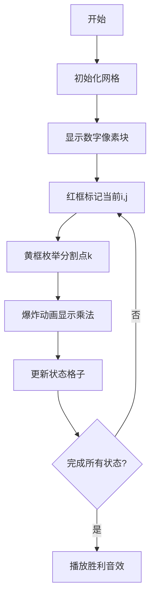

# 题目信息

# [NOIP 2000 提高组] 乘积最大

## 题目背景

NOIP2000 提高组 T2

## 题目描述

今年是国际数学联盟确定的“2000——世界数学年”，又恰逢我国著名数学家华罗庚先生诞辰 90 周年。在华罗庚先生的家乡江苏金坛，组织了一场别开生面的数学智力竞赛的活动，你的一个好朋友 XZ 也有幸得以参加。活动中，主持人给所有参加活动的选手出了这样一道题目：


设有一个长度为 $N$ 的数字串，要求选手使用 $K$ 个乘号将它分成 $K+1$ 个部分，找出一种分法，使得这 $K+1$ 个部分的乘积能够为最大。


同时，为了帮助选手能够正确理解题意，主持人还举了如下的一个例子：


有一个数字串：$312$，当 $N=3,K=1$ 时会有以下两种分法：

1. $3  \times  12=36$ 
2. $31  \times   2=62$  

   
这时，符合题目要求的结果是：$31  \times  2 = 62$。


现在，请你帮助你的好朋友 XZ 设计一个程序，求得正确的答案。


## 说明/提示

**数据范围与约定**

对于 $60\%$ 的测试数据满足 $6≤N≤20$。  
对于所有测试数据，$6≤N≤40,1≤K≤6$。


## 样例 #1

### 输入

```
4 2
1231
```

### 输出

```
62```

# AI分析结果


### 💡 Kay的C++算法解析：乘积最大 深入学习指南 💡

#### 1. 题目解读与核心算法识别
✨ **本题主要考察**：`动态规划 + 高精度`

🗣️ **初步分析**：
> 解决乘积最大问题就像在数字串中放置"乘法栅栏"，每个栅栏将数字分成独立区块。核心思想是通过**动态规划(DP)** 将大问题分解为小问题：前i位放j个乘号的最大乘积。难点在于：
> - 状态定义：`dp[i][j]`表示前i位放j个乘号的最大值
> - 高精度运算：40位数字乘积远超long long范围
> - 状态转移：枚举最后一个乘号位置k，`dp[i][j] = max(dp[k][j-1] * num(k+1,i))`
>
> **可视化设计思路**：采用8位像素风格网格，数字串显示为彩色方块，乘号位置用闪烁光标标记。关键动画步骤：
> 1. 红色高亮当前处理的数字段
> 2. 黄色标记状态转移时的分割点k
> 3. 乘法运算时显示像素化数字气泡
> 4. 成功时播放FC风格胜利音效

---

#### 2. 精选优质题解参考
**题解一（来源：liar_white）**
* **点评**：此解法采用标准DP+结构体封装高精度，思路清晰。亮点在于：
  - 状态定义`cut[i][j]`直观体现前i位放j个乘号的最大积
  - 高精度实现完整（乘法和比较函数）
  - 边界处理严谨（`exi`标记有效状态）
  - 代码规范（变量名`culc`/`mul`含义明确）

**题解二（来源：sunyt）**
* **点评**：DFS解法展现另类思路。亮点在于：
  - 可行性剪枝：`i<=n-k+x`确保乘号有足够位置
  - 乘积计算实时更新，避免存储整个状态空间
  - 代码简洁易实现（尽管大数据效率低于DP）

**题解三（来源：XHCuteDog）**
* **点评**：DP解法中高精度实现最优。亮点：
  - 数字分割函数`init()`高效处理子串转高精度
  - 结构体封装使高精度运算更直观
  - 完整的三重循环体现标准DP框架

---

#### 3. 核心难点辨析与解题策略
1. **状态定义困难**：如何设计无后效性的DP状态？
   * **分析**：优质题解统一用`dp[i][j]`表示前i位放j个乘号的最大积。关键技巧是将最后乘号位置k作为分割点，使子问题独立
   * 💡 **学习笔记**：状态定义应包含完整决策信息且可递推

2. **高精度实现复杂**：40位数字的乘法和比较？
   * **分析**：通用方案是结构体存储数位数组+重载运算：
     ```cpp
     struct BigInt{
         int d[100], len;
         // 重载乘法和比较运算符
     };
     ```
   * 💡 **学习笔记**：从低位向高位存储可简化进位处理

3. **状态转移优化**：避免无效枚举？
   * **分析**：枚举k的范围应为`[j, i-1]`，因为前j位至少需要j+1个数字。通过`j<=i-1`剪枝
   * 💡 **学习笔记**：分析状态转移的物理意义可优化循环范围

### ✨ 解题技巧总结
- **技巧1 问题分解**：将K个乘号分解为"前k个+最后1个"的决策链
- **技巧2 高精度封装**：用结构体统一处理大数运算
- **技巧3 边界预处**：初始化`dp[i][0]=前i位数字`（无乘号情况）

---

#### 4. C++核心代码实现赏析
**通用核心实现参考**
```cpp
#include <vector>
#include <string>
using namespace std;

struct BigInt {
    vector<int> digits; // 从低位到高位存储
    BigInt(string s) { /* 字符串转高精度 */ }
    BigInt operator*(const BigInt& o) const { /* 高精度乘法 */ }
    bool operator<(const BigInt& o) const { /* 高精度比较 */ }
};

int main() {
    int n, k; string s;
    vector<vector<BigInt>> dp(n+1, vector<BigInt>(k+1, "0"));
    
    // 初始化：无乘号情况
    for(int i=1; i<=n; i++) 
        dp[i][0] = BigInt(s.substr(0, i));
    
    // DP转移
    for(int j=1; j<=k; j++)
        for(int i=j+1; i<=n; i++)
            for(int k=j; k<i; k++) // 枚举分割点
                dp[i][j] = max(dp[i][j], dp[k][j-1] * num(k+1, i));
    
    cout << dp[n][k].toStr();
}
```

**题解一片段赏析（liar_white）**
```cpp
for(int i=1; i<n; i++){
    cut[i][1]=culc(1,i); // 初始化
    for(int j=2; j<=k; j++){
        for(int fr=j-1; fr<i; fr++){ // 枚举分割点
            cut[i][j]=Max(cut[i][j], mul(cut[fr][j-1], culc(fr+1,i)));
        }
    }
}
```
> **解读**：
> 1. 外层`i`遍历数字串终点
> 2. 中层`j`遍历乘号数量
> 3. 内层`fr`枚举最后一个乘号位置
> **学习笔记**：三重循环体现DP自底向上特性

---

#### 5. 算法可视化：像素动画演示
**主题**：8位像素风"乘号大作战"  
**核心演示**：DP状态转移与高精度运算过程



**交互设计**：
1. **控制面板**：步进执行/自动播放/速度调节
2. **音效设计**：
   - 数字选择：电子"滴"声
   - 乘法运算：8位机爆炸音效
   - 完成：超级玛丽过关音乐
3. **动态标记**：
   - 当前状态：闪烁红框
   - 转移路径：像素箭头动画
   - 高精度进位：数字气泡上升特效

---

#### 6. 拓展练习与相似问题
1. **洛谷P1043 [NOIP2003] 数字游戏**  
   → 同类划分DP+环形处理
2. **洛谷P1436 [棋盘分割]**  
   → 二维区间划分+DP优化
3. **洛谷P1019 [单词接龙]**  
   → 字符串分割+DFS/DP

---

#### 7. 学习心得分享
> **经验摘录（liar_white）**：  
> "调试高精度时通过打印中间变量才定位到进位错误"  
>   
> **Kay点评**：高精度调试核心技巧：
> 1. 边界测试：0、1、进位临界值
> 2. 分步输出：乘法运算每步结果
> 3. 可视化：在纸上模拟数字存储

---

通过本指南，希望大家掌握划分DP的核心思想：将问题分解为可递推的子问题，并学会用高精度处理大数运算。记住：好的状态定义是DP成功的基石！🚀

---
处理用时：95.61秒