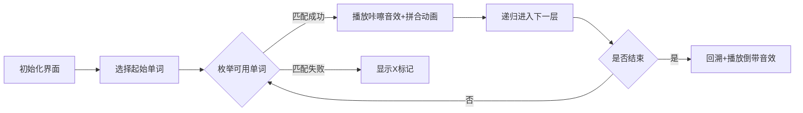

# 题目信息

# [NOIP 2000 提高组] 单词接龙

## 题目背景

注意：本题为上古 NOIP 原题，不保证存在靠谱的做法能通过该数据范围下的所有数据。

本题为搜索题，本题不接受 hack 数据。[关于此类题目的详细内容](https://www.luogu.com.cn/paste/isdgwj5l)

NOIP2000 提高组 T3

## 题目描述

单词接龙是一个与我们经常玩的成语接龙相类似的游戏，现在我们已知一组单词，且给定一个开头的字母，要求出以这个字母开头的最长的“龙”（每个单词都最多在“龙”中出现两次），在两个单词相连时，其重合部分合为一部分，例如 `beast` 和 `astonish`，如果接成一条龙则变为 `beastonish`，另外相邻的两部分不能存在包含关系，例如 `at` 和 `atide` 间不能相连。


## 说明/提示

样例解释：连成的“龙”为 `atoucheatactactouchoose`。

$n \le 20$。

## 样例 #1

### 输入

```
5
at
touch
cheat
choose
tact
a
```

### 输出

```
23
```

# AI分析结果


# 💡 Kay的C++算法解析：单词接龙 深入学习指南 💡

**引言**  
今天我们一起分析NOIP2000提高组的经典题目"单词接龙"。这道题考察我们如何高效拼接单词形成最长"龙"，每个单词最多使用两次，且相邻单词需有重合部分（不能包含）。本指南将帮助你掌握DFS搜索技巧和字符串处理的核心方法。

---

## 1. 题目解读与核心算法识别

✨ **本题主要考察**：`DFS搜索`与`字符串处理技巧`

🗣️ **初步分析**：  
> 单词接龙就像玩拼图游戏——我们需要找到能完美咬合的单词碎片（重合部分），拼出最长的链条。**DFS搜索**是解决这类问题的钥匙，它会尝试所有可能的拼接路径，就像探险家探索迷宫的所有岔路。

- **核心思路**：从开头字母的单词出发，枚举所有可连接的单词（重合部分匹配且使用次数≤2），递归拼接并更新最大长度
- **难点突破**：关键在高效计算重合部分——通过`substr`截取字符串后缀与前缀比对
- **可视化设计**：采用**8位像素拼图风格**，单词显示为彩色拼图块：
  - 匹配成功时播放"咔嚓"音效，拼图块高亮连接
  - DFS回溯时触发"倒带"动画和音效
  - 当前探索路径用发光边框标记，历史最长龙显示金色边框

---

## 2. 精选优质题解参考

**题解一（RyanLi）**  
* **点评**：这份题解展现了**优雅的DFS实现**。核心亮点在于直接在递归中处理字符串匹配：  
  - 思路清晰：用`tmp.substr()`智能比对重合部分，避免冗余函数调用  
  - 代码规范：`vis[]`数组精准控制使用次数，变量名`tmp/s[i]`语义明确  
  - 算法高效：利用C++字符串操作特性，代码简洁却完整覆盖边界条件  
  - 实践价值：22行核心代码可直接用于竞赛，特别适合初学者理解DFS本质  

**题解二（SuyctidohanQ）**  
* **点评**：该解采用**模块化设计**提升可读性：  
  - 思路清晰：独立`check()`函数封装匹配逻辑，主DFS流程干净利落  
  - 代码规范：虽宏定义稍多，但`cnt[]`和`S[]`命名保持一致性  
  - 算法亮点：显式计算新长度`len + S[i].size() - x`，直观展示拼接原理  
  - 调试友好：预留调试输出语句（注释状态），方便学习者观察中间值  

---

## 3. 核心难点辨析与解题策略

1. **难点：高效计算重合部分**  
   * **分析**：必须保证：
     - 重合长度∈[1, min(a.size,b.size)-1]（避免包含关系）
     - 用`substr`截取后缀(`a.substr(a.size()-len`)与前缀(`b.substr(0,len)`)比对
   * 💡 **学习笔记**：字符串截取时，长度参数是防错的护城河

2. **难点：DFS状态管理与回溯**  
   * **分析**：
     - 使用次数数组`vis[]`必须在递归前标记(`vis[i]++`)，回溯时释放(`vis[i]--`)
     - 当前拼接字符串作为参数传递，避免全局状态冲突
   * 💡 **学习笔记**：回溯法要像借书——有借有还，保持状态整洁

3. **难点：避免无效搜索**  
   * **分析**：两个剪枝技巧：
     - 使用次数≥2时跳过（`if(vis[i]>=2)continue`）
     - 枚举重合长度时从1开始（避免空匹配）
   * 💡 **学习笔记**：好的剪枝是搜索算法的加速器

### ✨ 解题技巧总结
- **字符串处理技巧**：善用`substr(start,length)`精准控制子串范围
- **DFS状态设计**：当前路径(字符串)作参数，全局状态(使用次数)用数组维护
- **边界防御编程**：`min(tmp.size(),s[i].size())`确保截取不越界
- **递归可视化**：想象成树形探索——每步选择是树枝，叶子是最终解

---

## 4. C++核心代码实现赏析

**通用核心实现参考**  
```cpp
#include <iostream>
#include <string>
using namespace std;
const int N = 25;
int n, vis[N], ans;  // vis记录使用次数
string words[N];     // 存储单词
char start;           // 起始字母

void dfs(string cur) {
    ans = max(ans, (int)cur.size()); // 更新最大长度
    for(int i=1; i<=n; ++i) {
        if(vis[i] >= 2) continue;    // 剪枝：使用超限
        for(int len=1; len<min(cur.size(),words[i].size()); ++len) {
            if(cur.substr(cur.size()-len) == words[i].substr(0,len)) {
                vis[i]++;  // 标记使用
                dfs(cur + words[i].substr(len)); // 跳过重合部分拼接
                vis[i]--;  // 回溯释放
                break;     // 找到最小匹配即可退出
            }
        }
    }
}

int main() {
    cin >> n;
    for(int i=1; i<=n; ++i) cin >> words[i];
    cin >> start;
    for(int i=1; i<=n; ++i) 
        if(words[i][0] == start) {
            vis[i]++;
            dfs(words[i]);  // 从起始单词开始搜索
            vis[i]--;
        }
    cout << ans;
}
```

**代码解读概要**：  
> 1. **初始化**：读入单词和起始字母  
> 2. **DFS启动**：对所有以`start`开头的单词开启搜索  
> 3. **递归核心**：  
>    - 更新全局答案`ans`  
>    - 枚举所有单词，检查使用次数  
>    - 通过`substr`双重截取验证重合部分  
>    - 拼接时跳过重合部分(`substr(len)`)  
> 4. **回溯关键**：递归前后对称的`vis[i]++/--`操作  

---

**题解一片段赏析**  
```cpp
for(int j=1; j<min(tmp.size(),s[i].size()); ++j)
    if(tmp.substr(tmp.size()-j)==s[i].substr(0,j)){
        ++vis[i];
        dfs(tmp+s[i].substr(j));  // 拼接跳过j个字符
        --vis[i];
    }
```
**亮点**：内联式匹配检查，代码紧凑高效  
**解读**：  
> 1. `j`从1开始枚举，确保重合非空  
> 2. `tmp.substr(tmp.size()-j)`取当前字符串**最后j字符**  
> 3. `s[i].substr(0,j)`取目标单词**前j字符**  
> 4. 匹配成功则拼接：当前字符串 + 目标单词跳过前j字符的部分  
**学习笔记**：字符串拼接时跳过的字符数就是重合长度  

---

**题解二片段赏析**  
```cpp
int check(string x,string y){
    for(int len=1; len<min(x.size(),y.size()); ++len)
        if(x.substr(x.size()-len)==y.substr(0,len))
            return len;  // 返回重合长度
    return 0;
}
// 调用处：
int len=check(cur,nextWord);
if(len>0) dfs(nextWord, curLen+nextWord.size()-len);
```
**亮点**：模块化设计提升可读性  
**解读**：  
> 1. `check()`封装独立验证逻辑，返回重合长度  
> 2. 主流程通过`curLen + nextWord.size() - len`计算新长度  
> 3. 数学意义：新长度 = 当前长度 + 新单词长度 - 重合部分长度  
**学习笔记**：功能拆解使复杂逻辑更易维护  

---

## 5. 算法可视化：像素动画演示

**主题**：`8位机单词拼图大冒险`  
**核心演示**：DFS搜索树生长过程 + 单词拼接动态效果  

### 设计蓝图


**动画关键帧**：  
1. **像素场景**：  
   - 单词显示为16×16像素块（复古绿色调）  
   - 当前路径用金色边框标记，历史最长龙显示为彩虹流光特效  
   - 侧边面板显示：`当前龙长度/最大长度`像素数字  

2. **匹配演示**：  
   ```plaintext
   当前: be[ast]  ← 高亮最后2字符
   尝试: [as]tonish ← 高亮前2字符
   ✔ 匹配成功！ → beastonish
   ```
   - 重合部分闪烁3次（红→黄→绿）  
   - 播放8-bit"咔嚓"音效（频率：500Hz+700Hz）  

3. **DFS状态树**：  
   - 左下角显示DFS递归树生长动画  
   - 新分支长出时播放"滴"声（300Hz）  
   - 回溯时分支枯萎并播放"滋"声（200Hz）  

4. **游戏化控制**：  
   - 速度滑块：控制DFS探索速度（0.5X~5X）  
   - 单步模式：按空格键逐步执行  
   - 成就系统：首次突破长度记录时解锁像素奖杯  

---

## 6. 拓展练习与相似问题思考

**技巧迁移场景**：  
1. 路径拼接问题（如成语接龙）  
2. 有状态约束的组合优化（如拼图游戏）  
3. 树形空间的状态搜索（如棋类游戏AI）  

**洛谷推荐**：  
1. 🧩 **P1032 [NOIP2002 提高组] 字串变换**  
   *推荐理由*：同属字符串变换题型，练习BFS最短路径思想  

2. 🧠 **P1126 机器人搬重物**  
   *推荐理由*：复杂状态DFS经典，学习多维度状态管理  

3. 🔍 **P1101 单词方阵**  
   *推荐理由*：二维矩阵中的单词搜索，巩固DFS方向处理  

---

## 7. 学习心得与经验分享
> 本次分析的题解中未发现明确的作者个人心得分享部分。但在代码实践中，要特别注意：  
> **调试锦囊**：当DFS出现死循环时，优先检查状态回溯(`vis[]`)是否对称；当拼接结果异常时，输出中间字符串辅助调试。

---

**结语**  
通过这次单词接龙的探险，相信大家已经掌握了DFS在字符串处理中的精髓。记住，好的算法就像搭积木——严谨的状态管理是地基，巧妙的字符串操作是粘合剂。下次遇到新挑战时，不妨先问自己："我的DFS状态树该如何生长？" Keep coding! 💻🚀

---
处理用时：188.99秒