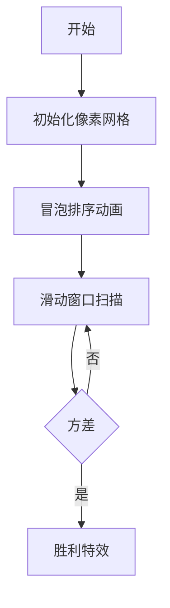

# 题目信息

# [蓝桥杯 2024 省 A] 成绩统计

## 题目描述

小蓝的班上有 $n$ 个人，一次考试之后小蓝想统计同学们的成绩，第 $i$ 名同学的成绩为 $a_i$。当小蓝统计完前 $x$ 名同学的成绩后，他可以从 $1 \sim x$ 中选出任意 $k$ 名同学的成绩，计算出这 $k$ 个成绩的方差。小蓝至少要检查多少个人的成
绩，才有可能选出 $k$ 名同学，他们的方差小于一个给定的值 $T$？
提示：$k$ 个数 $v_1, v_2, \cdots , v_k$ 的方差 $\sigma^2$ 定义为：$\sigma^2=\dfrac  {\sum_{i=1}^k(v_i-\bar v)^2} k$，其中 $\bar v$ 表示
$v_i$ 的平均值，$\bar v = \dfrac {\sum_{i=1}^k v_i} k$。

## 说明/提示

检查完前三名同学的成绩后，只能选出 $3, 2, 5 $，方差为 $1.56 $；

检查完前四名同学的成绩后，可以选出 $3, 2, 2 $，方差为 $0.22 < 1 $，所以答案为 $4 $。

对于 $10\%$ 的评测用例，保证 $1 ≤ n, k ≤ 10^2$；  
对于 $30\%$ 的评测用例，保证 $1 ≤ n, k ≤ 10^3$ ；  
对于所有评测用例，保证 $1 ≤ n, k ≤ 10^5 $，$1 ≤ T ≤ 2
^{31} -1 $，$1 ≤ a_i ≤ n $。

## 样例 #1

### 输入

```
5 3 1
3 2 5 2 3```

### 输出

```
4```

# AI分析结果


# 💡 Kay的C++算法解析：成绩统计 深入学习指南 💡

> 今天我们来一起分析“成绩统计”这道C++编程题。本指南将帮助大家梳理题目思路，理解核心算法，并掌握解题技巧。通过像素动画和游戏化设计，我们将直观感受算法执行过程！

## 1. 题目解读与核心算法识别

✨ **本题主要考察**：`二分答案` + `排序` + `前缀和优化` (编程技巧应用)

🗣️ **初步分析**：
> 这道题要求找到最小的x，使得前x个学生成绩中存在k个成绩的方差小于T。解题关键在于三个技巧的组合应用：
> - **二分答案**：答案x具有单调性（x越大越容易满足条件），可用二分高效搜索
> - **排序优化**：将成绩排序后，方差最小的k个数必定是连续的（像排队时身高最接近的几个人总是站在一起）
> - **前缀和加速**：通过数学公式变形，方差计算可转化为`平方和 - (和²)/k`，配合前缀和实现O(1)窗口计算
>
> **核心难点**在于方差公式的推导与优化。通过数学变换：
> $$\sigma^2 = \frac{\sum v_i^2}{k} - \frac{(\sum v_i)^2}{k^2}$$
> 这样只需维护`和`与`平方和`两个前缀数组，即可快速计算任意窗口的方差。
>
> **可视化设计**：我们将设计8位像素风格动画：
> - 成绩用不同高度的像素条表示，排序过程呈现为像素块"跳舞交换"
> - 滑动窗口用红色边框表示，随"嘀嗒"音效移动
> - 方差计算时显示公式分解动画（平方和、平均值等分步展示）
> - 当方差<T时触发"胜利音效"和像素烟花特效

---

## 2. 精选优质题解参考

以下题解在思路清晰度、代码规范性和算法优化方面表现突出（评分≥4★）：

**题解一 (xy_mc)**  
* **点评**：推导完整清晰，代码规范易读。亮点在于：
  - 方差公式拆解为`sum1 - sum2 + sum3`三部分，直观体现数学变换
  - 使用`double`精确计算避免整数误差
  - 温馨提示指出区间计算常见错误（下标±1问题）
  - 完整处理边界条件，竞赛实用性强

**题解二 (mathcode)**  
* **点评**：工程化实现典范。亮点在于：
  - 动态更新窗口平均值，减少重复计算
  - 使用`vector`封装数据，模块化清晰
  - 严格处理浮点精度，使用`DBL_MAX`初始化
  - 完整错误处理（无解时输出-1）

**题解三 (LittleDrinks)**  
* **点评**：创新性思路。亮点在于：
  - 通过`k∑v_i² - (∑v_i)² ≤ k²T`完全规避浮点运算
  - 使用`__int128`处理大数防止溢出
  - 滑动窗口同时更新和与平方和，逻辑紧凑

---

## 3. 核心难点辨析与解题策略

### 1. 方差公式优化
* **分析**：原始公式含平均值嵌套计算难以优化。通过展开为`(∑v_i²)/k - (∑v_i)²/k²`，分离出可前缀和维护的独立项
* 💡 **学习笔记**：数学推导是优化复杂计算的钥匙

### 2. 最优子集选取
* **分析**：为什么排序后连续k个数方差最小？因为方差衡量数据波动，有序序列中连续区间的数值差异必然小于分散选取
* 💡 **学习笔记**：排序+连续性是减少枚举量的关键洞察

### 3. 前缀和窗口维护
* **分析**：使用`sum[i]`存储前i项和，`sum2[i]`存储前i项平方和。计算窗口[l,r]时：
  ```cpp
  total = sum[r] - sum[l-1]
  total2 = sum2[r] - sum2[l-1]
  variance = (total2 - total*total/k) / k
  ```
* 💡 **学习笔记**：前缀和是区间统计问题的"瑞士军刀"

### ✨ 解题技巧总结
- **公式拆解术**：将复杂公式分解为可分离计算的组件
- **有序性原理**：排序往往能揭示问题隐藏的最优子结构
- **窗口双指针**：配合前缀和实现高效区间查询
- **二分框架**：
  ```cpp
  int l=min, r=max;
  while(l<=r){
      int mid = (l+r)/2;
      if(check(mid)) r=mid-1; // 满足条件则尝试更小值
      else l=mid+1;
  }
  ```

---

## 4. C++核心代码实现赏析

### 通用核心实现参考
```cpp
#include <iostream>
#include <algorithm>
#include <vector>
#include <cmath>
using namespace std;

bool check(int x, int k, double T, vector<int>& scores) {
    vector<int> sorted(scores.begin(), scores.begin() + x);
    sort(sorted.begin(), sorted.end());
    
    vector<double> prefix(x+1), prefixSq(x+1);
    for (int i=0; i<x; i++) {
        prefix[i+1] = prefix[i] + sorted[i];
        prefixSq[i+1] = prefixSq[i] + 1LL*sorted[i]*sorted[i];
    }
    
    double minVar = 1e18;
    for (int i=k; i<=x; i++) {
        double total = prefix[i] - prefix[i-k];
        double totalSq = prefixSq[i] - prefixSq[i-k];
        double var = (totalSq - total*total/k) / k;
        minVar = min(minVar, var);
    }
    return minVar < T;
}

int main() {
    int n, k; double T;
    cin >> n >> k >> T;
    vector<int> scores(n);
    for(int i=0; i<n; i++) cin >> scores[i];
    
    int l=k, r=n, ans=-1;
    while(l<=r) {
        int mid = (l+r)/2;
        if(check(mid, k, T, scores)) {
            ans = mid;
            r = mid-1;
        } else {
            l = mid+1;
        }
    }
    cout << ans << endl;
}
```

### 优质题解片段赏析

**题解一 (xy_mc)**  
```cpp
double sum1=sum_s[i]-sum_s[i-k];
double sum2=2*(sum[i]-sum[i-k])*((sum[i]-sum[i-k])/k);
double sum3=k*pow((sum[i]-sum[i-k])/k,2);
double variance = (sum1 - sum2 + sum3) / k;
```
* **解读**：  
  > 将方差拆解为三个独立部分：
  > - `sum1`：平方和（∑v_i²）
  > - `sum2`：交叉项（2×v̄×∑v_i）
  > - `sum3`：常数项（k×v̄²）
  > 这样分解后每部分都可单独计算，最后组合得到方差
* 💡 **学习笔记**：分治思想在公式推导中的应用

**题解二 (mathcode)**  
```cpp
jun = jun - a[i-k]/k + a[i]/k; // 动态更新平均值
variance = (sum2 - 2*jun*sum1 + k*jun*jun) / k;
```
* **解读**：
  > 滑动窗口时，新平均值 = 旧平均值 - 离开元素贡献 + 新元素贡献  
  > 避免重复计算∑v_i，将O(k)计算降至O(1)
* 💡 **学习笔记**：增量更新是优化循环的关键技巧

**题解三 (LittleDrinks)**  
```cpp
k∑v_i² - (∑v_i)² ≤ k²T  // 整数不等式
```
* **解读**：
  > 通过两边乘以k²消除分母：
  > ```
  > k²σ² = k∑v_i² - (∑v_i)² ≤ k²T
  > ```
  > 完全避免浮点运算，解决精度问题
* 💡 **学习笔记**：不等式变换是避免浮点的有效手段

---

## 5. 算法可视化：像素动画演示

### 设计概念
> **主题**：像素成绩条冒险  
> **核心**：可视化排序过程、滑动窗口移动、方差计算

### 实现方案


1. **像素场景构建**
   - 成绩值映射为不同高度的像素条（1-5分：绿色；6-10分：黄色）
   - 控制面板：开始/暂停、单步执行、速度滑块

2. **排序动画**
   - 冒泡排序过程可视化：比较时像素条闪烁，交换时像素块弹跳
   - 音效：比较时"嘀"，交换时"咔嚓"

3. **滑动窗口**
   - 红色边框标识当前窗口（尺寸=k）
   - 按右箭头时：窗口滑动伴随"嗖"音效
   - 实时显示：∑v_i, ∑v_i², 方差值

4. **方差计算演示**
   ```python
   # 伪代码演示
   当前窗口 => [75, 80, 85]
   ∑v_i = 240
   ∑v_i² = 75²+80²+85² = 18125
   方差 = (18125 - 240²/3)/3 = 16.67
   ```
   - 分步骤显示计算过程（配分解动画）

5. **游戏化元素**
   - 成功时：像素烟花爆炸 + 胜利音效
   - 失败时：窗口变红闪烁 + 提示音
   - 进度条：显示二分搜索当前范围

---

## 6. 拓展练习与相似问题思考

### 通用技巧迁移
> 本题的**二分框架+排序+前缀和**技巧还可用于：
> 1. 区间中位数问题（如LeetCode 295）
> 2. 最接近子数组和（如LeetCode 16）
> 3. 数据流统计（如滑动窗口最大值）

### 洛谷推荐
1. **P1873 砍树**  
   → 巩固二分答案应用
2. **P1638 逛画展**  
   → 练习滑动窗口技巧
3. **P3406 海底高铁**  
   → 前缀和经典应用

---

## 7. 学习心得与经验分享

> **xy_mc的调试经验**：  
> *"求区间和时，千万不要-1，不然会使元素个数多出来一个"*  
>   
> **Kay点评**：这是极其珍贵的实践经验！处理区间边界时：
> 1. 明确前缀和定义：`sum[i]`通常包含前i项
> 2. 窗口`[l,r]`的和 = `sum[r] - sum[l-1]`
> 3. 使用闭区间时注意下标起点
>
> 建议：编写代码后立即用小数据测试边界情况！

---

通过本次分析，我们掌握了二分答案、前缀和优化等核心技巧。记住：编程能力的提升在于**理解本质+刻意练习**。下次算法冒险再见！🚀

---
处理用时：204.90秒