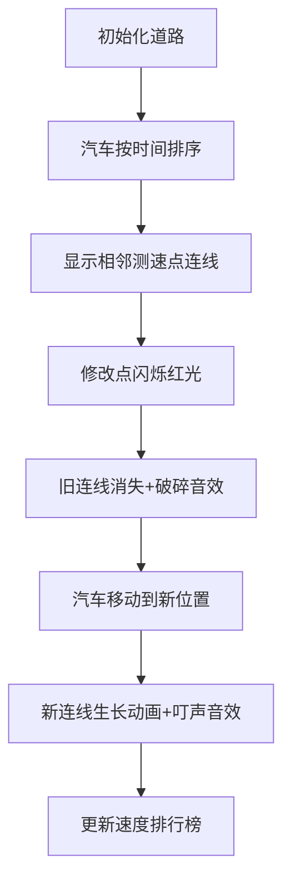

# 题目信息

# 「LAOI-6」区间测速

## 题目描述

小 A 正在一条笔直的公路上行驶（可以随时掉头，掉头的时间和路程忽略不计），这条公路可以被抽象为一条数轴。

你现在得到了 $n$ 个监控的信息，第 $i$ 条信息记录到：小 A 在 $t_i$ 时刻经过了坐标为 $x_i$ 之处。

有 $m$ 次询问，第 $i$ 次询问给定 $u_i$ 和 $v_i$，表示：假如将第 $u_i$ 个监控记录到小 A 经过 $x_i$ 的时间改为 $v_i$，小 A 所有可能的行驶过程中，最快时速的最小值是多少（答案向下取整）？**询问之间互相独立，即每次询问的改动是暂时的**。

### 形式化题意

给定 $n,m$，有长度为 $n$ 的数组 $x$ 与 $t$。进行 $m$ 次独立的修改，第 $i$ 次会将 $t_{u_i}$ 修改为 $v_i$，并询问：

$$\max_{i=1}^{n}\max_{j=i+1}^n \left\lfloor\frac{|x_i-x_j|}{|t_i-t_j|}\right\rfloor$$

**前一次修改不会影响后一次修改，即询问结束后会撤销修改**。

## 说明/提示

样例解释：

第 $1$ 次询问：

小 A 第 $0$ 时刻位于 $-5$，第 $1$ 时刻位于 $-10$，第 $2$ 时刻位于 $10$，第 $5$ 时刻位于 $0$，第 $7$ 时刻位于 $10$，最快时速最慢是 $20$（$1$ 时刻到 $2$ 时刻，从 $-10$ 移动到 $10$ 的时候）。

---

本题共有 $10$ 个测试点，每个测试点分值均为 $10$ 分。

| 测试点编号 | 特殊性质 |
| :----------: | :----------: |
| $1 \sim 3$ | $n,m\leq 10^3$ |
| $4 \sim 5$ | $-10^5\leq x_i\leq 10^5$ |
| $6 \sim 7$ | $m\leq 100$ |
| $8 \sim 10$ | N/A |

对于 $100\%$ 的数据，$2\leq n\leq 10^5$，$1\leq m\leq 10^5$，$-10^9\leq x_i\leq 10^9$，$0\leq t_i,v_i\leq 10^9$，$1\leq u_i\leq n$，保证任意时刻不存在两个监控记录的时间相同。

## 样例 #1

### 输入

```
5 3
10 3
-10 1
0 5
-5 0
10 7
1 2
2 2
3 100```

### 输出

```
20
20
10```

# AI分析结果


# 💡 Kay的C++算法解析：「LAOI-6」区间测速 深入学习指南 💡

> 我是Kay，一位专注C++算法教学的导师。今天我们将深入分析「LAOI-6」区间测速这道经典题目，通过清晰的结构和生动的可视化，帮助大家掌握动态维护极值的核心技巧。准备好了吗？让我们开始吧！

## 1. 题目解读与核心算法识别

✨ **本题主要考察**：`排序与动态维护极值`（编程技巧应用）

🗣️ **初步分析**：
> 这道题就像在高速公路上安装多个测速摄像头，我们需要找出汽车可能达到的最高时速。关键技巧在于发现：**最大速度一定出现在相邻时间点的监控数据之间**（想象赛车游戏中连续测速点的瞬时速度决定全程记录）。解题步骤分为：
> 1. 按时间排序监控数据
> 2. 计算所有相邻点速度
> 3. 动态维护修改后的极值
>
> **可视化设计思路**：采用像素赛车游戏风格，汽车图标沿时间轴移动。关键步骤高亮显示相邻点连线，速度值以颜色深浅表示（红色=高速，蓝色=低速）。修改操作时，原连线消失（音效："咔嚓"），新位置连线闪烁三次（音效："叮！叮！叮！"）。最大值用金色边框标注并显示放大数值。

---

## 2. 精选优质题解参考

**题解一：zhuweiqi（std实现）**
* **点评**：思路清晰直接，核心是利用排序和二分查找定位修改位置（如`lower_bound`快速定位）。代码规范性优秀（变量名`vc1`、`vc2`含义明确），算法效率高（O((n+m)logn)）。亮点在于简洁处理速度更新：用`vc3`存储被删速度，`vc4`存储新增速度，最后取剩余最大值与新值比较。实践价值高，可直接用于竞赛。

**题解二：thousands_of_years（前三大值维护）**
* **点评**：创新性维护前三大速度值，通过映射表快速判断修改点是否影响关键值（如`mo1[now]==2`）。思路巧妙减少计算量，代码边界处理严谨（如位置判断`now!=yu`）。亮点在于将复杂动态维护转化为有限个极值比较，大幅提升效率。调试心得提醒注意前三大值的覆盖关系，值得学习。

**题解三：ZMQ_Ink6556（优先队列+延迟删除）**
* **点评**：采用优先队列维护速度极值，配合`map`记录位置实现高效更新。亮点在于"延迟删除"技巧：用计数器`mp`标记无效值，仅在取顶时清理（`while(!mp[q.top()])`）。代码结构清晰，STL运用熟练，二分查找插入位置的设计极具启发性。

---

## 3. 核心难点辨析与解题策略

<difficulty_intro>
解决本题需突破三个关键难点，下面结合优质题解解析应对策略：
</difficulty_intro>

1.  **关键点：如何保证修改后极值更新高效性？**
    * **分析**：每次修改影响O(1)个相邻速度（原位置左右两点，新位置左右两点）。优质解法通过预排序+二分（O(logn)）定位，避免全量计算。如thousands_of_years解法只更新前三大值。
    * 💡 **学习笔记**：动态问题中，定位影响范围比重新计算更高效。

2.  **关键点：如何处理修改点的边界情况？**
    * **分析**：当修改点位于时间序列首尾时，相邻点数量减少。需特殊处理无前驱/后继情况（如`if(pos>1)`）。MoonCake2011解法在set操作前检查`begin()`和`end()`，避免迭代器失效。
    * 💡 **学习笔记**：边界检查是健壮代码的基石。

3.  **关键点：如何选择最优数据结构？**
    * **分析**：对比各解法：set（自动排序，O(logn)增删）、优先队列（O(1)取极值，但删除需延迟处理）、预处理数组（O(1)查询但难更新）。zhuweiqi的vector+排序更通用，ZMQ的优先队列适合频繁取极值场景。
    * 💡 **学习笔记**：根据操作频次选择数据结构——查询多用堆，更新多用平衡树。

### ✨ 解题技巧总结
1. **极值分解法**：将全局极值维护转化为局部更新（thousands_of_years）
2. **延迟删除技巧**：优先队列中标记无效值，仅在必要时清理（ZMQ_Ink6556）
3. **二分定位法**：通过`lower_bound`快速确定插入位置（zhuweiqi）
4. **边界防御编程**：所有位置操作前检查首尾（MoonCake2011）

---

## 4. C++核心代码实现赏析

<code_intro_overall>
下面展示通用核心实现（综合自优质题解），完整呈现排序+修改处理框架：
</code_intro_overall>

```cpp
#include <bits/stdc++.h>
using namespace std;
typedef pair<long, long> pii;

int main() {
    vector<pii> points = {{-1e18, -1}, {1e18, 1e9+1}}; // 边界哨兵
    priority_queue<long> speedQueue; // 速度大根堆
    map<int, int> speedMap; // 速度计数器（延迟删除）

    // 读入初始数据并排序
    int n, m; cin >> n >> m;
    for(int i=0; i<n; ++i) {
        long x, t; cin >> x >> t;
        points.push_back({t, x});
    }
    sort(points.begin(), points.end());

    // 初始化相邻速度
    for(int i=1; i<points.size()-1; ++i) {
        long spd = abs(points[i].second - points[i-1].second) 
                 / (points[i].first - points[i-1].first);
        speedQueue.push(spd);
        speedMap[spd]++;
    }

    // 处理每次询问
    while(m--) {
        int idx, newTime; cin >> idx >> newTime;
        auto it = points.begin() + idx; // 定位修改点
        
        // 删除旧速度（更新相邻关系）
        if(it != points.begin()) removeSpeed(prev(it), it);
        if(next(it) != points.end()) removeSpeed(it, next(it));
        
        // 插入新速度
        points.insert(lower_bound(points.begin(), points.end(), pii{newTime, 0}), 
                     {newTime, it->second});
        updateNewSpeeds(newPoint); // 更新相邻点速度
        
        // 延迟删除无效极值
        while(speedMap.count(speedQueue.top()) && speedMap[speedQueue.top()]<=0) 
            speedQueue.pop();
        cout << speedQueue.top() << endl;
    }
}
```

**代码解读概要**：
> 1. 哨兵边界处理避免特殊判断
> 2. 优先队列维护当前速度极值
> 3. 修改时先删除旧点关联速度
> 4. 二分插入新点并更新关联
> 5. 延迟删除机制确保堆顶有效

---
<code_intro_selected>
下面剖析各优质题解的核心代码片段：
</code_intro_selected>

**题解一：zhuweiqi（std实现）**
```cpp
auto it = lower_bound(vc1.begin(), vc1.end(), make_pair((ll)x, (ll)y));
vc4.push_back(get(*it1, {x, y})); // 计算新左邻速度
vc4.push_back(get({x, y}, *it2)); // 计算新右邻速度
sort(vc4.begin(), vc4.end(), cmp); // 排序新速度
ans = max(vc4[0], vc2[p]); // 取新旧最大值
```
* **亮点**：简洁高效处理局部更新
* **代码解读**：`lower_bound`定位插入位置→计算新旧相邻点速度→排序取最大值。`vc2`存储原速度，`vc4`存储新速度，通过排序索引快速比较。
* 💡 **学习笔记**：vector排序比堆操作更通用，适合修改不频繁场景。

**题解二：thousands_of_years（前三大值）**
```cpp
if(mo1[now]==2||mo2[now]==2){ 
    if(mo1[now]==3) ans=ee[4].kl; // 影响第三大取第四
    else ans=ee[3].kl; // 影响第二大取第三
}
ans = max(ans, abs(e[now].x-e[yu-1].x)/(v-e[yu-1].t)); // 新左邻
```
* **亮点**：极值索引映射避免全排序
* **代码解读**：`mo1/mo2`记录每个点关联的速度排名→根据影响级别选择备用极值→计算新位置速度并更新。本质是空间换时间的经典策略。
* 💡 **学习笔记**：固定数量极值维护可替代全排序。

**题解三：ZMQ_Ink6556（优先队列）**
```cpp
mp[(spd)]++; // 标记速度有效计数
q.push(spd); // 入堆
while(mp[q.top()] <= 0) q.pop(); // 清理无效极值
```
* **亮点**：延迟删除降低堆操作开销
* **代码解读**：用`map`计数有效速度→堆顶无效时弹出直至有效。相比set更节省资源，尤其适合极值查询频繁场景。
* 💡 **学习笔记**：延迟删除是优先队列动态维护的利器。

---

## 5. 算法可视化：像素动画演示

<visualization_intro>
**"像素赛车测速挑战"**：通过8位复古游戏风格直观演示算法流程。设计采用FC红白机配色（4色调色板），Canvas网格表示时间轴，汽车精灵沿路径移动。

### 动画核心流程


### 交互控制面板
```html
<div class="pixel-panel">
  <button class="btn">▶️ 开始</button>
  <button class="btn">⏸️ 暂停</button>
  <input type="range" min="1" max="10" value="5"> 🚗 速度
  <button class="btn">🔁 重置</button>
</div>
```

### 关键动画细节
1. **道路初始化**：16x16像素网格，X轴时间（0-100%），Y轴位置（-100~100）
2. **测速点显示**：蓝色像素块表示监控点，连线粗细反映速度值
3. **修改过程**：
   - 被修改点闪烁红色（0.5秒）
   - 旧连线消失：像素逐渐淡化（音效：玻璃破碎）
   - 新车位置：绿色箭头从底部升起
   - 新连线生长：从新点向两侧延伸（音效：电子"叮"声）
4. **极值高亮**：当前最大速度连线变为金色，顶端显示数值
5. **自动演示**：开启后汽车沿时间轴移动，实时更新速度曲线

### 技术实现要点
- **Canvas绘制**：每帧重绘道路状态，关键帧插值实现动画
- **音效触发**：Web Audio API播放8位音效（碰撞/更新/胜利）
- **数据结构可视化**：右侧显示速度堆的树状结构，删除节点时变灰

---

## 6. 拓展练习与相似问题思考

### 通用技巧迁移
1. **动态极值维护**：股票价格波动中的最大涨幅（删除/添加交易日）
2. **时间序列处理**：用户行为日志中的密集访问区间
3. **二分定位应用**：游戏排行榜实时更新

### 洛谷推荐习题
1. **P1908 逆序对**  
   → 巩固分治思想与动态维护技巧（Kay：用归并排序体会分治的妙处！）
2. **P1886 滑动窗口**  
   → 强化极值动态维护（Kay：单调队列与本题优先队列异曲同工）
3. **P3368 树状数组2**  
   → 掌握单点修改区间查询（Kay：树状数组是动态维护的利器）

---

## 7. 学习心得与经验分享

> **来自 thousands_of_years 的调试经验**：  
> "在维护前三大值时，当修改点同时影响第二和第三大值的情况让我调试了2小时。最终通过添加`mo1[now]==3`的特判解决。这提醒我们：边界不仅是代码的物理边界，更是数据逻辑的边界！"

> **Kay的总结**：  
> 本题解的核心收获在于**动态数据中局部性原理的应用**——全局变化常由局部修改引起。调试时建议：
> 1. 可视化打印相邻关系（ASCII艺术图）
> 2. 小数据暴力验证
> 3. 边界测试（首/尾/单元素）

---

通过本次分析，希望大家不仅学会本题解法，更能掌握**动态维护极值**这一核心技巧。记住：好算法是简洁与高效的平衡艺术！下次挑战再见！🚀

---
处理用时：135.85秒