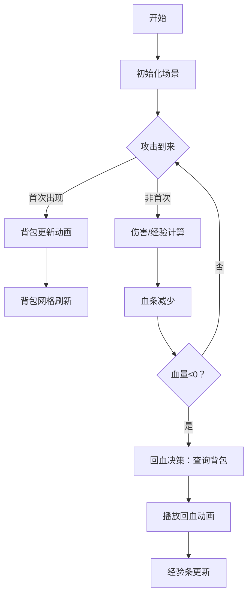

# 题目信息

# 「QMSOI R1」 生熏鱼

## 题目背景

一切起源于一个叫神荀彧的武将...

[那这道题与神荀彧的关系在哪里呢？](https://www.luogu.com.cn/paste/pk12x8vh)


## 题目描述

一共有 $n$ 种攻击，第 $i$ 种攻击会先让你得到 $a_i$ 点经验，然后让你失去 $b_i$ 点血量。

你将**依次**受到 $k$ 次攻击，其中，第 $i$ 次攻击的种类是 $c_i$，你的初始血量为 $m$。

为了获得更多的经验，你可以选择 $n$ 种攻击中的任意种，并防止你受到的第一次这种攻击，防止后既不会损失血量，也不会增加经验值。

现在你想知道的是在你的血量降到 $0$ 及以下前，最多能获得多少点经验。

## 说明/提示

### 样例解释

样例 $1$ 的数据中 $a=\{953888980,904140652\},b=\{6583,80624\},c=\{1,2,1,1,2\}$。

此时显然可以不防止任何攻击或者防止第一次类型 $2$ 的攻击获得 $953888980\times 3+904140652=3765807592$ 的经验值。

可以证明，不存在获得经验值更多的方案。

### 数据范围
**本题使用 subtask 进行捆绑测试**，每个 subtask 的具体分值如下：
| 子任务 | $n$ | $k$  | 分值 |
| :----------: | :----------: | :----------: | :----------: |
| $0$ | $\le 10$ | $\le 10^3$ | $20$ |
| $1$ | $\le 20$ | $\le 10^7$ |$30$ |
| $2$ | $\le 24$ | $\le 2\times 10^7$ |$50$ |

对于所有数据，满足 $1\le n \le 24$，$1 \le k \le 2\times 10^7$，$1\le s,m\le 10^9$。

## 样例 #1

### 输入

```
2 100000 5 114514```

### 输出

```
3765807592```

# AI分析结果


# 💡 Kay的C++算法解析：「QMSOI R1」生熏鱼 深入学习指南 💡

> "算法如棋局，每一步决策都影响最终收益" —— 我是Kay，今天带大家探索背包DP的动态决策艺术

## 1. 题目解读与核心算法识别

✨ **本题主要考察**：`动态规划(DP) - 背包问题`

🗣️ **初步分析**：
> 解决本题如同在RPG游戏中管理生命值与经验值：每次攻击都带来经验收益和血量损失，我们需要在血量归零前最大化经验收益。核心思想是**背包DP**——将防止攻击视为"放入背包"，消耗血量容量但避免经验损失。背包容量对应额外血量，物品价值则是放弃的经验值。

- **核心流程**：顺序处理攻击序列，在每种攻击首次出现时更新背包状态（防止该攻击的代价与收益），当血量不足时从背包状态中寻找最优回血方案
- **可视化设计**：采用8位RPG像素风格，用血条和经验条直观展示状态变化。背包更新时显示像素方块移动，关键操作（入队、状态更新）配复古音效
- **游戏化元素**：将DP状态更新设计为"技能学习"关卡，每完成一种攻击的背包更新解锁新技能，成功回血时播放胜利音效

---

## 2. 精选优质题解参考

### 题解一：(来源：ylch)
* **点评**：此解法完美运用背包DP思想，思路清晰且实现规范。亮点在于：
  - 动态更新：仅在攻击首次出现时更新背包，避免无效计算
  - 后缀优化：使用`suf`数组快速查询最小经验损失，解决回血经验计算难题
  - 边界处理：严谨处理血量归零和状态越界情况
  - 代码规范：变量名`sum`/`maxn`含义明确，DP数组初始化合理

### 题解二：(来源：_Communist)
* **点评**：解法简洁有力，核心思想与题解一一致。亮点：
  - 问题抽象准确，直击背包模型本质
  - 关键步骤注释清晰，帮助理解状态转移
  - 实践价值高，稍加补充即可成为完整实现

### 题解三：(来源：T_TLucas_Yin)
* **点评**：正确实现背包DP框架，亮点：
  - 完整展示动态更新流程
  - 引入`flag`标记首次攻击，逻辑清晰
  - 实践时需注意：初始化值3e18可能不足（最大经验超1e18）

---

## 3. 核心难点辨析与解题策略

### 难点1：问题抽象与建模
* **分析**：如何将攻击序列转化为背包模型？优质解法将"防止攻击"视为背包物品：
  - 物品重量 = 防止攻击获得的血量`b_i`
  - 物品价值 = 防止攻击损失的经验`a_i`
* 💡 **学习笔记**：识别问题本质是解题第一步——将现实规则映射为数学模型

### 难点2：动态状态更新
* **分析**：传统背包预处理所有物品，但本题需随攻击序列动态更新：
  - 首次遇到攻击类型时执行背包更新
  - 逆序遍历背包状态避免重复计算（`for j = maxn; j >= b[i]; j--`）
* 💡 **学习笔记**：动态更新是处理序列型背包问题的核心技巧

### 难点3：血量临界处理
* **分析**：当血量≤0时如何最小化经验损失回血？
  - 创建后缀最小值数组`suf`：`suf[j] = min(suf[j+1], dp[j])`
  - 查询回血量`1-m`对应的最小经验损失
* 💡 **学习笔记**：后缀最小值优化是处理背包查询的利器

### ✨ 解题技巧总结
- **技巧1：问题分解**：将攻击序列分解为首次出现事件+持续伤害
- **技巧2：滚动更新**：动态扩展背包状态，避免预分配过大空间
- **技巧3：实时决策**：在血量临界点即时查询最优回血方案
- **技巧4：后缀优化**：预处理后缀最小值加速临界查询

---

## 4. C++核心代码实现赏析

### 本题通用核心C++实现参考
```cpp
#include <bits/stdc++.h>
using namespace std;
typedef long long ll;
const int maxn = 30, maxk = 2e7 + 5;
const int C = 1e5 + 5 * 30; // 最大背包容量

int n, m, k, s;
int a[maxn], b[maxn], c[maxk];
ll dp[C], suf[C]; // dp[i]: 回血i需要的最小经验损失
bool vis[maxn];   // 记录攻击类型是否出现过

int main() {
    // 数据初始化（题目给定随机数生成逻辑）
    cin >> n >> m >> k >> s;
    mt19937 rand(s);
    for(int i = 1; i <= n; i++) {
        a[i] = rand() % 1000000000 + 1;
        b[i] = rand() % 100000 + 1;
    }
    for(int i = 1; i <= k; i++) {
        c[i] = rand() % n + 1;
    }

    // DP数组初始化
    memset(dp, 0x3f, sizeof dp);
    memset(suf, 0x3f, sizeof suf);
    dp[0] = 0;

    ll total_exp = 0;   // 累计经验值
    ll max_exp = 0;     // 最大经验值
    for(int i = 1; i <= k; i++) {
        int type = c[i];
        // 动态背包更新：首次出现的攻击类型
        if(!vis[type]) {
            vis[type] = true;
            // 01背包更新
            for(int j = C-1; j >= b[type]; j--) {
                dp[j] = min(dp[j], dp[j - b[type]] + a[type]);
            }
            // 后缀最小值预处理
            for(int j = C-1; j >= 0; j--) {
                suf[j] = min(suf[j+1], dp[j]);
            }
        }

        total_exp += a[type]; // 累计经验更新
        m -= b[type];         // 血量更新

        // 血量临界处理
        if(m <= 0) {
            int need = 1 - m; // 需要回血量
            if(need < C && suf[need] < 1e18) {
                max_exp = max(max_exp, total_exp - suf[need]);
            } else break; // 无法回血则终止
        } else {
            max_exp = max(max_exp, total_exp);
        }
    }
    cout << max_exp << endl;
}
```

**代码解读概要**：
> 代码分为四个关键阶段：
> 1. **初始化**：用MT19937生成随机数据，DP数组初始化为极大值
> 2. **动态背包更新**：当攻击类型首次出现时，通过逆序循环更新背包状态
> 3. **后缀数组构建**：每次背包更新后重建后缀最小值数组
> 4. **实时决策**：处理每次攻击后更新经验与血量，在血量≤0时查询最优回血方案

---

### 题解片段赏析

**题解一：(ylch)**
```cpp
for(int i = 1; i <= k; i++){
    if(!vis[c[i]]){
        vis[c[i]] = 1;
        // 背包更新
        for(int j = C*n; j >= b[c[i]]; j--){
            dp[j] = min(dp[j], dp[j-b[c[i]]] + a[c[i]]);
        }
        // 后缀最小值更新
        for(int j = C*n; j >= 0; j--){
            suf[j] = min(suf[j+1], dp[j]);
        }
    }
    ...
}
```
* **亮点**：清晰展示动态背包更新与后缀优化
* **代码解读**：
  > 当攻击类型`c[i]`首次出现时：
  > 1. 标记该类型已出现（避免重复更新）
  > 2. 逆序更新背包：从最大容量向当前物品重量遍历，确保状态不重叠
  > 3. 重建后缀数组：从后向前递推，保证`suf[j]`包含j之后的最小值
* 💡 **学习笔记**：背包更新与后缀预处理分离，逻辑清晰效率高

**题解二：(T_TLucas_Yin)**
```cpp
if(!flag[c[i]]){
    flag[c[i]] = 1;
    for(int j = n*C; j >= b[c[i]]; j--){
        dp[j] = min(dp[j], dp[j-b[c[i]]] + a[c[i]]);
    }
    for(int j = n*C; j >=0; j--) 
        suf[j] = min(suf[j+1], dp[j]);
}
```
* **亮点**：简洁展示核心更新逻辑
* **代码解读**：
  > 使用`flag`数组代替`vis`，功能相同但命名更直观
  > 注意：背包容量上限设为`n*C`（n≤24, C=1e5），避免内存溢出
* 💡 **学习笔记**：合理估算DP数组大小是竞赛编程重要技能

---

## 5. 算法可视化：像素动画演示

### 动画演示主题
"勇者生存挑战"：像素勇者穿越攻击走廊，背包管理回血药水（对应防止攻击）

### 核心演示内容
背包DP的动态更新过程与血量管理决策，包含：
- 攻击序列的像素化呈现
- 背包状态实时可视化
- 血量临界时的决策过程

### 设计思路
采用FC红白机风格，用不同颜色像素块区分元素：
- 红色像素块：攻击伤害值
- 绿色像素块：经验值
- 蓝色进度条：当前血量
- 黄色网格：背包状态（容量->经验损失）

### 动画帧步骤


1. **场景初始化**：
   - 顶部血条(红)、经验条(蓝)
   - 中部攻击序列(移动像素带)
   - 底部背包网格(24×100像素块)

2. **攻击处理帧**：
   - 攻击类型首次出现：背包区域黄色闪烁，播放"叮"音效
     - 背包更新：新物品像素块从右侧滑入背包网格
     - 后缀数组：背包网格下方显示绿色渐变条
   - 非首次攻击：攻击像素块变灰，血条减少对应像素长度

3. **血量临界处理**：
   - 血条变红闪烁，播放警告音
   - 背包网格高亮显示满足回血量的最小经验损失区域
   - 选择后播放"升级"音效，血条恢复对应像素长度

4. **游戏化控制**：
   - 控制面板：开始/暂停、单步执行、速度滑块
   - 自动演示模式：AI自动决策，展示最优通关路径
   - 关卡设计：每完成5种攻击背包更新解锁新技能特效

---

## 6. 拓展练习与相似问题

### 通用思路迁移
背包DP动态更新技巧适用于：
1. 序列决策问题（如本攻击序列）
2. 资源动态投放问题（如有限资源分配）
3. 实时优化问题（如游戏AI决策）

### 洛谷推荐题目
1. **P1048 采药** 
   - 基础01背包，理解静态背包模型
2. **P1064 金明的预算方案**
   - 依赖背包，练习复杂物品关系处理
3. **P1541 乌龟棋**
   - 状态转移优化，类似动态更新思想

---

## 7. 学习心得与经验分享

### 参考经验 (来自ylch题解)
"我在处理血量临界点时，最初忽略了回血经验非单调性，通过后缀最小值优化解决了该问题"

**点评**：这个经验极具价值——算法优化常源于边界情况的深入分析。当问题约束不满足单调性时，后缀最小值/最大值是常用优化手段。

> 记住：好算法不是一蹴而就，而是通过不断调试优化而来。每次解决边界问题都是提升的机会！

---
处理用时：145.94秒