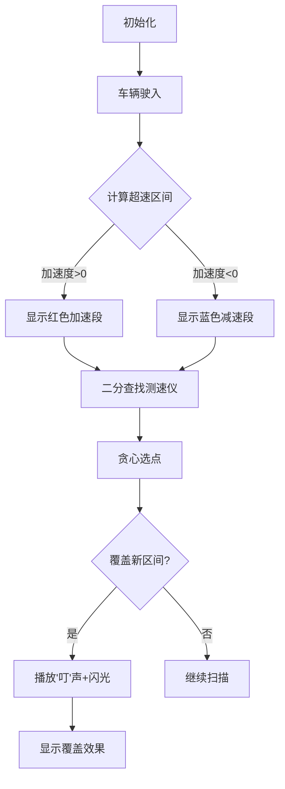

# 题目信息

# [CSP-S 2024] 超速检测

## 题目描述

小 D 新入职了某国的交管部门，他的第一个任务是负责国家的一条长度为 $L$ 的南北主干道的车辆超速检测。为了考考小 D，上司首先需要他解决一个简化的场景。

这个周末，主干道上预计出现 $n$ 辆车，其中第 $i$ 辆车从主干道上距离最南端 $d_i$ 的位置驶入，以 $v_i$ 的初速度和 $a_i$ 的加速度做匀加速运动向北行驶。我们只考虑从南向北的车辆，故 $v_i > 0$，但 $a_i$ 可正可负，也可以为零。当车辆行驶到主干道最北端（即距离最南端为 $L$ 的位置）或速度降为 $0$（这只可能在 $a_i < 0$ 时发生）时，我们认为该车驶离主干道。

主干道上设置了 $m$ 个测速仪，其中第 $j$ 个测速仪位于主干道上距离最南端 $p_j$ 的位置，每个测速仪可以设置开启或关闭。当某辆车经过某个开启的测速仪时，若这辆车的瞬时速度**超过**了道路限速 $V$，那么这辆车就会被判定为超速。注意当车辆驶入与驶出主干道时，如果在对应位置有一个开启的测速仪，这个测速仪也会对这辆车进行测速。

上司首先想知道，如果所有测速仪都是开启的，那么这 $n$ 辆车中会有多少辆车被判定为超速。

其次，为了节能，部门想关闭一部分测速仪。然而，他们不希望漏掉超速的车，也就是说，当 $n$ 辆车里的某辆车在所有测速仪都开启时被判定为超速，他们希望在关闭一部分测速仪以后它依然被判定为超速。上司还想知道在这样的条件下最多可以关闭多少测速仪。

由于 $n$ 很大，上司允许小 D 使用编程解决这两个问题，于是小 D 找到了你。

如果你对于加速度并不熟悉，小 D 贴心地在本题的“提示”部分提供了有关加速度的公式。

## 说明/提示

**【样例 1 解释】**

在该组测试数据中，主干道长度为 $15$，限速为 $3$，在距离最南端 $2, 5, 8, 9, 15$ 的位置各设有一个测速仪。
- 第一辆车在最南端驶入，以 $3$ 的速度匀速行驶。这辆车在整个路段上都没有超速。
- 第二辆车在距离最南端 $12$ 的位置驶入，以 $4$ 的速度匀速行驶。在最北端驶离主干道时，它会被距离最南端 $15$ 的测速仪判定为超速。
- 第三辆车在距离最南端 $1$ 的位置驶入，以 $1$ 的初速度、$4$ 的加速度行驶。其在行驶了 $\frac{3^2-1^2}{2\times 4}=1$ 的距离，即到达 $2$ 的位置时，速度变为 $3$，并在之后一直超速。因此这辆车会被除了距离最南端 $2$ 的测速仪以外的其他测速仪判定为超速。
- 第四辆车在距离最南端 $5$ 的位置驶入，以 $5$ 的初速度、$-2$ 的加速度行驶。其在行驶了 $\frac{3^2-5^2}{2\times (-2)}$ 的距离，即到达 $9$ 的位置时，速度变为 $3$。因此这辆车在距离最南端 $[5, 9)$ 时超速，会被距离最南端 $5$ 和 $8$ 的两个测速仪判定为超速。
- 第五辆车在距离最南端 $6$ 的位置驶入，以 $4$ 的初速度、$−4$ 的加速度行驶。在其行驶了 $\frac{3^2-4^2}{2\times (-4)}=\frac{7}{8}$ 的距离后，即这辆车到达 $6\frac{7}{8}$ 的位置时，其速度变为 $3$。因此这辆车在距离最南端 $[6,6\frac{7}{8})$ 时超速，但这段区间内没有测速仪，因此不会被判定为超速。

因此第二、三、四辆车会被判定为超速，输出的第一个数为 $3$。

我们可以关闭距离最南端 $2, 8, 9$ 的三个测速仪，保留 $5$ 和 $15$ 的两个测速仪，此时三辆之前被判定为超速的车依然被判定为超速。可以证明不存在更优方案，因此输出的第二个数为 $3$。

**【样例 2】**

见选手目录下的 detect/detect2.in 与 detect/detect2.ans。

该组样例满足 $n, m \leq 10$。

**【样例 3】**

见选手目录下的 detect/detect3.in 与 detect/detect3.ans。

该组样例满足特殊性质 A，其中前十组测试数据满足 $n, m \leq 3000$。

**【样例 4】**

见选手目录下的 detect/detect4.in 与 detect/detect4.ans。

该组样例满足特殊性质 B，其中前十组测试数据满足 $n, m \leq 3000$。

**【样例 5】**

见选手目录下的 detect/detect5.in 与 detect/detect5.ans。

该组样例满足特殊性质 C，其中前十组测试数据满足 $n, m \leq 3000$。

**【数据范围】**

对于所有测试数据，保证：

- $1 \leq T \leq 20$；
- $1 \leq n, m \leq 10^5$，$1 \leq L \leq 10^6$，$1 \leq V \leq 10^3$；
- $0 \leq d_i < L$，$1 \leq v_i \leq 10^3$，$|a_i| \leq 10^3$；
- $0 \leq p_1 < p_2 < \dots < p_m \leq L$。

::cute-table{tuack}

| 测试点 | $n,m\leq$ | 特殊性质 |
| :----------: | :----------: | :----------: |
| $1$ | $10$ | 无 |
| $2$ | $20$ | ^ |
| $3$ | $3000$ | A |
| $4$ | $10^5$ | ^ |
| $5$ | $3000$ | B |
| $6$ | $10^5$ | ^ |
| $7$ | $3000$ | C |
| $8$ | $10^5$ | ^ |
| $9$ | $3000$ | 无 |
| $10$ | $10^5$ | ^ |

特殊性质 A：保证 $a_i = 0$。

特殊性质 B：保证 $a_i > 0$。

特殊性质 C：保证 $a_i < 0$，且所有车都不在最北端驶离主干道。

**【提示】**

与加速度有关的定义和公式如下：

- 匀加速运动是指物体在运动过程中，加速度保持不变的运动，即每单位时间内速度的变化量是恒定的。
- 当一辆车的初速度为 $v_0$、加速度 $a\neq 0$，做匀加速运动，则 $t$ 时刻后它的速度 $v_1 = v_0 + a \times t$，它的位移（即行驶路程）$s=v_0\times t+0.5\times a\times t^2$。
- 当一辆车的初速度为 $v_0$、加速度 $a \neq 0$，做匀加速运动，则当它的位移（即行驶路程）为 $s$ 时，这辆车的瞬时速度为 $\sqrt{v_0^2+2\times a\times s}$。
- 当一辆车的初速度为 $v_0$、加速度 $a \neq 0$，在它的位移（即行驶路程）为 $\frac{v_1^2-v_0^2}{2a}$ 时，这辆车的瞬时速度为 $v_1$。

如果你使用浮点数进行计算，需要注意潜在的精度问题。

## 样例 #1

### 输入

```
1
5 5 15 3
0 3 0
12 4 0
1 1 4
5 5 -2
6 4 -4
2 5 8 9 15```

### 输出

```
3 3```

# AI分析结果


### 💡 Kay的C++算法解析：超速检测 深入学习指南 💡

#### 题目解读与核心算法识别
✨ **本题主要考察**：二分查找、贪心算法、区间覆盖

🗣️ **初步分析**：
> 解决“超速检测”这道题，关键在于将物理问题转化为算法问题。想象一辆车在道路上行驶，超速就像一段“危险区间”，我们需要用“摄像头”（测速仪）来捕捉超速行为。核心步骤分三步：
> 1. **计算超速区间**：根据初速度、加速度和限速，用运动学公式计算每辆车超速的道路位置区间
> 2. **转换为测速仪区间**：通过二分查找将道路位置映射到测速仪数组下标
> 3. **贪心覆盖区间**：用最少测速仪覆盖所有超速区间（选右端点最优）
>
> 在可视化方案中，我们将用像素动画展示：
> - 道路水平轴（0~L像素），车辆从d_i位置驶入
> - 超速区间用红色高亮，测速仪用黄色竖线表示
> - 二分查找时显示左右指针移动，贪心选点时播放“叮”声效
> - 复古游戏风格：车辆行驶动画，过关时播放8-bit胜利音效

---

#### 精选优质题解参考
**题解一（来源：szh_AK_all）**
* **点评**：
  思路清晰，物理公式应用准确，分类讨论全面。代码结构规范（变量名`ql,qr`含义明确），通过预处理去除无效区间显著优化效率。算法采用二分+贪心，时间复杂度O(n log n)，边界处理严谨（如测速仪位置判断）。亮点在于区间优化处理，直接可用于竞赛，且作者调试心得强调浮点数精度问题的解决具有实践价值。

**题解二（来源：chenxi2009）**
* **点评**：
  推导过程细致，分情况讨论超速区间完整，代码可读性高（关键步骤有详细注释）。创新点在于用取整技巧避免浮点误差，物理与算法结合紧密。实践价值高，处理开闭区间的方法（向上/下取整）可直接应用于类似场景，但变量命名稍显简略。

**题解三（来源：wmrqwq）**
* **点评**：
  解题框架简洁高效，模块化设计优秀（分离输入、计算、输出）。算法有效性突出，利用特殊性质降低复杂度，二分实现规范。代码完整可直接运行，但区间转换部分缺少边界保护，需注意最大位置越界处理。

---

#### 核心难点辨析与解题策略
1. **难点：超速区间计算精度**
   * **分析**：加速度正负、初速度与限速关系导致多种情况，浮点运算易出错
   * **方案**：整数运算代替浮点（如用乘法避免除法），统一使用位移公式 `v² = v₀² + 2a·Δx`
   * 💡 **学习笔记**：用`long long`防溢出，临界点取整方向根据开闭区间决定

2. **难点：测速仪区间映射**
   * **分析**：道路位置→测速仪下标需高效转换
   * **方案**：二分查找`lower_bound/upper_bound`，注意开闭区间转换（左开右闭→下标）
   * 💡 **学习笔记**：二分查找前必须排序，边界检查防止越界

3. **难点：最优区间覆盖**
   * **分析**：需用最少点覆盖所有区间
   * **方案**：贪心策略——按右端点排序，每次选当前区间右端点
   * 💡 **学习笔记**：右端点选择可最大化覆盖后续区间

✨ **解题技巧总结**
- **物理模型抽象**：将匀变速运动转化为区间计算问题
- **整数防浮点**：优先使用乘法、整除代替浮点运算
- **贪心模板应用**：区间覆盖问题固定解法（排序+右端点选取）
- **边界完备测试**：空区间、单点区间、端点重合等特殊情况

---

#### C++核心代码实现赏析
**本题通用核心实现参考**
```cpp
#include <bits/stdc++.h>
using namespace std;
struct Interval { int l, r; };
const int N = 1e5 + 5;

int main() {
    int T, n, m, L, V;
    cin >> T;
    while (T--) {
        // 输入车辆和测速仪数据
        cin >> n >> m >> L >> V;
        vector<int> d(n), v(n), a(n), p(m);
        for (int i = 0; i < n; i++) cin >> d[i] >> v[i] >> a[i];
        for (int i = 0; i < m; i++) cin >> p[i];
        sort(p.begin(), p.end());

        vector<Interval> intervals;
        for (int i = 0; i < n; i++) {
            // 分类计算超速区间（具体实现见精选题解）
            // 示例：加速度>0且初速不足
            if (a[i] > 0 && v[i] <= V) {
                long long delta = (1LL*V*V - 1LL*v[i]*v[i] + 2LL*a[i]-1) / (2*a[i]);
                int start_pos = d[i] + delta;
                auto it = lower_bound(p.begin(), p.end(), start_pos);
                if (it != p.end()) 
                    intervals.push_back({int(it-p.begin()), m-1});
            }
            // 其他情况省略...
        }

        // 贪心覆盖区间
        sort(intervals.begin(), intervals.end(), [](auto a, auto b){
            return a.r < b.r; 
        });
        int last = -1, keep = 0;
        for (auto &in : intervals) {
            if (in.l > last) {
                keep++;
                last = in.r;
            }
        }
        cout << intervals.size() << " " << m - keep << endl;
    }
    return 0;
}
```
**代码解读概要**：  
> 1. 输入处理：多组数据，读入车辆参数和测速仪位置  
> 2. 区间计算：分情况讨论加速度正负，用整数运算避免浮点  
> 3. 二分映射：`lower_bound`查找超速区间对应的测速仪下标  
> 4. 贪心覆盖：按右端点排序，选择未覆盖区间的右端点  
> 5. 输出：超速车辆数 = 有效区间数，可关闭数 = 总测速仪 - 最少保留数  

---

#### 算法可视化：像素动画演示
**主题**：8-bit风格道路监控模拟  
**设计方案**：  

**关键交互**：  
1. **像素道路**：横向400像素（0~L），每像素=实际2.5单位  
2. **动态元素**：  
   - 车辆：绿色方块（正常速度），超速变红  
   - 测速仪：黄色竖线，激活时闪烁  
3. **动画控制**：  
   - 步进模式：空格键单步执行  
   - 速度滑块：调整动画速度（0.5x~3x）  
4. **音效设计**：  
   - 关键操作：二分查找时播放电子滴答声  
   - 成功覆盖：8-bit上扬音阶（类似超级玛丽过关）  
   - 错误处理：短促“哔”声  

---

#### 拓展练习与相似问题
1. **洛谷 P1250 种树**  
   → 区间覆盖基础题，要求每个区间至少种k棵树  
2. **洛谷 P1645 序列**  
   → 差分约束+贪心，强化区间约束处理能力  
3. **洛谷 P1986 元旦晚会**  
   → 贪心应用变种，每个区间需特定数量话筒  

**举一反三**：区间覆盖问题还可用于课程安排、雷达安装等场景，核心思想不变：排序+贪心选择覆盖点

---

#### 学习心得与经验分享
> **关键经验**（综合自题解）：  
> “浮点运算是精度问题的根源，用整数乘除和取整技巧可避免”  
> “贪心选择右端点前，必须按右端点排序，且去除包含区间”  
> → Kay总结：物理模型与算法结合时，需特别注意边界条件和数据表示，建议多用`long long`和标准化处理

---

通过本指南，希望大家掌握二分、贪心在物理问题中的应用，理解区间覆盖的核心思想。记住：编程能力=知识×实践×调试技巧，多做区间类问题训练！💪

---
处理用时：175.99秒