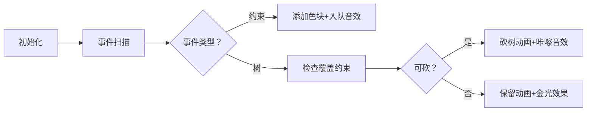

# 题目信息

# [USACO24DEC] Deforestation S

## 题目描述

Farmer John 正在扩大他的农场！他已经找到了完美的位置——红黑森林，由数轴上的 $N$ 棵树（$1≤N≤10^5$）组成，第 $i$ 棵树位于位置 $x_i$（$−10^9≤x_i≤10^9$）。

环境保护法限制了 Farmer John 可以砍伐哪些树来为他的农场腾出空间。有 $K$ 个限制（$1≤K≤10^5$），规定在线段 $[l_i,r_i]$（包含端点）中必须始终至少存在 $t_i$ 棵树（$−10^9≤l_i,r_i≤10^9$）。输入保证红黑森林初始时满足这些限制。

Farmer John 想要他的农场尽可能大。请帮助他计算他可以砍伐的树的最大数量，同时仍然满足所有限制！

## 说明/提示

### 样例解释

对于第一个测试用例，Farmer John 可以砍伐前 $4$ 棵树，留下位于 $x_i=2,6,7$ 的树来满足限制。

对于第二个测试用例，额外的限制不会影响 Farmer John 可以砍伐哪些树，因此他可以砍伐相同的树并同时满足两个限制。

对于第三个测试用例，Farmer John 至多只能砍伐 $3$ 棵树，因为初始时有 $7$ 棵树，但第二个限制要求他至少留下 $4$ 棵树不砍伐。

### 测试点性质

测试点性质：
- 测试点 1：样例。
- 测试点 2：$N,K≤16$。
- 测试点 3-5：$N,K≤1000$。
- 测试点 6-7：对于所有的 $i=1,\cdots,K$ 有 $ti=1$。
- 测试点 8-11：没有额外限制。

## 样例 #1

### 输入

```
3
7 1
8 4 10 1 2 6 7
2 9 3
7 2
8 4 10 1 2 6 7
2 9 3
1 10 1
7 2
8 4 10 1 2 6 7
2 9 3
1 10 4```

### 输出

```
4
4
3```

# AI分析结果


### 💡 Kay的C++算法解析：Deforestation S 深入学习指南 💡

> 今天我们来分析 USACO24DEC 的「Deforestation S」这道题。本指南将帮助你理解如何通过贪心策略和数据结构优化，在满足区间约束的前提下最大化砍树数量。我们将通过清晰的算法解析、代码实现和像素动画演示，带你深入掌握解题技巧！

---

## 1. 题目解读与核心算法识别

✨ **本题主要考察**：`贪心策略 + 数据结构优化`  

🗣️ **初步分析**：
> 解决此题的关键在于运用 **事件流处理** 和 **贪心决策**。想象你是一名森林管理员（像素小人），需要在数轴上移动并决定砍伐哪些树（绿色像素块）。每个约束条件（半透明色块）要求特定区间内必须保留一定数量的树。

> - **核心思路**：将树的位置和约束的左端点统一为「事件点」排序。用优先队列动态维护覆盖当前树的有效约束，根据队列状态决定是否砍树。
> - **可视化设计**：
>   - 数轴用网格展示，树显示为像素方块，约束区间用半透明色块标记
>   - 当像素小人移动到树的位置时，高亮覆盖该树的约束区间
>   - 优先队列以像素二叉树形式实时显示，堆顶节点闪烁红光
>   - 砍树时播放「咔嚓」音效，保留树时播放「叮」音效
> - **复古游戏化**：采用8位像素风格（类似FC游戏），控制面板含步进/暂停/调速滑块。成功满足所有约束时播放胜利音效并显示金色树动画。

---

## 2. 精选优质题解参考

**题解一（来源：masonxiong）**
* **点评**：思路清晰度⭐️⭐️⭐️⭐️⭐️  
  将问题抽象为事件流处理，利用优先队列动态维护有效约束。代码规范（变量名`events`/`pq`含义明确），边界处理严谨（自动弹出无效约束）。亮点在于用`pq.top().first > ans`巧妙判断砍树条件，时间复杂度优化至$O((n+k)\log k)$。

**题解二（来源：XGTD）**
* **点评**：代码规范性⭐️⭐️⭐️⭐️  
  结合树状数组和`multiset`实现高效查询与删除。亮点在于离散化后使用`upper_bound`快速定位区间，并用`multiset`维护可砍树位置。实践价值高，但实现稍复杂。

**题解三（来源：Chenyichen0420）**
* **点评**：算法启发性⭐️⭐️⭐️⭐️  
  创新性采用差分约束模型，将问题转化为前缀和不等式组求最长路。提供全新视角，但SPFA最坏复杂度$O(nk)$，在极端数据可能超时。

---

## 3. 核心难点辨析与解题策略

1. **难点：如何动态维护覆盖当前树的有效约束？**
   - **分析**：优质题解普遍采用 **优先队列**（小根堆），以约束右端点为键值。当处理树位置时，弹出所有右端点小于当前位置的约束（不再覆盖当前树）。
   - 💡 **学习笔记**：优先队列是处理滑动窗口约束的利器！

2. **难点：如何决定当前树是否可砍？**
   - **分析**：核心条件是「存在至少一个覆盖该树的约束，其剩余可砍树数量>0」。通过维护`pq.top().first`（当前砍树数+该约束剩余可砍数），当该值大于当前总砍树数`ans`时即可砍。
   - 💡 **学习笔记**：`pq.top().first > ans` 等价于「该约束还有砍树名额」

3. **难点：如何高效计算初始区间树数量？**
   - **分析**：使用`upper_bound/lower_bound`在排序后的树数组中计算区间包含的树数量，复杂度$O(\log n)$。
   - 💡 **学习笔记**：排序+二分是处理数轴问题的标配！

### ✨ 解题技巧总结
- **事件流处理**：将树位置和约束端点统一排序，避免复杂区间查询
- **贪心选择**：优先队列实现「能砍则砍」的局部最优策略
- **边界防御**：多组数据必须清空优先队列和事件数组
- **复杂度优化**：优先队列操作$O(\log k)$，整体复杂度$O((n+k)\log k)$

---

## 4. C++核心代码实现赏析

**本题通用核心C++实现参考**
```cpp
#include <bits/stdc++.h>
using namespace std;

int main() {
    int T; cin >> T;
    while (T--) {
        int n, k; cin >> n >> k;
        vector<int> trees(n);
        for (int i = 0; i < n; ++i) cin >> trees[i];
        sort(trees.begin(), trees.end()); // 关键步骤1：树坐标排序

        vector<tuple<int, int, int, int>> events; // (位置, 类型, 右端点, 剩余可砍数)
        for (auto x : trees) events.emplace_back(x, 1, 0, 0); // 树事件
        while (k--) {
            int l, r, t;
            cin >> l >> r >> t;
            // 计算区间内树的数量
            auto lit = lower_bound(trees.begin(), trees.end(), l);
            auto rit = upper_bound(trees.begin(), trees.end(), r);
            int remain = (rit - lit) - t; // 可砍树数量
            events.emplace_back(l, 0, r, remain); // 约束事件
        }

        sort(events.begin(), events.end()); // 关键步骤2：按位置排序
        priority_queue<pair<int, int>, vector<pair<int, int>>, greater<>> pq; // (ans+remain, 右端点)
        int ans = 0; // 记录砍树数量

        for (auto [pos, typ, r, remain] : events) {
            if (typ == 0) { // 约束事件
                pq.emplace(ans + remain, r);
            } else { // 树事件
                // 弹出无效约束（右端点<当前位置）
                while (!pq.empty() && pq.top().second < pos) pq.pop();
                // 无约束或仍有名额时砍树
                if (pq.empty() || pq.top().first > ans) ans++;
            }
        }
        cout << ans << '\n';
    }
}
```

**代码解读概要**：  
1. **输入处理**：多组数据框架，树坐标排序
2. **事件构建**：树事件（类型1）和约束事件（类型0）存入`events`
3. **事件处理**：按位置排序后顺序处理
4. **贪心决策**：树事件中根据优先队列状态决定是否砍树
5. **输出**：每组数据输出最大砍树数

**题解一核心片段赏析**  
```cpp
pq.emplace(ans + remain, r);  // 约束入队
while (!pq.empty() && pq.top().second < pos) pq.pop(); // 弹出无效约束
if (pq.empty() || pq.top().first > ans) ans++; // 砍树决策
```
**代码解读**：  
- **约束入队**：将`当前砍树数+剩余可砍数`作为键值，保证队列顶部总是「最紧迫」的约束
- **弹出逻辑**：当约束右端点小于当前位置，说明该约束不再覆盖后续树
- **砍树条件**：`pq.top().first > ans` 意味着该约束还有砍树名额。为什么？因为`first = ans_old + remain`，若大于当前`ans`，说明在约束加入后还未消耗完名额

---

## 5. 算法可视化：像素动画演示

### 🌲 像素伐木工：贪心策略模拟器
* **主题**：8位像素风格，仿FC游戏界面
* **核心演示**：数轴移动 + 约束检查 + 优先队列动态变化

**动画流程**：


**关键交互**：
1. **数轴网格**：横向滚动，树显示为🌲，砍后变⛓️
2. **约束面板**：屏幕上方显示激活约束列表，当前处理约束高亮
3. **优先队列可视化**：右侧显示小根堆的二叉树结构，节点显示`(ans+remain, r)`
   - 堆顶节点持续闪烁红光
   - 入队/出队时播放电子音效
4. **控制面板**：
   - 步进控制：← → 键单步移动
   - 速度滑块：调整扫描速度
   - AI演示：自动播放完整流程

**音效设计**：
- 约束添加：短促「叮」
- 砍树：清脆「咔嚓」
- 保留树：上扬「叮咚」
- 过关：8位胜利旋律

---

## 6. 拓展练习与相似问题思考

1. **P11232 [CSP-S 2024] 超速检测**  
   → 同样按右端点排序+贪心选择，强化区间覆盖理解
2. **P1250 种树**  
   → 差分约束经典应用，理解贪心与约束的关联
3. **P2887 [USACO07NOV] Sunscreen G**  
   → 优先队列维护局部最优解，掌握数据结构的选择

---

## 7. 学习心得与经验分享

> **masonxiong的经验**：  
> *"按右端点排序和优先队列的结合是本题关键。调试时特别注意多组数据的队列清空！"*  
> → 这是血的教训：多测不清空，爆零两行泪！

> **Kay的总结**：  
> 1. **排序预处理**是简化复杂区间问题的利器
> 2. **优先队列**能以$O(\log n)$动态维护最优决策
> 3. **正难则反**（砍树→保留树）是重要思维转换
> 4. **事件流模型**能有效处理多类触发点

---

通过本指南，相信你已经掌握「Deforestation S」的核心解法！记住：在算法森林中，清晰的策略是你的斧头，数据结构是你的护甲。继续挑战更多题目吧！🚀

---
处理用时：132.28秒