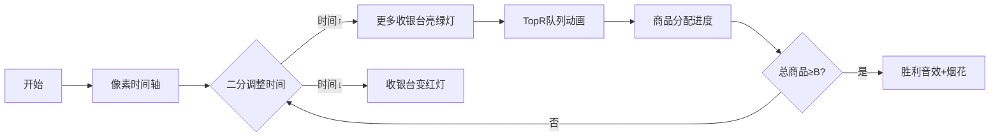

# 题目信息

# [GCJ 2018 #1A] Bit Party

## 题目描述

如今，机器人已经能够驾驶汽车，但它们能举办一场精彩的派对吗？Code Jam 团队对此的研究还处于初级阶段。我们刚刚派遣了 $\mathbf{R}$ 个机器人购物者到本地超市，为我们在多伦多举办的世界总决赛采购派对用品，但它们对加拿大派对的第一印象非常简单：它们只买了 $\mathbf{B}$ 个“bit”（bit 是当地一种小型甜甜圈状点心）。我们以后会继续改进它们的人工智能，但现在，我们希望帮助它们尽快购买完所有的 bit。

超市有 $\mathbf{C}$ 个收银员可以为顾客结账。第 $i$ 个收银员有如下特点：
- 每位顾客最多接受 $\mathbf{M}_{\mathbf{i}}$ 个商品
- 扫描每个商品需要 $\mathbf{S}_{\mathbf{i}}$ 秒
- 还需要额外花费 $\mathbf{P}_{\mathbf{i}}$ 秒用于收款和打包 bit

也就是说，一个顾客如果带着 $\mathrm{N}$ 个 bit 找到第 $i$ 个收银员（其中 $\mathrm{N}$ 必须不超过 $\mathbf{M}_{\mathbf{i}}$），则与该收银员的总交互时间为 $\mathbf{S}_{\mathbf{i}} \times \mathrm{N}+\mathbf{P}_{\mathbf{i}}$ 秒。

在机器人和收银员交互之前，你可以任意分配 bit 给机器人（bit 必须保持完整，不能拆分成小数部分！）。任何没有分到 bit 的机器人将无法与收银员交互，并会失望地离开。

接下来，对于每个至少分到一个 bit 的机器人，你需要为其选择一个不同的收银员。（两个机器人不能使用同一个收银员，一个机器人也不能使用多个收银员。）所有机器人会在时间 0 同时开始与各自的收银员交互。注意，一旦某个机器人完成了与收银员的交互，它不能再获得更多 bit，也不能与其他收银员交互。

如果你帮助机器人做出最优选择，所有机器人最早能在什么时候全部完成与收银员的交互？

## 说明/提示

**样例解释**

在样例 1 中，有两个机器人、两个 bit 和两个收银员，每个收银员最多只能处理一个商品。因此，必须给每个机器人分配一个 bit。收银员 1 需要 5 秒，收银员 2 需要 3 秒，所以所需时间为 5 秒。

样例 2 与前一个类似，但现在收银员 2 最多可以处理 2 个商品。因此，最优做法是将所有 bit 都分配给一个机器人，并让该机器人使用收银员 2。这样总共需要 $1$ 秒每个商品加上 $2$ 秒，共 $4$ 秒。

在样例 3 中，最优策略是让一个机器人带着 2 个 bit 去找收银员 2，另外两个机器人各带 1 个 bit 去找其他任意收银员。

**数据范围**

- $1 \leqslant \mathbf{T} \leqslant 100$。
- 对所有 $i$，$1 \leqslant \mathbf{M}_{\mathbf{i}} \leqslant 10^{9}$。
- 对所有 $i$，$1 \leqslant \mathbf{S}_{\mathbf{i}} \leqslant 10^{9}$。
- 对所有 $i$，$1 \leqslant \mathbf{P}_{\mathbf{i}} \leqslant 10^{9}$。
- $\mathbf{M}_{\mathbf{i}}$ 中最大的 $\mathbf{R}$ 个数之和 $\geqslant \mathbf{B}$。（即至少存在一组 $\mathbf{R}$ 个收银员可以处理所有 bit。）

**测试点 1（11 分，公开）**

- $1 \leqslant \mathbf{R} \leqslant \mathbf{C} \leqslant 5$。
- $1 \leqslant \mathbf{B} \leqslant 20$。

**测试点 2（21 分，隐藏）**

- $1 \leqslant \mathbf{R} \leqslant \mathbf{C} \leqslant 1000$。
- $1 \leqslant \mathbf{B} \leqslant 10^{9}$。

由 ChatGPT 4.1 翻译

## 样例 #1

### 输入

```
3
2 2 2
1 2 3
1 1 2
2 2 2
1 2 3
2 1 2
3 4 5
2 3 3
2 1 5
2 4 2
2 2 4
2 5 1```

### 输出

```
Case #1: 5
Case #2: 4
Case #3: 7```

# AI分析结果


### Kay的C++算法解析：GCJ 2018 #1A Bit Party 深入学习指南

---

#### **1. 题目解读与核心算法识别**  
✨ **本题主要考察**：`二分答案` + `贪心选择`  
🗣️ **初步分析**：  
> 解决"Bit Party"的关键是**双重优化策略**：  
> - **二分答案**：像调节烤箱温度一样，我们通过二分法不断试探"所有机器人完成的最短时间"（温度过高会烤焦/过低烤不熟，时间过长可行/过短不可行）。  
> - **贪心选择**：对每个试探时间`t`，计算每个收银员在`t`秒内能处理的商品上限，并**贪婪选取处理能力最强的R个收银员**（类似挑选跑得最快的运动员参赛）。  
>  
> **可视化设计思路**：  
> - 像素动画将展示**时间条滑动**（二分过程），收银员柜台用**像素进度条**显示`(t-P_i)/S_i`的计算结果  
> - 关键高亮：当收银员处理能力进入"Top R队列"时触发**8-bit音效**，商品分配成功时播放**胜利音效**  

---

#### **2. 精选优质题解参考**  
**题解（来源：tuxiaolai）**  
* **点评**：  
  思路直击核心——二分时间+贪心验证，逻辑严密性⭐️⭐️⭐️⭐️⭐️。代码亮点：  
  1. **防溢出技巧**：用`l+(r-l)/2`避免`(l+r)`溢出（重大实践价值）  
  2. **边界处理**：`max(0, min(...))`防御负数/越界（鲁棒性典范）  
  3. **空间优化**：优先队列动态维护Top R收银员（仅O(C log R)空间）  
  唯一不足：变量命名`R`与二分`r`易混淆（作者特别警示）  

---

#### **3. 核心难点辨析与解题策略**  
1. **难点1：二分边界的确定**  
   * **分析**：时间上限`r=LLONG_MAX`易溢出，必须用**偏移量写法**`mid=l+(r-l)/2`  
   * 💡 **学习笔记**：大范围二分时，算术运算优先级高于逻辑运算  

2. **难点2：收银员能力计算**  
   * **分析**：公式`res = min(M_i, (t-P_i)/S_i)`需三重防御：  
     - 时间不足时`(t-P_i)<0`返回0  
     - 商品数不超过`M_i`  
     - 除法需向下取整  
   * 💡 **学习笔记**：离散问题中，浮点转整型要显式取整  

3. **难点3：最优收银员组合选择**  
   * **分析**：用**最小堆**动态维护Top R：新元素比堆顶大时替换（确保堆内始终是当前最大R个值）  
   * 💡 **学习笔记**：求最大的R个数之和 = 用最小堆过滤小数  

**✨ 解题技巧总结**  
- **技巧1（防御性编程）**：数值计算前预判边界（如`t-P_i`可能负）  
- **技巧2（空间优化）**：用size-K堆代替全排序（复杂度O(C log R)→O(C log C)）  
- **技巧3（调试辅助）**：区分变量命名（如`totalRobots` vs `rightBound`)  

---

#### **4. C++核心代码实现赏析**  
**通用核心实现参考**  
```cpp
#include <queue>
using namespace std;
typedef long long ll;

ll solve(ll R, ll B, ll C, vector<ll>& M, vector<ll>& S, vector<ll>& P) {
    ll l = 0, r = LLONG_MAX, ans;
    while (l <= r) {
        ll mid = l + (r - l) / 2; // 防溢出核心写法
        priority_queue<ll, vector<ll>, greater<ll>> pq; // 最小堆
        ll sum = 0;

        for (int i = 0; i < C; i++) {
            ll capacity = (mid - P[i]) / S[i];       // 基础计算
            if (capacity < 0) capacity = 0;          // 时间不足防御
            ll res = min(M[i], capacity);            // 不超商品上限

            if (pq.size() < R) {                    // 堆未满直接加入
                pq.push(res);
                sum += res;
            } else if (res > pq.top()) {             // 替换最小元素
                sum += res - pq.top();
                pq.pop();
                pq.push(res);
            }
        }
        if (sum >= B) ans = mid, r = mid - 1;       // 时间可行
        else l = mid + 1;
    }
    return ans;
}
```

**题解片段赏析**  
```cpp
ll res = max(0, (int)min((ll)m[i], (mid-p[i])/s[i]));
```
* **代码解读**：  
  > 这行是**能力计算核心**：  
  > 1. `(mid-p[i])/s[i]`：计算在`mid`时间内能扫描的商品数（自动向下取整）  
  > 2. `min(m[i], ...)`：限制不超过收银员单次处理上限  
  > 3. `max(0, ...)`：防御时间不足情况（如`mid<p[i]`时得负数）  
  > → 像给收银员做"体能测试"，不合格者计0分  
* 💡 **学习笔记**：链式`min/max`是边界处理的利器  

---

#### **5. 算法可视化：像素动画演示**  
**主题**：`8-bit收银员大作战`  

**核心交互设计**：  


**关键动画细节**：  
1. **收银员像素面板**：  
   - 每个收银员显示为16x16像素小人，头顶进度条显示`(t-P_i)/S_i`  
   - 能力值达标时触发`绿色闪烁`，加入TopR队列时播放`叮`音效  
2. **控制面板**：  
   - 速度滑块：调节二分查找速度（1x-10x）  
   - `单步执行`：按一次走一个收银员计算步骤  
3. **数据结构可视化**：  
   - 右侧动态显示最小堆：新元素加入时触发`像素挤压`动画  
   - 商品总数用`像素甜甜圈`表示，每分配一个掉落进篮子  

**技术实现**：  
```javascript
// 伪代码：收银员能力计算动画
function drawCashier(i, t) {
  let scanTime = max(0, (t - P[i]) / S[i]); 
  let capacity = min(M[i], scanTime);
  drawProgressBar(i, capacity/M[i]); // 绘制进度条
  
  if (capacity > 0) playSound('bleep'); 
}
```

---

#### **6. 拓展练习与相似问题思考**  
**技巧迁移场景**：  
1. **资源分配优化**：服务器任务调度（如：最短时间完成分布式计算）  
2. **阈值检测问题**：满足条件的最小/最大值（如：网络延迟阈值）  
3. **离散决策问题**：从多选项中选最优子集（如：广告投放选择）  

**洛谷推荐**：  
1. **P3743** 小鸟的设备 - 同款二分+贪心验证  
2. **P4058** 木材加工 - 商品切割版"Bit Party"  
3. **P4343** 自动刷题机 - 二分答案变形应用  

---

#### **7. 学习心得与经验分享**  
> **参考经验（tuxiaolai）**：  
> *"注意二分初始值LLONG_MAX时，必须写mid=l+(r-l)/2"*  
> *"变量名冲突（如题目R和二分r）会导致致命错误"*  
>  
> **点评**：这些是**竞赛血泪教训**的精华：  
> 1. 数值安全：大数运算优先考虑**几何偏移**而非算术平均  
> 2. 命名规范：作用域重叠时加前缀（如`binSearch_r`）  
> 3. 防御思维：假设所有极端数据都会出现  

---

通过本次分析，我们深度拆解了二分答案+贪心选择的经典范式。记住：**二分是骨架，贪心是血肉**，而防御性编程是护甲。下次遇到"最短最长问题"，不妨先问：能否二分验证？

---
处理用时：85.80秒