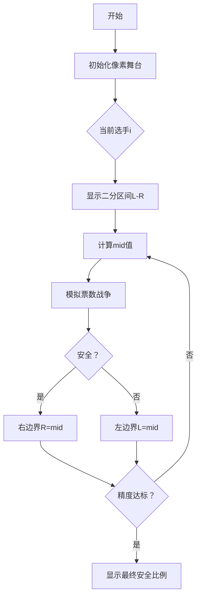

# 题目信息

# [GCJ 2012 #1B] Safety in Numbers

## 题目描述

有 $N$ 名选手参加一档真人秀节目。每位选手会被评委打分，并获得观众投票。评委分数与观众投票将按照如下方式合成为选手的最终得分：

设 $x$ 为所有选手评委分数的总和。假设某位选手获得了 $j$ 分评委分数，并且她获得了观众投票的 $y$ 部分（$y$ 在 $0$ 到 $1$ 之间，包括 $0$ 和 $1$，例如 $y$ 可能为 $0.3$）。那么这位选手的最终得分为 $j + x \cdot y$。注意，所有选手获得的观众投票比例之和必须为 $1$。

得分最低的选手将被淘汰。

现在给定每位选手从评委那里获得的分数，你的任务是，对于每一位选手，计算她为了**确保自己不会被淘汰**，无论其他观众票如何分配，至少需要获得多少百分比的观众投票。

如果有多名选手并列最低分，则没有任何选手会被淘汰。

## 说明/提示

**限制条件**

- $0 \leq s_i \leq 100$
- 至少存在一个 $i$ 使得 $s_i > 0$。也就是说，至少有一名选手的评委分数大于 $0$。

**测试集 1（10 分，结果可见）**

- $1 \leq T \leq 20$
- $2 \leq N \leq 10$

**测试集 2（11 分，结果隐藏）**

- $1 \leq T \leq 50$
- $2 \leq N \leq 200$

翻译由 ChatGPT-4.1 完成。

## 样例 #1

### 输入

```
4
2 20 10
2 10 0
4 25 25 25 25
3 24 30 21```

### 输出

```
Case #1: 33.333333 66.666667
Case #2: 0.000000 100.000000
Case #3: 25.0 25.0 25.0 25.0
Case #4: 34.666667 26.666667 38.666667```

# AI分析结果


### 💡 Kay的C++算法解析：Safety in Numbers 深入学习指南 💡

**题目解读与核心算法识别**  
✨ **本题主要考察**：`二分法` + `贪心策略`  
🗣️ **初步分析**：  
> 解决本题的关键在于理解"安全票数比例"的计算本质——**在极端票数分配下的生存保障**。想象你在参加一场音乐比赛🌠，评委分数是基础分，观众投票是"保命加成"。每位选手需要知道：当其他选手恶意分配票数（尽可能提高自己分数来淘汰你）时，你的最小保命票数是多少。  

**核心算法流程**：  
1. **二分框架**：对每个选手，二分搜索其最小安全票数比例`y_i`（精度1e-7）  
2. **贪心验证**：在`check()`函数中模拟最坏情况——剩余票数全部分配给其他选手，使他们的分数尽可能超过当前选手  
3. **数学转化**：通过`(s_i + sum*y_i - s_j)/sum`计算其他选手所需票数，若总和≤剩余票数则不安全  

**像素动画设计思路**：  
- 🎮 复古音游界面：选手化作像素小人，头顶评委分数条  
- 🔍 二分过程可视化：屏幕左右滑动显示当前搜索区间`[L,R]`  
- 💥 危险提示：当其他选手总需票数<剩余票数时，当前选手像素小人闪烁红光  

---

### 2. 精选优质题解参考  
**题解（作者：Idealwindow）**  
* **点评**：  
  - **思路清晰性**：直击问题本质——通过二分法+贪心验证求解临界值，推导过程严谨（通过极端分配模拟最坏情况）  
  - **代码规范性**：变量命名合理（`s[]`存评委分，`sum`总分），边界处理完善（1e-7精度控制）  
  - **算法有效性**：复杂度O(Tn²log(1/ε))完美满足N≤200的数据范围  
  - **实践价值**：可直接用于编程竞赛，`check()`函数封装使主逻辑简洁  
  - **亮点**：将复杂问题转化为简洁的数学比较`(s_i+sum*y_i - s_j)/sum`  

---

### 3. 核心难点辨析与解题策略  
1. **难点：理解"安全票数"的定义边界**  
   * **分析**：安全票数需保证在**所有可能的票数分配**中不被淘汰。题解通过逆向思维——计算"淘汰所需最小票数"的补集来破解  
   * 💡 **学习笔记**：极值问题常考虑最坏情况（adversarial scenario）  

2. **难点：验证函数的数学建模**  
   * **分析**：`check()`的核心是计算不等式：  
     ```math  
     \sum_{j≠i} \max\left(0,\ \frac{(s_i+sum·y_i)-s_j}{sum}\right) > 1-y_i  
     ```  
     左边表示让其他选手全高于i所需总票数，右边是实际可分配票数  
   * 💡 **学习笔记**：将逻辑条件转化为数值比较是算法核心技巧  

3. **难点：精度控制与二分终止条件**  
   * **分析**：题目要求6位小数精度，题解采用`while(r-l>1e-7)`确保结果精确  
   * 💡 **学习笔记**：二分法终止条件应比输出精度高2个数量级  

**✨ 解题技巧总结**  
- **逆向构造法**：从"如何被淘汰"反推"如何保安全"  
- **极值假设法**：假设对手采取最优攻击策略（贪心分配剩余票数）  
- **数值稳定性**：浮点比较需设置精度容差（如1e-7）  

---

### 4. C++核心代码实现赏析  
**本题通用核心实现参考**  
```cpp
#include <iostream>
#include <vector>
#include <iomanip>
using namespace std;

bool check(int id, double y, vector<int>& s, int sum) {
    double my_score = s[id] + sum * y;
    double need_others = 0;
    for (int i = 0; i < s.size(); ++i) {
        if (i == id) continue;
        if (s[i] < my_score) 
            need_others += (my_score - s[i]) / sum;
    }
    return need_others > 1 - y; // 关键不等式
}

int main() {
    int T; cin >> T;
    for (int t = 1; t <= T; ++t) {
        int n; cin >> n;
        vector<int> s(n);
        int sum = 0;
        for (int i = 0; i < n; ++i) {
            cin >> s[i];
            sum += s[i];
        }

        cout << "Case #" << t << ": ";
        for (int i = 0; i < n; ++i) {
            double l = 0, r = 1;
            while (r - l > 1e-7) { // 二分搜索
                double mid = (l + r) / 2;
                if (check(i, mid, s, sum)) r = mid;
                else l = mid;
            }
            cout << fixed << setprecision(6) << l * 100 << " ";
        }
        cout << endl;
    }
}
```

**代码解读概要**：  
> 1. 读取T组数据，每组包含选手数n和评委分数列表s  
> 2. 对每个选手进行二分搜索：  
>    - 左边界l=0（无需票数），右边界r=1（全票）  
>    - 通过`check()`验证mid是否安全  
> 3. `check()`模拟最坏票数分配：计算让其他选手超过当前选手所需总票数  

**题解片段赏析**  
```cpp
// 关键验证逻辑
double sc = s[p] + sum * y; // 当前选手总分
double sum1 = 0;            // 其他选手所需总票数
for(int i=0; i<n; ++i) {
    if(i == p) continue;
    if(s[i] < sc)  // 仅需帮助分数低于sc的选手
        sum1 += (sc - s[i]) / sum; // 累加所需票比例
}
return sum1 > 1 - y; // 安全条件：所需票>可分配票
```

**代码解读**：  
> - **`sc`计算**：当前选手p在假设票数y下的总分  
> - **`sum1`累计**：遍历其他选手，对每个分数低于sc的选手，计算使其超过sc所需的最小票数比例  
> - **安全判定**：若所需总票数`sum1` > 剩余票数`1-y`，说明无法让所有对手超过p → 安全  

**💡 学习笔记**：验证函数本质是**资源约束检查**——对手的"攻击资源"（剩余票数）是否足够覆盖"防御缺口"（分数差距）  

---

### 5. 算法可视化：像素动画演示  
**动画主题**：🎮《票数战争：生存大挑战》（8-bit像素风）  

**核心演示内容**：  


**交互设计**：  
1. **像素战场**：  
   - 每个选手=8-bit小人，头顶双血条（绿条：评委分，黄条：观众票）  
   - 当前选手高亮闪烁，对手小人眼睛显示红色（攻击模式）  

2. **战斗过程**：  
   - 当`check()`返回false：对手小人集体发射💥炮弹，当前选手血条归零（淘汰动画）  
   - 当`check()`返回true：当前选手举起🛡️盾牌反弹攻击，显示"SAFE!"像素字  

3. **音效系统**：  
   - 按钮：FC经典"滴"声（8-bit波形）  
   - 安全/淘汰：胜利/失败音阶（NES音源）  
   - 二分步进：电子"滴答"声  

4. **数据面板**：  
   - 实时显示：`L=.. R=.. mid=.. ∑need=..`  
   - 代码同步：高亮执行中的check()代码行  

**设计意义**：将抽象的数学比较转化为具象的生存战争，通过视听反馈强化算法逻辑理解  

---

### 6. 拓展练习与相似问题  
**通用技巧迁移**：  
1. **资源分配保障**：如网络带宽竞争中的最小保障带宽  
2. **临界值搜索**：物理/工程中的安全阈值计算  
3. **对抗策略模拟**：博弈论中的最优防御策略  

**洛谷推荐**：  
1. **P1577 切绳子**  
   🗣️ 同样需要二分搜索+精度控制，强化边界处理能力  
2. **P1083 借教室**  
   🗣️ 练习贪心验证的差分数组实现，提升资源分配建模能力  
3. **P1843 奶牛晒衣服**  
   🗣️ 结合二分与贪心检查，深化对最坏情况分析的掌握  

---

> 本次题解分析就到这里！记住核心口诀：**二分搜索定区间，贪心验证保安全**。尝试用可视化代码实现动画demo吧！🚀

---
处理用时：105.82秒