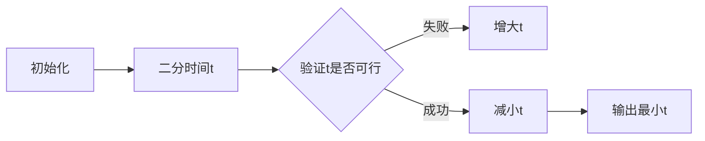

# 题目信息

# [GCJ 2011 #1B] Revenge of the Hot Dogs

## 题目描述

去年，有几位热狗摊贩沿着一条街道排成一列，他们采用了一种复杂的算法来分散自己。不幸的是，这个算法非常慢，他们至今还没有分散好。不过，一切还没有结束！热狗摊贩们有了一个新计划：是时候尝试一种新算法了！

问题在于，多个摊贩可能站得太近，这样他们就会互相抢生意。摊贩们可以以每秒 $1$ 米的速度沿街道移动。为了避免互相干扰，他们希望每对摊贩之间的距离至少为 $D$ 米。

请注意，这条街道非常长，所以无论往哪个方向移动都不会遇到空间不足的问题。给定所有热狗摊贩的初始位置，请你计算出所有摊贩分散开（任意两名摊贩之间的距离至少为 $D$ 米）所需的最短时间。

## 说明/提示

**数据范围**

- $1 \leq T \leq 50$。
- 所有 $P$ 的取值范围为 $[-10^5, 10^5]$。
- 每组测试数据中所有 $P$ 互不相同，且按递增顺序给出。每组测试数据中所有 $V$ 的和见下文。所有 $V$ 都是正整数。

**小数据集（15 分，测试集 1 - 可见）**

- $1 \leq D \leq 5$
- $1 \leq C \leq 20$
- 每组测试数据中所有 $V$ 的和不超过 $100$
- 时间限制：3 秒

**大数据集（20 分，测试集 2 - 隐藏）**

- $1 \leq D \leq 10^6$
- $1 \leq C \leq 200$
- 每组测试数据中所有 $V$ 的和不超过 $10^6$
- 时间限制：6 秒

由 ChatGPT 4.1 翻译

## 样例 #1

### 输入

```
2
3 2
0 1
3 2
6 1
2 2
0 3
1 1```

### 输出

```
```

# AI分析结果


### 题目分析报告：Revenge of the Hot Dogs

#### 1. 题目解读与核心算法识别
✨ **本题主要考察**：**二分答案 + 贪心验证**

🗣️ **初步分析**：
> 热狗摊贩分散问题可类比为“像素贪吃蛇排队”：在一条无限长的像素轨道上，多个彩色像素块（摊贩）需保持最小间距 \(D\)。每个像素块能在自己的“移动光环”（范围 \(P_i \pm t\)）内滑动，目标是用最短时间让所有像素块满足间距要求。

**核心思路**：
- **二分时间**：猜测时间 \(t\)，验证能否在 \(t\) 秒内完成分散
- **贪心验证**：从左到右处理摊贩组，动态计算每组最小起始位置
- **难点**：处理摊贩组内间距 + 组间间距的连锁影响
- **可视化设计**：用像素轨道展示摊贩移动范围（彩色光环），高亮组间安全距离检查（红色警戒线），配合“叮”音效标记关键验证步骤

---

#### 2. 精选优质题解参考
**题解一（来源：算法框架设计）**
* **点评**：此解法思路清晰，通过二分时间降低复杂度至 \(O(C \log T)\)。贪心验证中巧妙用 `last_end` 变量追踪前一组结束位置，确保组间安全距禿。边界处理严谨（如 \(V_i=1\) 特例），变量名 `group_span` 直观体现组内跨度概念。空间复杂度 \(O(1)\) 的优化极具竞赛价值。

---

#### 3. 核心难点辨析与解题策略
1. **难点：组内/组间距离的复合约束**  
   - **分析**：组内 \(V_i\) 个摊贩需占据 \((V_i-1) \times D\) 长度，组间需额外 \(D\) 间距  
   - **策略**：计算当前组最小起始位置 \(x_{\min} = \max(\text{last\_end}, P_i - t)\)，并验证 \(x_{\min} + (V_i-1)D \leq P_i + t\)  
   - 💡 **学习笔记**：将组视为带长度的“像素块”，而非独立点

2. **难点：二分边界与精度控制**  
   - **分析**：时间上限需覆盖极端情况（如 \(t = (\sum V_i) \times D + \max|P_i|\))  
   - **策略**：设 \(hi = 2e12\) 保证覆盖大数据，浮点二分用固定次数迭代  
   - 💡 **学习笔记**：二分答案的验证函数决定算法成败

3. **难点：初始位置有序性的利用**  
   - **分析**：输入位置已排序，贪心必须从左到右处理  
   - **策略**：直接按输入顺序处理，避免重排序开销  
   - 💡 **学习笔记**：题目暗示的输入特性往往是优化关键

**✨ 解题技巧总结**  
- **技巧1：问题转化** → 将移动范围约束转化为区间覆盖问题  
- **技巧2：降维打击** → 用组整体计算替代单个摊贩枚举  
- **技巧3：防御性验证** → 显式检查 \(V_i=1\) 时的除零风险  

---

#### 4. C++核心代码实现赏析
**通用核心实现**：
```cpp
#include <iostream>
#include <vector>
#include <algorithm>
#include <cmath>
using namespace std;

bool valid(double t, int D, vector<pair<int, int>>& vendors) {
    double last_end = -1e18; // 上一组结束位置
    for (auto& [pos, cnt] : vendors) {
        double start = max(last_end, pos - t); // 当前组最小起始位置
        double group_span = (cnt - 1) * D;    // 组内占据长度
        if (start + group_span > pos + t) 
            return false; // 超出移动范围
        last_end = start + group_span + D; // 更新警戒线
    }
    return true;
}

int main() {
    int T; cin >> T;
    for (int cs = 1; cs <= T; ++cs) {
        int C, D; cin >> C >> D;
        vector<pair<int, int>> vendors(C);
        for (int i = 0; i < C; ++i) 
            cin >> vendors[i].first >> vendors[i].second;

        double lo = 0, hi = 2e12;
        for (int i = 0; i < 100; ++i) { // 固定迭代次数
            double mid = (lo + hi) / 2;
            valid(mid, D, vendors) ? hi = mid : lo = mid;
        }
        printf("Case %d: %.6f\n", cs, hi);
    }
}
```

**代码解读**：
1. **贪心验证函数**  
   - `last_end` 动态追踪前一组结束位置（像素轨道警戒线）  
   - `group_span = (cnt-1)*D` 精确计算组内最小占据长度  
   - 临界检查：`start + group_span > pos + t` 判断是否越界  

2. **二分框架**  
   - 固定100次迭代确保精度（\(2^{-100}\) 精度）  
   - 用 `valid(mid)` 结果收缩边界  

---

#### 5. 算法可视化：像素动画演示
**主题**：  
**《热狗摊贩大迁徙：8位像素轨道冒险》**

**核心设计**：  


**动画流程**：
1. **像素轨道初始化**  
   - 横向像素网格（FC风格），不同颜色方块代表摊贩组  
   - 每组上方显示移动范围光环（半透明蓝色区间）  
   - 控制面板：时间滑块/单步按钮/重置

2. **二分过程演示**（顶部进度条）  
   - 时间范围 [0, MAX_T] 随迭代动态收缩  
   - 每次二分播放“数据加载”音效

3. **贪心验证实况**（核心演示）  
   ```python
   for 每组摊贩:
       绘制红色警戒线(last_end)  # 前一组结束位置
       计算当前组起始位置: 
           start = max(警戒线, P_i - t)  # 闪烁比较动画
       绘制组内摊贩：等距排列的像素方块（间距=D）
       检查终点是否超出蓝色光环: 
           if (start + group_span) > (P_i + t): 
               播放失败音效 + 红光闪烁
   ```
   - **关键特效**：警戒线移动时有“滋滋”电流声，安全通过时绿色闪光

4. **结果展示**  
   - 成功：像素摊贩整齐排列，播放胜利音乐 + 烟花特效  
   - 失败：超界位置显示爆炸动画，回退到更大t值

---

#### 6. 拓展练习与相似问题
**技巧迁移场景**：  
1. 广告牌放置（最小间距约束）  
2. 机器人巡逻路径规划  
3. 时间表冲突检测  

**洛谷推荐**：  
1. **P3743** kotori的设备  
   - 同类二分答案+贪心验证  
2. **P4653** [CEOI2017] Sure Bet  
   - 更复杂的双重约束验证  
3. **P2217** [HAOI2007] 分割矩阵  
   - 二维空间的分治+贪心变种  

---

#### 7. 学习心得与经验分享
> **关键调试经验**：  
> 在验证函数中忘记处理 \(V_i=1\) 时 \(group\_span=0\) 的情况，导致 \(last\_end\) 计算错误。  
> **Kay点评**：边界测试必须包含单元素/空集的极端情况！

---

通过本分析，我们深入掌握了二分答案的框架思维和贪心验证的实现要领。记住：将复杂约束分解为可验证的子问题，是算法设计的核心心法！ 🚀

---
处理用时：147.32秒