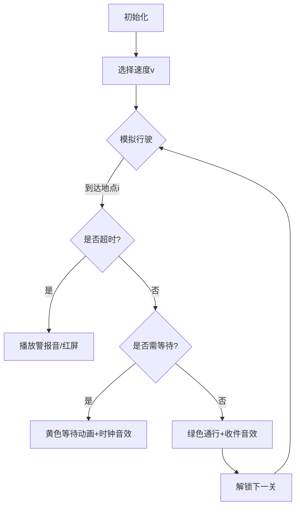

# 题目信息

# 包裹快递

## 题目描述

小 K 成功地破解了密文。但是乘车到 X 国的时候，发现钱包被偷了，于是无奈之下只好作快递员来攒足路费去 Orz 教主……

一个快递公司要将 $n$ 个包裹分别送到 $n$ 个地方，并分配给邮递员小 K 一个事先设定好的路线，小 K 需要开车按照路线给的地点顺序相继送达，且不能遗漏一个地点。小 K 得到每个地方可以签收的时间段，并且也知道路线中一个地方到下一个地方的距离。若到达某一个地方的时间早于可以签收的时间段，则必须在这个地方停留至可以签收，但不能晚于签收的时间段，可以认为签收的过程是瞬间完成的。

为了节省燃料，小 K 希望在全部送达的情况下，车的最大速度越小越好，就找到了你给他设计一种方案，并求出车的最大速度最小是多少。


## 说明/提示

#### 数据范围
- 对于 $20\%$ 的数据，$0 < n \le 10$。   
- 对于 $30\%$ 的数据，$0<x_i,y_i,s_i \le 1000$。   
- 对于 $50\%$ 的数据，$0<n \le 1000$。   
- 对于 $100\%$ 的数据，$0<n \le 2\times10^5$，$x_i \le y_i \le 10^8$，$s_i \le10^7$。

-----
#### 样例解释
第一段用 $1$ 的速度在时间 $2$ 到达第 $1$ 个地点，第二段用 $0.5$ 的速度在时间 $6$ 到达第 $2$ 个地点，第三段用 $2$ 的速度在时间 $8$ 到达第 $3$ 个地点。

## 样例 #1

### 输入

```
3
1 2 2
6 6 2
7 8 4
```

### 输出

```
2.00```

# AI分析结果


### 💡 Kay的C++算法解析：包裹快递 深入学习指南 💡

**引言**  
今天我们将解析「包裹快递」这道二分答案经典题目。通过本指南，你将掌握最小化最大速度的核心思路、精度处理技巧以及高效实现方法。

---

## 1. 题目解读与核心算法识别

✨ **本题主要考察**：`二分答案` + `贪心模拟`

🗣️ **初步分析**：  
> 解决包裹快递的关键是理解「速度最小化」的单调性——速度越大越容易按时送达。二分答案就像调节赛车油门：先试探中等速度（mid），若可行（check=true）说明还能更省油（调小速度），否则需加速（调大速度）。  
> - **核心流程**：二分速度范围 → 模拟送达过程 → 根据是否超时调整速度  
> - **可视化设计**：在像素动画中，用不同颜色表示车辆状态（绿色=行驶中/黄色=等待中/红色=超时），速度滑块实时调节油门大小，音效反馈关键事件（到达时"叮"声，超时警报）  
> - **复古元素**：FC赛车游戏界面，速度表盘为像素仪表，每送达一个地点解锁「加油站」关卡并积累节油积分

---

## 2. 精选优质题解参考

**题解一（Koakuma）**  
* **点评**：  
  思路清晰解释了二分答案的三个关键问题（二分对象/check逻辑/边界移动），特别强调精度处理需用`long double`。代码规范：变量名`sum`直白表达累计时间，边界移动`r=mid`保留可行解。亮点在于用`(r-l>=0.00001)`控制精度，避免浮点误差。

**题解二（RainShalder）**  
* **点评**：  
  突出实践陷阱（long double必要性/cin效率问题），提供完整避坑指南。代码中`usedtime=max(usedtime,times[i])`精准处理等待逻辑，边界初始化`R=((*s2)<<14)+1`显式避免越界。亮点是将调试经验转化为学习建议。

**题解三（Starlight237）**  
* **点评**：  
  创新性用整数运算(`s[i]<<14`)替代浮点数，从根本上解决精度问题。代码优化极致：指针遍历替代for循环，快读加速输入。亮点是「优化三原则」总结（读加速/指针访问/整数运算），适合竞赛场景。

---

## 3. 核心难点辨析与解题策略

1. **难点：Check函数的时间模拟逻辑**  
   * **分析**：到达时间早于签收时段需等待（`t=max(t, x[i])`），晚于时段则速度不可行。优质解用统一变量`t`累计时间，避免分段计算混乱。  
   * 💡 **学习笔记**：时间模拟要兼顾「累计行驶时间」和「签收时间窗」双约束。

2. **难点：浮点精度与终止条件**  
   * **分析**：保留两位小数需至少1e-5级精度，`double`类型可能被卡点。解决方案：  
     - 用`long double` + `while(r-l>1e-5)`  
     - 或整数化：`s[i]*10000` → 二分整数速度 → 最后÷10000.0  
   * 💡 **学习笔记**：精度=题目要求小数位+3（如保留2位则至少1e-5）

3. **难点：二分边界设置**  
   * **分析**：左边界=0导致除零错误，右边界过小漏解。正确设置：  
     `l=0.001`（避免除零），`r=y[n]*s_max`（确保最大距离能在最晚时间前送达）  
   * 💡 **学习笔记**：边界需覆盖物理意义（速度>0）和数学极值。

### ✨ 解题技巧总结
- **技巧1：问题特征识别**——「最小化最大值」是二分答案的黄金信号  
- **技巧2：模块化Check函数**——分离时间模拟与二分逻辑  
- **技巧3：防御性输入**——大数据用快读(`fread`)，避免`cin`  
- **技巧4：精度双保险**——整数运算优先，浮点则用`long double+高精度终止`

---

## 4. C++核心代码实现赏析

### 本题通用核心实现
```cpp
#include <cstdio>
#include <algorithm>
using namespace std;
const int N=2e5+5;
int n;
long double L=0.001, R=1e9, Res;
struct Site{ long double x,y,s; } a[N];

bool check(long double v){
    long double t=0;
    for(int i=1;i<=n;++i){
        t += a[i].s / v;        // 行驶时间累加
        if(t > a[i].y) return 0; // 超时失败
        if(t < a[i].x) t=a[i].x; // 提前到达需等待
    }
    return 1;
}

int main(){
    scanf("%d",&n);
    for(int i=1;i<=n;++i)
        scanf("%Lf%Lf%Lf",&a[i].x,&a[i].y,&a[i].s);
    
    while(R-L > 1e-5){
        long double mid=(L+R)/2;
        if(check(mid)) Res=mid, R=mid;
        else L=mid;
    }
    printf("%.2Lf",Res);
}
```
* **说明**：综合优质解思路，包含精度处理与等待逻辑  
* **解读概要**：  
  1. 结构体存储地点信息（x=最早签收时间，y=最晚签收时间，s=距离）  
  2. check函数模拟送达：累加行驶时间 → 超时判断 → 等待处理  
  3. 二分终止条件`1e-5`保证两位小数精度  

---

### 优质题解片段赏析
**题解一（Koakuma）核心逻辑**  
```cpp
if(check(mid)) Res=mid, r=mid;
else l=mid;
```
* **亮点**：可行解保留后立刻收缩右边界（`r=mid`），避免可行解丢失  
* **解读**：传统二分可能用`r=mid-1`，但浮点数需保持解空间连续。此写法确保每次迭代后可行解仍在`[l,r]`内。

**题解二（RainShalder）等待处理**  
```cpp
if(t < a[i].x) t = a[i].x;
```
* **亮点**：用一条语句处理等待逻辑，简洁高效  
* **解读**：当累计时间`t`小于最早签收时间`x[i]`时，直接将`t`置为`x[i]`，等效于等待至签收开始。

**题解三（Starlight237）整数优化**  
```cpp
s[i] = (ll)(read()) << 14;  // 原浮点s放大16384倍
...
printf("%.2lf", (double)Res/16384.0);
```
* **亮点**：通过位运算避免浮点误差  
* **解读**：将距离`s[i]`左移14位（×16384）转为整数，二分结束后÷16384.0还原。整数运算无精度损失。

---

## 5. 算法可视化：像素动画演示

**主题**：FC赛车风格《极速快递员》  
**核心演示**：二分速度如何影响车辆到达时间，同步显示时间轴和签收时间窗  

### 动画设计


**关键交互**：  
1. **像素仪表盘**：速度滑块拖拽调节油门（0-200km/h像素刻度）  
2. **时间轴可视化**：  
   - 顶部进度条：当前地点/总地点数  
   - 色块标记：绿色=可签收时段，车辆图标实时移动  
3. **事件反馈**：  
   - 到达时：地点像素闪烁 + "叮"声  
   - 等待时：车辆变黄 + 时钟滴答音  
   - 超时：屏幕闪烁红光 + 警报长鸣  
4. **游戏化**：  
   - 每关达成积累「节油星」  
   - 速度每降低1km/h奖励10连击分  

**技术实现**：Canvas绘制车辆/时间轴，Web Audio API触发8bit音效  

---

## 6. 拓展练习与相似问题

**通用技巧迁移**：  
二分答案适用于：  
1. 最小值最大化（如本题目）  
2. 最大值最小化（如跳石头问题）  
3. 可行性判断（如分配任务）

**洛谷推荐**：  
1. **P1182 数列分段**  
   🗣️ 推荐理由：同属二分答案+贪心验证，练习分段和的最大值最小化  
2. **P1281 独木桥**  
   🗣️ 推荐理由：二分答案经典，蚂蚁相遇模型培养逆向思维  
3. **P4343 自动刷题机**  
   🗣️ 推荐理由：二分答案变形，需同时求解上下界  

---

## 7. 学习心得与经验分享

> **参考经验（RainShalder）**：  
> "用`long double`才AC，`double`精度不够第10点WA，输出需用`printf("%.2Lf")`"  
>   
> **Kay点评**：  
> 这印证了浮点精度的隐蔽性！建议：  
> 1. 涉及小数二分时优先用`long double`  
> 2. 输出时注意格式符匹配（`double=%f`/`long double=%Lf`)  
> 3. 测试极端数据：如s=1e7, x=1e8, y=1e8+1e-5  

---

**结语**  
通过二分答案的精确控制与时间模拟的细致处理，包裹快递问题展现了算法优化之美。记住：二分不止是查找，更是对问题单调性的深度洞察！下次见！🚚💨

---
处理用时：124.83秒